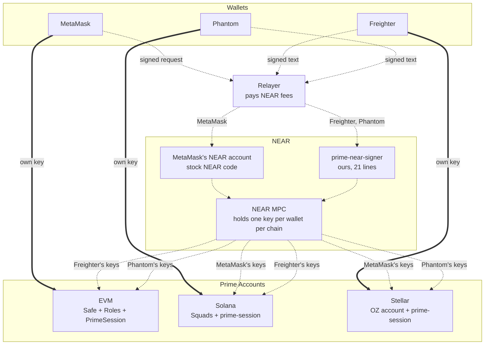
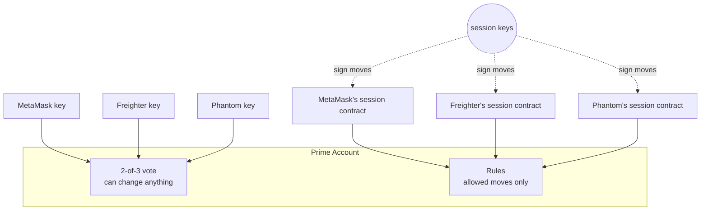
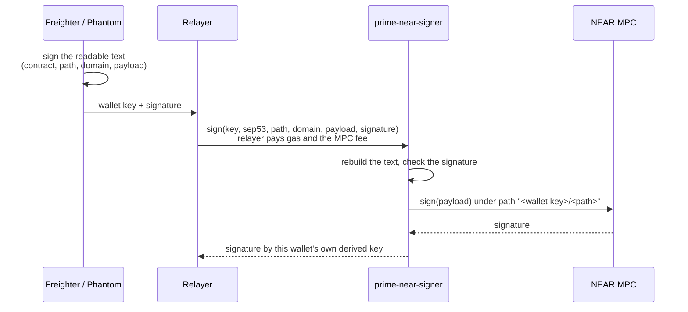
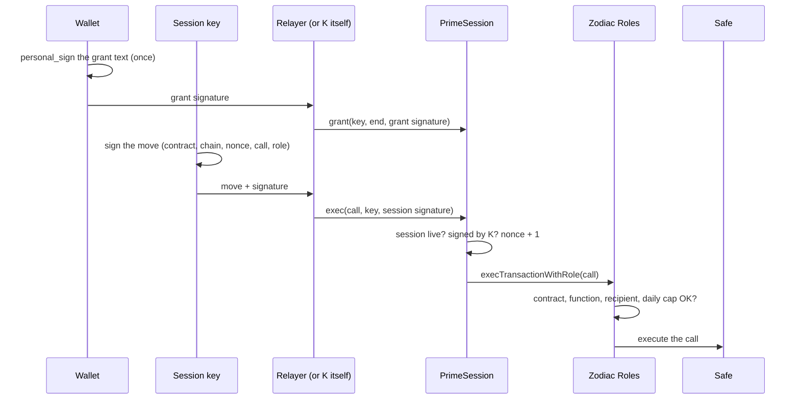
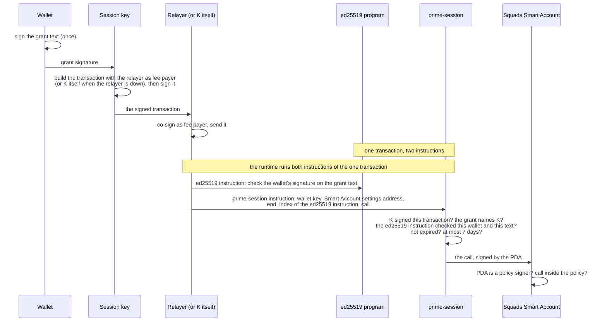
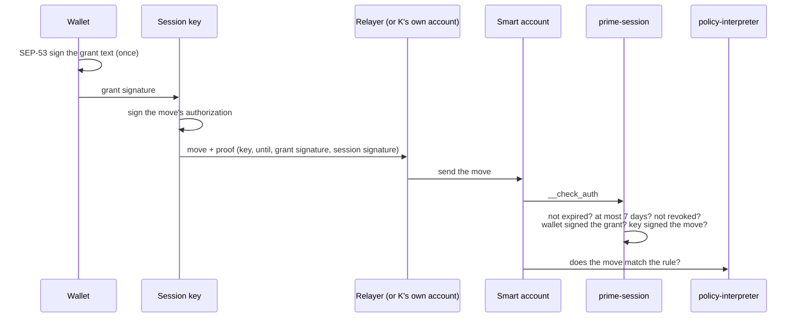

# Prime on Stellar, EVM and Solana: three wallets, seats and sessions

Status: spike, testnet only, branch `spike/session-signer` (named before the contracts were renamed). Runs dated 7 October 2026. Claims link to a log, a testnet transaction or a source file (section 12); `evidence-r8.log` holds the read-only checks for network facts. Spike paths below are relative to `spike/matrix/near-minimal/`.

## 1. The goal

A **Prime Account** is a shared account with three owners. Each owner uses one of three wallets: **MetaMask**, **Freighter** or **Phantom**. The account can live on any of three chains: **Stellar**, **EVM** (Base) or **Solana**.

Every wallet must be able to do two jobs on every chain:

1. **Seat.** The wallet is one of three votes. Any two votes together can change anything (2-of-3). One vote alone can change nothing.
2. **Session.** The wallet signs **once** to start a session key that lasts at most 7 days. The session key then makes moves by itself, but only the moves the account's rules allow. A session key can never vote.

Our **relayer** pays the fees for moves. If the relayer is down, the **session key pays its own fee**.

That is 3 wallets × 3 chains × 2 jobs = 18 cases. All 18 are tested (section 10), with the limits listed in sections 10.1 and 13.

## 2. Words used here

| Word | Meaning |
|---|---|
| Prime Account | The shared account: a Safe on EVM, a Squads Smart Account on Solana, an OpenZeppelin smart account on Stellar. |
| Seat | One of the three 2-of-3 votes. Always a plain key: an EVM address, a Solana key, or a Stellar account. |
| Ledger | Stellar's word for a block. One ledger closes about every 5 seconds. |
| Rule | What a session may do: which contract, which function, which recipient, and on EVM and Solana how much per move or per day. |
| Session contract | Named **prime-session** on every chain (`PrimeSession` in Solidity). Solana and Stellar each have their own; the Stellar one is the crate at the root of this folder. Our small contract that the rules list as a member (on Solana, the member is an address that only our program can sign for). It checks the wallet's one-time grant and the session key's signature on each move. |
| Grant | Readable text the wallet signs once: "session key K may act until time T". |
| Move | One action by a session key, such as "send 10 tokens to the venue". |
| Relayer | Our server. It sends transactions and pays their fees. Freighter and Phantom hold no NEAR, so their NEAR requests go through it. MetaMask's NEAR account is funded once by the relayer and pays the MPC fee itself. Moves still work without the relayer. |
| NEAR MPC | NEAR's signing service (`v1.signer-prod.testnet`). A NEAR account asks it to sign bytes. The key it signs with is derived from the account's name and a "path" string, so every NEAR account gets its own keys for every chain. Each request carries a small fee (1 yoctoNEAR on testnet). |
| Domain | Which kind of key the MPC uses: 0 = secp256k1 (EVM), 1 = ed25519 (Solana, Stellar). |
| Home chain | The chain a wallet can sign for by itself: MetaMask on EVM, Freighter on Stellar, Phantom on Solana. |
| Stand-in | A test key that signs in exactly the same format as the real wallet. The large test runs use stand-ins; section 10.1 lists what ran with the real wallet apps. |

Chain-specific terms are explained where they first appear.

## 3. The big picture



In one sentence: **each wallet uses its own key on its home chain, and a key held for it by NEAR MPC on the other two.**

| Wallet | EVM | Solana | Stellar |
|---|---|---|---|
| MetaMask | **own key** | stock NEAR account → MPC ed25519 key | stock NEAR account → MPC ed25519 key |
| Freighter | prime-near-signer → MPC secp256k1 key | prime-near-signer → MPC ed25519 key | **own key** |
| Phantom | prime-near-signer → MPC secp256k1 key (or its own EVM account, section 6.2) | **own key** | prime-near-signer → MPC ed25519 key |

On each chain, the same key does both jobs: it is the wallet's seat, and it is the owner that signs session grants.

## 4. Seats and sessions are kept apart

Seats are plain keys. Our session contracts are only ever members of the rules, never seats.



| Chain | Seat (2-of-3) | Session contract is | and is not |
|---|---|---|---|
| EVM | Safe owner | a Zodiac Roles member | a Safe owner |
| Solana | Squads settings signer | a signer of a Squads policy | a settings signer |
| Stellar | signer of rule 0 | the only signer of that wallet's session rule | a signer of rule 0 |

So a stolen session key can at worst make allowed moves until it expires. It cannot add owners, change rules or vote. Each chain's tests try to make a session vote; every attempt is refused (section 10).

**Where the grant lives** differs by chain, to keep each contract small:

| Chain | Grant handling | Why |
|---|---|---|
| EVM | sent once in its own transaction; PrimeSession stores "valid until" per session key | each move then carries only the session key's signature, which keeps moves cheap |
| Solana, Stellar | not stored; the grant signature travels with every move and is checked every time | no storage and no extra transaction, so less code |

## 5. NEAR: a key for chains the wallet cannot sign for

### 5.1 Why a wallet cannot use its own key everywhere

The problem is the wallets: each one refuses to sign some formats.

| Wallet | Signs | So it cannot |
|---|---|---|
| MetaMask | EVM transactions and messages (secp256k1 keys) | sign for Solana or Stellar, which use ed25519 keys |
| Freighter | Stellar transactions, and messages only in SEP-53 form: `sha256("Stellar Signed Message:\n" + text)` | sign an EVM message or a Solana transaction. Its key is ed25519 like Solana's, but it adds the SEP-53 prefix to every message, so a Solana transaction signature cannot be made. |
| Phantom (Solana account) | Solana transactions, and messages that are valid UTF-8 and do not look like a Solana transaction | sign a Stellar transaction or authorization: those are 32 hash bytes, which are almost never valid UTF-8 |
| Phantom (EVM account) | EVM, on its built-in chain list only | sign for NEAR's EVM chain ids (397/398), so it cannot use MetaMask's NEAR route |

### 5.2 Why NEAR, and not a signature checker on each chain

Each chain could check the other wallets' formats itself. An earlier version on this branch did exactly that, with no NEAR (`spike/matrix/minimal/`):

| | Each chain checks every wallet's format | NEAR route (this design) |
|---|---|---|
| EVM | 59 lines **+ 1,104 lines** of an unaudited ed25519 library, because EVM has no ed25519 built in | 32 lines, normal EVM signatures only |
| Stellar | 89 lines: secp256k1, SEP-53 and plain-text owners | 54 lines: SEP-53 owners only |
| Solana | 71 lines: ed25519 and secp256k1 owners | 27 lines: ed25519 owners only |
| NEAR | — | prime-near-signer 21 lines |
| **Total** | **219 lines + 1,104 vendored** | **134 lines** |

This is not an exact like-for-like comparison. In the earlier version, the same contracts were also the wallets' seats, and the Solana one had revoke. The point that matters: with NEAR, each chain's contract checks only one signature format, and no chain needs extra cryptography code. The cost is a NEAR round trip of about 8 s on average for NEAR-routed seat votes, grants and revokes (never for moves).

### 5.3 MetaMask: stock NEAR code only

Every EVM address has a NEAR account of the same name (an "eth-implicit" account, NEP-518). It comes into existence the first time someone sends it NEAR (our relayer sent 2 NEAR), and it runs NEAR's stock wallet contract. MetaMask signs one EVM-style transaction for NEAR's chain id (398 on testnet, 397 on mainnet). The relayer sends it to the account's `rlp_execute` method and pays the gas. The stock contract then calls MPC `sign`, paying the 1 yoctoNEAR fee from the account's balance. Nothing of ours runs on NEAR for MetaMask.

### 5.4 Freighter and Phantom: why stock NEAR code is not enough

NEAR's open-source wallet contract (`near/intents`, `contracts/wallet/signatures/`) supports three modes: ed25519 over a raw 32-byte hash, WebAuthn (passkeys), and no signature. The no-signature mode checks no owner at all, so it is not usable. Neither Freighter nor Phantom can produce a raw-hash ed25519 signature or a WebAuthn one (section 5.1).

NEAR Intents does accept SEP-53. But it can call other contracts only through `AuthCall` → `on_auth()`, and the MPC contract has no `on_auth`, so Intents cannot ask the MPC to sign.

We do not change NEAR's wallet contract, so it stays stock, already-reviewed code. Instead we wrote one small separate contract.

### 5.5 prime-near-signer (ours, 21 lines)

A NEAR contract at `signer.prime-spike-muwguc60.testnet` with one method and no storage.



This is the exact text real Phantom showed and signed on testnet:

```
Prime NEAR signer
contract: signer.prime-spike-muwguc60.testnet
path: prime:stellar
domain: 1
payload: 77d2870cebe528bcd6a869ff33ab3e0dc72c7a4e687c5fe2386507504a66a4e9
```

| Part | Why it is there |
|---|---|
| Readable text | Freighter signs it as SEP-53 and Phantom as plain UTF-8, both without changes. The user sees which contract, path and key type they approve; the payload itself is a hash shown as hex, so the app must show what it means next to the prompt. |
| The text names the contract, path, domain and payload | A signature for one request cannot be used for any other. Four refusal tests check this (another payload, path, domain or signer contract). |
| The wallet's key starts the MPC path | The MPC derives the key from (caller, path), and the caller is always this contract. With the wallet's key in the path, wallet A can never get wallet B's key. |
| No storage, no nonce | Replaying a request only gets another signature over the same payload, which gives nothing new. |

**Before mainnet:** delete the deploy key from the signer account so its code can never change. Today the account still has one full-access key (checked on testnet).

## 6. EVM (Base): Safe + Zodiac Roles + PrimeSession

### 6.1 Components and why each is needed

| Component | Who wrote it | Why it is needed |
|---|---|---|
| Safe 1.4.1 (SafeL2, proxy factory, fallback handler, MultiSend) | Safe, open source | Holds the funds. Its owners and threshold are the 2-of-3 seats. |
| Zodiac Roles v2 | Gnosis Guild, open source | The rules. A Safe "module" (an add-on the Safe trusts to send transactions) that lets each member call only allowed contracts, functions and arguments, within daily allowances. |
| PrimeX onboarding and policy code | ours, already in PrimeX (`apps/evm-web/src/core/onboarding.ts`, `evm-policy.ts`) | Creates the Safe, deploys Roles, writes the rule. Not changed by this spike (it will need to add PrimeSession as the Roles member). |
| **PrimeSession** | **ours, new, 32 lines** | One per wallet per account. It is that wallet's Roles member. It checks the wallet's grant and the session key's signature on each move, then calls Roles. |
| OpenZeppelin ECDSA, MessageHashUtils, Strings 5.4 | OpenZeppelin, open source | Signature recovery and text building inside PrimeSession. |

Why not make each session key a Roles member directly? Adding a member takes a 2-of-3 Safe transaction every time. With PrimeSession, the 2-of-3 adds PrimeSession once. After that, the wallet starts sessions alone with one signature.

### 6.2 A seat action (2-of-3)


- MetaMask signs with its own key. PrimeX already uses typed data (EIP-712) for this.
- Freighter and Phantom sign the hash through NEAR MPC with their secp256k1 keys. On the live Base Sepolia Safe, Phantom's seat is its MPC key `0x5F17…F3b1`.
- Phantom can instead use its own EVM account. Base Sepolia (84532) is on Phantom's chain list, but in our test (Testnet mode on), Phantom reported the switch to Base Sepolia as done but stayed on Sepolia, so it refused to sign typed data (EIP-712) for Base Sepolia. It can still `personal_sign` the hash: Safe has a signature type for `personal_sign` signatures and accepts it. This was tested with the real Phantom on a Base Sepolia fork.

### 6.3 A session



- `personal_sign` (EIP-191) is the standard "sign this text" in EVM wallets. MetaMask signs the grant text itself. For Freighter and Phantom, NEAR MPC signs the same EIP-191 digest; the wallet itself signs only the prime-near-signer text, which carries that digest as hex.
- A grant must end in the future, at most 7 days ahead, and later than the key's current end. So a grant can extend a session but never shorten or replay it.
- **Revoke** is the same `grant` call with end 0: the wallet signs the grant text with end 0, and PrimeSession sets the key's end to the largest possible number. A move needs "end within 7 days from now", so the key stops working. A new grant needs "new end later than current end", which is impossible, so the key can never be granted again. There is no separate revoke function.

## 7. Solana: Squads Smart Account + prime-session

### 7.1 Components and why each is needed

| Component | Who wrote it | Why it is needed |
|---|---|---|
| Squads Smart Account program (`SMRTzfY6…`) | Squads, open source | Holds the funds. Its settings signers with threshold 2 are the seats. Its `ProgramInteraction` policies are the rules (allowed programs and accounts, per-move limit, daily allowance). |
| Solana ed25519 program | built into Solana | Checks the wallet's grant signature inside the same transaction. |
| **prime-session** | **ours, new, 27 lines** | Signs for one "PDA" per wallet per account. A PDA is an address with no private key that only its program can sign for. Each wallet's PDA (`["prime", wallet key, Smart Account settings address]`) is a policy signer only. On each move, prime-session checks that the ed25519 program verified this wallet's grant in this transaction, then signs the Smart Account call as the PDA. |

Why a program at all? The policy needs a signer that is not a seat and that a wallet can hand to a session key with one signature. A PDA can be that signer, and only a program can sign for a PDA. Squads accepts it because it only checks that a policy signer is a member and has signed (`is_signer`), and a PDA signed by its program counts as signed.

### 7.2 A session



For a NEAR-routed wallet (MetaMask or Freighter on Solana), the first step goes through the relayer, NEAR and the MPC, as in section 5.

- **The grant text** names the PDA, the session key, the end time, the cluster and the program id. The cluster is set when prime-session is built (`PRIME_CLUSTER`, default `localnet`), so a grant for another cluster or another program is refused (X6, X7).
- **The session key must sign the transaction** (X10: refused when only the relayer signs).
- **No explicit PDA check is needed:** the grant text names the PDA, and the Solana runtime refuses the inner call if it marks as signer an address that the program's seeds do not derive. Test X8 tries it: Phantom signs a grant naming MetaMask's PDA (a real policy signer), and the runtime refuses it ("signer privilege escalated"). X9 does the same with the right PDA but another account's settings address in the data.
- **The session key is bound to the grant:** the grant text names the session key, and prime-session rebuilds the text with the key that signed the transaction.
- **No nonce is needed:** the session key must sign every transaction, and Solana itself refuses a transaction it has already processed.
- **No per-session revoke.** It needs a stored "revoked" marker that the program owns, which cost 13 lines in an earlier version, so we left it out to keep the program small (section 13). A session ends at its time, or earlier when the 2-of-3 removes the PDA from the policy (R0–R3: after removal Freighter's live session is refused with `NotASigner`, and MetaMask's still works). Removal stops all of that wallet's sessions. Grants are not stored, so adding the same PDA back revives every grant that has not yet expired, a leaked one included: wait 7 days after removal, or give the wallet a new PDA, before adding it back.
- **Only the Smart Account program can be called:** prime-session's inner call goes to a program id fixed in its code, so it needs no target check. X11 puts the System program where the client normally lists the Smart Account program: the move still runs, and the transaction log shows that prime-session called the Smart Account program and nothing else.
- **One account only:** the PDA depends on the wallet's key and on the Smart Account, and the grant text names the PDA. So a grant made for one Prime Account is refused in any other, even one with the same three seats (tests A0–A6).

## 8. Stellar: OpenZeppelin smart account + prime-session

### 8.1 Components and why each is needed

| Component | Who wrote it | Why it is needed |
|---|---|---|
| Smart account (OpenZeppelin `stellar-accounts`, "context rules") | OpenZeppelin, open source | Holds the funds. Each rule lists signers and policies for some calls. Rule 0 covers everything and holds the three seats. Each seat is a `Delegated` signer: a Stellar account (G…) that must authorize the call itself. |
| OZ weighted-threshold policy | OpenZeppelin, open source | Makes rule 0 a 2-of-3. |
| policy-interpreter | ours, already on testnet and mainnet | The session rules' policy. Checks each move against a predicate, such as "only `transfer`, only to the venue". Not changed by this work. |
| **prime-session** | **ours, new, 54 lines** | One per wallet per account. It is the only signer of that wallet's session rule. When the account asks it to approve a call (`__check_auth`), it checks the wallet's SEP-53 grant and the session key's signature. |

Why both prime-session and policy-interpreter? They answer different questions. prime-session answers "who is asking?" (a live session of this wallet). policy-interpreter answers "is this move allowed?".

### 8.2 A session



For a NEAR-routed wallet (MetaMask or Phantom on Stellar), the first step goes through the relayer, NEAR and the MPC, as in section 5.

- The grant has no network line, because the contract address already differs per network.
- **Revoke** is a separate `revoke(key, owner signature)` call: the owner signs the grant text with ledger `00000000`, and the contract stores a permanent "revoked" marker for the key. It is a transaction (the relayer or the session key pays). After it, the key is refused for good (contract error 2). Expired or more than 7 days ahead is error 1; a bad signature stops the call (a host trap).
- Expiry is a ledger number, at most 120,960 ledgers (about 7 days) ahead. The grant text writes it as 8 hex digits (`valid until ledger (hex): 004d5f27`): one small hex routine then serves both the session key and the ledger number, which saves the decimal-printing code. A ledger number means little to a person in either form, so the app should show the matching date next to the prompt.
- A revoke is saved in long-lived ("persistent") storage. If Stellar archives that entry, any move that reads it fails until someone restores it with its old value, so a revoke can never quietly vanish. A new entry also lives at least 120,960 ledgers on testnet and 2,073,600 (about 120 days) on mainnet, both at least as long as the longest session.
- The tested session rules allow XLM transfers to one venue only. They have no amount limit; policy-interpreter can express one, but it was not part of these tests.

## 9. Fees: relayer first, session key as fallback

| Chain | Relayer up | Relayer down |
|---|---|---|
| EVM | relayer sends `grant` and `exec` | the session key sends them from its own address and pays the gas |
| Solana | the session key builds the transaction with the relayer as fee payer and signs it; the relayer co-signs and sends it | the session key is the fee payer and sends it |
| Stellar | relayer's account is the transaction source and pays | the session key's own Stellar account (same key) is the source and pays |
| NEAR | relayer pays gas, and the MPC fee for Freighter and Phantom | NEAR-routed seat votes, grants and revokes wait; moves are unaffected |

Each chain tests both paths, plus a session key with no money, which is refused.

## 10. What was tested

| Chain | Where | Result | Log |
|---|---|---|---|
| EVM, this version (PrimeSession) | Base Sepolia **fork** (the live relayer is out of test ETH) + NEAR testnet | **92/92**: the live matrix without X11a (a 20-second session that needs real block times) plus X12–X16 (revoke edge cases) | `evm/pkn.log`, `evm/bytecode-eq.fork.log` |
| EVM, previous version (named PrimeKey; section 12.2) | **real Base Sepolia** + NEAR testnet | **88/88**: 30 transactions (all succeeded on chain), 53 refusals, 5 balance and owner checks | `evm/pkn-live.log`, `evm/verify-evm.log` |
| Stellar | **Stellar testnet** + NEAR testnet | **55/55** | `stellar/stn.log`, `stellar/verify-stellar.log` |
| Solana | local validator running the devnet Squads program unchanged + NEAR testnet | **83/83** | `solana/psn.log` |
| prime-near-signer | NEAR testnet | **11/11**: 8 refusals, 3 accepted controls | `near-signer/signer-neg.log` |
| Stellar prime-session unit tests | local | **13/13** | `cargo test` in `contracts/prime-session` |

Each chain's matrix runs these groups. The table notes where a group covers only some wallets or chains.

| Group | What is checked |
|---|---|
| Seats | every pair of wallets can act; each wallet alone is refused; an outsider is refused; a wallet's key under another NEAR path is refused; one wallet cannot vote twice (EVM; Stellar and Solana check that a seat is signed by its own key) |
| Sessions cannot vote | a session key, or a session contract, is refused as a vote; a session cannot add owners, change rules or delegatecall (run code inside the account) |
| Sessions | one-signature grant; move paid by the relayer; move paid by the session key; no money means refused; replay, wrong signer, wrong recipient, too long, expired: all refused; over the daily amount limit refused (EVM, Solana) |
| Revoke (EVM: all three wallets; Stellar: MetaMask and Freighter) | one signature revokes; on EVM another wallet's end-0 signature is refused, a key can be revoked before it is ever granted and then never granted, and replaying a revoke changes nothing (X12–X16, fork); the revoked key is refused and cannot be granted again; the wallet's other sessions keep working |
| One account only (Solana, A0–A6, Phantom's grants) | a second Smart Account with the same seats: a grant for account A is refused in account B and the other way round; a grant for B works in B |
| Removal from the policy (Solana, R0–R3) | after the 2-of-3 removes Freighter's PDA, its live session is refused (`NotASigner`); MetaMask's still works |
| Cross-wallet | wallet A's grant on wallet B's session contract; a grant text made for another contract; the wrong format (raw hash instead of `personal_sign`, plain text instead of SEP-53): all refused |

### 10.1 Real wallet apps versus stand-ins

| Wallet | Run with the real browser extension | Stand-in in the matrices |
|---|---|---|
| Phantom 26.32.0 | Signed the prime-near-signer text above; NEAR MPC then signed with Phantom's derived key ([NEAR tx](https://testnet.nearblocks.io/txns/2xhZduPcJKwfXJfqG2WrSaZuoMeWn34XBDWhUtuAptcb)). Its own EVM account `personal_sign`ed a sample grant text in the EVM format (placeholder addresses; the signature recovers to its address) and acted as a Safe seat on a Base Sepolia fork (`phantom-evm/`). | a test ed25519 key signing the same UTF-8 text |
| Freighter 5.49.0 | Signed the prime-near-signer text as SEP-53; NEAR MPC then signed with Freighter's derived EVM key `0xD114…a952`, the same address we derive offline (`evidence-r8.log`) ([NEAR tx](https://testnet.nearblocks.io/txns/GZxKyDGL9LZtM3uaMpA2jBskZWNXik6PjbHPK8HmhpC3)). | Freighter's own `signMessage` code with a test key |
| MetaMask | **not run** (no MetaMask extension on the test machine) | a test key signing the same chain-398 transaction and `personal_sign` text |

- The real extensions used their own keys, not the matrices' test keys. So they prove that each route works with the real app; they are not the seats of the test accounts (for example, the test Safe's Freighter seat is `0x29A9…13fF`, the stand-in's key).
- The Freighter profile was on Main Net for the first request, and its prompt said so. `signMessage` signs only the text, so the network plays no part, and no mainnet transaction was made. The profile is now on Test Net, and a second real Freighter request showed "Network: Test Net" ([NEAR tx](https://testnet.nearblocks.io/txns/8npfk7AKj5qCLUruqvKTNmCm3pQi5mr7oVnQB8F6N57u), ed25519 key for Solana).

## 11. New code on top of open source

### 11.1 On-chain code

| Chain | Open source used as is | Our existing code, unchanged | **New for this design** | sLOC | Includes revoke? |
|---|---|---|---|---|---|
| NEAR | NEAR MPC; NEP-518 eth-implicit wallet (MetaMask) | — | **prime-near-signer** | **21** | not needed (no state) |
| EVM | Safe 1.4.1, Zodiac Roles v2, OpenZeppelin 5.4 libraries | PrimeX onboarding (308) and policy builder (555), TypeScript | **PrimeSession** | **32** | yes (inside `grant`: end 0 revokes) |
| Solana | Squads Smart Account, ed25519 program | — (no Prime app on Solana yet) | **prime-session** | **27** | no (would add about 13) |
| Stellar | OZ smart account, OZ weighted-threshold policy | policy-interpreter (1,082, Rust); policy-synth rule builder | **prime-session** | **54** | yes (7 of the 54) |
| | | | **Total** | **134** | |

sLOC means non-blank, non-comment lines. Nothing was added to NEAR's wallet contract.

### 11.2 Off-chain code (app and relayer)

| Piece | What it does | Spike reference (sLOC, including test code) |
|---|---|---|
| NEAR routing client | MetaMask: build the chain-398 transaction for `rlp_execute`. Freighter / Phantom: build the request text and call the signer. Derive and check each MPC key. | `nearsig.ts` (89), `mm.ts` (58), `near.ts` (24) |
| EVM grant and move builders | grant text, move hash, relayer or self-paid submit | `evm/pkn.ts` (205, mostly tests) |
| Solana grant and move builders | ed25519 instruction, policy move, fee payer choice; also sets up the Squads account and policy | `solana/psn.ts` (259, mostly tests) |
| Stellar grant and move builders | grant text, auth proof, fee source choice | `stellar/stn.ts` (190, mostly tests), `stellar/stellar.ts` (131) |
| Relayer endpoints | send NEAR, grant and move transactions; pay their fees | the spike uses a local key; the Prime relayer needs new endpoints |

None of this is in the Prime apps yet. Solana has no Prime app; the spike creates its Squads account and policy directly.

## 12. Proofs

### 12.1 The deployed code is the reviewed code (`build-proofs.log`, `evm/bytecode-eq.log`)

| Contract | Network | Check | Result |
|---|---|---|---|
| prime-near-signer | NEAR testnet | base58(sha256) of our wasm equals the account's `code_hash` | `D2xgePUEzgfRysCScYruUGUFg2g8Twueuh1ipCpz3Hob`, equal |
| PrimeSession ×3 | Base Sepolia fork | deployed bytecode equals our solc 0.8.28 build, ignoring the owner and Roles addresses each PrimeSession is deployed with (4 places in the code) | equal, all three (`evm/bytecode-eq.fork.log`) |
| PrimeKey ×3 (previous version) | Base Sepolia | the same check for the earlier live deployment | equal, all three (`evm/bytecode-eq.log`) |
| prime-session (Stellar) ×3 | Stellar testnet | `stellar contract build` from this branch gives the deployed wasm hash | `8c5e0ab928f8868f21e49663cccce20ac9a4d6f059f6932aefada161e24d73d6`, equal |
| prime-session (Solana program) | local validator | the program code read back from the validator is our build plus zero padding (`solana/build-check.log`) | sha256 of our build `c5305242be20cfee3dfdc62022ed6fd60e3e63bf78b8c2329c0fd497dcec7d8c`, equal |
| Squads Smart Account | Solana devnet | the validator cloned the devnet program, last deployed at slot 425,429,201 (2 December 2025, `evidence-r8.log`), before our 7 October 2026 runs | unchanged |

### 12.2 EVM, real Base Sepolia (previous version)

This live run used the contract before the rename, then named `PrimeKey` (33 lines; source in git history at commit `0090b85`). The current `PrimeSession` differs in two places only: its name, and `ECDSA.recover(...) == owner` in place of `tryRecover` plus an error check, which refuses exactly the same signatures. The live relayer `0xeceb…8E11` now holds about 0.0000017 test ETH (`evidence-r8.log`), too little for another run, so `PrimeSession` ran the same matrix on a Base Sepolia fork (92/92, section 10). Grant and revoke gas rose by 47–83 (about 0.1%, for example 75,768 → 75,839, from `recover`'s extra revert path); move gas moves only by ±12 from calldata bytes (relayed 143,486–143,498, MetaMask's 160,586 in both runs; self-paid 126,386–126,398). A malformed signature (wrong length, high s, or one that recovers to nobody) now reverts with OpenZeppelin's `ECDSAInvalidSignature*` errors instead of `"grant sig"`; a well-formed signature by the wrong wallet still gives `"grant sig"`.


| What | Link |
|---|---|
| Safe 1.4.1; owners = the 3 seat keys, threshold 2 | [0x3F3D…1FC3](https://sepolia.basescan.org/address/0x3F3D7716da883b3827E0553d8D992aEaD4721FC3) |
| Roles (proxy of the Roles mastercopy `0xf296…83d5`); the three PrimeKeys are members and not Safe owners | [0x1E78…278A](https://sepolia.basescan.org/address/0x1E78C5498AD7E0Bdf47d5f823Ef012E960A5278A) |
| PrimeKey for MetaMask / Freighter / Phantom | [0x52d6…0E0e](https://sepolia.basescan.org/address/0x52d6e78B03d5065EDbEc7E7053c95C89D0950E0e), [0x1D4F…e768](https://sepolia.basescan.org/address/0x1D4F874262bf86cab9a54A95F9B2A9891db0e768), [0xc211…3638](https://sepolia.basescan.org/address/0xc21198c28e223f8afadf22f0a0D5511Ef1D23638) |
| C1 creates the Safe with MetaMask as its only owner (the PrimeX flow). C2, a Safe transaction signed by MetaMask, adds Freighter and Phantom as owners, sets the threshold to 2, and installs Roles with the three PrimeKeys and the rule. | [C1](https://sepolia.basescan.org/tx/0x7bb52679c2b7c598f25dda6e780801ae9f6e1d7144db3f1ccc47836e0379b087), [C2](https://sepolia.basescan.org/tx/0x831dd0efd2dac68a116c46abc16c30223e7bb376f675ab2aa256ee581f722594) |
| 2-of-3: MetaMask + Freighter, Freighter + Phantom, Phantom + MetaMask (S1, each wallet alone, was refused) | [S2](https://sepolia.basescan.org/tx/0x7215745c38b97eab6dff4a3142fb550af1fcde3ea15121686fa5abc8c44f602b), [S3](https://sepolia.basescan.org/tx/0xdbee8c8971bf76c39370b15f64a9b9c4bc44322e33fa100c72eebe90909d0a36), [S4](https://sepolia.basescan.org/tx/0xd97a1d263db2b984d7bb5c27b17517cda612da32ed85518699e4272fb2bc572b) |
| MetaMask session: grant, relayer move, self-paid move, revoke | [grant](https://sepolia.basescan.org/tx/0xf1c07ded4816f23bb203ef81f878189c46b221299e991d9277aa50bda1273a18), [relayer](https://sepolia.basescan.org/tx/0xb3fee1c6fda51260380ef1822e091f682e893186054e26bcdbc5f312cd91c914), [self-paid](https://sepolia.basescan.org/tx/0x5651426fc0bd0ee7820eaa08b6e41e974c5ff4ee6197d42c53eb4bd03efda1b4), [revoke](https://sepolia.basescan.org/tx/0xcaec7725d72c41e04a58ee73af5d684fe9065c851a3eed734aacdeb74ecb1b86) |
| Freighter session (through NEAR): grant, relayer, self-paid, revoke | [grant](https://sepolia.basescan.org/tx/0xf0611fb8d917249554b8b4df23562e4e5396265c229598518e3e1bc05e410b46), [relayer](https://sepolia.basescan.org/tx/0xdb63f0ced255e1d87d4fa7b50e3ebe043c4aa542165106af219c27516ce7e056), [self-paid](https://sepolia.basescan.org/tx/0x31c8a5f3aa340d900fa7b3a34d7978cf1f4c6c77b48e23bd6fa859cee955a318), [revoke](https://sepolia.basescan.org/tx/0x42a0cd8bc579c46d014a60add4e077eeefa6c9ecc5f1f1e238fc79a9af1950ca) |
| Phantom session (through NEAR): grant, relayer, self-paid, revoke | [grant](https://sepolia.basescan.org/tx/0xe72f4f4dfd2e18e454395b844321bfa38b75d83f255025d46a6d4212253e6e00), [relayer](https://sepolia.basescan.org/tx/0x75aaec203a7a96a3c8327c89caf3694fc7cdcff3a2bbbe817ea56692a8737618), [self-paid](https://sepolia.basescan.org/tx/0xdf42a672aefdf417c73ae841e4672e08444966378eeb44b5ba9fab5dc6014d68), [revoke](https://sepolia.basescan.org/tx/0x2708a66b90d8ebd95ea58ea0a78e45831417ec8f61bdf55ab0799ffa364f80bf) |

- These are 17 of the 30 transactions. All 30 are listed with their test names in `evm/state-pkn-live.json`, and `evm/verify-evm.log` re-reads every receipt from the chain (30 succeeded, 0 failed).
- The self-paid transactions are sent from the session keys themselves (for example `0xac2b…1053` for Freighter), not from the relayer.
- A refused move fails in simulation and is never sent, so refusals have no transaction. Their reasons are in `evm/pkn-live.log`. The public RPC dropped Roles' error data, so we replayed those calls to read it (`evm/roles-why.log`):

| Call from | Call | Roles error |
|---|---|---|
| a stranger | any `execTransactionWithRole` | `NotAuthorized(address)`: not a member |
| a PrimeKey | token transfer to another address | `ConditionViolation(ParameterNotAllowed)` |
| a PrimeKey | delegatecall | `ConditionViolation(DelegateCallNotAllowed)` |
| a PrimeKey | `addOwnerWithThreshold` on the Safe | `ConditionViolation(TargetAddressNotAllowed)` |

### 12.3 Stellar testnet

| What | Link |
|---|---|
| Prime Account. Rule 0 = the three seats + weighted-threshold policy. Rules 3–5 = one prime-session each + policy-interpreter. Rules 1–2 were test rules, added and removed by 2-of-3 votes (Y2–Y5). | [CB52…4XALT](https://stellar.expert/explorer/testnet/contract/CB52N6T5KWJQWGOCBGCLMEN7UM2MBZ3S6YCLETLXEHV6QLX2S254XALT) |
| prime-session for MetaMask / Freighter / Phantom | [CDGB…W4EL](https://stellar.expert/explorer/testnet/contract/CDGBVPXVTCKNCE4PKGZRAFFIDNRGJH5TYYTXK6I4BO37IYWWDB37W4EL), [CCKH…FSO4](https://stellar.expert/explorer/testnet/contract/CCKH6RD53HGZMMSXPKETQGUVE5WLK2KILAXFGOJH5ONHIO6QSEYFFSO4), [CCKP…PSM2O](https://stellar.expert/explorer/testnet/contract/CCKPLOP4C4RQQV4RRI6WPUHTVRVLU7ZPAC3ATAN6ZRSA4ODDZQJPSM2O) |
| policy-interpreter (testnet; mainnet instance `CDN7…BN52`) | [CCBH…ANU5](https://stellar.expert/explorer/testnet/contract/CCBHVZ6HGGV7C4SNHCZ3S5665Z2WEMHTMBAEPO4XW6PKON464BEBANU5) |
| 2-of-3: MetaMask + Freighter add a rule, Freighter + Phantom remove it, Phantom + MetaMask add one, MetaMask + Phantom remove it (Y1, each wallet alone, was refused) | [Y2](https://stellar.expert/explorer/testnet/tx/70e1553d39789381681a70e854374ad65bc516ee54f732e16a1eebada4b1479d), [Y3](https://stellar.expert/explorer/testnet/tx/376950f77cd9489911d14e0724e4251eef29fc8bd7dbcc65bfb4770d9949c69c), [Y4](https://stellar.expert/explorer/testnet/tx/b35d53b2ea35a045ab0ed43f7dadfa08674950d90f04995111b5b8c9c47630d9), [Y5](https://stellar.expert/explorer/testnet/tx/1558b61bf3e0a13f45324cd05f5e12776148d16bb4f3b352742f26097371883e) |
| MetaMask + Freighter install the three session rules (3, 4, 5) | [MetaMask's](https://stellar.expert/explorer/testnet/tx/6f36d7e7acc2c740141325cd911a66582d203f70bd6f9f0d64faa3ddce41f332), [Freighter's](https://stellar.expert/explorer/testnet/tx/b4067a4df659d682a2b60711147218bbe12983a2005f5f4fd4c2d6b269ea02c6), [Phantom's](https://stellar.expert/explorer/testnet/tx/30bb833eb71d5eb0a5c47804436ab56bf6a38aaeabd38c035fb33c92a1b7a790) |
| MetaMask session: relayer move, self-paid move, revoke | [relayer](https://stellar.expert/explorer/testnet/tx/7d85e983ef758da46071486a10d0765cf49282593c9029a163c9a39f084e1015), [self-paid](https://stellar.expert/explorer/testnet/tx/bf903f53bda4bdffe077310ac0ae7140703117fafcf4216bd28b6fc3cf587a06), [revoke](https://stellar.expert/explorer/testnet/tx/3a57279e4e215f46b16475e045c31fed86641ba0a20746e29af660207a00efbc) |
| Freighter session: relayer, self-paid, revoke | [relayer](https://stellar.expert/explorer/testnet/tx/16848c8fff20e127c251f2aa8c0f3f3e1344d26663a1fbf1a89a2a058fc3987c), [self-paid](https://stellar.expert/explorer/testnet/tx/cc923a65803b749c75702b077a9189054cde5a4d38f4d601d5a2fe9f415d41df), [revoke](https://stellar.expert/explorer/testnet/tx/910bacd3f98c091c96c3ac816423a2bb01ed7289067fab8c5a9a6454cfb08e85) |
| Phantom session: relayer, self-paid (the Stellar revoke test ran for MetaMask and Freighter) | [relayer](https://stellar.expert/explorer/testnet/tx/a7fb154f131687ca708727eb392f7d736df611a498e925c6d9008226f8b2ad2a), [self-paid](https://stellar.expert/explorer/testnet/tx/c48e2c9999f92d1d562c0a4ef784a88ce212db29330235744b322eff66469012) |

On Stellar, grants are not transactions: the grant signature travels inside each move. The self-paid moves have the session key as their source account (checked on Horizon, Stellar's public API).

### 12.4 NEAR testnet (`proof-near.log`, `real-wallets/`)

| What | Link |
|---|---|
| prime-near-signer account (code hash `D2xg…3Hob`) | [signer.prime-spike-muwguc60.testnet](https://testnet.nearblocks.io/address/signer.prime-spike-muwguc60.testnet) |
| MetaMask's eth-implicit account runs NEAR's stock wallet (a "global contract": one shared copy of the code that all eth-implicit accounts run, hash `3PpYvRxBfC5BkZxTw8ZFG3D52w1ZRhvDDWirKoxphMDn`): `rlp_execute` → MPC `sign` | [tx](https://testnet.nearblocks.io/txns/FbhtJr2BGLgaBayWEiLBigr8KrpemwmLhZuCtwZXfmNd) |
| Phantom (stand-in) → signer → MPC ed25519; key = Phantom's Stellar seat `GB2U…KJQJ` | [tx](https://testnet.nearblocks.io/txns/BFsYLin2MzP13LMqz6nTrD2cdVePd2CnqyTBBucczGHB) |
| Freighter (stand-in) → signer → MPC secp256k1; address = Freighter's Safe seat `0x29A9…13fF` | [tx](https://testnet.nearblocks.io/txns/79S64xykAnBB1KRQ79McTGisU7DykbkCUGU7TJqzYHK1) |
| Real Phantom → signer → MPC ed25519 | [tx](https://testnet.nearblocks.io/txns/2xhZduPcJKwfXJfqG2WrSaZuoMeWn34XBDWhUtuAptcb) |
| Real Freighter → signer → MPC secp256k1 | [tx](https://testnet.nearblocks.io/txns/GZxKyDGL9LZtM3uaMpA2jBskZWNXik6PjbHPK8HmhpC3) |
| Real Freighter (Test Net) → signer → MPC ed25519 | [tx](https://testnet.nearblocks.io/txns/8npfk7AKj5qCLUruqvKTNmCm3pQi5mr7oVnQB8F6N57u) |

Each NEAR-derived key was checked three ways:
- the MPC signature verifies against the key we derive offline;
- the derived key equals the seat on the target chain (Stellar rule 0, Safe owners, Solana settings signers);
- the transaction's receipts show the call path signer → `v1.signer-prod.testnet` → `sign`.

The EVM fork run made 38 NEAR MPC signatures, averaging 8.2 s each (`evm/pkn.log`, last lines); the live run made 36, averaging 7.9 s.

### 12.5 Source references

| Claim | Source |
|---|---|
| Phantom signs only valid UTF-8 that is not a Solana transaction | Phantom 26.32.0 extension, `chunk-GN2XWC4M.js`: `isSafeMessage` (`a5e`) and the UTF-8 check `o_t` |
| Phantom's EVM chain list has no 397/398 | same extension, `btc.js`: `eip155` chains 1, 137, 143, 998, 999, 8453, 10143, 42161, 80002, 84532, 421614, 11155111 |
| Freighter signs messages only as SEP-53 | Freighter `extension/src/helpers/stellar.ts` (`encodeSep53Message`) and `handlers/signBlob.ts`; copied in `freighter-sign.ts` |
| NEAR wallet contract schemes: ed25519, webauthn, no-sign | `near/intents` at `4127e8e`, `contracts/wallet/signatures/` |
| NEAR Intents reaches other contracts only through `on_auth` | `near/intents`, `contracts/defuse/core/src/intents/auth.rs` (`AuthCall`) |
| eth-implicit accounts, chain ids 397/398, `rlp_execute` | NEP-518 |
| A Squads policy signer only needs to be a member and `is_signer` | `Squads-Protocol/smart-account-program` at `80bf1f7`: `transaction_execute_sync.rs` calls `validate_synchronous_consensus` in `utils/context_validation.rs` |
| Roles errors and status codes | `gnosisguild/zodiac-modifier-roles`, `PermissionChecker.sol` (`Status`, `ConditionViolation`, `moduleOnly`) |
| PrimeX signs Safe transactions with EIP-712 | `octopos/apps/evm-web/src/app/safe-actions.ts`, `components/queue-list.tsx` (`signTypedData`) |
| Archived persistent entries fail until restored, and are never re-created | Stellar docs, "State archival" |
| Persistent lifetime 120,960 (testnet), 2,073,600 (mainnet) ledgers | network config `stateArchivalSettings.minPersistentTtl`, read from both networks (`evidence-r8.log`) |
| The earlier on-chain format checks cost 219 lines + 1,104 vendored | `spike/matrix/minimal/README.md` ("Size", "What each contract does") |
| MPC key derivation | `sha3_256("near-mpc-recovery v0.1.0 epsilon derivation:" + caller + "," + path)` added to the MPC root key; checked against live MPC signatures for both key types (`near.ts`, `secpderive.ts`) |

## 13. Limits and open items

- **Solana ran on a local validator**, not devnet: deploying the Solana prime-session program needs about 0.25 SOL, devnet airdrops were refused (daily rate limit; re-tried on 7 October, `evidence-r8.log`), other public devnet endpoints require a paid key, and we do not use the web faucet. Sending about 1 SOL to `5bevLKtW8bA6LCXXMqQAjnWBRCWcSXwcvQHiCbT6JjuY` on devnet would let the same matrix run there. The Squads program in it was cloned unchanged from devnet.
- **MetaMask extension not run.** Its route uses only stock NEAR code and standard MetaMask methods.
- **Latency.** NEAR-routed signatures averaged 7.9 s (32 signatures, Stellar run), 8.1 s (27, Solana run) and 8.2 s (38, EVM fork run) on testnet; the live EVM run averaged 7.9 s (36). Moves never use NEAR; only NEAR-routed seat votes, grants and revokes do.
- **NEAR availability.** If NEAR or its MPC is down, NEAR-routed wallets cannot vote, start sessions or revoke them. Existing sessions keep working. Each chain has only one wallet that signs natively (two on EVM if Phantom uses its own EVM account), so stopping a session early may have to wait for NEAR to return, or for the session to end (at most 7 days).
- **Solana has no per-session revoke** (section 7.2).
- **Stellar amount limits** were not part of these tests (section 8.2).
- **Before mainnet:** remove the full-access key from the signer account; point the signer at the mainnet MPC and MetaMask's route at chain 397; build the Solana prime-session program for mainnet (`PRIME_CLUSTER`).
- **Audit scope:** the four new contracts, 134 lines in total, plus the off-chain MPC key derivation and checks (`near.ts`, `secpderive.ts`), which decide which keys become seats.
