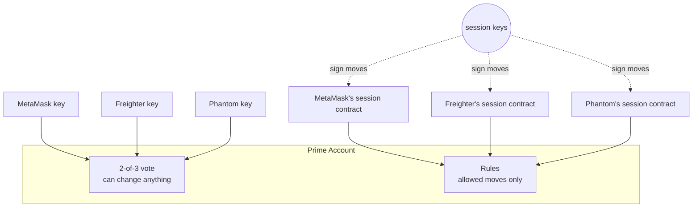
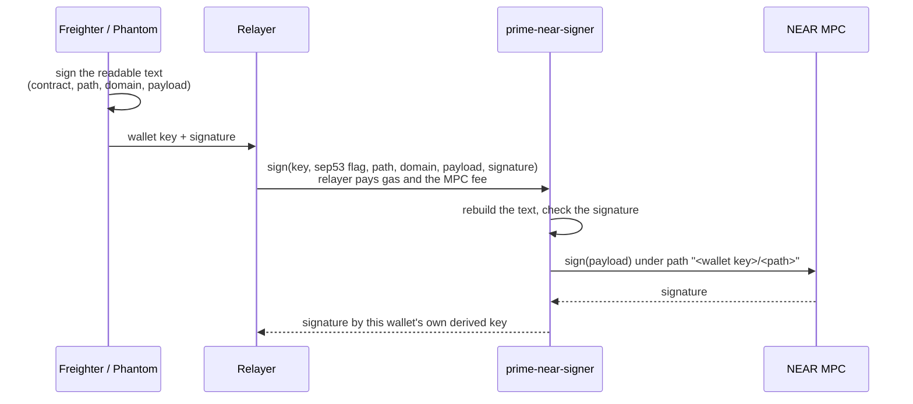
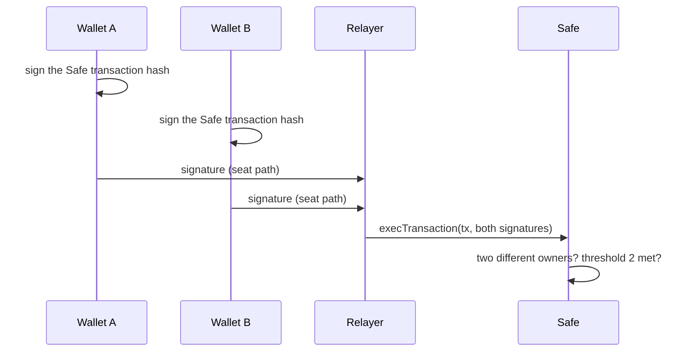
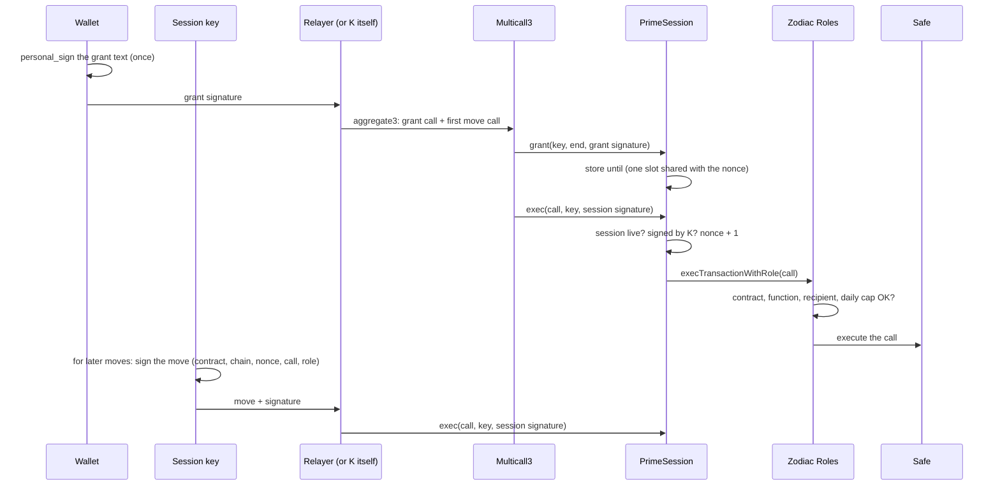
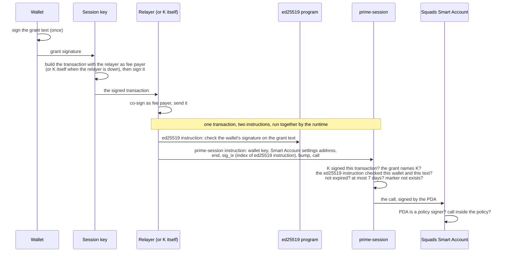
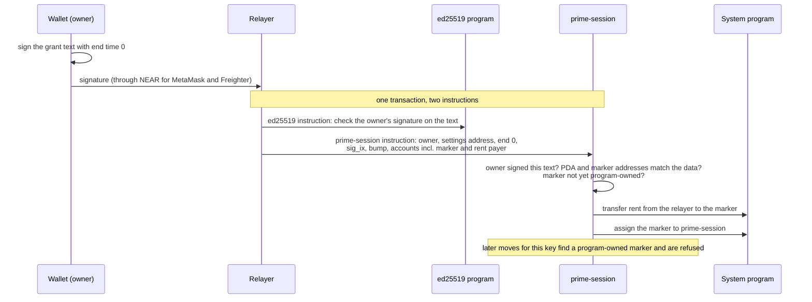
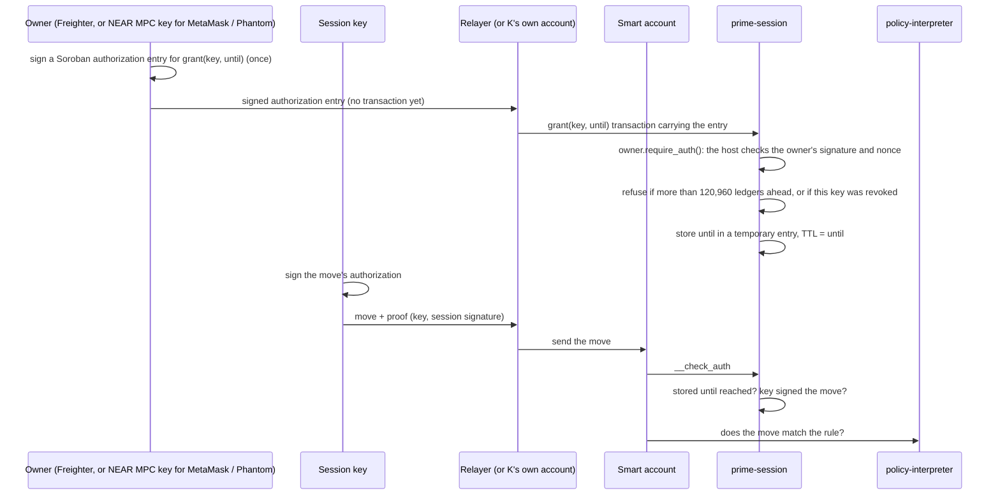

# Prime on Stellar, EVM and Solana: three wallets, seats and sessions

Status: spike, testnet only, branch `spike/session-signer` (created before the contracts were renamed). Refinement round 9, runs dated 8 October 2026. Claims link to a log, a testnet transaction or a source file (section 12). Round 9 logs sit under `round9/`; `evidence-r8.log` holds the read-only checks for network facts. Spike paths below are relative to `spike/matrix/near-minimal/`.

## 1. The goal

A **Prime Account** is a shared account with three owners. Each owner uses one of three wallets: **MetaMask**, **Freighter** or **Phantom**. The account can live on any of three chains: **Stellar**, **EVM** (Base) or **Solana**.

Every wallet must be able to do two jobs on every chain:

1. **Seat:** the wallet is one of three votes. Any two votes together can change anything (2-of-3). One vote alone can change nothing.
2. **Session:** the wallet signs **once** to start a session key that lasts at most 7 days. The session key then makes moves by itself, but only the moves the account's rules allow. A session key can never vote.

Our **relayer** pays the fees for moves. If the relayer is down, the **session key pays its own fee**.

That is 3 wallets × 3 chains × 2 jobs = 18 cases. All 18 are tested (section 10), with the limits listed in sections 10.1 and 13.

## 2. Words used here

| Word | Meaning |
|---|---|
| Prime Account | The shared account: a Safe on EVM, a Squads Smart Account on Solana, an OpenZeppelin smart account on Stellar. |
| Seat | One of the three 2-of-3 votes. Always a plain key: an EVM address, a Solana key, or a Stellar account. |
| Ledger | Stellar's word for a block. One ledger closes about every 5 seconds. |
| Rule | What a session may do: which contract, which function, which recipient, and on EVM and Solana how much per move or per day. |
| Session contract | Called **prime-session** on every chain (`PrimeSession` in Solidity). Each chain has its own; the Stellar one is the crate at the root of this folder. Our small contract that the rules list as a member (on Solana, the member is an address that only our program can sign for). It checks the wallet's one-time grant and the session key's signature on each move. |
| Grant | What the wallet signs once: "session key K may act until time T". On EVM and Solana it is readable text. On Stellar it is a Soroban authorization entry for `grant(key, until)`. |
| Move | One action by a session key, such as "send 10 tokens to the venue". |
| Relayer | Our server. It sends transactions and pays their fees. Freighter and Phantom hold no NEAR, so their NEAR requests go through it. MetaMask's NEAR account is funded once by the relayer and pays the MPC fee itself. Moves still work without the relayer. |
| NEAR MPC | NEAR's signing service (`v1.signer-prod.testnet`). A NEAR account asks it to sign bytes. The key it signs with is derived from the account's name and a "path" string, so every NEAR account gets its own keys for every chain. Each request carries a small fee (1 yoctoNEAR on testnet). |
| Domain | Which kind of key the MPC uses: 0 = secp256k1 (EVM), 1 = ed25519 (Solana, Stellar). |
| Home chain | The chain a wallet can sign for by itself: MetaMask on EVM, Freighter on Stellar, Phantom on Solana. |
| Stand-in | A test key that signs in exactly the same format as the real wallet. The large test runs use stand-ins; section 10.1 lists what ran with the real wallet apps. |

Chain-specific terms are explained where they first appear.

## 3. The big picture


In one sentence: **each wallet uses its own key on its home chain, and a key held for it by NEAR MPC on the other two.**

| Wallet | EVM | Solana | Stellar |
|---|---|---|---|
| MetaMask | **own key** | stock NEAR account → MPC ed25519 key | stock NEAR account → MPC ed25519 key |
| Freighter | prime-near-signer → MPC secp256k1 key | prime-near-signer → MPC ed25519 key | **own key** |
| Phantom | prime-near-signer → MPC secp256k1 key (or its own EVM account, section 6.2) | **own key** | prime-near-signer → MPC ed25519 key |

On each chain, the wallet's seat keeps one MPC path (`prime:<chain>`). The session owner that signs grants uses a separate path for NEAR-routed wallets (`prime:<chain>-session`), which no seat vote uses. This prevents a session-owner signature from being filed as a seat vote. MetaMask's native keys on its home chain (EVM) and Freighter's on theirs (Stellar) do both jobs; Phantom's on Solana does both.

## 4. Seats and sessions are kept apart

Seats are plain keys. Our session contracts are only ever members of the rules, never seats.



| Chain | Seat (2-of-3) | Session contract is | and is not |
|---|---|---|---|
| EVM | Safe owner | a Zodiac Roles member | a Safe owner |
| Solana | Squads settings signer | a signer of a Squads policy | a settings signer |
| Stellar | signer of rule 0 | the only signer of that wallet's session rule | a signer of rule 0 |

So a stolen session key can at worst make allowed moves until it expires. It cannot add owners, change rules or vote. Each chain's tests try to make a session vote; every attempt is refused (section 10).

**Where the grant lives** differs by chain, to keep each contract small:

| Chain | Grant handling | Why |
|---|---|---|
| EVM | sent once, alone or in one Multicall3 transaction with the first move; PrimeSession stores "valid until" per session key | each move then carries only the session key's signature, which keeps moves cheap |
| Stellar | sent once in a `grant(key, until)` transaction that carries the owner's Soroban authorization; prime-session stores "valid until" in a temporary entry | each move carries only the session key's signature (96 bytes of proof), and the host's nonce and signature expiry stop replays |
| Solana | not stored; the grant signature travels with every move and is checked every time | no storage and no extra transaction, so less code. A revoke is the one thing stored (a marker account) |

## 5. NEAR: a key for chains the wallet cannot sign for

### 5.1 Why a wallet cannot use its own key everywhere

The problem is the wallets: each one refuses to sign some formats.

| Wallet | Signs | So it cannot |
|---|---|---|
| MetaMask | EVM transactions and messages (secp256k1 keys) | sign for Solana or Stellar, which use ed25519 keys |
| Freighter | Stellar transactions, Soroban authorization entries (`signAuthEntry`), and messages only in SEP-53 form: `sha256("Stellar Signed Message:\n" + text)` | sign an EVM message or a Solana transaction. Its key is ed25519 like Solana's, but it adds the SEP-53 prefix to every message, so a Solana transaction signature cannot be made. |
| Phantom (Solana account) | Solana transactions, and messages that are valid UTF-8 and do not look like a Solana transaction | sign a Stellar transaction or authorization: those are 32 hash bytes, which are almost never valid UTF-8 |
| Phantom (EVM account) | EVM, on its built-in chain list only | sign for NEAR's EVM chain ids (397/398), so it cannot use MetaMask's NEAR route |

### 5.2 Why NEAR, and not a signature checker on each chain

Each chain could check the other wallets' formats itself. An earlier version on this branch did exactly that, with no NEAR (`spike/matrix/minimal/`):

| | Each chain checks every wallet's format | NEAR route (this design) |
|---|---|---|
| EVM | 59 lines **+ 1,104 lines** of an unaudited ed25519 library, because EVM has no ed25519 built in | 32 lines, normal EVM signatures only |
| Stellar | 89 lines: secp256k1, SEP-53 and plain-text owners | 37 lines, stored grant via Soroban authorization, Address owners only, final revoke |
| Solana | 71 lines: ed25519 and secp256k1 owners | 33 lines: ed25519 owners only, per-session revoke |
| NEAR | (no code) | prime-near-signer 20 lines |
| **Total** | **219 lines + 1,104 vendored** | **122 lines** |

This is not an exact like-for-like comparison. In the earlier version, the same contracts were also the wallets' seats, and the Solana one had revoke. With NEAR, each chain's contract checks only one signature format, and no chain needs extra cryptography code. The cost is a NEAR round trip of about 8 s on average (7.8 to 8.3 s in the final runs) for NEAR-routed seat votes, grants and revokes. Moves never use NEAR.

### 5.3 MetaMask: stock NEAR code only

Every EVM address has a NEAR account of the same name (an "eth-implicit" account, NEP-518). It comes into existence the first time someone sends it NEAR (our relayer sent 2 NEAR), and it runs NEAR's stock wallet contract. MetaMask signs one EVM-style transaction for NEAR's chain id (398 on testnet, 397 on mainnet). The relayer sends it to the account's `rlp_execute` method and pays the gas. The stock contract then calls MPC `sign`, paying the 1 yoctoNEAR fee from the account's balance. Nothing of ours runs on NEAR for MetaMask.

### 5.4 Freighter and Phantom: why stock NEAR code is not enough

NEAR's open-source wallet contract (`near/intents`, `contracts/wallet/signatures/`) supports three modes: ed25519 over a raw 32-byte hash, WebAuthn (passkeys), and no signature. The no-signature mode checks no owner at all, so it is not usable. Neither Freighter nor Phantom can produce a raw-hash ed25519 signature or a WebAuthn one (section 5.1).

NEAR Intents does accept SEP-53. But it can call other contracts only through `AuthCall` → `on_auth()`, and the MPC contract has no `on_auth`, so Intents cannot ask the MPC to sign.

We do not change NEAR's wallet contract, so it stays stock, already-reviewed code. Instead we wrote one small separate contract.

### 5.5 prime-near-signer (ours, 20 lines)

A NEAR contract at `signer.prime-spike-muwguc60.testnet` with one method and no storage. It passes the payload through unchanged to the MPC (code hash `AfRTxyBpBmUDYi88xxytL5z4yfPn3tBa1SYawt4Jzh3b`).



This is the exact text real Phantom showed and signed on testnet (7 October 2026, `real-wallets/pnear-input.json`). It uses the seat path; a grant request carries `path: prime:stellar-session` in the same position:

```
Prime NEAR signer
contract: signer.prime-spike-muwguc60.testnet
path: prime:stellar
domain: 1
payload: 77d2870cebe528bcd6a869ff33ab3e0dc72c7a4e687c5fe2386507504a66a4e9
```

| Part | Why it is there |
|---|---|
| Readable text | Freighter signs it as SEP-53 and Phantom as plain UTF-8, both without changes. The user sees which contract, path and key type they approve; the payload itself is a hash shown as hex, so the app must show what it means next to the prompt. |
| Path ends in `-session` for grant owners | The path separates session owners (`prime:stellar-session`) from seats (`prime:stellar`). A signature made under one path cannot be filed as the other. |
| The text names the contract, path, domain and payload | A signature for one request cannot be used for any other. Four refusal tests check this (another payload, path, domain or signer contract). |
| The wallet's key starts the MPC path | The MPC derives the key from (caller, path), and the caller is always this contract. With the wallet's key in the path, wallet A can never get wallet B's key. |
| No storage, no nonce | Replaying a request only gets another signature over the same payload. A signature is no use twice on a chain, because Soroban refuses a used authorization nonce and Solana refuses a processed transaction. |

The signer passes the payload string through unchanged: the wallet signs the exact string the MPC receives, so an upper-case payload signed as lower-case is refused. A payload that is not hex passes the signer and fails at the MPC, which costs the relayer 5.14 Tgas instead of 1.91 (`round9/near/signer-neg.log`).

**Before mainnet:** delete the deploy key from the signer account so its code can never change. Today the account has one full-access key in place.

## 6. EVM (Base): Safe + Zodiac Roles + PrimeSession

### 6.1 Components and why each is needed

| Component | Who wrote it | Why it is needed |
|---|---|---|
| Safe 1.4.1 (SafeL2, proxy factory, fallback handler, MultiSend) | Safe, open source | Holds the funds. Its owners and threshold are the 2-of-3 seats. |
| Zodiac Roles v2 | Gnosis Guild, open source | The rules. A Safe "module" (an add-on the Safe trusts to send transactions) that lets each member call only allowed contracts, functions and arguments, within daily allowances. |
| PrimeX onboarding and policy code | ours, already in PrimeX (`apps/evm-web/src/core/onboarding.ts`, `evm-policy.ts`) | Creates the Safe, deploys Roles, writes the rule. Will add PrimeSession as the Roles member, passing the session-owner address for NEAR-routed wallets. |
| **PrimeSession** | **ours, new, 32 lines** | One per wallet per account, and that wallet's Roles member. It checks the wallet's grant and the session key's signature on each move, then calls Roles. Stores `until` and `nonce` in one slot. |
| Multicall3 (aggregate3, `0xcA11bde05977b3631167028862bE2a173976CA11`) | mds1/multicall, open source, already deployed on Base Sepolia | Sends grant and first move in one atomic transaction, with `allowFailure: true` on the grant call only. |
| OpenZeppelin ECDSA, MessageHashUtils, Strings 5.4 | OpenZeppelin, open source | Signature recovery and text building inside PrimeSession. |

Why not make each session key a Roles member directly? Adding a member takes a 2-of-3 Safe transaction every time. With PrimeSession, the 2-of-3 adds PrimeSession once. After that, the wallet starts sessions alone with one signature.

### 6.2 A seat action (2-of-3)



Seats use the `prime:<chain>` path. MetaMask signs with its own key using EIP-712 typed data. Freighter and Phantom sign the hash through NEAR MPC with their secp256k1 keys under `prime:evm`. The test shows Phantom's seat at MPC key `0x5F17…F3b1` on Base Sepolia.

Phantom can instead use its own EVM account. Base Sepolia (84532) is on Phantom's chain list. The real Phantom on a Base Sepolia fork signed a grant with `personal_sign` (EIP-191) and acted as a Safe seat.

### 6.3 A session



- The grant owner is MetaMask's own key, or the NEAR MPC key of Freighter or Phantom under `prime:evm-session` (different from their seat path).
- `personal_sign` (EIP-191) is the standard "sign this text" in EVM wallets. MetaMask signs the grant text itself. For Freighter and Phantom, NEAR MPC signs the same EIP-191 digest under `prime:evm-session`; the wallet itself signs only the prime-near-signer text, which carries that digest as hex.
- **Grant and first move in one transaction**: on first use, the relayer or session key sends `grant` and `exec` through Multicall3 `aggregate3` with `allowFailure: true` on the grant call only. If someone submits the grant call alone first (a front-run), the combined call's grant fails harmlessly and the move runs (168,450 gas on the fork). `exec` still needs a live session, so a grant that fails for any other reason makes the move revert on its own `session` check, and a combined call with a bad grant signature reverts as a whole with nothing stored. A refused first move also reverts its grant. Later moves send only `exec`.
- **Gas** (Base Sepolia fork, real Safe and Roles): the first relayed move costs 124,742 to 124,754 gas (round 8: 143,486); a later move costs 124,754; grant plus first move in one Multicall3 transaction costs 183,483 to 183,507, against 200,754 for the same two steps in two transactions (`round9/evm/pkn.fork-r9b.log`).
- **Storage**: `until` and `nonce` live in one 256-bit storage slot (`struct Session { uint128 until; uint128 nonce; }`). The grant already fills the slot, so the first move no longer pays to write a fresh slot. In the contract's forge test (stub Roles) the first move fell from 59,016 to 40,272 gas, and the grant rose from 83,195 to 83,356.
- **Zero key**: a grant for the zero address is accepted and stored, and that key can never move, because OpenZeppelin's `recover` reverts instead of returning the zero address (fork checks, and the repo's forge tests).
- A grant must end in the future, at most 7 days ahead, and later than the key's current end. So a grant can extend a session but never shorten or replay it.
- **Revoke** is the same `grant` call with end 0: the wallet signs the grant text with end 0, and PrimeSession sets the key's end to the largest possible number (`type(uint128).max`). A move needs "end within 7 days from now", so the revoked key stops working immediately. A new grant needs "new end later than current end"; this constraint makes it impossible to grant the key again. There is no separate revoke function.

## 7. Solana: Squads Smart Account + prime-session

### 7.1 Components and why each is needed

| Component | Who wrote it | Why it is needed |
|---|---|---|
| Squads Smart Account program (`SMRTzfY6…`) | Squads, open source | Holds the funds. Its settings signers with threshold 2 are the seats. Its `ProgramInteraction` policies are the rules (allowed programs and accounts, per-move limit, daily allowance). |
| Solana ed25519 program | built into Solana | Checks the wallet's grant signature inside the same transaction. |
| **prime-session** | **ours, new, 33 lines** | Signs for one "PDA" per wallet per account. A PDA is an address with no private key that only its program can sign for. Each wallet's PDA (`["prime", wallet key, Smart Account settings address]`) is a policy signer only. On each move, prime-session checks that the ed25519 program verified this wallet's grant in this transaction, then signs the Smart Account call as the PDA. Per-session revoke uses a marker account at the PDA `[wallet key, Smart Account settings address, session key]`, which the program creates and owns; a move is refused if the marker exists. |

Why a program at all? The policy needs a signer that is not a seat and that a wallet can hand to a session key with one signature. A PDA can be that signer, and only a program can sign for a PDA. Squads accepts it because it only checks that a policy signer is a member and has signed (`is_signer`), and a PDA signed by its program counts as signed.

### 7.2 A session



The revoke is one transaction with the same two instructions. The session key does not sign it, and the relayer pays the rent (or the owner pre-funds the marker address and anyone submits the signed revoke):



For a NEAR-routed wallet (MetaMask or Freighter on Solana), the wallet signs under the session-owner path (`prime:solana-session`), and the first step goes through the relayer, NEAR and the MPC, as in section 5. Phantom's native key stays both seat and owner.

- **The grant text** has four lines after its title: the PDA (derived from the session-owner key), the session key, the end time and the cluster. The text leaves out the program id, because the PDA already commits to it. The cluster is set when prime-session is built (`PRIME_CLUSTER`; a build without it fails at compile time), so a grant for another cluster is refused.
- **The session key must sign the transaction** (refused when only the relayer signs).
- **PDA verification**: the grant text names the PDA, and prime-session calls `create_program_address` with the same seeds to verify the PDA matches the one in the instruction. A mismatch is refused in the program (error 2). The same comparison runs for moves and revokes, so a grant for account A cannot be used with account B's settings address.
- **The session key is bound to the grant:** the grant text names the session key, and prime-session rebuilds the text with the key that signed the transaction.
- **No nonce is needed:** the session key must sign every transaction, and Solana itself refuses a transaction it has already processed.
- **Per-session revoke with a marker account** (diagram below): the owner signs the grant text with end time 0. prime-session then creates an empty account at the PDA `[owner key, settings address, session key]`, owned by the program. Every move passes that account as read-only and is refused if the program owns it (error 2). Only the owner's signature can start a revoke, and only the program can assign the marker, so only the owner can revoke one session. A revoke is permanent: the key cannot be granted again, and a revoke for a key that was never granted also blocks it. The program moves the minimum rent for an empty account, 890,880 lamports, from the first call account (the relayer, signing as rent payer) into the marker and then assigns the marker to itself.
- **Bump in data**: the PDA bump travels in the instruction data (one byte), so the program checks the PDA with `create_program_address` instead of searching for it. The marker address still uses `find_program_address`: a bump chosen by the caller could point a move at an unrevoked address.
- **Cost** (local validator, one Smart Account, ten alternating samples each): a move uses a median of 53,205 compute units (round 8: 57,105; the spread, 52,455 to 61,455, comes from the marker bump search at about 1,500 units per extra step). The move transaction is 975 bytes (round 8: 995). The program is 54,024 bytes (round 8: 46,056). A revoke uses 22,229 compute units and a 726-byte transaction (`round9/solana/psn-local.log`).
- **Only the Smart Account program can be called:** prime-session's inner call goes to a program id fixed in its code.
- **One account only:** the PDA depends on the session-owner key and the Smart Account settings, and the grant text names the PDA. So a grant made for one Prime Account is refused in any other, even one with the same three seats.

## 8. Stellar: OpenZeppelin smart account + prime-session

### 8.1 Components and why each is needed

| Component | Who wrote it | Why it is needed |
|---|---|---|
| Smart account (OpenZeppelin `stellar-accounts`, "context rules") | OpenZeppelin, open source | Holds the funds. Each rule lists signers and policies for some calls. Rule 0 covers everything and holds the three seats. Each seat is a `Delegated` signer: a Stellar account (G…) that must authorize the call itself. |
| OZ weighted-threshold policy | OpenZeppelin, open source | Makes rule 0 a 2-of-3. |
| policy-interpreter | ours, already on testnet and mainnet | The session rules' policy. Checks each move against a predicate, such as "only `transfer`, only to the venue". Not changed by this work. |
| **prime-session** | **ours, new, 37 lines** | One per wallet per account, and the only signer of that wallet's session rule. It stores the owner as an `Address` (Freighter's own account, or a G account whose key NEAR MPC holds). `grant(key, until)` needs the owner's authorization and stores `until` in a temporary entry. When the account asks it to approve a call (`__check_auth`), it checks that the session is live and that the session key signed the move. |

Why both prime-session and policy-interpreter? They answer different questions. prime-session answers "who is asking?" (a live session of this wallet). policy-interpreter answers "is this move allowed?".

### 8.2 A session



Freighter signs the entry with `signAuthEntry` (the real extension did this on testnet, section 10.1). For MetaMask and Phantom the owner is a G account whose key NEAR MPC holds under `prime:stellar-session`: the wallet signs the request through the relayer, NEAR and the MPC, as in section 5, and the MPC signature is the entry's signature. Freighter's own account is both seat and owner.

- **Grant handling**: the relayer (or the session key's own account) sends one transaction `grant(key, until)` that carries the owner's authorization entry. The contract stores `until` in temporary storage and extends the entry's TTL to `until`, so the entry lives at most 120,960 ledgers (about 7 days at 5 seconds per ledger). A grant further ahead is refused at grant time (contract error 1). The entry binds the network, this contract, the key and the end ledger, so the app cannot change them after the owner signs (a changed `until` is refused at simulation).
- **Move check**: `__check_auth` reads the entry; an expired temporary entry reads as absent, which counts as 0 and is refused. A session ends at its `until` ledger even while the entry still lives.
- **Revoke** is `grant(key, 0)` with the owner's authorization. The contract stores 0 for the key and keeps that entry for the network's maximum TTL (`e.storage().max_ttl()`: 3,110,400 ledgers, about 180 days at 5 seconds, the same value on testnet and mainnet). While the entry lives, `grant` refuses any non-zero `until` for that key. So a grant authorization that was signed earlier and held back, or one signed with a far-future expiry, cannot bring a revoked key back: the revoke entry outlives any authorization signed before the revoke, because the host limits a signature's expiry to the same network maximum. A revoked key stays revoked for that window, and the app uses a fresh key for each session.
- **Why the revoke costs more**: the revoke entry rents the maximum TTL, so a revoke costs 717,565 to 719,515 stroops (about 0.072 XLM) on testnet. A grant costs about 18,100 stroops and a move about 32,900 (section 8.3). A limit in the relayer would be cheaper, but it would not stop someone who holds a signed entry from submitting it directly.
- **MPC-derived G accounts are locked** (section 8.3).
- The grant has no network line, because the contract address already differs per network.
- **App-side display** (no contract change): before calling `signAuthEntry`, the app shows the session key, end ledger and approximate date, and asks the user to expand the `grant` row in Freighter and compare the values. The Freighter prompt shows the contract address, function, and two unlabelled parameters: the session key as hex (64 digits) and the end ledger as a decimal number. Nothing shows before the row is expanded, and no date shows at all. The date comes from the latest ledger's close time plus 5 seconds per remaining ledger. MetaMask and Phantom see only `path: prime:stellar-session` and a payload hash in the MPC request.
- The tested session rules allow XLM transfers to one venue only. They have no amount limit; policy-interpreter can express one, but it was not part of these tests.

### 8.3 Locked MPC accounts and measured costs

The G accounts that NEAR MPC controls are ordinary Stellar accounts, so a classic Stellar operation could change their signer list. One opaque approval of a payload hash would be enough: a hostile app could present a hash of a "add signer" transaction as an ordinary request. A signer added to a session-owner account could then authorize `grant` on every prime-session that account owns for as long as it stays, and could lock the real owner out. Setup therefore sends one SetOptions transaction from each of these accounts: master weight 1, low threshold 1, medium threshold 1, high threshold 2.

Soroban authorization needs the medium threshold, which the key's weight of 1 meets, so seat votes and grants keep working. Changing the signer list and merging the account need the high threshold, which a single key of weight 1 can never reach. The signer list is frozen.

| Locked account | Path | Role |
|---|---|---|
| MetaMask seat | `prime:stellar` | rule 0 signer |
| Phantom seat | `prime:stellar` | rule 0 signer |
| MetaMask session owner | `prime:stellar-session` | owns MetaMask's prime-session |
| Phantom session owner | `prime:stellar-session` | owns Phantom's prime-session |

Freighter's own accounts (its seat and the real extension account) are keys the wallet holds, so they are not locked. Each locked account passed five checks on testnet (20 in all): thresholds read 1/1/2 with the account's own key as the only signer; a control SetOptions at the medium threshold is accepted; a SetOptions that adds a signer is refused (`op_bad_auth`); an AccountMerge is refused (`op_bad_auth`); and afterwards the signer list and thresholds are unchanged. The lock is permanent: the key can never rotate and the account can never be merged. A seat is replaced through a 2-of-3 rule change, and an MPC path that is lost becomes a new account. Each session-owner account must exist before it can authorize, so a mainnet Prime Account needs one funded session-owner account per NEAR-routed wallet; it serves every prime-session that wallet owns.

Costs on testnet (Horizon `fee_charged`, `round9/stellar/stn-summary.log`):

| Item | Fee in stroops |
|---|---|
| Grant, relayed or self-paid | 18,095 to 18,102 (the 7-day entry: 45,143) |
| Move, steady state, relayed or self-paid | 32,882 to 32,885 |
| Revoke, relayed | 717,565 to 719,515 |
| First relayed move on a session rule | 994,132 to 1,318,999 (the OZ rule's own rent, as in round 8) |

The wasm is 1,542 bytes (`stellar contract build`). One live-session `__check_auth` used 714,403 CPU instructions on the 1,384-byte build, down from 1,389,824 in round 8 (measured by the security review; the final change touches only `grant`, and the final wasm was not re-measured).

## 9. Fees: relayer first, session key as fallback

| Chain | Relayer up | Relayer down |
|---|---|---|
| EVM | relayer sends `grant` and `exec`, or both in one Multicall3 transaction on first use | the session key sends them from its own address and pays the gas |
| Solana | the session key builds the transaction with the relayer as fee payer and signs it; the relayer co-signs and sends it | the session key is the fee payer and sends it |
| Stellar | relayer's account is the transaction source of the grant and every move, and pays | the session key's own Stellar account (same key) is the source and pays |
| NEAR | relayer pays gas, and the MPC fee for Freighter and Phantom | NEAR-routed seat votes, grants and revokes wait; moves are unaffected |

Each chain tests both paths, plus a session key with no money (refused). On Solana a revoke is paid by the relayer, which also pays the marker's rent (section 7.2).

## 10. What was tested

| Chain | Where | Result | Log (under `round9/`) |
|---|---|---|---|
| EVM (PrimeSession, packed slot, Multicall3) | Base Sepolia **fork** + NEAR testnet | **134/134**: seats, sessions, revoke edge cases, combined grant + move, front-run harmlessness; bytecode of all three instances equals the build; 50 receipts verified; 6/6 forge tests | `evm/pkn.fork-r9b.log`, `evm/bytecode-eq.fork-r9b.log`, `evm/verify-evm.fork-r9b.log` |
| Stellar (stored grant, final revoke, locked accounts) | **Stellar testnet**, fresh deployment, + NEAR testnet | **138 distinct checks** (the summary log counts 139, because the state file keeps a superseded Horizon summary): seats, 20 lock checks, rule installs, separation, sessions, cross-wallet, and the real Freighter extension; 11/11 unit tests | `stellar/stn-*.log`, `stellar/verify-stellar.log`, `stellar/cargo-test.log` |
| Solana (per-session revoke with marker) | local validator cloned from devnet + NEAR testnet | **138/138**: 128 matrix checks plus 10 paired round 8 move measurements | `solana/psn-local.log`, `solana/pdhash-local.log` |
| prime-near-signer (payload pass-through) | NEAR testnet | **12/12**: 2 accept controls, 9 refusals inside the contract, and a non-hex payload that the contract passes on and the MPC rejects | `near/signer-neg.log`, `near/proof-near.log` |
| EVM, round 7 (previous PrimeKey build) | **real Base Sepolia** + NEAR testnet | **88/88**: 30 transactions (all succeeded on chain), 53 refusals, 5 balance and owner checks | `evm/pkn-live.log`, `evm/verify-evm.log` (section 12.2) |

Each chain's matrix runs these groups. The table notes where a group covers only some wallets or chains.

| Group | What is checked |
|---|---|
| Seats | every pair of wallets can act; each wallet alone is refused; an outsider is refused; a wallet's key under another NEAR path is refused; one wallet cannot vote twice (EVM; Stellar and Solana check that a seat is signed by its own key) |
| Session-owner paths | on every chain, a signature made under a `*-session` path and filed as a seat vote is refused; a grant signed by a seat-path key is refused |
| Sessions cannot vote | a session key, or a session contract, is refused as a vote; a session cannot add owners, change rules or delegatecall (run code inside the account) |
| Sessions | one-signature grant; move paid by the relayer; move paid by the session key; no money means refused; replay, wrong signer, wrong recipient, too long, expired: all refused; over the daily amount limit refused (EVM, Solana) |
| Revoke | one signature revokes (EVM and Stellar tested for all three wallets, Stellar also with the real Freighter); the wallet's other sessions keep working; another wallet's revoke is refused. EVM: a key can be revoked before it is ever granted and then never granted, and replaying a revoke changes nothing. Stellar: a second authorization signed together with the first and submitted after the revoke is refused, so is a fresh grant of the revoked key, and the revoke entry reads 0 and lives to about 3.11 million ledgers ahead. Solana: a revoke signed for account A and sent with account B's settings is refused; a pre-funded marker does not stop the revoke; a non-canonical bump is refused |
| Combined grant and first move (EVM) | one Multicall3 transaction, paid by the relayer or by the session key; a refused first move reverts its grant; a grant already submitted alone first still lets the move run; a bad grant signature stores nothing |
| Locked accounts (Stellar) | for each of the four MPC-derived accounts: thresholds 1/1/2, a medium-threshold control accepted, a signer-adding SetOptions refused, an AccountMerge refused, state unchanged; seat votes and grants pass afterwards |
| One account only (Solana, Phantom's grants) | a second Smart Account with the same seats: a grant for account A is refused in account B and the other way round; a grant for B works in B. The same program at a second id refuses grants made for the first |
| Removal from the policy (Solana) | after the 2-of-3 removes Freighter's PDA, its live session is refused (`NotASigner`); MetaMask's still works |
| Cross-wallet | wallet A's grant on wallet B's session contract; a grant text made for another contract; the wrong format (raw hash instead of `personal_sign`, plain text instead of SEP-53): all refused |

### 10.1 Real wallet apps versus stand-ins

| Wallet | Run with the real browser extension | Stand-in in the matrices |
|---|---|---|
| Phantom 26.32.0 | Signed the prime-near-signer text as UTF-8 under `prime:stellar` (7 October 2026, earlier signer build), which NEAR MPC then signed with a derived ed25519 key; the signature verified against the key we derive offline ([NEAR tx](https://testnet.nearblocks.io/txns/2xhZduPcJKwfXJfqG2WrSaZuoMeWn34XBDWhUtuAptcb)). | a test ed25519 key signing the same UTF-8 text |
| Freighter 5.49.0 | Signed the prime-near-signer text as SEP-53, which NEAR MPC then signed with Freighter's derived EVM secp256k1 key (path `prime:evm`) and ed25519 key (path `prime:solana`, "Network: Test Net" in the prompt), both on 7 October 2026 with the earlier signer build. On Stellar, in round 9, the real extension signed a grant authorization entry and a revoke entry through `signAuthEntry`; the session key moved 1 XLM between them, and the revoked key was refused ([Stellar grant tx](https://stellar.expert/explorer/testnet/tx/4273fbb6a4efc8c80f4bede5e3492e88884772555a6ee400a4f8dd6aa3cd9eb7)). | Freighter's own `signMessage` code with a test key (NEAR routes); a test key signing the authorization entries (the matrix's Freighter owner) |
| MetaMask | **not run** (no MetaMask extension on the test machine) | a test key signing the same chain-398 transaction and `personal_sign` text |

- The real extensions used their own keys. This proves that each route works with the real app. The matrices' test keys are separate from the wallet keys the extensions used.
- The real Freighter extension on Stellar holds account `GBXPJIRT…2OD2`, the owner of its own prime-session `CB5GRYA2…OIUQ` and its own rule on the same Prime Account. This key is separate from the matrix's Freighter seat key.
- The Freighter authorization prompt (collapsed and expanded) is captured in `round9/stellar/freighter-prompt/`.

## 11. New code on top of open source

### 11.1 On-chain code

| Chain | Open source used as is | Our existing code, unchanged | **New for this design** | sLOC | Includes revoke? |
|---|---|---|---|---|---|
| NEAR | NEAR MPC; NEP-518 eth-implicit wallet (MetaMask) | (no additional code) | **prime-near-signer** (payload pass-through) | **20** | not needed (no state) |
| EVM | Safe 1.4.1, Zodiac Roles v2, OpenZeppelin 5.4 libraries, Multicall3 | PrimeX onboarding (332) and policy builder (590), TypeScript (octopos `b3d41bf5`) | **PrimeSession** (packed slot, grant + move in Multicall3) | **32** | yes (inside `grant`: end 0 revokes) |
| Solana | Squads Smart Account, ed25519 program | - (no Prime app on Solana yet) | **prime-session** (per-session revoke with marker) | **33** | yes (8 sLOC for marker + revoke) |
| Stellar | OZ smart account, OZ weighted-threshold policy | policy-interpreter (1,082, Rust); policy-synth rule builder | **prime-session** (stored grant, final revoke via max TTL) | **37** | yes (`grant(key, 0)`, stored as `until = 0`) |
| | | | **Total** | **122** | |

sLOC means non-blank, non-comment lines in the source as written (repo style), recounted from the four final files. The Rust files use long lines; formatted with `rustfmt` and `forge fmt` at their default settings, the same files count 65 (EVM), 102 (Solana), 50 (Stellar) and 50 (NEAR), 267 in all. Nothing was added to NEAR's wallet contract.

### 11.2 Off-chain code (app and relayer)

| Piece | What it does | Spike reference (sLOC, including test code) |
|---|---|---|
| NEAR routing client | MetaMask: build the chain-398 transaction for `rlp_execute`. Freighter / Phantom: build the request text and call the signer. Derive and check each MPC key. | `nearsig.ts` (89), `mm.ts` (58), `near.ts` (24) |
| EVM grant and move builders | grant text, move hash, relayer or self-paid submit, Multicall3 grant + first move | `evm/pkn.ts` (247, mostly tests) |
| Solana grant, revoke and move builders | ed25519 instruction, policy move, marker revoke, fee payer choice; also sets up the Squads account and policy | `solana/psn.ts` (399, mostly tests) |
| Stellar grant and move builders | grant authorization entry, move proof, fee source choice, lock of MPC-derived accounts | `stellar/stn.ts` (350, mostly tests), `stellar/stellar.ts` (131) |
| Relayer endpoints | send NEAR, grant and move transactions; pay their fees | the spike uses a local key; the Prime relayer needs new endpoints |

None of this is in the Prime apps yet. Solana has no Prime app; the spike creates its Squads account and policy directly.

## 12. Proofs

### 12.1 The deployed code is the reviewed code (round 9, 8 October 2026)

| Contract | Network | Check | Result |
|---|---|---|---|
| prime-near-signer | NEAR testnet | base58(sha256) of our wasm equals the account's `code_hash` | `AfRTxyBpBmUDYi88xxytL5z4yfPn3tBa1SYawt4Jzh3b` (deploy tx `FSsLhAZ9TZGfK1riATh2c2Y3JFoYC1bD8WDdGtNCeKKU`; code hash after the payload pass-through change, `round9/near/deploy.log`) |
| PrimeSession ×3 | Base Sepolia fork | deployed bytecode (with immutables masked) equals our solc 0.8.28 build | equal, all three (3,996 bytes each, 4 immutable slots, `round9/evm/bytecode-eq.fork-r9b.log`) |
| prime-session (Stellar) ×4 | Stellar testnet | `stellar contract build` from this branch gives the deployed wasm hash; each instance's stored owner equals the expected owner; the four MPC-derived G accounts read thresholds 1/1/2 with themselves as the only signer | `e36d155f0381a466fb6c2c29b788a9d52e4a6f3e568f30da981609075bb7a0b3` (1,542 bytes, `round9/stellar/verify-stellar.log`). `build-wasm.sh` makes a different file, so the hash to pin for mainnet needs a decision |
| prime-session (Solana program) | local validator | the program code read back matches our build | sha256 `be6ade02a14b495d528d69d4f4632a0ffb9c9c83a9165ac8d2e0b1dbac102e13` (localnet build, 54,024 bytes; the on-chain account holds the code followed by zero padding; programs A and B equal, `round9/solana/pdhash-local.log`). The devnet build differs only in the cluster string: `8db245ab5ba25a6b8585bfd193be5d9241e5df0f331792437c34f1ac888b7b76` |
| Squads Smart Account | Solana devnet | the validator cloned the devnet program | deployed at slot 425,429,201 (2 December 2025), read again on 8 October 2026 |

### 12.2 EVM, real Base Sepolia (round 7 with PrimeKey)

This live run used the earlier contract `PrimeKey` (33 lines; source in git history at commit `0090b85`, `evm/src/PrimeKey.sol`), on 7 October 2026 (the transactions below were mined between 15:34 and 15:42 UTC). The current `PrimeSession` differs in more than the name: it recovers the signer with `ECDSA.recover(...) == owner` instead of `tryRecover` plus an error check, packs `until` and `nonce` into one slot, supports the Multicall3 grant and first move, and for Freighter and Phantom takes its owner from `prime:evm-session`. The round 9 live run is pending relayer funds: `0xeceb…8E11` holds 0.00000165 ETH (read on 8 October 2026), and the matrix needs about 0.000065 ETH (about 10.9 M gas at 0.006 gwei, an estimate); 0.0005 ETH leaves room for a price swing. Meanwhile `PrimeSession` ran the same matrix on a Base Sepolia fork (134/134, section 10).

Gas, live round 7 against the round 9 fork (relayed and self-paid moves use the same gas):

| Call | Round 7 live (PrimeKey) | Round 9 fork (PrimeSession) |
|---|---|---|
| grant | 75,768 | 76,000 |
| first relayed move (Freighter, Phantom) | 143,486 | 124,742 |
| later move | 126,398 | 124,754 |
| revoke | 57,672 | 57,845 |

MetaMask's first move on both runs (160,586 live, 141,854 on the fork) includes the one-time write of the venue's first token balance. A malformed signature (wrong length, high s, or one that recovers to an invalid wallet) now reverts with OpenZeppelin's `ECDSAInvalidSignature*` errors instead of `"grant sig"`; a well-formed signature by the wrong wallet still gives `"grant sig"`.

| What | Link |
|---|---|
| Safe 1.4.1; owners = the 3 seat keys, threshold 2 | [0x3F3D…1FC3](https://sepolia.basescan.org/address/0x3F3D7716da883b3827E0553d8D992aEaD4721FC3) |
| Roles (proxy of the Roles mastercopy `0xf296…83d5`); the three PrimeKeys are members and not Safe owners | [0x1E78…278A](https://sepolia.basescan.org/address/0x1E78C5498AD7E0Bdf47d5f823Ef012E960A5278A) |
| PrimeKey for MetaMask / Freighter / Phantom | [0x52d6…0E0e](https://sepolia.basescan.org/address/0x52d6e78B03d5065EDbEc7E7053c95C89D0950E0e), [0x1D4F…e768](https://sepolia.basescan.org/address/0x1D4F874262bf86cab9a54A95F9B2A9891db0e768), [0xc211…3638](https://sepolia.basescan.org/address/0xc21198c28e223f8afadf22f0a0D5511Ef1D23638) |
| Creation: the Safe with MetaMask as its only owner (the PrimeX flow); then a Safe transaction signed by MetaMask adds Freighter and Phantom as owners, sets the threshold to 2, and installs Roles with the three PrimeKeys and the rule. | [create](https://sepolia.basescan.org/tx/0x7bb52679c2b7c598f25dda6e780801ae9f6e1d7144db3f1ccc47836e0379b087), [set up](https://sepolia.basescan.org/tx/0x831dd0efd2dac68a116c46abc16c30223e7bb376f675ab2aa256ee581f722594) |
| 2-of-3: MetaMask + Freighter, Freighter + Phantom, Phantom + MetaMask (each wallet alone was refused) | [MetaMask + Freighter](https://sepolia.basescan.org/tx/0x7215745c38b97eab6dff4a3142fb550af1fcde3ea15121686fa5abc8c44f602b), [Freighter + Phantom](https://sepolia.basescan.org/tx/0xdbee8c8971bf76c39370b15f64a9b9c4bc44322e33fa100c72eebe90909d0a36), [Phantom + MetaMask](https://sepolia.basescan.org/tx/0xd97a1d263db2b984d7bb5c27b17517cda612da32ed85518699e4272fb2bc572b) |
| MetaMask session: grant, relayer move, self-paid move, revoke | [grant](https://sepolia.basescan.org/tx/0xf1c07ded4816f23bb203ef81f878189c46b221299e991d9277aa50bda1273a18), [relayer](https://sepolia.basescan.org/tx/0xb3fee1c6fda51260380ef1822e091f682e893186054e26bcdbc5f312cd91c914), [self-paid](https://sepolia.basescan.org/tx/0x5651426fc0bd0ee7820eaa08b6e41e974c5ff4ee6197d42c53eb4bd03efda1b4), [revoke](https://sepolia.basescan.org/tx/0xcaec7725d72c41e04a58ee73af5d684fe9065c851a3eed734aacdeb74ecb1b86) |
| Freighter session (through NEAR): grant, relayer, self-paid, revoke | [grant](https://sepolia.basescan.org/tx/0xf0611fb8d917249554b8b4df23562e4e5396265c229598518e3e1bc05e410b46), [relayer](https://sepolia.basescan.org/tx/0xdb63f0ced255e1d87d4fa7b50e3ebe043c4aa542165106af219c27516ce7e056), [self-paid](https://sepolia.basescan.org/tx/0x31c8a5f3aa340d900fa7b3a34d7978cf1f4c6c77b48e23bd6fa859cee955a318), [revoke](https://sepolia.basescan.org/tx/0x42a0cd8bc579c46d014a60add4e077eeefa6c9ecc5f1f1e238fc79a9af1950ca) |
| Phantom session (through NEAR): grant, relayer, self-paid, revoke | [grant](https://sepolia.basescan.org/tx/0xe72f4f4dfd2e18e454395b844321bfa38b75d83f255025d46a6d4212253e6e00), [relayer](https://sepolia.basescan.org/tx/0x75aaec203a7a96a3c8327c89caf3694fc7cdcff3a2bbbe817ea56692a8737618), [self-paid](https://sepolia.basescan.org/tx/0xdf42a672aefdf417c73ae841e4672e08444966378eeb44b5ba9fab5dc6014d68), [revoke](https://sepolia.basescan.org/tx/0x2708a66b90d8ebd95ea58ea0a78e45831417ec8f61bdf55ab0799ffa364f80bf) |

- These are 17 of the 30 transactions. All 30 are listed with their test names in `evm/state-pkn-live.json`, and `evm/verify-evm.log` re-reads every receipt from the chain (30 succeeded, 0 failed).
- The self-paid transactions are sent from the session keys themselves (for example `0xac2b…1053` for Freighter). `evm/verify-evm.log` reads each receipt and shows the session key's own address as the sender of each self-paid transaction.
- A refused move fails in simulation and is never sent, so refusals have no transaction. Their reasons are in `evm/pkn-live.log`. The public RPC dropped Roles' error data, so we replayed those calls to read it (`evm/roles-why.log`):

| Call from | Call | Roles error |
|---|---|---|
| a stranger | any `execTransactionWithRole` | `NotAuthorized(address)`: not a member |
| a PrimeKey | token transfer to another address | `ConditionViolation(ParameterNotAllowed)` |
| a PrimeKey | delegatecall | `ConditionViolation(DelegateCallNotAllowed)` |
| a PrimeKey | `addOwnerWithThreshold` on the Safe | `ConditionViolation(TargetAddressNotAllowed)` |

### 12.3 Stellar testnet (round 9, fresh deployment of 8 October 2026)

Round 8 used a different deployment and a different grant design (a signed text carried in every move). Its addresses and transactions stay in this document's git history (commit `9fdf14e`).

| What | Link |
|---|---|
| Prime Account. Rule 0 = the three seats + weighted-threshold policy. Rules 3 - 6 = one prime-session each + policy-interpreter (6 is the real Freighter extension's). Rules 1 - 2 were test rules, added and removed by 2-of-3 votes. | [CCGG…6ONO](https://stellar.expert/explorer/testnet/contract/CCGGOBFHDOSHJSNKE5OD5OWOE6T4BOV54FG2PGRNSPIP5FWAAR6V6ONO) |
| prime-session for MetaMask / Freighter / Phantom / real Freighter | [CAHJ…DMTI](https://stellar.expert/explorer/testnet/contract/CAHJHPZFB2M7FNWOYHVV7YR45AR2BCJDUR6WFLKJD5I7SE4PQD3HDMTI), [CDTN…ULY5](https://stellar.expert/explorer/testnet/contract/CDTN6U5HIV76RSG3C2JNU6JWQX6VF3AJZDKVPVANA5BTIDVN5CFAULY5), [CCCJ…25IH](https://stellar.expert/explorer/testnet/contract/CCCJ3LW2MOP3WFNEOHYUJDHZLTYYMFWBRJTCFOEYRBNIOJEV5AKN25IH), [CB5G…OIUQ](https://stellar.expert/explorer/testnet/contract/CB5GRYA2OJBPJCJVBSTJHAVYQWFW222PUNGIVMZUQ74MVZ4CK5EMOIUQ) |
| policy-interpreter (testnet; mainnet instance `CDN755TDYZM3ZQ5OXTJ6TIBUBWZV2KRI2BYJPBXD2MVWED4STT3VBN52`) | [CCBH…ANU5](https://stellar.expert/explorer/testnet/contract/CCBHVZ6HGGV7C4SNHCZ3S5665Z2WEMHTMBAEPO4XW6PKON464BEBANU5) |
| 2-of-3 after the lock: MetaMask + Freighter add a rule, Freighter + Phantom remove it, Phantom + MetaMask add one, MetaMask + Phantom remove it (each wallet alone was refused) | [add](https://stellar.expert/explorer/testnet/tx/0a65bb6ae49fd1d8b33f6c996df65eacb40c5c64bbd3131a0a2978df514b8b58), [remove](https://stellar.expert/explorer/testnet/tx/6c819805d045c4aef938a2781d80821293c796ca8b42f70451f444baabaefc46), [add](https://stellar.expert/explorer/testnet/tx/acd9090e4b40a866b4230fd72e12231563e3a3a4798666c082add7763dcdcc42), [remove](https://stellar.expert/explorer/testnet/tx/851c623d44d105cfeee3527cf5a93c5c0acad275c142752d908f20c370eb2ee7) |
| MetaMask + Freighter install the four session rules (3, 4, 5, 6) | [MetaMask's](https://stellar.expert/explorer/testnet/tx/b7d9d7b4d0fca819e08e004faddc6b9edaebd9f6963a5c9887db309b35f9ab70), [Freighter's](https://stellar.expert/explorer/testnet/tx/478ebd795fb2416755c3402d3a89b28e652bc2dc6bbe021486dd2c5ffc104fd8), [Phantom's](https://stellar.expert/explorer/testnet/tx/e3c6c852ce96b78cffec5fdbec3461aebb015bec5ed1c88d8021842ee0a5494b), [real Freighter's](https://stellar.expert/explorer/testnet/tx/b9b07e69e628abfe42f68cbdb846e5aff2fdf92621f60e012d9767928993690c) |
| MetaMask session (owner: MPC key under `prime:stellar-session`): grant, relayer move, self-paid move, revoke | [grant](https://stellar.expert/explorer/testnet/tx/14cbf7015ed565dbfa27b0718617d20e401326928985198903d99394d12de4df), [relayer](https://stellar.expert/explorer/testnet/tx/600b31ee8287d3f807f5cbc5510fd419e59aa84e746b3c6f6f4d5738967a6068), [self-paid](https://stellar.expert/explorer/testnet/tx/2416fd62de221ba9407e99172e7e31a9963010afb0ab1be980ea201d049bada7), [revoke](https://stellar.expert/explorer/testnet/tx/0612162f458b80387f0f9e619c39d97c12dfd797bd01bbdf584b1f3947c990fa) |
| Freighter session (`signAuthEntry` stand-in): grant, relayer move, self-paid move, revoke | [grant](https://stellar.expert/explorer/testnet/tx/b296af9822014ea511e5ff2355875d78830596131204abd441ae512814e51814), [relayer](https://stellar.expert/explorer/testnet/tx/064b66fcfb545d36905c917803a2aeeeb58820bdd4d3f0efaf32377738c45444), [self-paid](https://stellar.expert/explorer/testnet/tx/21f0b27f2692f9f733f07476ae1c86613d1d76010f21bda1f57d499ad7c910c1), [revoke](https://stellar.expert/explorer/testnet/tx/873c54677b60dbab5dc8ea0397bddab1409c3627fbc7e8fc5ea682a836ba73c6) |
| Phantom session (MPC key under `prime:stellar-session`): grant, relayer move, self-paid move, revoke | [grant](https://stellar.expert/explorer/testnet/tx/f27af14875ed4414929b113d35452361e8193ea04a8afa5873c786b09cc01299), [relayer](https://stellar.expert/explorer/testnet/tx/f4bc635c3808c0be9da0c05f1117ed9a7c7a215f1d3c172dbcab5e304e3a9ed1), [self-paid](https://stellar.expert/explorer/testnet/tx/a643b607e1cb8c900d50594a2611ef01a36453e0c946d639a02fe43804664dea), [revoke](https://stellar.expert/explorer/testnet/tx/cd7f05a36f478908d4c59c5e6d3ce2b5e7f44d7efa72cc69c00f0337d2cf9e21) |
| Real Freighter extension: grant, move, revoke (all through `signAuthEntry`) | [grant](https://stellar.expert/explorer/testnet/tx/4273fbb6a4efc8c80f4bede5e3492e88884772555a6ee400a4f8dd6aa3cd9eb7), [move](https://stellar.expert/explorer/testnet/tx/345c976b3f20a66f4da1ba248b6ae7ec6f6c6264126113aad04dbac788561533), [revoke](https://stellar.expert/explorer/testnet/tx/ac3770d51f32ec1f580ec6483446ab5f1f84e3cfac6ddff0d144386b29fd826d) |

On Stellar the grant is a transaction (`grant(key, until)`) that carries the owner's authorization entry; moves carry only the session key's signature. The self-paid grants and moves have the session key as their source account; the harness checks the source of all 53 confirmed grants, revokes and moves on Horizon, Stellar's public API (`round9/stellar/stn-realfr.log`, last check). The first attempt at the real Freighter step stopped before any transaction, when the browser behind the bridge closed; the second attempt passed (`round9/stellar/stn-realfr.attempt1.log`).

### 12.4 NEAR testnet (`round9/near/proof-near.log`, `real-wallets/`)

| What | Link |
|---|---|
| prime-near-signer account (code hash `AfRTxyBpBmUDYi88xxytL5z4yfPn3tBa1SYawt4Jzh3b`; one full-access key, read 8 October 2026) | [signer.prime-spike-muwguc60.testnet](https://testnet.nearblocks.io/address/signer.prime-spike-muwguc60.testnet) |
| MetaMask's eth-implicit account runs NEAR's stock wallet (a "global contract": one shared copy of the code that all eth-implicit accounts run, hash `3PpYvRxBfC5BkZxTw8ZFG3D52w1ZRhvDDWirKoxphMDn`): `rlp_execute` → MPC `sign`; key = MetaMask's Stellar seat `GDVV…4SJW` | [tx](https://testnet.nearblocks.io/txns/7m39SttugNfHrrLd84oPaVqMGtEohcwDsy83BxHEFVac) |
| Phantom (stand-in) → signer → MPC ed25519; key = Phantom's Stellar seat `GB2U…KJQJ` | [tx](https://testnet.nearblocks.io/txns/8qwjFfc6vpFxi8mukJ14P6E2x4RuZKDHUCRkC5fECZvY) |
| Freighter (stand-in) → signer → MPC secp256k1; address = Freighter's Safe seat `0x29A9…13fF` | [tx](https://testnet.nearblocks.io/txns/6tiQTqMm2WKP3FCoBPBNvXNepW4kSk18vT3idpZCihMV) |
| Phantom (stand-in) → signer → MPC secp256k1; address = Phantom's Safe seat `0x5F17…F3b1` | [tx](https://testnet.nearblocks.io/txns/Fz4kpsLEveQmSQZ98W7BarV8nZX7reW4LqL4uC8rjcTa) |
| Real Phantom → signer → MPC ed25519 (7 October 2026, earlier signer build) | [tx](https://testnet.nearblocks.io/txns/2xhZduPcJKwfXJfqG2WrSaZuoMeWn34XBDWhUtuAptcb) |
| Real Freighter → signer → MPC secp256k1 (7 October 2026, earlier signer build) | [tx](https://testnet.nearblocks.io/txns/GZxKyDGL9LZtM3uaMpA2jBskZWNXik6PjbHPK8HmhpC3) |
| Real Freighter (Test Net) → signer → MPC ed25519 (7 October 2026, earlier signer build) | [tx](https://testnet.nearblocks.io/txns/8npfk7AKj5qCLUruqvKTNmCm3pQi5mr7oVnQB8F6N57u) |

Each NEAR-derived key was checked three ways:
- the MPC signature verifies against the key we derive offline;
- the derived key equals the seat on the target chain (Stellar rule 0, Safe owners, Solana settings signers);
- the transaction's receipts show the call path signer → `v1.signer-prod.testnet` → `sign`.

NEAR MPC signatures in the final runs: the EVM fork run made 53 (7.8 s average, `round9/evm/pkn.fork-r9b.log`), the Stellar run 58 (8.3 s, from the harness timers in `state-stn.json`), the Solana run 35 (8.1 s, `round9/solana/psn-local.log`). The round 7 live EVM run made 36 (7.9 s, `evm/pkn-live.log`).

### 12.5 Source references

| Claim | Source |
|---|---|
| Phantom signs only valid UTF-8 that is not a Solana transaction | Phantom 26.32.0 extension, `chunk-GN2XWC4M.js`: `isSafeMessage` (`a5e`) and the UTF-8 check `o_t` |
| Phantom's EVM chain list has no 397/398 | same extension, `btc.js`: `eip155` chains 1, 137, 143, 998, 999, 8453, 10143, 42161, 80002, 84532, 421614, 11155111 |
| Freighter signs messages only as SEP-53 | Freighter `extension/src/helpers/stellar.ts` (`encodeSep53Message`) and `handlers/signBlob.ts`; copied in `freighter-sign.ts` |
| NEAR wallet contract schemes: ed25519, webauthn, no-sign | `near/intents` at `4127e8e`, `contracts/wallet/signatures/` |
| NEAR Intents reaches other contracts only through `on_auth` | `near/intents`, `contracts/defuse/core/src/intents/auth.rs` (`AuthCall`) |
| eth-implicit accounts, chain ids 397/398, `rlp_execute` | NEP-518 |
| A Squads policy signer only needs to be a member and `is_signer` | `Squads-Protocol/smart-account-program` at `80bf1f7`: `transaction_execute_sync.rs` calls `validate_synchronous_consensus` in `utils/context_validation.rs` |
| Roles errors and status codes | `gnosisguild/zodiac-modifier-roles`, `PermissionChecker.sol` (`Status`, `ConditionViolation`, `moduleOnly`) |
| PrimeX signs Safe transactions with EIP-712 | `octopos/apps/evm-web/src/app/safe-actions.ts`, `components/queue-list.tsx` (`signTypedData`) |
| Freighter `signAuthEntry` signs `sha256(preimage)` of the authorization entry with the account key | Freighter 5.49 `background.min.js` (`SIGN_AUTH_ENTRY`); the harness checks the returned signature against the entry hash before sending |
| Temporary entries: minimum TTL 720 (testnet) and 17,280 (mainnet) ledgers; maximum entry TTL 3,110,400 on both | network config `stateArchivalSettings`: testnet in `round9/stellar/verify-stellar.log`; mainnet read-only query on 8 October 2026 (the log for it is still to be added to the bundle) |
| Authorizing a G account needs the sum of its signer weights to reach the medium threshold; changing signers and merging the account need the high threshold | `soroban-env-host` 27.0.1, `builtin_contracts/account_contract.rs` lines 226 to 254, and stellar-core's threshold categories (security review); confirmed on testnet by the lock checks in `round9/stellar/stn-setup.log` |
| Persistent lifetime 120,960 (testnet), 2,073,600 (mainnet) ledgers (round 8 design; the stored grant now uses temporary storage) | `stateArchivalSettings.minPersistentTtl`, read from both networks (`evidence-r8.log`) |
| The earlier on-chain format checks cost 219 lines + 1,104 vendored | `spike/matrix/minimal/README.md` ("Size", "What each contract does") |
| MPC key derivation | `sha3_256("near-mpc-recovery v0.1.0 epsilon derivation:" + caller + "," + path)` added to the MPC root key; checked against live MPC signatures for both key types (`near.ts`, `secpderive.ts`) |

## 13. Limits and open items

Pending live runs:

- **EVM, Base Sepolia:** the round 9 live run needs about 0.000065 ETH (estimate: 10.9 M gas at 0.006 gwei). The relayer `0xecebBf71Faa6682Ff31fD145646f8Eda82E98E11` holds 0.00000165 ETH (read on 8 October 2026), about 2.5% of that. 0.0005 ETH leaves room for a price swing. Section 12.2 keeps the round 7 live links until then.
- **Solana, devnet:** the payer `5bevLKtW8bA6LCXXMqQAjnWBRCWcSXwcvQHiCbT6JjuY` holds 0 SOL (read on 8 October 2026). The run needs about 1.43 SOL for two program deploys and the matrix (1.6 SOL recommended); the commands are in `run-round9.sh`. The matrix ran on a local validator cloned from devnet because the devnet airdrop returned 429 and the payer is empty.
- **MetaMask extension:** no MetaMask extension was available on the test machine, so MetaMask runs with a test key. Its route uses only stock NEAR code and standard MetaMask methods (EIP-191 over chain 398 to the eth-implicit account).

Decisions and prompts:

- **MetaMask on Solana and Stellar shows no path:** MetaMask signs an opaque chain-398 transaction to reach the MPC, so its prompt cannot tell `prime:solana` from `prime:solana-session`, or `prime:stellar` from `prime:stellar-session`. The keys stay separate on every chain (section 3), but the visible half of that separation depends on the other NEAR-routed wallet's prompt, which shows the path. EVM is unaffected, because MetaMask signs natively there. Until the decision on routing MetaMask through prime-near-signer with `personal_sign` (about 5 more lines, and it changes MetaMask's derived keys), the app labels each prompt "seat vote" or "start session" and shows the decoded path next to MetaMask's confirmation.
- **Stellar Freighter prompt:** the expanded `grant` row shows the session key (64 hex digits) and the end ledger (decimal) without labels or a date, and shows nothing before the row is expanded. The app shows the key and the date next to the prompt (section 8.2). NEAR-routed owners (MetaMask, Phantom) see only a hash and `path: prime:stellar-session`.

Costs and behaviour to know:

- **Stellar revoke cost:** a revoke costs about 0.072 XLM on testnet because its entry rents the maximum TTL (section 8.2). The mainnet rent rate was not measured; the maximum TTL itself reads 3,110,400 ledgers on both networks. A fresh key per session loses nothing to the finality.
- **Stellar locks are permanent:** the four MPC-derived accounts can never rotate their key or be merged (section 8.3).
- **Solana revoke rent:** each revoke leaves a permanent 890,880-lamport marker (0.00089088 SOL), paid by the relayer. The relayer must rate-limit revokes per owner and per account, and may refuse a revoke for a key with no matching grant. An owner who wants a revoke without the relayer can pre-fund the marker address and let anyone submit the signed revoke.
- **Solana relayer rules:** the program forwards the transaction's outer signers into the Squads call, so the relayer must refuse any transaction that lists its own key anywhere except as fee payer or, for a revoke, rent payer.
- **Latency:** NEAR-routed signatures averaged 8.3 s (Stellar run), 8.1 s (Solana) and 7.8 s (EVM fork) on testnet. Moves never use NEAR; only NEAR-routed seat votes, grants and revokes do.
- **NEAR availability:** if NEAR or its MPC is down, NEAR-routed wallets cannot vote, start sessions or revoke them. Existing sessions keep working. Each chain has only one wallet that signs natively, so stopping a session early may have to wait for NEAR to return or for the session to end (at most 7 days).
- **Stellar session length:** the 7-day cap counts ledgers (120,960). At 5 seconds per ledger that is 7 days; at 6 seconds it is 8.4 days.
- **Stellar instance TTL:** prime-session does not extend its own instance or code TTL (unchanged since round 8).
- **EVM move deadline:** an `exec` signature has no deadline of its own; the session end and the nonce bound it.
- **Stellar amount limits** were not part of these tests (section 8.2).

Before mainnet:

- Remove the full-access key from the prime-near-signer account (`near account delete-keys signer.prime-spike-muwguc60.testnet public-keys ed25519:K7JPXNYz7uKwm65G3bqeYuWkh6e4Wbiv766Xv9w2pDB network-config testnet` on testnet; run it only after the final code-hash check, because it cannot be undone). The account holds exactly this key today (read on 8 October 2026).
- Point the signer at the mainnet NEAR MPC (`PRIME_MPC`; a mainnet build without it calls an account that exists only on testnet).
- MetaMask's route points at chain 397 instead of 398.
- Solana: build with `PRIME_CLUSTER=mainnet` (a build without the variable fails to compile), deploy mainnet from its own program keypair, and deploy with `--final` from the start (`solana program set-upgrade-authority <program> --final` locks a devnet run after the matrix).
- Stellar: set up each MPC-derived G account with the lock (thresholds 1/1/2) and fund one session-owner account per NEAR-routed wallet. Pick which wasm build to pin: the deployed file comes from `stellar contract build`, and `build-wasm.sh` makes a different one. Measure the revoke rent on mainnet.
- **Audit scope:** the four new contracts, 122 sLOC in total, plus the off-chain MPC key derivation and checks, which decide which keys become seats.
