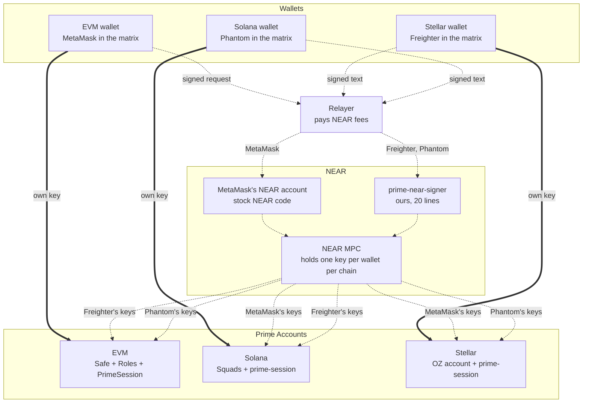
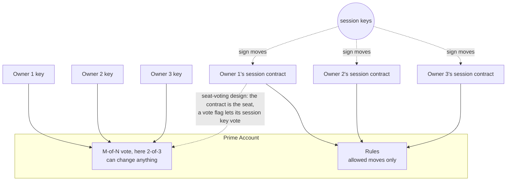
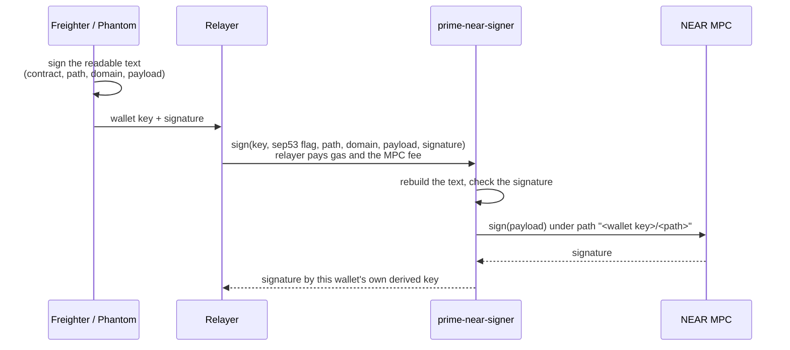
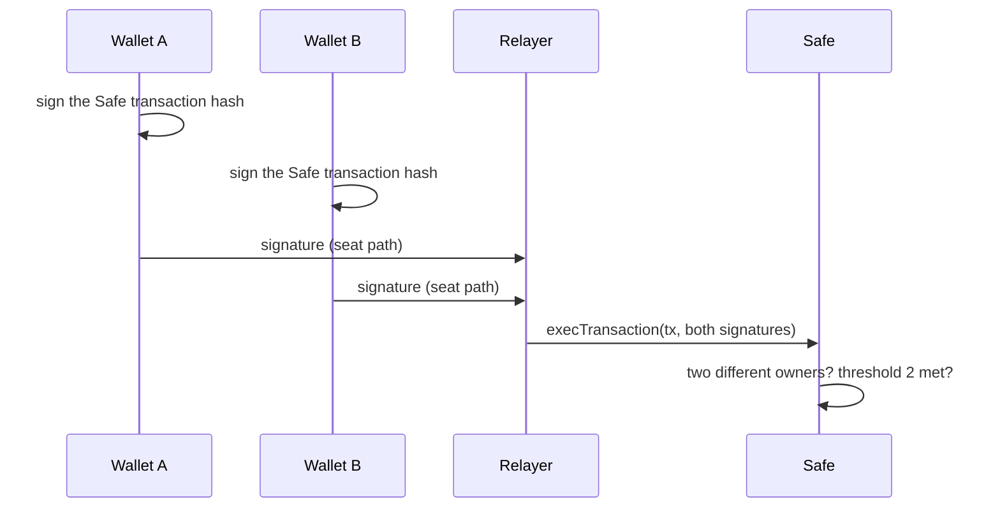
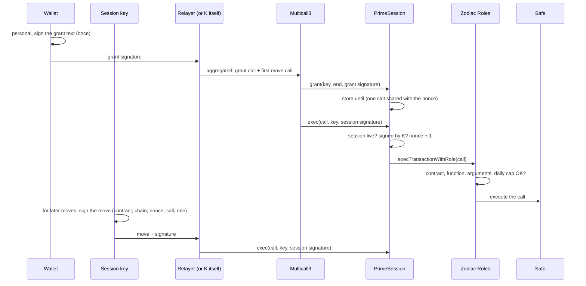
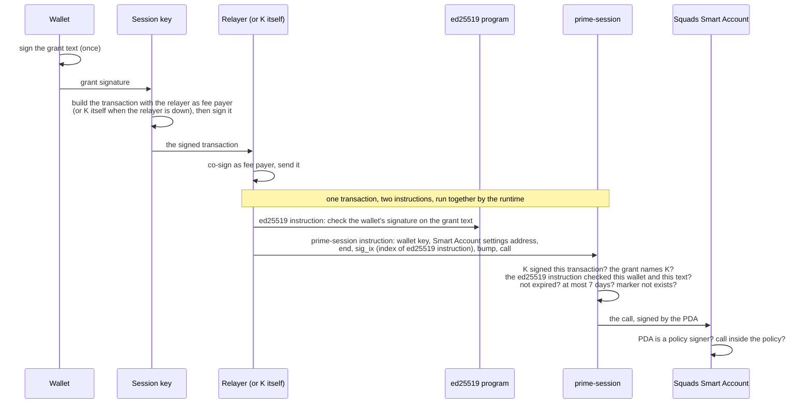
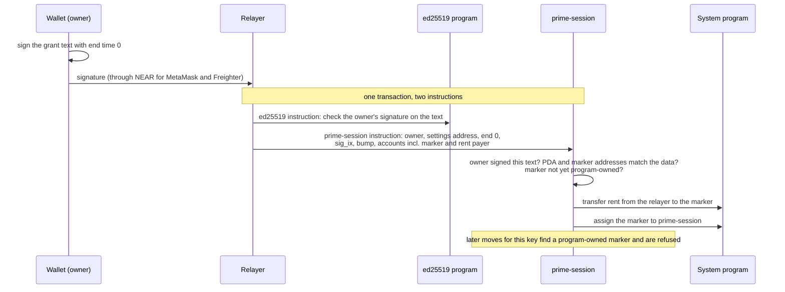
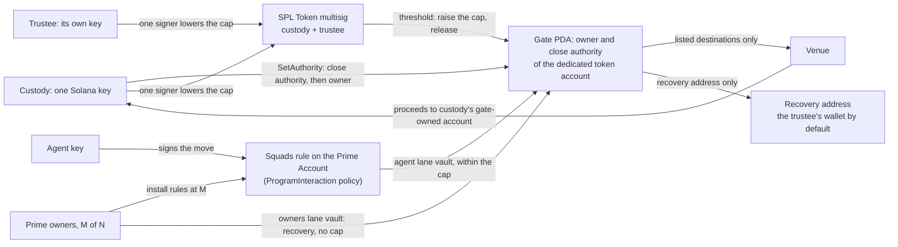
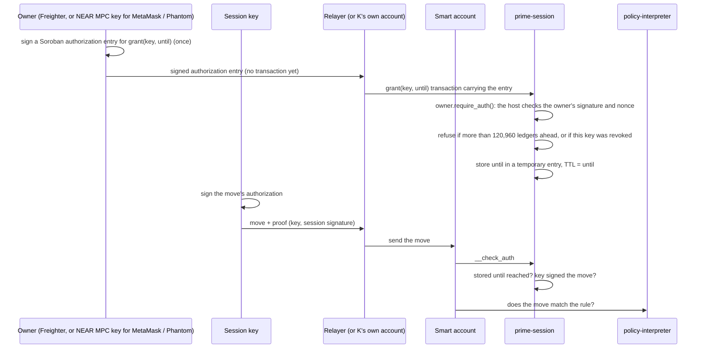

# Prime on Stellar, EVM and Solana: owners, wallets, seats and sessions

Status: spike, testnet only, branch `spike/session-signer` (created before the contracts were renamed). Refinement round 9, runs dated 8 October 2026. Claims link to a log, a testnet transaction or a source file (section 12). Follow-up pieces of work of the same day are in this document: native accounts on a second chain (section 5.6), Swig as the Solana session layer (section 7.3), calls other than token transfers (section 4.2) and session keys that vote for their owner (section 14). Round 9 logs sit under `round9/`, and the follow-up logs under `round9/native/` and `round9/swig/`; `evidence-r8.log` holds the read-only checks for network facts. The owner-count runs (section 4.1), the contract-call runs (section 4.2), the wallet runs (section 10.2) and the seat-voting spike with its independent review (section 14) have their logs and reports outside the bundle for now. Sections 6 to 8 and 10 describe the contracts as built and tested in round 9; the seat-voting variants of section 14 are spikes, and the production contracts are not switched to them yet. Spike paths below are relative to `spike/matrix/near-minimal/`.

## 1. The goal

A **Prime Account** is a shared account with **M-of-N owners**: any number of owners and any threshold, from one owner alone (1-of-1) to many (section 4.1). Each owner uses a wallet. Wallets come in three **signature families**: **EVM wallets** (MetaMask, Coinbase Wallet, Rabby and others), **Stellar wallets** (Freighter, Hana, xBull, Albedo, LOBSTR and others) and **Solana wallets** (Phantom, Solflare, Backpack and others). The test matrix was built on one wallet per family: **MetaMask**, **Freighter** and **Phantom**. Section 10.2 lists the other wallets we ran. The account can live on any of three chains: **Stellar**, **EVM** (Base) or **Solana**.

The tested baseline is a 2-of-3 account with those three wallets, and the examples below use it. The same contracts run other owner counts and thresholds (section 4.1).

Every owner's wallet must be able to do two jobs on every chain:

1. **Seat:** the wallet is one of the N votes. Any M votes together can change anything. Fewer than M votes can change nothing. In the baseline, M is 2 and N is 3.
2. **Session:** the wallet signs **once** to start a session key that lasts at most 7 days. By default the session key makes only the moves the account's rules allow, and a move is any call the rules allow, with a specific contract, a specific function and limits on its arguments (section 4.2). A grant can also carry a **vote flag**, and then the session key casts its owner's seat vote, so a session key can act on behalf of its owner. In this design the seat is the owner's session contract, so the owner and its own session count once (section 14).

Our **relayer** pays the fees for moves. If the relayer is down, the **session key pays its own fee**.

For the baseline that is 3 wallets × 3 chains × 2 jobs = 18 cases. All 18 are tested (section 10), with the limits listed in sections 10.1 and 13. The vote flag is verified in separate spikes (section 14); the contracts that those 18 cases ran against keep seats as plain keys.

## 2. Words used here

| Word | Meaning |
|---|---|
| Prime Account | The shared account with M-of-N owners: a Safe on EVM, a Squads Smart Account on Solana, an OpenZeppelin smart account on Stellar. |
| Owner | A person or organisation with one wallet on the account. Each owner has one seat and one session contract (or PDA, on Solana). |
| Seat | One owner's vote, of the N; M are needed. In the current build a seat is a plain key: an EVM address, a Solana key, or a Stellar account. In the seat-voting design it is the owner's session contract (section 14). |
| Ledger | Stellar's word for a block. One ledger closes about every 5 seconds. |
| Rule | What a session may do: which contract, which function, limits on each argument (for example the recipient or the amount) and, on EVM and Solana, totals per day. |
| Session contract | Called **prime-session** on every chain (`PrimeSession` in Solidity). Each chain has its own; the Stellar one is the crate at the root of this folder. Our small contract that the rules list as a member (on Solana, the member is an address that only our program can sign for). It checks the wallet's one-time grant and the session key's signature on each move. |
| Grant | What the wallet signs once: "session key K may act until time T". On EVM and Solana it is readable text. On Stellar it is a Soroban authorization entry for `grant(key, until)`. In the seat-voting design it can also carry a vote flag. |
| Vote flag, vote session | A grant made with the vote flag starts a vote session: its key can cast the owner's seat vote as well as make moves. A grant without the flag starts a move-only session, the default. |
| Signature family | The kind of signatures a wallet makes: EVM wallets sign secp256k1 messages and transactions, Stellar wallets sign ed25519 with Stellar's formats, Solana wallets sign ed25519 over raw text and Solana transactions. |
| Move | One call that a session key makes and the account's rules allow, with a specific contract, a specific function and limits on its arguments. "Send 10 tokens to the venue" is one example, and "deposit up to 1,000 into this venue, for this account only" is another. Section 4.2 has the rule engine of each chain and the test results. |
| Relayer | Our server. It sends transactions and pays their fees. Freighter and Phantom hold no NEAR, so their NEAR requests go through it. MetaMask's NEAR account is funded once by the relayer and pays the MPC fee itself. Moves still work without the relayer. |
| NEAR MPC | NEAR's signing service (`v1.signer-prod.testnet`). A NEAR account asks it to sign bytes. The key it signs with is derived from the account's name and a "path" string, so every NEAR account gets its own keys for every chain. Each request carries a small fee (1 yoctoNEAR on testnet). |
| Domain | Which kind of key the MPC uses: 0 = secp256k1 (EVM), 1 = ed25519 (Solana, Stellar). |
| Home chain | The chain a wallet can sign for by itself: MetaMask on EVM, Freighter on Stellar, Phantom on Solana. |
| Stand-in | A test key that signs in exactly the same format as the real wallet. The large test runs use stand-ins; section 10.1 lists what ran with the real wallet apps. |

Chain-specific terms are explained where they first appear.

## 3. The big picture



In one sentence: **each wallet uses its own key on its home chain (the chain of its signature family), and a key held for it by NEAR MPC on the other two.**

The diagram and the table show the three baseline wallets. Any wallet of the same signature family takes the same cell: Coinbase Wallet or Rabby in MetaMask's, Hana in Freighter's, Solflare or Backpack in Phantom's. Section 10.2 lists which of them we ran and what each one can sign. A Prime Account with more owners repeats the pattern for each owner; every owner adds one MPC key per chain it does not sign for natively.

| Wallet (family) | EVM | Solana | Stellar |
|---|---|---|---|
| MetaMask (EVM) | **own key** | stock NEAR account → MPC ed25519 key | stock NEAR account → MPC ed25519 key |
| Freighter (Stellar) | prime-near-signer → MPC secp256k1 key | prime-near-signer → MPC ed25519 key | **own key** |
| Phantom (Solana) | prime-near-signer → MPC secp256k1 key (or its own EVM account, section 6.2) | **own key** | prime-near-signer → MPC ed25519 key |

On each chain, the wallet's seat keeps one MPC path (`prime:<chain>`). In the built contracts, the session owner that signs grants uses a separate path for NEAR-routed wallets (`prime:<chain>-session`), which no seat vote uses. This prevents a session-owner signature from being filed as a seat vote. The seat-voting design merges the two paths unless a second key is added (section 14.6). MetaMask's native keys on its home chain (EVM) and Freighter's on theirs (Stellar) do both jobs; Phantom's on Solana does both.

**Option, a native account on a second chain:** Phantom can sign with its own EVM account and MetaMask with its own Solana account, as seat and as session owner. In the table above those two cells would read "own key", and NEAR drops out of them. NEAR stays the route for the other four cells and the fallback for any user who has not enabled the second account; both harnesses pick the route with a setting. Section 5.6 has the results and the open prompt choice.

## 4. Seats and sessions

By default a session is kept apart from the seats. In the built contracts, seats are plain keys, and our session contracts are only ever members of the rules. A grant can also carry a vote flag (section 14). In that design the seat is the owner's session contract, and the session key can cast its owner's vote. The drawing and table below show the built contracts, for the 2-of-3 baseline.



The dotted line from owner 1's session contract to the vote is the seat-voting design (section 14). Each owner adds one key to the vote and one session contract to the rules. The baseline uses MetaMask, Freighter and Phantom as owners 1 to 3.

| Chain | Seat (M-of-N), built contracts | Session contract is | and is not | Seat in the seat-voting design |
|---|---|---|---|---|
| EVM | Safe owner (a key) | a Zodiac Roles member | a Safe owner | the owner's PrimeSession, through ERC-1271 |
| Solana | Squads settings signer (a key) | a signer of a Squads policy | a settings signer | the same PDA, also a settings signer |
| Stellar | signer of rule 0 (a Stellar account) | the only signer of that wallet's session rule | a signer of rule 0 | `External(prime-session)` in rule 0, served by `verify()` |

So a stolen session key can at worst make allowed moves until it expires. In the built contracts it cannot add owners, change rules or vote, and each chain's tests try to make a session vote and see every attempt refused (section 10). Where a native account's one key does both jobs, the message formats keep a grant and a vote apart (section 5.6).

**Session keys that vote for their owner:** an owner can ask for more. A grant made with the vote flag lets the session key cast the owner's seat vote, so the key acts on behalf of its owner. The seat is then the owner's session contract: it accepts a vote from the owner's key or from a live vote session of that owner, so the owner and its own session count once. Without the flag, the session stays a move-only session. That is the default, and it keeps the table above true. We built it on all three chains in spikes, and all three passed on testnet or a fork with the real NEAR MPC. An independent review of the spikes recommends against adopting the full design, because it turns the M-of-N over wallets into an M-of-N over keys that live in the app. It recommends keeping plain-key seats and widening what a session may call (section 4.2). The production contracts are not switched, and Tuan decides (section 14).

**Where the grant lives** differs by chain, to keep each contract small:

| Chain | Grant handling | Why |
|---|---|---|
| EVM | sent once, alone or in one Multicall3 transaction with the first move; PrimeSession stores "valid until" per session key | each move then carries only the session key's signature, which keeps moves cheap |
| Stellar | sent once in a `grant(key, until)` transaction that carries the owner's Soroban authorization; prime-session stores "valid until" in a temporary entry | each move carries only the session key's signature (96 bytes of proof), and the host's nonce and signature expiry stop replays |
| Solana | not stored; the grant signature travels with every move and is checked every time | no storage and no extra transaction, so less code. A revoke is the one thing stored (a marker account) |

### 4.1 How many owners

The number of owners N and the threshold M are setup parameters. Every owner has its own seat and its own session contract (or PDA, on Solana), and every owner's session starts the same way. The 2-of-3 baseline is the configuration the 18-case matrix ran on (section 10). We also ran the same harnesses with 1, 2, 5, 12 and 15 owners and thresholds from 1 to 8. Owners 1 to 3 are MetaMask, Freighter and Phantom; further owners are local test keys with the same signing formats, acting as seat and as session owner.

Each cell shows the checks that passed out of the checks run, from the final logs of 8 October 2026. Every run in the table has zero failures. Wherever an owner signs on a chain that is not its home chain, it signed through the real NEAR MPC.

| Owners (M-of-N) | EVM (Base Sepolia fork) | Solana (local validator) | Stellar (testnet) |
|---|---|---|---|
| 1-of-1 | 28/28 | 30/30 | 29/29 |
| 2-of-2 | 47/47 | 49/49 | 54/54 |
| 2-of-3 (baseline) | 134/134 | 128/128 | 132/132 |
| 3-of-5 | 87/87 | 94/94 | 104/104 |
| 7-of-12 | 178/178 | 210/210 | not run |
| 8-of-15 | not run | not run | 274/274 |

The 2-of-3 row repeats the baseline of section 10 on the same harness. The Stellar baseline there counts 138 because it also counts six steps with the real Freighter extension. Each chain ran its largest configuration that fits its own limit: 7-of-12 on EVM and Solana, and 8-of-15 on Stellar, where 15 signers is the most one rule takes.

Each run covers four groups. M votes pass, fewer than M are refused, a different set of M passes, and an outsider or a seat signed by another key is refused. Every owner's session grants, makes moves (relayer-paid and self-paid), revokes one of two sessions while the other keeps working, and meets its refusals, including a grant signed by another owner. A session key plus M-1 real owners is refused on the account's admin path. The last group removes an owner: its session stops at once, its later grant moves nothing, the other owners' sessions keep working, and once the owners remove its seat that owner's vote no longer counts and the remaining owners still reach the threshold.

Two first attempts failed for reasons outside the contracts. The first Stellar 8-of-15 run showed 22 failed session moves for owners 11 to 15 with contract error 10, the token contract's balance error: the harness funded the Prime Account with a flat 30 XLM and each owner's checks spend 3 XLM, so the account was empty by owner 10. The harness now funds the larger of 30 XLM and 5 XLM per owner, and the rerun passed. While the balance was 0, a few refusal checks passed for the wrong reason, and with funding fixed they pass for the right one. The first Solana 7-of-12 run lost its validator connection and the rerun on a fresh validator passed. Both earlier logs are kept beside the final ones.

What the runs showed about counts and limits:

- **Cost per owner:** each owner adds one session contract on EVM (a deployment of 919,172 gas, plus about 87,000 gas in the setup transaction for the Roles member and the Safe owner), one session contract on Stellar (a deployment fee of 97,100 to 98,000 stroops), and one PDA on Solana. A Solana PDA needs no deployment. Each owner does make the Squads settings and the policy 33 bytes larger each, about 0.00046 SOL of refundable rent (229,680 lamports for each). Revoking a session leaves a marker that costs 890,880 lamports (section 7.2). The Stellar account creation fee grows by about 264,000 stroops (0.026 XLM) per owner: 890,203 with 1 owner, 1,151,662 with 2, 1,946,095 with 5 and 4,586,525 with 15.
- **Cost per vote:** on EVM a Safe vote costs about 7,700 gas more per signature, from 90,886 gas with one signature to 137,268 with seven. On Solana each signer sends its own approve transaction at 5,000 lamports. On Stellar one transaction carries all the signatures, and a vote with 8 signatures took 19 to 26 s end to end in the harness, because the NEAR-routed signatures run one after another at about 8 s each.
- **Cost per session action:** flat on EVM (grant 76,000 gas, relayed move 125,000 to 142,000, self-paid move 125,000, revoke 58,000) and flat on Stellar. A Solana move grows by about 900 compute units per owner: 50,648 with 1 owner, 54,249 with 2, 54,556 to 57,618 with 5 and 60,267 to 61,860 with 12, at a flat fee of 15,000 lamports. A single sample can sit 4,000 to 5,000 units above the trend when a program-derived address search runs longer.
- **NEAR signatures grow with the threshold:** the runs made 73 NEAR signatures on EVM 7-of-12 (9.5 s average), 44 on Stellar 3-of-5 (8.0 s) and 89 on Stellar 8-of-15 (8.1 s). Owners whose wallets sign natively on a chain need none, and only the first three owners ever use NEAR in these runs, so the count follows the threshold and the number of moves, and extra plain-key owners add none.
- **NEAR relayer balance:** each MPC `sign` call prepays 300 Tgas and burns about 0.0012 NEAR at the minimum gas price (the 89 signatures of the Stellar 8-of-15 run burned 0.102 NEAR). At the gas price of one hour of the runs, ten times the minimum, the prepay was 0.3009 NEAR while the relayer held 0.2998, and every sign failed with "does not have enough balance". The relayer therefore needs a floor of about 0.31 NEAR. At 1.68 NEAR it covers about 1,400 signatures at the minimum price and about 140 if the price rises tenfold again.
- **Chain limits on owner count:** Safe 1.4.1 and Zodiac Roles have no owner cap in the contracts, and one setup transaction held 12 owners for 1,518,079 gas (about 87,000 gas per extra owner); we measured up to 12. A vote carries 65 bytes of signature per signer. Squads fits 25 signers in one create transaction (1,150 of 1,232 bytes) and refuses 28 (1,249 bytes), then grows an account one signer at a time: one settings account reached 62 signers with each signer added in its own transaction, and the 63rd add failed with an access violation in the program's heap region (`round9/owners/psn.limits3.log`). An OpenZeppelin smart account accepts 15 signers in rule 0 on testnet, and an account created with 16 is refused (contract error 3010, `TooManySigners`). The same account took 41 rules (rule 0 and 40 more) before the probe stopped, so the rule count is no limit. More than 15 owners on Stellar needs another layout, such as a sub-account as one signer.
- **Last owner:** a 1-owner Safe refuses an owner removal that would leave it without owners (`GS013`), and Squads refuses the matching proposal at execution (`NoProposers`) and refuses to leave the policy with no member. The Stellar account accepts removing its only signer from rule 0, and the account is then unreachable. Tuan decides whether the account should refuse that (section 13).
- **One vote per owner:** the Safe refuses one owner signing three times as three votes (`GS026`), and Squads refuses a second approval by the same owner (`AlreadyApproved`). The Stellar runs refuse an outsider and a seat signed by another key (contract errors 3016 and 5).

**Onboarding must check that the owner keys differ:** a Safe counts each contract owner once whatever key stands behind it (section 14).

### 4.2 What a session key can call

A session key can make any call the account's rule allows. The rule names a contract, a function and conditions on each argument, and the key's call goes through only when it matches. A token transfer is one such call, and "deposit up to 1,000 into this venue, for this account only" is another. All three chains send the key's call through the account's own rule engine, and the session contract adds no permission.

| Chain | Rule engine | What the rule can say about a call |
|---|---|---|
| EVM | Zodiac Roles v2.1.1: `PrimeSession.exec` calls `execTransactionWithRole`, and the Safe then makes the call, so the venue sees the Safe as the caller | the target contract, the function (its 4-byte selector), each static argument (address, number, bool, fixed bytes) by equal to, one of a set, greater or less than, or bitmask; ETH value and delegatecall are off unless the rule turns them on; allowances per period for tokens, ETH and call counts |
| Solana | A Squads `ProgramInteraction` policy: prime-session calls only the Smart Account program, signing as the wallet's PDA, and the policy checks each inner instruction before it runs as the vault | the program id; the data at fixed byte offsets (numbers of 1 to 16 bytes compared for equal, different, greater or less; a byte slice compared for equal or different); an account's address or its own data; the number of instructions in a move |
| Stellar | the policy-interpreter predicate on the session rule (grammar version 4): the account asks prime-session whether the key is live and signed, and then asks the interpreter whether the call matches | the contract (the rule is scoped to one), the function, each argument by equal, less than, greater than or in a set (addresses, i128, u32, symbols), the element count of a vec argument and a field of a struct inside it, combined with `and` and `or` |

We ran calls that move no token. On each chain a small venue contract keeps a ledger of deposits and records who called it (the Memo program on Solana serves too). The rule allowed one shape of call, and the harness made the near misses. Each refusal was checked three ways: the error names the rule that refused it, the venue's ledger did not change, and the account's own owners, signing as seats with no session rule, made the same call successfully. That shows the venue accepts the call and the session rule did the refusing.

| Chain | Where | Result | Calls the session made | Calls refused |
|---|---|---|---|---|
| EVM | Base Sepolia fork | **84/84** | 7 | 20, nine of them repeated from the Safe as controls |
| Solana | local validator cloned from devnet | **89/89** | 7 | 30, with 6 controls by the seats |
| Stellar | testnet | **66/66** | 9 | 22, with 7 controls by the seats |

- **EVM:** the rule allowed only `deposit` on one venue with `amount <= 1000` and `onBehalfOf` equal to the Safe. A deposit of 100 and of exactly 1,000 passed, and the venue saw the Safe as the caller. Refused: 1,001 and 2^256 - 1, a stranger, the session key or the zero address as beneficiary, `withdraw`, the same deposit on a second venue, a delegatecall, 1 wei attached, an owner change on the Safe, and empty calldata. A second rule held a range (`10 <= amount <= 100`), a choice of two beneficiaries and a `withdraw` with any amount to the Safe, and it refused a role that PrimeSession is not a member of. With this venue the first move cost 166,480 gas and later moves about 112,400.
- **Solana:** one policy with three constraints. Constraint 0 allowed a venue `deposit` of at most 1,000 with the vault as beneficiary, on one ledger account. Constraint 1 allowed a Memo whose text starts with `prime:`. Constraint 2 allowed a deposit to a second ledger only while that ledger's own total (read from its account data) was at most 50. A deposit and a memo in one move ran together, and a good deposit with a bad memo ran nothing. A deposit move used 58,380 compute units in a 1,005-byte transaction.
- **Stellar:** the rule allowed `deposit(from, amount, on_behalf_of)` with `from` and `on_behalf_of` equal to the account and `1 <= amount <= 1000`, and a Blend-shaped `submit` with exactly one request whose token is XLM, whose amount is 1 to 1,000 and whose type is 0 to 3. Refused: amounts over the cap, 0 and negative, another beneficiary, `withdraw`, request types 4 and 5, two requests or none, another spender, and the same call on a second venue.
- **Session limits still bind:** an expired session, a session of more than 7 days, a revoked key and another wallet's key were refused on calls the rule allows.

What to know when writing rules:

- **Extra bytes after the last constrained argument pass** on EVM and Solana, and the venue then reads the same call. A venue that reads `msg.data.length` or the last 20 bytes of calldata (an ERC-2771 trusted forwarder does) would see a different call, so a rule should pin the target to venues that decode arguments with the Solidity ABI decoder. Stellar arguments are typed, so the question does not arise.
- **Stellar integers are signed,** so an upper bound alone lets a negative amount through (the venue accepted -5 when seats called it). The predicate needs an explicit lower bound. EVM unsigned arguments have a floor of zero already.
- **Solana data is read at fixed offsets:** a field that follows a variable-length field has no fixed offset and cannot be constrained, and a byte slice supports equal and not equal only, so a prefix needs a slice of exactly the prefix length (the Memo rule does this).
- **The Squads client helper for multi-instruction moves shifts the account indexes** after the first instruction, because it adds the signer list once per instruction. The harness builds the move without it and adds the session PDA once, and without that change a two-instruction move is refused with a program id mismatch.
- **A real Blend supply needs two Stellar rules:** it authorizes two contexts, the pool `submit` and the token `transfer`, and the interpreter sees one authorized call at a time, so the account holds a rule for each. The 6 October run in `octopos/docs/near-hybrid-session-keys.md` did this with a real pool (supply accepted, borrow refused, two requests in one `submit` refused). Our run used a Blend-shaped venue with one context.
- **The app's EVM policy document covers static arguments only:** conditions on arrays, bytes and strings need Roles conditions built with the SDK, and Roles reads no venue state, balance or price unless a checker contract is attached.
- **One rule covers every live session of a wallet,** so the rule cannot tell two session keys of the same wallet apart.
- **Run next:** an allowed `supply` against a real EVM pool such as Aave on the fork, the Squads hooks and per-call spending limits, and Roles allowances on calls other than transfers. Rolling totals ran in the earlier matrices on transfers (EVM allowances and a Solana spending limit); the OpenZeppelin spending-limit policy on Stellar has not run.

## 5. NEAR: a key for chains the wallet cannot sign for

### 5.1 Why a wallet cannot use its own key everywhere

The problem is the wallets: each one refuses to sign some formats. The table covers MetaMask, Freighter and Phantom, one wallet per signature family. Wallets of the same family differ in details, and section 10.2 lists what each of the others signed.

| Wallet | Signs | So it cannot |
|---|---|---|
| MetaMask | EVM transactions and messages (secp256k1 keys) | sign for Solana or Stellar, which use ed25519 keys |
| Freighter | Stellar transactions, Soroban authorization entries (`signAuthEntry`), and messages only in SEP-53 form: `sha256("Stellar Signed Message:\n" + text)` | sign an EVM message or a Solana transaction. Its key is ed25519 like Solana's, but it adds the SEP-53 prefix to every message, so a Solana transaction signature cannot be made. |
| Phantom (Solana account) | Solana transactions, and messages that are valid UTF-8 and do not look like a Solana transaction | sign a Stellar transaction or authorization: those are 32 hash bytes, which are almost never valid UTF-8 |
| Phantom (EVM account) | EVM, on its built-in chain list only | sign for NEAR's EVM chain ids (397/398), so it cannot use MetaMask's NEAR route |

Both wallets can sign for the second chain with their own account once the user enables it (section 5.6): Phantom's EVM account signs `personal_sign` over raw bytes, and MetaMask's Solana account signs `signMessage` as plain ed25519 over the UTF-8 text.

### 5.2 Why NEAR, and not a signature checker on each chain

Each chain could check the other wallets' formats itself. An earlier version on this branch did exactly that, with no NEAR (`spike/matrix/minimal/`):

| | Each chain checks every wallet's format | NEAR route (this design) |
|---|---|---|
| EVM | 59 lines **+ 1,104 lines** of an unaudited ed25519 library, because EVM has no ed25519 built in | 32 lines, normal EVM signatures only |
| Stellar | 89 lines: secp256k1, SEP-53 and plain-text owners | 37 lines, stored grant via Soroban authorization, Address owners only, final revoke |
| Solana | 71 lines: ed25519 and secp256k1 owners | 33 lines: ed25519 owners only, per-session revoke |
| NEAR | (no code) | prime-near-signer 20 lines |
| **Total** | **219 lines + 1,104 vendored** | **122 lines** |

This is not an exact like-for-like comparison. In the earlier version, the same contracts were also the wallets' seats, and the Solana one had revoke. With NEAR, each chain's contract checks only one signature format, and no chain needs extra cryptography code. The cost is a NEAR round trip of about 8 s on average (7.8 to 8.3 s in the final runs) for NEAR-routed seat votes, grants and revokes. Moves never use NEAR.

### 5.3 MetaMask: stock NEAR code only

Every EVM address has a NEAR account of the same name (an "eth-implicit" account, NEP-518). It comes into existence the first time someone sends it NEAR (our relayer sent 2 NEAR), and it runs NEAR's stock wallet contract. MetaMask signs one EVM-style transaction for NEAR's chain id (398 on testnet, 397 on mainnet). The relayer sends it to the account's `rlp_execute` method and pays the gas. The stock contract then calls MPC `sign`, paying the 1 yoctoNEAR fee from the account's balance. Nothing of ours runs on NEAR for MetaMask.

### 5.4 Freighter and Phantom: why stock NEAR code is not enough

NEAR's open-source wallet contract (`near/intents`, `contracts/wallet/signatures/`) supports three modes: ed25519 over a raw 32-byte hash, WebAuthn (passkeys), and no signature. The no-signature mode checks no owner at all, so it is not usable. Neither Freighter nor Phantom can produce a raw-hash ed25519 signature or a WebAuthn one (section 5.1).

NEAR Intents does accept SEP-53. But it can call other contracts only through `AuthCall` → `on_auth()`, and the MPC contract has no `on_auth`, so Intents cannot ask the MPC to sign.

We do not change NEAR's wallet contract, so it stays stock, already-reviewed code. Instead we wrote one small separate contract.

### 5.5 prime-near-signer (ours, 20 lines)

A NEAR contract at `signer.prime-spike-muwguc60.testnet` with one method and no storage. It passes the payload through unchanged to the MPC (code hash `AfRTxyBpBmUDYi88xxytL5z4yfPn3tBa1SYawt4Jzh3b`).



This is the exact text real Phantom showed and signed on testnet (7 October 2026, `real-wallets/pnear-input.json`). It uses the seat path; a grant request carries `path: prime:stellar-session` in the same position:

```
Prime NEAR signer
contract: signer.prime-spike-muwguc60.testnet
path: prime:stellar
domain: 1
payload: 77d2870cebe528bcd6a869ff33ab3e0dc72c7a4e687c5fe2386507504a66a4e9
```

| Part | Why it is there |
|---|---|
| Readable text | Freighter signs it as SEP-53 and Phantom as plain UTF-8, both without changes. The user sees which contract, path and key type they approve; the payload itself is a hash shown as hex, so the app must show what it means next to the prompt. |
| Path ends in `-session` for grant owners | In the built contracts the path separates session owners (`prime:stellar-session`) from seats (`prime:stellar`), and a signature made under one path cannot be filed as the other. The seat-voting design signs both under the session path (section 14.6). |
| The text names the contract, path, domain and payload | A signature for one request cannot be used for any other. Four refusal tests check this (another payload, path, domain or signer contract). |
| The wallet's key starts the MPC path | The MPC derives the key from (caller, path), and the caller is always this contract. With the wallet's key in the path, wallet A can never get wallet B's key. |
| No storage, no nonce | Replaying a request only gets another signature over the same payload. A signature is no use twice on a chain, because Soroban refuses a used authorization nonce and Solana refuses a processed transaction. |

The signer passes the payload string through unchanged: the wallet signs the exact string the MPC receives, so an upper-case payload signed as lower-case is refused. A payload that is not hex passes the signer and fails at the MPC, which costs the relayer 5.14 Tgas instead of 1.91 (`round9/near/signer-neg.log`).

**Question from Tuan: can the session key act as a short-lived signer of the Prime account itself (rule 0 on Stellar)?** Yes. That is the seat-voting spike of section 14, and on Stellar it ran on testnet with the real NEAR MPC (263/263 checks, deployed code equal to the build). Rule 0 lists each owner's seat as `External(prime-seat)`, the owner's own contract. A grant made with the vote flag lets its session key sign as that seat, for at most 7 days or until the owner revokes it. The same shape ran on 6 October with an EVM-owned session signer as the seat (24/24 checks, `octopos/docs/near-hybrid-session-keys.md`).

Adding the session key itself to rule 0 would need a 2-of-3 change each time. Every change to a rule calls the account's own authorization, which for rule 0 is the 2-of-3 vote, and with the weighted policy a new signer takes two such calls (add the signer, then set its weight) and a removal takes two more. With the seat contract, rule 0 never changes: the owner signs one grant, the contract accepts the owner or a live vote session as the same single vote, and a revoke ends it.

The independent review of the spikes adds a risk finding and a recommendation. A vote session holds the owner's whole seat: one vote session plus one other owner reaches 2-of-3 and can change owners, threshold and rules (on Stellar the account's code too), and two vote sessions need no owner. The NEAR-routed owners sign a hex payload, so they cannot see the vote flag when they grant it. The review recommends against adopting the full design. It recommends plain-key seats with move-only sessions, widened by rule for each routine action the owner wants the session to take (section 4.2). If the vote right is wanted, a no-governance variant is acceptable only when seven conditions hold (section 14.5). Tuan decides (section 14.8).

**Before mainnet:** delete the deploy key from the signer account so its code can never change. Today the account has one full-access key in place.

### 5.6 Option: the wallet's own account on a second chain

Two of the six cross-chain cells can skip NEAR: Phantom's own EVM account on Base, and MetaMask's own Solana account on Solana. The wallet's account becomes the seat and the session owner on that chain, with no `-session` path. NEAR stays for the other four cells and as the fallback for users who have not enabled the account. No contract changed. The harnesses select the route with `PKN_NATIVE` (EVM) and `PSN_NATIVE` (Solana), and the NEAR runs below show the original route on the same harnesses.

| Chain | Route | Checks | Log (under `round9/native/`) |
|---|---|---|---|
| EVM (Base Sepolia fork) | NEAR route, same harness | **134/134** | `pkn.near-baseline-fork.log` |
| EVM | Phantom native: the real Phantom extension signs all 25 Phantom signatures, real NEAR for Freighter | **137/137** | `pkn.native-fork.log` |
| Solana (local validator cloned from devnet) | NEAR route, same harness | **128/128** | `psn.near-baseline-local.log` |
| Solana | MetaMask native: the real MetaMask 13.50.0 signs 12 `signMessage` requests (every grant and revoke), a stand-in with the same key signs the Squads vote transactions, real NEAR for Freighter | **145/145** | `psn.native-local.log` |

The native runs add separation checks and drop session-path checks, so the counts differ from the NEAR route by those checks. The same matrices also ran with a local stand-in in place of NEAR (`pkn.native-dry-stub-near.log`, 137/137; `psn.native-dry2-stub-near.log`, 145/145).

**What the real wallets do:**

- **Phantom, EVM:** `personal_sign` with a 0x-hex parameter signs the 32 raw bytes (EIP-191). Safe 1.4.1 accepts that as its eth_sign signature type (v + 4), and `PrimeSession` accepts the grant text signed the same way. In Testnet mode Phantom stays on Sepolia after a switch to Base Sepolia and refuses typed data for chain 84532 (error 4901), so a native Safe vote uses the eth_sign type. Typed data on Base mainnet is unchecked, because mainnet is read-only for us.
- **MetaMask, Solana:** `signMessage` signs the UTF-8 bytes of the text with no prefix, which is the check prime-session makes through the ed25519 program. `signTransaction` can rewrite the transaction (next paragraph). The wallet disables Confirm when its own simulation reverts, and the matrix's Squads accounts exist only on the local validator, so the real wallet could not sign the matrix's vote transactions. The stand-in follows the wallet's code; the real wallet signed devnet memo transactions in seven cases that fix that behaviour (`mm-real-wallet-norewrite.log`).

**The MetaMask transaction rule:** when a transaction has no signature yet and lacks a compute price or limit, the wallet prepends a `SetComputeUnitPrice` of 10,000 micro-lamports and appends a `SetComputeUnitLimit`, then signs that message. This changes what the relayer must co-sign and moves every instruction index: a prime-session `sig_ix` of 0 then points at the price instruction, and the program refuses a revoke with custom error 7 (reproduced). The client therefore builds every MetaMask-signed transaction with both compute-budget instructions in place (price first, limit last, limit set from a simulation with both present), and the wallet signs the message as built. An owner-submitted revoke puts `sig_ix` at 1. The relayer is the fee payer and a writable signer, so it validates the returned message before it co-signs: same fee payer and blockhash, same other instructions and accounts, at most one price and one limit with well-formed data, a priority fee under 25,000 lamports, and a wallet signature that verifies over the returned message. The harness accepts the unchanged message and a changed budget value, and refuses seven tampered returns.

**Why a grant and a vote stay apart:** one key now does both jobs, so the message formats carry the separation.

- **EVM:** the Safe checks an eth_sign vote over a 60-byte preimage (28 prefix bytes and the 32-byte hash). `PrimeSession` builds the grant text on chain from fixed parts, 160 to 256 bytes (164 to 241 measured), so a grant preimage has at least 189 bytes. Preimages of different lengths share a digest only through a keccak256 collision. A grant filed as a vote, and a vote offered as a grant, are both refused in the harness, and a valid vote on the same Safe transaction passes as control.
- **Solana, grant as vote:** MetaMask's `signMessage` signs the text decoded as UTF-8 with NUL bytes removed, so it signs a transaction message only when that message is valid UTF-8 without NUL. Every Squads vote lists the Squads program id among its keys, and `SMRTzf…` contains the byte 0xFB, which never occurs in valid UTF-8 (a v0 message starts with the byte 0x80, which can never begin valid UTF-8). So `signMessage` can never yield a Squads vote, for any key. On the real wallet, `signMessage` over a 160-byte transaction message signed 269 different bytes.
- **Solana, vote as grant:** every grant text starts with "Prime". Read as a transaction header it needs 3,488 key bytes, and the longest grant text has 191 bytes, so no grant text parses as a transaction message.

**NEAR calls removed:** on EVM the matrix makes 27 NEAR signatures against 53 (26 fewer). On Solana the log shows 15 against 35; a new check adds two Freighter calls, so 22 of the removed calls are MetaMask's. Per flow, one NEAR call goes away for each seat vote, grant and revoke by the native wallet, and a 2-of-3 vote between the two native wallets or a session start by either needs none.

**Latency** (harness runs of 8 October; browser automation included, and a person adds reaction time on every route):

| Route | Time per signature |
|---|---|
| EVM, NEAR route (53 signatures) | 7.6 s |
| EVM, Phantom native, real extension (25 signatures) | 3.7 s (5.6 s and 6.3 s in earlier runs) |
| Solana, NEAR route (35 signatures) | 8.4 s |
| Solana, MetaMask native, real `signMessage` (12 signatures) | 4.8 s (5.3 s alone) |
| Solana, MetaMask native, real `signTransaction` (devnet, 1 signature) | 3.1 s |

**Cost of the native route:** an EVM seat vote uses 136 to 172 more gas (81,663 to 81,687 against 81,515 to 81,527), the eth_sign prefix hash. A Solana vote that executes grows from 49,866 to 50,042 compute units and from 490 to 542 bytes, with a fee of 10,501 lamports against 10,000; the two budget instructions cause that. Grants, revokes and moves cost the same as on the NEAR route.

**Seat-vote prompt (open, Tuan decides):** the prompt is the only thing a user sees before a seat vote, and it differs by route.

| Route | Vote prompt | Grant prompt |
|---|---|---|
| NEAR | a labelled text: "Prime NEAR signer / contract: signer.prime-spike-muwguc60.testnet / path: prime:evm / domain: 0 / payload: <hash>" | the same layout with `path: prime:evm-session`; the payload is the EIP-191 digest, so the terms are hidden |
| Phantom native | "Sign Message / Message: 0x<32-byte hash> / Network: Ethereum" | the full grant text: contract, session key, expiry and network |

The native grant prompt is better than the NEAR one. The native vote prompt is a bare 32-byte hash. A `personal_sign` over 32 bytes is a common dapp request (login nonces, order hashes), so any site connected to Phantom's EVM account can ask for a seat vote behind a generic prompt, and one such vote plus one other seat completes a 2-of-3. On the NEAR route a page can copy the labelled text too, so the label helps a careful user and does not stop a page that copies the layout. The separation proof above holds in every option below.

| Option | Seat vote | Grant | NEAR use | Effect |
|---|---|---|---|---|
| 1. Native for grants, NEAR for votes | labelled text through NEAR | native, full text | votes only | keeps today's labelled vote prompt; a session start loses the 8 s wait, and votes keep it |
| 2. Native for both | bare-hash prompt | native, full text | none for Phantom | removes the NEAR calls for Phantom; every vote prompt is a bare hash |
| 3. Option 2, and the app shows the decoded Safe transaction beside the prompt | bare-hash prompt, details in the app | native | none | helps a user inside the app's own flow; a phishing page shows no such details |
| 4. EIP-712 votes where Phantom accepts the chain id | readable `SafeTx` fields in the wallet | native | none | gives the best prompt; Phantom refuses typed data on Base Sepolia, and Base mainnet (8453) is unchecked |

## 6. EVM (Base): Safe + Zodiac Roles + PrimeSession

### 6.1 Components and why each is needed

| Component | Who wrote it | Why it is needed |
|---|---|---|
| Safe 1.4.1 (SafeL2, proxy factory, fallback handler, MultiSend) | Safe, open source | Holds the funds. Its owners and threshold are the M-of-N seats (2-of-3 in the baseline). |
| Zodiac Roles v2 | Gnosis Guild, open source | The rules. A Safe "module" (an add-on the Safe trusts to send transactions) that lets each member call only allowed contracts, functions and arguments, within daily allowances. |
| PrimeX onboarding and policy code | ours, already in PrimeX (`apps/evm-web/src/core/onboarding.ts`, `evm-policy.ts`) | Creates the Safe, deploys Roles, writes the rule. Will add PrimeSession as the Roles member, passing the session-owner address for NEAR-routed wallets. |
| **PrimeSession** | **ours, new, 32 lines** | One per wallet per account, and that wallet's Roles member. It checks the wallet's grant and the session key's signature on each move, then calls Roles. Stores `until` and `nonce` in one slot. |
| Multicall3 (aggregate3, `0xcA11bde05977b3631167028862bE2a173976CA11`) | mds1/multicall, open source, already deployed on Base Sepolia | Sends grant and first move in one atomic transaction, with `allowFailure: true` on the grant call only. |
| OpenZeppelin ECDSA, MessageHashUtils, Strings 5.4 | OpenZeppelin, open source | Signature recovery and text building inside PrimeSession. |

Why not make each session key a Roles member directly? Adding a member takes an M-of-N Safe transaction every time. With PrimeSession, the owners add it once. After that, the wallet starts sessions alone with one signature.

### 6.2 A seat action (M-of-N, shown for 2-of-3)



Seats use the `prime:<chain>` path. MetaMask signs with its own key using EIP-712 typed data. Freighter and Phantom sign the hash through NEAR MPC with their secp256k1 keys under `prime:evm`. The test shows Phantom's seat at MPC key `0x5F17…F3b1` on Base Sepolia.

Phantom can instead use its own EVM account. Base Sepolia (84532) is on Phantom's chain list. The real Phantom on a Base Sepolia fork signed a grant with `personal_sign` (EIP-191) and acted as a Safe seat. The full matrix has since run this way, with the real extension signing all 25 Phantom signatures (137/137, section 5.6). In Testnet mode Phantom stays on Sepolia and refuses typed data for chain 84532, so its vote is `personal_sign` over the 32 raw bytes of the Safe transaction hash, filed as the Safe's eth_sign signature type.

### 6.3 A session



- The grant owner is MetaMask's own key, or the NEAR MPC key of Freighter or Phantom under `prime:evm-session` (different from their seat path). Phantom can instead sign the grant with its own EVM account (section 5.6).
- `personal_sign` (EIP-191) is the standard "sign this text" in EVM wallets. MetaMask signs the grant text itself. For Freighter and Phantom, NEAR MPC signs the same EIP-191 digest under `prime:evm-session`; the wallet itself signs only the prime-near-signer text, which carries that digest as hex.
- **Grant and first move in one transaction**: on first use, the relayer or session key sends `grant` and `exec` through Multicall3 `aggregate3` with `allowFailure: true` on the grant call only. If someone submits the grant call alone first (a front-run), the combined call's grant fails harmlessly and the move runs (168,450 gas on the fork). `exec` still needs a live session, so a grant that fails for any other reason makes the move revert on its own `session` check, and a combined call with a bad grant signature reverts as a whole with nothing stored. A refused first move also reverts its grant. Later moves send only `exec`.
- **Gas** (Base Sepolia fork, real Safe and Roles): the first relayed move costs 124,742 to 124,754 gas (round 8: 143,486); a later move costs 124,754; grant plus first move in one Multicall3 transaction costs 183,483 to 183,507, against 200,754 for the same two steps in two transactions (`round9/evm/pkn.fork-r9b.log`).
- **Storage**: `until` and `nonce` live in one 256-bit storage slot (`struct Session { uint128 until; uint128 nonce; }`). The grant already fills the slot, so the first move no longer pays to write a fresh slot. In the contract's forge test (stub Roles) the first move fell from 59,016 to 40,272 gas, and the grant rose from 83,195 to 83,356.
- **Zero key**: a grant for the zero address is accepted and stored, and that key can never move, because OpenZeppelin's `recover` reverts instead of returning the zero address (fork checks, and the repo's forge tests).
- A grant must end in the future, at most 7 days ahead, and later than the key's current end. So a grant can extend a session but never shorten or replay it.
- **Revoke** is the same `grant` call with end 0: the wallet signs the grant text with end 0, and PrimeSession sets the key's end to the largest possible number (`type(uint128).max`). A move needs "end within 7 days from now", so the revoked key stops working immediately. A new grant needs "new end later than current end"; this constraint makes it impossible to grant the key again. There is no separate revoke function.

## 7. Solana: Squads Smart Account + prime-session

### 7.1 Components and why each is needed

| Component | Who wrote it | Why it is needed |
|---|---|---|
| Squads Smart Account program (`SMRTzfY6…`) | Squads, open source | Holds the funds. Its settings signers with threshold 2 are the seats. Its `ProgramInteraction` policies are the rules (allowed programs, accounts, data at fixed offsets, per-move limit, daily allowance). |
| Solana ed25519 program | built into Solana | Checks the wallet's grant signature inside the same transaction. |
| **prime-session** | **ours, new, 33 lines** | Signs for one "PDA" per wallet per account. A PDA is an address with no private key that only its program can sign for. Each wallet's PDA (`["prime", wallet key, Smart Account settings address]`) is a policy signer only. On each move, prime-session checks that the ed25519 program verified this wallet's grant in this transaction, then signs the Smart Account call as the PDA. Per-session revoke uses a marker account at the PDA `[wallet key, Smart Account settings address, session key]`, which the program creates and owns; a move is refused if the marker exists. |

Why a program at all? The policy needs a signer that is not a seat and that a wallet can hand to a session key with one signature. A PDA can be that signer, and only a program can sign for a PDA. Squads accepts it because it only checks that a policy signer is a member and has signed (`is_signer`), and a PDA signed by its program counts as signed.

### 7.2 A session



The revoke is one transaction with the same two instructions. The session key does not sign it, and the relayer pays the rent (or the owner pre-funds the marker address and anyone submits the signed revoke):



For a NEAR-routed wallet (MetaMask or Freighter on Solana), the wallet signs under the session-owner path (`prime:solana-session`), and the first step goes through the relayer, NEAR and the MPC, as in section 5. Phantom's native key stays both seat and owner. MetaMask can instead sign with its own Solana account: its `signMessage` over the grant text is plain ed25519, the check prime-session already makes (section 5.6).

- **The grant text** has four lines after its title: the PDA (derived from the session-owner key), the session key, the end time and the cluster. The text leaves out the program id, because the PDA already commits to it. The cluster is set when prime-session is built (`PRIME_CLUSTER`; a build without it fails at compile time), so a grant for another cluster is refused.
- **The session key must sign the transaction** (refused when only the relayer signs).
- **PDA verification**: the grant text names the PDA, and prime-session calls `create_program_address` with the same seeds to verify the PDA matches the one in the instruction. A mismatch is refused in the program (error 2). The same comparison runs for moves and revokes, so a grant for account A cannot be used with account B's settings address.
- **The session key is bound to the grant:** the grant text names the session key, and prime-session rebuilds the text with the key that signed the transaction.
- **No nonce is needed:** the session key must sign every transaction, and Solana itself refuses a transaction it has already processed.
- **Per-session revoke with a marker account** (diagram below): the owner signs the grant text with end time 0. prime-session then creates an empty account at the PDA `[owner key, settings address, session key]`, owned by the program. Every move passes that account as read-only and is refused if the program owns it (error 2). Only the owner's signature can start a revoke, and only the program can assign the marker, so only the owner can revoke one session. A revoke is permanent: the key cannot be granted again, and a revoke for a key that was never granted also blocks it. The program moves the minimum rent for an empty account, 890,880 lamports, from the first call account (the relayer, signing as rent payer) into the marker and then assigns the marker to itself.
- **Bump in data**: the PDA bump travels in the instruction data (one byte), so the program checks the PDA with `create_program_address` instead of searching for it. The marker address still uses `find_program_address`: a bump chosen by the caller could point a move at an unrevoked address.
- **Cost** (local validator, one Smart Account, ten alternating samples each): a move uses a median of 53,205 compute units (round 8: 57,105; the spread, 52,455 to 61,455, comes from the marker bump search at about 1,500 units per extra step). The move transaction is 975 bytes (round 8: 995). The program is 54,024 bytes (round 8: 46,056). A revoke uses 22,229 compute units and a 726-byte transaction (`round9/solana/psn-local.log`).
- **Only the Smart Account program can be called:** prime-session's inner call goes to a program id fixed in its code.
- **One account only:** the PDA depends on the session-owner key and the Smart Account settings, and the grant text names the PDA. So a grant made for one Prime Account is refused in any other, even one with the same three seats.

### 7.3 Why not Swig

Swig (`swigypWH…`, source `anagrambuild/swig-wallet` at `0cc3b69`) is an upgradeable third-party wallet program with session keys. On 8 October 2026 we tested its wallets as the Squads policy signers in place of prime-session, on a local validator with the Smart Account program cloned from devnet. Swig ran as the devnet build and as the mainnet bytes loaded at the same program id.

**It works:** the harness passed 256/256 on each build (247 checks and 9 findings), and a second run on a fresh validator reproduced 256/256 (that log is not in the bundle). A Swig session key moves money through a synchronous Squads policy execution with the Swig wallet address as the policy signer, for all four owner routes: MetaMask `personal_sign` on its own secp256k1 key, MetaMask's Solana account, Phantom, and Freighter through NEAR (13/13 with the real MPC, 5 signatures, 8.2 s average). The Swig session role holds no vote, no settings access and no other program, and the harness shows each of those refused. An M-of-N decision removes a wallet's Swig from the policy.

**What it would save** (local validator, relayer pays; ten Swigs in ten accounts for the compute units):

| | prime-session (round 9) | Swig |
|---|---|---|
| Our on-chain code | 33 sLOC, 54,024 B program | none |
| Move transaction | 975 B | 561 B relayed, 465 B self-paid |
| Move compute units, median | 53,205 | 38,981 (mainnet build), 38,090 (devnet build) |
| Move fee, relayer pays | 15,000 lamports | 10,000 lamports |
| Revoke | leaves an 890,880-lamport marker | leaves no rent |
| Rent per wallet per account | none until a revoke | 3,507,840 lamports for an ed25519 owner (248 B account plus the 890,880-lamport wallet address), 3,563,520 for secp256k1 |

Three wallets cost 10,579,200 lamports (0.0106 SOL) per Prime Account, so Swig's rent passes the 0.377 SOL of prime-session program rent after about 36 accounts. Four revokes by one wallet leave 3,563,520 lamports in prime-session markers, more than the 3,507,840 an ed25519 Swig holds.

**Why we keep prime-session:**

- **The 7-day cap counts slots:** Swig stores the maximum session length in slots. Mainnet slot time fell from about 420 ms in July to 267 ms since 18 September. A cap of 1,400,000 slots stays under 7 days in the slowest week of the last 90 days (6.85 days at 422.5 ms) and lasts 4.33 days at today's 267 ms. The harness's own 1,512,000 would have run 7.4 days in that week. prime-session reads the clock.
- **One live session per role:** a second session start replaces the first. A second concurrent session needs another Swig role (136 bytes, 946,560 lamports, one owner signature). prime-session allows several, each revocable alone.
- **The admin role needs a design:** Swig requires an admin role at creation. With the owner as admin, the owner can add a role ten times longer, so the cap binds the session key only. In the frozen setup, a throwaway key creates the Swig and hands role 0 to the vault, which cannot call Swig. The cap is then hard, and a leaked session key can delete its own role; the repair is a new Swig and a 2-of-3 policy update. A session role that holds `ManageAuthority` lets its key add a never-expiring authority (it moved 5,000,000 lamports in the harness), so the session role holds only the Smart Account program.
- **The prompts get weaker:** Phantom signs a transaction that calls an unknown program, where prime-session shows the session key and expiry as text. MetaMask's `personal_sign` text is a 64-character hash. Freighter's request carries the transaction bytes in hex. We still need to run the real extensions against Swig; local keys stood in for all three wallets.
- **Upgradeable third-party code joins the move path:** Swig's program and state hold about 15,990 lines, against 33 for prime-session. Its upgrade authority is vault 0 of a 3-of-4 Squads multisig with no time lock. The program data shows 29 successful transactions since 13 August 2025 (23 upgrades, 4 extensions, 2 authority changes) and seven upgrades since the end of the last audit window (Halborn, 4 to 31 August 2026), six of them between 28 September and 2 October. A build of the repository head (302,777 B) matches neither the mainnet bytes (283,561 B) nor the devnet bytes (280,937 B), and OtterSec lists the mainnet program as unverified. An upgrade could sign as any Swig wallet address in any policy. The Squads policy bounds each such move, and the seats stay out of reach because a Swig wallet address is no settings signer. prime-session deploys with `--final`.

The Squads Smart Account program is upgradeable too (mainnet authority: a 3-of-5 multisig with no time lock, last deployed 31 August 2026, no verified build), and both designs depend on it. Both designs also need the relayer rule of section 13: a relayer-funded account creation of 10,240 bytes ran through Swig and cost the relayer 0.072 SOL.

### 7.4 Custody gate on Solana (gate-owned custody)

Prime on Solana keeps the funds in custody, as OctoGate does on Stellar and the custody Safe gate does on EVM. Custody hands the owner and the close authority of a dedicated token account to a gate program of ours. Only the gate signs for that account, and it pays only for one Prime Account. This section holds the design, the setup order, recovery, the time lock, a comparison with the other two chains, the findings of the build, the conditions of the earlier design review and the status of each claim.

**Final design (Tuan, 8 October 2026):** gate-owned custody, with a trustee. Custody hands the owner and the close authority to the gate. Custody plus the trustee can release the account back. Recovery is uncapped and always open to the recovery address, by default the trustee's wallet. The cap is the stop: any one custody signer lowers it, and the multisig's threshold raises it. This replaces the earlier designs (an SPL allowance with a locked mode, and a multisig as the token account's owner). The multisig-as-owner design stays in the history only: it kept custody alone out and let custody plus the trustee reverse the set-up (162/162 in its spike), it left the close authority with custody, and the token program accepts a multisig with m greater than n.

**Status tags:** **Verified** names the check ids or counts of the gate-owned build's harness (`gate-spike/a4-min`, `reports/gate-a4-min.md`), or an earlier spike. **Pending** means the run is queued or the work is open. **Design only** means no code and no run exist yet. The custody gate is a spike: the production contracts of sections 7.1 to 7.3 are unchanged. The independent security review of the gate-owned build is done with the verdict adopt with fixes (see "Independent review" below), and its fixes are in the app checks and in section 7.4.

**Evidence:** the gate-owned build ran on a local validator with the mainnet feature set (mainnet Squads, Token-2022, Orca Whirlpool and Kamino Lend programs, mainnet state cloned read-only): 345/345 checks on the mock venue, 53/53 on real Orca and Kamino (including the whole-batch time lock, recovery, release and `prime-session` in the path), 9/9 with the trustee as a Prime vault, 56/56 gate mutants killed, and `setup-checks.ts` with 43 unit tests, 54 live checks and 88/88 mutants killed. Logs are in `logs/gate/a4/` and `logs/gate/a4-fix/`.

**Two limits to know before the gate holds assets:**

- **A freezable mint can be frozen by its issuer:** USDC and USDT carry a freeze authority. While the issuer freezes a token account, the token program refuses every transfer and ownership change on it, so recovery and release both fail until the issuer unfreezes it (FZ2 to FZ5b of the independent review). This holds on every chain and for every custody design, so the gate adds no risk of its own here. The app reads the mint before funds move and warns: "the issuer can freeze this account; while frozen, recovery and release are refused". Recovery is reliable for a mint whose issuer holds no freeze authority.
- **An owner majority reaches the recovery address and the cap:** M owners can pay the fixed recovery address with no cap at any time, and draw up to the cap to any listed destination. Custody cannot stop a recovery once the owners sign. The wait before a recovery exists only when the Prime Account's own time lock is above 0 (see "Recovery").

#### Design



| Part | Design | Status |
|---|---|---|
| Custody | One ed25519 key (an MPC wallet such as Fordefi signs like this). It opens an empty dedicated token account and signs two `SetAuthority` calls on it, close authority first, owner second, both to the gate PDA. From then on custody alone is refused for transfer, close, `SetAuthority`, approve and revoke | Verified: H5 to H10. Fordefi's policy engine: Design only |
| Trustee and multisig | The trustee holds its own key, independent of custody and of the owners, and represents the investor side as on Stellar. Custody's identity in the gate is an SPL Token multisig, 2 of 2 or the weighted `[custody, backup, trustee, trustee]` with m = 3, so custody's keys never reach m without the trustee. A Prime vault can fill the trustee slot | Verified: R12 to R12g; 9/9 with a Prime vault as trustee |
| Gate account | PDA `["gate", multisig, settings, seed]`, 181 bytes plus 32 per destination: multisig 0..32, settings 32..64, agent lane vault, owners lane vault, recovery address, end time (i64), run window (u32), seed (8 bytes), bump, destinations. 245 bytes and 2,596,080 lamports of rent with two destinations. Nothing writes to it after creation | Verified: Y1 (byte-identical after draws, a recovery, a cap change and a release) |
| Instructions | Tag 0 `create` (recovery, end time, run window, seed, the two lane numbers, destinations), tag 1 `transfer` (amount, not-after), tag 2 `allow` (cap), tag 3 `release` (new owner). Cap PDA `["cap", gate]`. Errors: `Custom(1)` no lane or too few signers, `2` destination not allowed or gate ended, `4` outside the run window, `5` wrong account | Verified: G1 to G20f, T1 to T16, A1 to A16e, R1 to R14 |
| Cap | The gate approves the cap PDA as the delegate of the token account with the cap amount, and the token program stops a draw at it. One signer of the multisig lowers or suspends it, and m signers raise it. A used-up cap gives no uncapped fallback | Verified: A1 to A16e, 36/36 |
| Lanes | Agent lane: Squads vault `k` of the Prime Account, which only a `ProgramInteraction` policy with `account_index = k` can sign for. It pays listed owners, within the cap, before the end time. Owners lane: a second vault that signs at the settings threshold. It pays the recovery address only. Both numbers are 1 or higher and differ, because session rules sign as vault 0 | Verified: T6 to T6f, G1 to G20f, P1 to P10b |
| Destinations | The gate compares the owner field of the destination token account with the list set at creation. The agent rule pins the destination accounts, because anyone can open a token account owned by a listed address | Verified: T2, T11, T13 |
| Single caller | `create` refuses a Prime Account with a settings authority, a settings account Squads does not own, and a creator who holds no slot of the custody multisig | Verified: G1 to G20f, 41/41 |
| End time and not-after | After the end time the agent lane pays nothing and recovery stays open. Every `transfer` carries a mandatory not-after with now <= not_after <= now + run window | Verified: E1 to E5, T5 to T5d, B1, B2 (calls every 300 ms across each boundary) |
| Seed | An 8-byte seed in the gate address lets one custody multisig run several gates. A pre-funded gate address does not block `create` | Verified: G17 to G18c, G20 |
| Agent rules | One policy per rule: one venue, one direction, an amount band, who must approve, atomic batches, a time lock. The agent key is a policy signer and needs no prime-session grant | Verified: P1 to P10b, 14/14 |
| Real venues | A real venue takes the caller's signature, so the listed destination is the Prime Account's vault. The venue's proceeds land in a gate-owned account of custody, so the Prime vault holds nothing afterwards | Verified: 53/53 on Orca and Kamino |
| Token-2022 | Mints without fee or hook extensions work. Fee and hook mints fail closed (error 0x1f). The app reads the mint (`checkMint`) and refuses a permanent delegate (it moves custody's tokens with no gate involved), a transfer hook, a transfer fee, a non-transferable mint, frozen-by-default accounts, confidential transfer and any extension it cannot parse. It warns for a freeze authority and a pause authority, and says to prefer the classic Token program | Verified: Z1 to Z9b, 28/28; SX1 to SX7b live; PD1, PD2 and FZ2 to FZ5b of the independent review |
| Native SOL | Wrapped SOL only; custody wraps after the hand-over | Verified: N1 to N7c, 16/16 |
| Token programs | Only the Token and Token-2022 programs are called | Verified: T10, T10b, A13, R6 |
| Upgrade | Gate deploys non-upgradeable (`--final`). The app refuses a gate program that still has an upgrade authority. Squads and Token-2022 are upgradeable on mainnet and the classic Token program is immutable (see "Who you trust") | Design only (the harness loads it non-upgradeable) |
| Gate read-back | Any one multisig signer can create a gate, so the app reads the gate account back (`checkGate`) and compares the owner, the address, the stored bump and every fixed field with the plan before the hand-over. The owners run the same check again before they install a rule | Verified: SX8 to SX16b live; unit tests |

Gate size: 91 sLOC as written, 253 after `rustfmt`, 50,464 bytes (the earlier hardened gate: 119, 276, 87,160 bytes). A threshold-only variant of the cap rule is 90 and 251, 50,408 bytes, with 348/348 checks and no single-signature stop for custody; the one-signature rule costs one line and 56 bytes. Lines by function, as written and formatted: imports and constants 10 and 18, dispatch 9 and 17, `create` 19 and 67, `transfer` 16 and 61, `allow` 12 and 33, `release` 11 and 24, `load` 4 and 6, `votes` 6 and 11, `call` 4 and 16.

Costs on the local validator: `create` with two destinations 12,171 to 22,671 compute units (517 bytes); the hand-over 251 units (374 bytes); `allow` 5,204 to 10,232 units (440 to 537 bytes); `release` with 2 signers 5,156 to 5,433 units (528 bytes); an agent draw through a rule 43,226 units (583 bytes); a draw with a venue payback 51,630 units (666 bytes); a recovery by the owners 23,090 to 36,590 units (671 bytes). Deploy rent is 0.354 SOL locally (6,960 lamports per byte) and 0.732 SOL together with prime-session.

#### Setup order

1. Custody and the trustee create the multisig (2 of 2, or `[custody, backup, trustee, trustee]` with m = 3). The app runs `checkMultisig` and the zero-amount test signature.
2. A multisig signer creates the gate (`create`), and pays its rent.
3. The app reads the gate back (`checkGate`) and compares every field with the plan. Any difference stops the setup before anything is handed over.
4. The app reads the token's mint (`checkMint`) and shows its warnings. Custody then opens an empty dedicated token account `X` (165 bytes, owner custody).
5. Custody signs `SetAuthority(CloseAccount)` and `SetAuthority(AccountOwner)` to the gate PDA in one transaction, in that order.
6. The app reads `X` back (`checkHandedOver`): owner is the gate, close authority is the gate (none for wrapped SOL), no delegate, 165 bytes.
7. Custody funds `X`.
8. The multisig's threshold calls `allow` to set the cap.
9. The owners read the gate back again (`checkGate`), then install the agent rule and the recovery rule.

The hand-over follows the gate read-back because only a release reverses it. Funding follows the account's read-back so that a wrong hand-over never holds funds. The Prime Account exists before step 2, because `create` reads its settings. The step-by-step guide is `docs/prime-solana-setup-and-recovery.md`.

#### Custody's powers and release

| Who | Power |
|---|---|
| Custody alone | None over the funds |
| Any one multisig signer | Lowers or suspends the cap (`allow`) |
| Custody plus the trustee (the threshold) | Raises the cap, and releases the account: `release` hands the owner and the close authority back to the key the multisig names. It works before and after the end time (R14) |
| The agent | Draws to listed destinations within the cap, under the owners' rules |
| The owners at M | Pay the recovery address with no cap, at any time |

A stolen single custody key can stop the agent lane and cannot raise the cap, release or touch recovery. Gate accounts cannot be closed, so a retired gate keeps its rent. The gate has no close instruction either, so each gate-owned token account keeps its rent (2,039,280 lamports) while the gate owns it. A recovery empties the balance and leaves the account open, and the rent returns after a release hands the account back and the new owner closes it.

| Claim | Status |
|---|---|
| The threshold sets the cap, one signer lowers or suspends it, a raise needs m signers | Verified: A1 to A16e, 36/36 |
| The threshold releases the account, which hands back to the gate again with a cap and an agent draw. Custody alone, the trustee alone, a stranger, the owners' lanes and a wrong multisig are refused | Verified: R1 to R14, 33/33 |
| A weighted multisig releases and raises the cap with custody's key lost | Verified: R12c, R12e to R12g |
| A Prime vault as trustee: custody plus the vault raise the cap (30,299 compute units, 761 bytes) and release (29,494, 751). Either alone is refused. Custody plus the owners at M can then release with no external trustee | Verified: 9/9 (`trustee-a4.ts`) |

#### Recovery

The Prime owners at their normal approval count M sign as the owners lane. The gate pays the recovery address only, which custody fixed at creation and the gate never changes. The recovery address is the trustee's wallet by default. Custody signs nothing. Recovery has no cap and is open at any time, before and after the end time, with the cap at 0. The agent lane cannot reach the recovery address unless custody lists it as a destination, and the app warns about that listing.

- **The full reach of an owner majority:** M owners act with no signature from custody or the agent. They reach the recovery address with no cap, at any time (T12, E3b, A7d, RR7), and any listed destination up to the cap, by signing as the agent lane through the account's settings path with no agent key and no installed rule (T1). If a listed destination is a Prime vault the owners control, M owners can draw the cap to themselves. They cannot pay another address, release an account, set a close authority or approve an arbitrary delegate.
- **Custody cannot stop a recovery once the owners sign it:** lowering the cap with one signature stops the agent-lane draw and has no effect on a recovery (A7d, RR3b). Custody's defence is a release back to itself, which races the recovery and needs custody, the trustee and an unfrozen account. The recovery address is the whole bound on the owner majority. With the trustee's wallet as the recovery address, the majority can send every gate-owned balance to the trustee at any time, so custody, the owners and the investors must all trust the trustee. A custody that wants a firmer bound picks an address under its own control. A recovery address that no key controls loses the funds, so the app warns when it equals a destination or has no known holder.
- **The wait exists only when the Prime Account's own Squads time lock is above 0:** a recovery rule on the owners lane carries a time lock, and the owners cancel a stored recovery with their votes. At 0 the owners at M pay at once through the settings path (RR7). At 5 seconds the synchronous path is refused with `TimeLockNotZero` and only the stored recovery runs, after the rule's wait (RR8 to RR8g). The owners' cancel window exists in the same case. A Prime Account time lock also delays every settings change.
- **A frozen account refuses it:** if the mint's issuer freezes the gate-owned account, the recovery fails with `AccountFrozen` (0x11) until the issuer unfreezes it (FZ3).
- **Lapse:** the owners lane carries a not-after too, so an approved stored recovery that waits past its window is refused (T15).
- **Squads upgrade exposure (a reading of the code):** an upgrade that signs as the owners lane vault can move custody's gate-owned funds, with no cap, to the recovery address, and nowhere else. An upgrade that signs as the agent lane reaches the listed destinations within the cap.

| Claim | Status |
|---|---|
| Owners at count M pay the recovery address only, with no custody signature. One owner alone is refused by Squads | Verified: T12 to T16, T14 |
| Recovery is not bounded by the cap, and works before and after the end time | Verified: T12, E1b, E3, E3b, A7d, RR4, V30c (on real Orca state, 500 USDC at 29,240 compute units with the cap at 0) |
| The recovery rule's own time lock: store, wait, run, cancel by the owners; the Prime Account time lock and `TimeLockNotZero` | Verified: RR1 to RR8g, 21/21 |
| An account with a foreign close authority still empties through recovery | Verified: X6, X8 to X8e |
| Account-level recovery of the Prime Account's own settings | Design only. The alternative design cannot offer it while Squads' `SettingsChange` writes nothing back |

#### Time lock

**Decision (Tuan, 8 October 2026):** the whole batch waits on the owners' rule. The agent's rule carries a Squads policy time lock. Squads stores the whole call: the gate draw, the venue call and the proceeds back. The call waits, runs after the lock as one atomic transaction and is cancelled by the owners with a vote. A policy time lock closes the synchronous path (`TimeLockNotZero`), so the agent stores the move in three steps (create, propose, approve) and a run follows. The Prime Account's settings time lock stays 0 for the owners' synchronous path.

| Option | What it does | Outcome |
|---|---|---|
| 1. Wait inside the gate | The gate holds the minimum wait, so custody controls it. Only the draw waits and the venue call is a separate move. The earlier spike built this | Set aside |
| 2. The whole batch waits on the owners' rule | The rule's time lock stores and runs the batch. The owners set and change the minimum wait at M of N | Chosen |
| 3. The gate checks Squads' stored transaction | The gate reads the stored batch to enforce a floor. It would add gate code that depends on Squads' internal layout | Set aside |

- **Trade-off Tuan accepted:** custody does not control the minimum wait. The owners can set it low and custody cannot raise it.
- **Custody's own protection:** the cap (one signer lowers or suspends it at any time), the gate's end time, destinations fixed at creation and the gate-owned account.
- **Who cancels:** the owners, with a vote on the rule's stored move. Custody stops a stored batch by lowering or suspending the cap, which empties the draw. The agent cannot cancel.
- **Lapse:** Squads has no run window. It checks only that the lock has passed since approval, and an approved move stays executable (`transaction_execute.rs:82-94`, `transaction_close.rs:220-222`). Three bounds close it: the mandatory not-after of each batch (within custody's run window), the gate's end time and the rule's expiry.
- **No queue in the gate:** the final gate has four instructions. The queue of the earlier spike gate (a record, `run`, `cancel`, a minimum wait and a run window) is gone, because option 2 replaces it.

| Claim | Status |
|---|---|
| A Squads rule with its own time lock stores a call, refuses an early run (`TimeLockNotReleased`), runs after the lock, checks the rule at run time and lets the owners cancel as a voter | Verified: spike of the alternative design (225/225); the stored call there was a single call |
| The whole batch is stored by the rule, an early run and a second run are refused, and it runs as one transaction after the wait. The owners cancel. Custody lowers the cap and the run fails. The not-after lapses, a not-after beyond the window is refused, and so are a run after the gate's end time and a run after the rule's expiry | Verified: TL1 to TL11b, 24/24 |
| The same whole batch on real Orca state under a 6-second time lock: 50 USDC became about 50 USDT in one run (43,464 and 56,022 compute units to store, 119,159 to run); the owners cancel a stored batch (48,709); custody stops it (V22, V23); lapse (V28c) | Verified: `venues-a4`, 53/53 |
| Stored-batch rent, paid by the relayer: a stored mock batch 468 bytes and 4,148,160 lamports plus a 294-byte proposal at 2,937,120; a stored Orca batch 733 bytes and 5,992,560 plus the proposal | Verified: measured in the harness |
| The Squads close call that returns a stored batch's rent | Design only |

#### Compared with OctoGate and the EVM gate

| Property | OctoGate on Stellar | Custody Safe gate on EVM | Custody gate on Solana |
|---|---|---|---|
| Allowance per asset | Token allowance per asset, up to 180 days | ERC-20 approval per asset, no expiry | A cap per token account, enforced by the token program (SPL delegate of the cap PDA); end time on the gate |
| Destinations | List fixed at creation, every address in the batch checked | List fixed at creation | Owners of destination token accounts, fixed at creation; Squads rules pin the accounts of each call |
| Single caller | Execution contract, pinned by code hash | TimelockController per gate | One Prime Account's two lane vaults |
| Wait | Gate minimum in ledgers, a rule can ask more; the whole batch waits | Seconds; a second gate for immediate moves | The owners' rule carries the wait (M of N can change it); the whole batch waits. Custody does not control the minimum |
| Run window | Yes, then the move lapses | None | Squads has none: a mandatory not-after in each batch within custody's run window, the gate's end time and the rule's expiry |
| Cancel | Custody or the account's signers | Custody, or the account at its approval count | The owners cancel the stored batch; any one custody signer lowers or suspends the cap |
| Recovery | Account's full count, through the gate, to the recovery address | Same | Owners at count M, recovery address only (the trustee's wallet by default), no cap, always open, through the recovery rule's own time lock |
| Custody restricted | Account weights on the custody account | Funds in a Safe | The gate owns the dedicated token account; custody plus the trustee release it |
| Native asset | XLM through its asset contract | Wrapped ETH only | Wrapped SOL only |
| New code | 55 + 221 sLOC | None (audited Safe, Zodiac Roles, OpenZeppelin TimelockController) | 91 sLOC (253 formatted), 50,464 bytes |
| Trust | Our gate and adapter (internal review, external audit in progress), OpenZeppelin account | Audited Safe, Roles and TimelockController | Our gate (independent review done, adopt with fixes; external audit and `--final` deploy to do), plus Squads for lanes and rules |
| Position with a real venue | Held by the Prime Account for Blend | Held by custody | Held by custody in a gate-owned account |

#### Findings from the build

- **CPI guard:** the Token-2022 CPI guard blocks the owner change with error 0x2f while it is on (Z9b). An account with the guard never reaches the gate, and `checkSourceAccount` flags the extension (any account above 165 bytes) before custody tries.
- **A foreign close authority:** a non-native token account keeps its close authority through an owner change. If custody keeps it, an agent that draws the account empty lets custody close it, reopen the address as its own and receive a venue's proceeds there. Setup hands the close authority over too, and `allow` refuses to set a cap on a source whose close authority is neither the gate nor unset. The scripted bypass captures 0, and on mutant o28, which lacks the check, custody moves 50 tokens alone (X1 to X8e). A third party as close authority blocks the cap and the release, and recovery still empties the account.
- **Eleven signers:** an `allow` by 11 signers is 1,314 bytes as a legacy transaction and 1,195 bytes as a version 0 transaction with a lookup table when a signer pays the fee. With the relayer as fee payer it needs a 12th signature and reaches 1,291 bytes even with the table (SC8). The app lets a multisig signer pay the fee, or keeps n at 10 or below.
- **Token-2022 associated accounts:** their owner is immutable, so `SetAuthority(AccountOwner)` fails with error 0x22 (Z7b). A classic associated account hands over, and its address still names custody, so the associated token program refuses to create custody's own account for that mint (Z7d, Z7e). Both go in by transfer into a dedicated account, and the app flags them.
- **Hand-over order:** close authority first, then owner, ends with both at the gate on Token, Token-2022 and wrapped SOL. Owner first is refused on the second call (error 0x4) and leaves the close authority unset, which falls back to the owner, the gate. That end state is safe and the app reports it (H1 to H4g, N1 to N2). A delegate set before the hand-over is cleared by the owner change (H11 to H11d).
- **Multisig faults:** the token program accepts m greater than n, and a 2-of-3 whose two custody keys reach 2 passes the test signature with custody's keys alone. `checkMultisig` flags both (SC3 to SC5).
- **A permanent delegate** on a Token-2022 mint moves custody's tokens with no gate involved, and the token account stays 165 bytes, so `checkSourceAccount` alone passes it (PD1, PD2). `checkMint` reads the mint and refuses it, with the other unsafe mints of the Token-2022 row above (SX4 to SX7b).
- **A freeze authority** stops recovery and release on a frozen account (FZ2 to FZ5b). `checkMint` warns before funds move. USDC and USDT both carry one.
- **A rogue gate:** `create` accepts any one signer of the multisig, who then fixes the recovery address and the other fields. `checkGate` catches a difference from the plan before the hand-over and again at the owners' confirmation (SX9b to SX16b).
- **Seed squatting:** any multisig signer can take the seed the app planned, because `create` refuses a taken address (G10). The app picks a random 8-byte seed and retries with a new one, so this is a nuisance and no loss of funds.

#### The earlier design review's conditions

The independent review of the earlier designs (an SPL allowance gate against a Squads policy on custody's own account) recommended the allowance design for custody with one Solana address, and the alternative for a custodian that already holds its funds in a Squads account. In the alternative, every token and lamport in custody's vault sits under the Squads upgrade authority (a 3-of-5 multisig with no time lock) and under policy code that postdates both audit reports. The review's ten conditions, against the gate-owned build:

| # | Condition | Status |
|---|---|---|
| 1 | Owners' lane on its own vault index, away from vault 0 | Verified: G1 to G20f, P1 to P10b |
| 2 | Store the rent payer in each record and refund it on run and cancel | Not applicable: the gate has no queue. The relayer pays stored-batch rent through Squads |
| 3 | An end time on the gate | Verified: E1 to E5, B1 |
| 4 | A seed so one custody address holds several gates | Verified: G17 to G20 |
| 5 | `TransferChecked` with forwarded accounts if fee mints are in scope; hook mints stay refused | Fee and hook mints fail closed (Z8, Verified). Supporting fee mints: Design only |
| 6 | A hostile-program test of the token-program allow-list; an external audit of the final source (253 formatted lines), a published build and a `--final` deploy; the app refuses a gate that has an upgrade authority | Hostile-program test: Verified (T10, T10b, A13, R6). Audit and deploy: Design only |
| 7 | Run against cloned real venues with the Prime Account's vault as the listed destination, and decide whether positions held by the Prime Account are acceptable | Verified: 53/53. The proceeds land in custody's gate-owned account, so the position sits with custody |
| 8 | Run the custody calls through Fordefi's policy engine | Design only: the hand-over, `allow` and `release` |
| 9 | Relayer rule: its key appears only as fee payer and as rent payer of a stored move | Design only |
| 10 | Run every harness on a feature set cloned from the target cluster | Verified: the final build ran with `--clone-feature-set` of mainnet |

The earlier review also records that its spike runs used a runtime with SIMD-0268 active (CPI depth limit 8 instead of 4). On the devnet and mainnet feature sets the venue runs at stack height 2 under the gate design and keeps three levels below it, two when the call goes through prime-session (`probe-depth`). The final build's venue runs show the same: the gate and the venue at height 2, the token program at 3, and one level more through prime-session.

#### Independent review: adopt with fixes

The independent review is done (`reports/gate-owned-review.md`, 8 October 2026). The reviewer rebuilt the gate byte for byte, ran 345/345 and 348/348 harness checks on an own validator, re-ran the 19 unit tests and a 21-mutant pass with no survivors, and found no way for custody, the trustee, the owners, the agent, the relayer or a stranger alone to move funds off the fixed paths. The gate's logic is unchanged. The fixes concern the assets the gate may hold, the app's checks and the documents:

| # | Finding | Fix | Status |
|---|---|---|---|
| F1 | High for freezable assets: the mint's freeze authority stops recovery and release | `checkMint` warns; the caveat sits above "Design" in section 7.4 | Done in code, tests and docs. The app screen is design only |
| F2 | Medium: a permanent-delegate mint bypasses the gate and `checkSourceAccount` passed it | `checkMint` refuses the mints in the Token-2022 row and any extension it cannot parse | Done in code and tests (SX4 to SX7b) |
| F3 | Medium: no gate read-back, and any one multisig member fixes the gate's fields | `checkGate` before the hand-over and again by the owners | Done in code and tests (SX8 to SX16b) |
| F4 | Medium, by design: the owner majority's full reach, and custody cannot stop a recovery | Stated in "Recovery" | Done in docs |
| F5 | Informational: Squads and Token-2022 are upgradeable, classic Token is immutable, the gate deploys with `--final` | Stated in "Who you trust" | Done in docs. The app's refusal of a gate program with an upgrade authority is design only |
| F6 | Low: rent stays locked in gate-owned accounts until a release | Stated in "Custody's powers and release" | Done in docs |
| F7 | Low: seed squatting | Stated in "Findings from the build", with the app's retry | Done in docs |

#### Who you trust

- **Squads Smart Account** (`SMRTzfY6...`) is upgradeable on mainnet, with upgrade authority `HT3JknwuufXdtVJggz5Z9JcnYtanPpLzTCqLWsVX1Vu2` and no time lock. The gate's two lanes are Squads vaults, so whoever holds that authority can change how the vaults sign. The reach stays inside the gate's fixed recovery address, cap and destination list, which bounds that party the same way an owner majority is bounded. The gate harness re-runs after each Squads upgrade.
- **Token-2022** (`TokenzQd...`) is upgradeable on mainnet, with upgrade authority `AeLmXCbPaQHGWRLr2saFsEVfmMNuKnxRAbWCT9P5twgz`. Holding assets there adds that authority as a trusted party. The classic Token program (`Tokenkeg...`) is immutable, so prefer it where the asset allows.
- **The gate deploys with `--final`:** a latent bug then cannot be patched, and the way out is a release to a fresh gate, which needs custody, the trustee and an unfrozen account. The small surface (253 formatted lines) and the external audit carry that risk.

Upgrade authorities read on chain on 8 October 2026 (read-only, through the public RPC).

#### Verification status

| Item | Status | Where |
|---|---|---|
| Mock-venue harness, primary build (threshold-only variant: 348/348) | Verified: 345/345 | `gate-a4.ts`, `logs/gate/a4/gate-a4.gate-owned.final.log` |
| Real Orca and Kamino (deposit, redeem, swap, whole-batch time lock, recovery, release, `prime-session` v0), each build | Verified: 53/53 | `venues-a4.ts` |
| The trustee as a Prime vault | Verified: 9/9 | `trustee-a4.ts` |
| Gate mutants (56) and setup-check mutants (88) | Verified: 56/56 and 88/88 killed | `mutants.py`, `ts-mutants.py` |
| `setup-checks.ts` | Verified: 43 unit tests, 54 live checks (22 earlier, 32 for `checkMint` and `checkGate`) | `setup-checks.test.ts`, sections SC and SX of the harness |
| Real Phantom, Solflare, Backpack and Glow: grant, move, revoke, refusal | Verified: 16/16 each, 8/8 setup, 41/41 cross-wallet | real-wallet run |
| Real seat votes by `signTransaction` | Verified for Backpack and Phantom (2 real signatures each, all executed); Solflare and Glow refuse on a local validator | real-wallet run, 14/14 |
| Independent security review of the gate-owned build | Verified: adopt with fixes | `reports/gate-owned-review.md`; fixes above |
| Fordefi policy engine, external audit, non-upgradeable deploy, gate on devnet | Design only | section 13 |

#### References

External links resolved on 8 October 2026; Squads source links use commit `80bf1f7`.

- **Solana basics:** [Program derived addresses](https://solana.com/docs/core/pda), [cross-program invocation](https://solana.com/docs/core/cpi) (with the call depth limit in [program limitations](https://solana.com/docs/programs/limitations)); [Transactions](https://solana.com/docs/core/transactions) (1,232 bytes), [Fees](https://solana.com/docs/core/fees) (rent and priority fees), [compute budget](https://solana.com/developers/cookbook/transactions/optimize-compute); [Ed25519 program](https://docs.rs/solana-ed25519-program/latest/solana_ed25519_program/) and the [instructions sysvar](https://docs.rs/solana-sdk-ids/latest/solana_sdk_ids/sysvar/instructions/index.html) (instruction introspection); [clusters](https://solana.com/docs/references/clusters)
- **SPL Token and Token-2022:** [SPL Token documentation](https://www.solana-program.com/docs/token): `SetAuthority` and account owner, the warning against reassigning an associated token account (Wallet Integration Guide), `Approve` and delegates (Authority delegation); [ImmutableOwner extension](https://solana.com/docs/tokens/extensions/immutable-owner); [`AuthorityType` reference](https://docs.rs/spl-token/latest/spl_token/instruction/enum.AuthorityType.html); [Transfer fee](https://solana.com/docs/tokens/extensions/transfer-fees), [transfer hook](https://solana.com/docs/tokens/extensions/transfer-hook), [permanent delegate](https://solana.com/docs/tokens/extensions/permanent-delegate); [wrapped SOL](https://solana.com/docs/tokens/basics/sync-native)
- **Squads Smart Account:** [smart-account-program](https://github.com/Squads-Protocol/smart-account-program) (program repository); source files at commit `80bf1f7`: [`ProgramInteraction`](https://github.com/Squads-Protocol/smart-account-program/blob/80bf1f7ad28fd1176c364879776982730b8e9c80/programs/squads_smart_account_program/src/state/policies/implementations/program_interaction.rs), [`SpendingLimit`](https://github.com/Squads-Protocol/smart-account-program/blob/80bf1f7ad28fd1176c364879776982730b8e9c80/programs/squads_smart_account_program/src/state/policies/implementations/spending_limit_policy.rs), [`SettingsChange`](https://github.com/Squads-Protocol/smart-account-program/blob/80bf1f7ad28fd1176c364879776982730b8e9c80/programs/squads_smart_account_program/src/state/policies/implementations/settings_change.rs), [`Policy`](https://github.com/Squads-Protocol/smart-account-program/blob/80bf1f7ad28fd1176c364879776982730b8e9c80/programs/squads_smart_account_program/src/state/policies/policy_core/policy.rs) (policy `time_lock`), [`synchronous_transaction_message.rs`](https://github.com/Squads-Protocol/smart-account-program/blob/80bf1f7ad28fd1176c364879776982730b8e9c80/programs/squads_smart_account_program/src/utils/synchronous_transaction_message.rs) (synchronous execution), [`transaction_execute.rs`](https://github.com/Squads-Protocol/smart-account-program/blob/80bf1f7ad28fd1176c364879776982730b8e9c80/programs/squads_smart_account_program/src/instructions/transaction_execute.rs) (time lock on execute); On-chain reads of 8 October 2026 (internal, `reports/gate-b-squads.md` and `logs/gate/b/trust-b.log`): program id `SMRTzfY6DfH5ik3TKiyLFfXexV8uSG3d2UksSCYdunG`; mainnet upgrade authority `HT3JknwuufXdtVJggz5Z9JcnYtanPpLzTCqLWsVX1Vu2`, vault 0 of Squads v4 multisig `DtgsedPQi8DdsgGLZiFii3ShwhrQN8v14EYsWAjmroxC` (3 of 5, time lock 0); devnet upgrade authority `J496LGUhsKvBE6yRvet4FtMgxxox82fMiDKb3qtScUh2`
- **Wallets:** [Solana wallet standard](https://github.com/anza-xyz/wallet-standard/tree/master/packages/core/features/src) ([signMessage](https://github.com/anza-xyz/wallet-standard/blob/master/packages/core/features/src/signMessage.ts), [signTransaction](https://github.com/anza-xyz/wallet-standard/blob/master/packages/core/features/src/signTransaction.ts)); Phantom: [sign messages](https://docs.phantom.com/sdks/browser-sdk/sign-messages), [sign transactions](https://docs.phantom.com/sdks/browser-sdk/sign-and-send-transaction), [Testnet Mode](https://docs.phantom.com/developer-powertools/testnet-mode) (lists devnet and testnet; no page documents localnet, so our localnet result is an internal observation); Solflare: [signMessage](https://docs.solflare.com/solflare/technical/deeplinks/provider-methods/signmessage), [signTransaction](https://docs.solflare.com/solflare/technical/deeplinks/provider-methods/signtransaction). Backpack: [signMessage](https://docs.backpack.app/deeplinks/provider-methods/signmessage), [signTransaction](https://docs.backpack.app/deeplinks/provider-methods/signtransaction)
- **NEAR chain signatures:** [Chain signatures](https://docs.near.org/chain-abstraction/chain-signatures) (NEAR docs); the signer contract we call is `v1.signer-prod.testnet` (our receipts are internal evidence)
- **Prime on Stellar and EVM:** Prime docs: [How Prime works](https://docs.untangled.finance/docs/Prime/how-prime-works/), [Set up the custody gate](https://docs.untangled.finance/docs/Prime/set-up-the-custody-gate/), [Recover custody funds](https://docs.untangled.finance/docs/Prime/recover-custody-funds/), [Prime on EVM](https://docs.untangled.finance/docs/Prime/prime-on-evm/)
- **Internal evidence:** reports in `/home/ubuntu/work/prime-refine/reports/` (`gate-a-spl.md`, `gate-b-squads.md`, `gate-review.md`, `solana-real-wallets.md`, `seat-spike-solana.md`) and logs in `/home/ubuntu/work/prime-refine/logs/gate/`.

### 7.5 prime-session on Solana devnet

prime-session is deployed on Solana devnet and passed the Solana matrix there on 8 October 2026 with the real NEAR MPC (41 signatures, 8.7 s average). The Smart Account has settings signers MetaMask (NEAR `prime:solana`), Freighter (NEAR `prime:solana`) and Phantom (its own key), with threshold 2. The report is `reports/solana-devnet.md`; the logs are in `logs/solana-devnet/`.

| Item | Value |
|---|---|
| Program id | [`4tXCkZW255iZNT4gPHDuAbqR3eG8Zs3tRsgLRc1BoPRa`](https://explorer.solana.com/address/4tXCkZW255iZNT4gPHDuAbqR3eG8Zs3tRsgLRc1BoPRa?cluster=devnet) |
| Program data account | [`6t3A3u8z...WKoY`](https://explorer.solana.com/address/6t3A3u8zT9TW91TpCZUyEzafGvmCJsxkphECPtsFWKoY?cluster=devnet), 54,024 bytes (`--max-len` equal to the `.so`) |
| Build | `PRIME_CLUSTER=devnet`, sha256 `8db245ab5ba25a6b8585bfd193be5d9241e5df0f331792437c34f1ac888b7b76`. `pdhash.ts` on devnet: the on-chain code starts with the local `.so`, the rest is zero, and its sha256 equals the build hash |
| Deploy transaction | [`62AXRoHp...57KJL`](https://explorer.solana.com/tx/62AXRoHpF3UQSN6jdfAeCGjE6uGaMp95Wh2HibgpJvPPHzVyzcX2qguyerx2YpEQcJfKnwnzWuihBCo33jk57KJL?cluster=devnet) (slot 508,872,959) |
| Final transaction | [`3M5HBwXP...FX8FH`](https://explorer.solana.com/tx/3M5HBwXP2BHmxZiFZoVF6C8WBvhZShYC46xhN2nJkm46cycdjN4BWBwcULsqaaaPU7b8mYvdwfL667J1ZhFfX8FH?cluster=devnet): `set-upgrade-authority --final` (slot 508,876,374). After it `pdhash.ts` reads executable true, upgrade authority none, same hash |
| Smart Accounts (settings addresses) | A [`Ge5g2ZRr...HKXUo`](https://explorer.solana.com/address/Ge5g2ZRrhKCufG5F1FtBVxPqwm5Tb3zKcuD5K46HKXUo?cluster=devnet), B [`GfpFgQHX...Z7L7o`](https://explorer.solana.com/address/GfpFgQHXZivfrhgYqBkn5N5iQaQXL13zLgirVZFt7L7o?cluster=devnet). `logs/solana-devnet/tx-signatures.md` lists 62 transactions with explorer links |
| Result | 136/136 distinct checks (134/136 in the first run; two harness defects, X6's cluster text and a 429 from the public RPC on A5, re-ran on the same accounts and passed, 3/3). The local default run after the edits passes 128/128 |
| Cost | 0.7239 SOL of 1.0 SOL: deploy 0.2764, main run 0.4354, re-run and `--final` 0.0121. The payer holds 0.2761 SOL. No buffer is left |

Devnet charges 5,080 lamports per byte for rent, against 6,960 on the local validator, so the program costs 0.2762 SOL there (program data 0.27532, program account 0.00083) and the deploy peaks at 0.5514 SOL while the buffer and the program data coexist. Program B and the checks X7a to X7d (two program ids) and the round 8 comparison moves ran locally only (138/138, `reports/solana-refine.md`).

What ran on devnet: every pair of the three seats reaches 2-of-3 and a single seat is refused (`InvalidProposalStatus`); an outsider is refused; a session-path key cannot vote as a seat. Per wallet route: one grant signature, a relayed move, a self-paid move (the session key pays its own fee), a session key without SOL refused, a wrong recipient and an over-limit move refused, a stretched `valid until` refused, and a replay by another key refused. Revoke: Phantom through the V section, and MetaMask and Freighter through block W (grant, relayed move, self-paid move, revoke by one relayed signature, then the revoked session refused both ways with error 2, and the wallet's other session still works). A grant for account A is refused in account B and the reverse. A grant text signed for `cluster: mainnet` is refused on devnet with error 7. Removing Freighter's PDA from the policy stops its live session and leaves MetaMask's working.

| Metric | Devnet | Local run |
|---|---|---|
| Move, Phantom, relayer pays | 54,853 compute units, 973 bytes, fee 15,000 lamports | 53,205 median of ten samples |
| Move, ten Phantom samples | median 56,382, max 62,382 | median 53,205, max 61,455 |
| Revoke | 22,229 compute units, 724 bytes, fee 10,000 lamports | 22,229 compute units, 726 bytes |
| Revoke marker rent | 650,240 lamports | 890,880 lamports |

The ten-sample move median is 3,177 compute units higher on devnet. The difference sits in the Squads call, which can differ between the local clone and the devnet deployment, and in the marker bump search, which depends on each random session key.

## 8. Stellar: OpenZeppelin smart account + prime-session

### 8.1 Components and why each is needed

| Component | Who wrote it | Why it is needed |
|---|---|---|
| Smart account (OpenZeppelin `stellar-accounts`, "context rules") | OpenZeppelin, open source | Holds the funds. Each rule lists signers and policies for some calls. Rule 0 covers everything and holds the three seats. Each seat is a `Delegated` signer: a Stellar account (G…) that must authorize the call itself. |
| OZ weighted-threshold policy | OpenZeppelin, open source | Makes rule 0 an M-of-N: equal weights and a threshold of M (2-of-3 in the baseline, tested up to 8-of-15 in section 4.1). A rule holds at most 15 signers on testnet. |
| policy-interpreter | ours, already on testnet and mainnet | The session rules' policy. Checks each move against a predicate, such as "only `deposit`, only for this account, an amount from 1 to 1,000". Not changed by this work. |
| **prime-session** | **ours, new, 37 lines** | One per wallet per account, and the only signer of that wallet's session rule. It stores the owner as an `Address` (Freighter's own account, or a G account whose key NEAR MPC holds). `grant(key, until)` needs the owner's authorization and stores `until` in a temporary entry. When the account asks it to approve a call (`__check_auth`), it checks that the session is live and that the session key signed the move. |

Why both prime-session and policy-interpreter? They answer different questions. prime-session answers "who is asking?" (a live session of this wallet). policy-interpreter answers "is this move allowed?".

### 8.2 A session



Freighter signs the entry with `signAuthEntry` (the real extension did this on testnet, section 10.1). For MetaMask and Phantom the owner is a G account whose key NEAR MPC holds under `prime:stellar-session`: the wallet signs the request through the relayer, NEAR and the MPC, as in section 5, and the MPC signature is the entry's signature. Freighter's own account is both seat and owner.

- **Grant handling**: the relayer (or the session key's own account) sends one transaction `grant(key, until)` that carries the owner's authorization entry. The contract stores `until` in temporary storage and extends the entry's TTL to `until`, so the entry lives at most 120,960 ledgers (about 7 days at 5 seconds per ledger). A grant further ahead is refused at grant time (contract error 1). The entry binds the network, this contract, the key and the end ledger, so the app cannot change them after the owner signs (a changed `until` is refused at simulation).
- **Move check**: `__check_auth` reads the entry; an expired temporary entry reads as absent, which counts as 0 and is refused. A session ends at its `until` ledger even while the entry still lives.
- **Revoke** is `grant(key, 0)` with the owner's authorization. The contract stores 0 for the key and keeps that entry for the network's maximum TTL (`e.storage().max_ttl()`: 3,110,400 ledgers, about 180 days at 5 seconds, the same value on testnet and mainnet). While the entry lives, `grant` refuses any non-zero `until` for that key. So a grant authorization that was signed earlier and held back, or one signed with a far-future expiry, cannot bring a revoked key back: the revoke entry outlives any authorization signed before the revoke, because the host limits a signature's expiry to the same network maximum. A revoked key stays revoked for that window, and the app uses a fresh key for each session.
- **Why the revoke costs more**: the revoke entry rents the maximum TTL, so a revoke costs 717,565 to 719,515 stroops (about 0.072 XLM) on testnet. A grant costs about 18,100 stroops and a move about 32,900 (section 8.3). A limit in the relayer would be cheaper, but it would not stop someone who holds a signed entry from submitting it directly.
- **MPC-derived G accounts are locked** (section 8.3).
- The grant has no network line, because the contract address already differs per network.
- **App-side display** (no contract change): before calling `signAuthEntry`, the app shows the session key, end ledger and approximate date, and asks the user to expand the `grant` row in Freighter and compare the values. The Freighter prompt shows the contract address, function, and two unlabelled parameters: the session key as hex (64 digits) and the end ledger as a decimal number. Nothing shows before the row is expanded, and no date shows at all. The date comes from the latest ledger's close time plus 5 seconds per remaining ledger. MetaMask and Phantom see only `path: prime:stellar-session` and a payload hash in the MPC request.
- The session rules of the matrix allow XLM transfers to one venue only. They have no amount limit; policy-interpreter can express one, and section 4.2 tests rules that name another function and bound its arguments.

### 8.3 Locked MPC accounts and measured costs

The G accounts that NEAR MPC controls are ordinary Stellar accounts, so a classic Stellar operation could change their signer list. One opaque approval of a payload hash would be enough: a hostile app could present a hash of a "add signer" transaction as an ordinary request. A signer added to a session-owner account could then authorize `grant` on every prime-session that account owns for as long as it stays, and could lock the real owner out. Setup therefore sends one SetOptions transaction from each of these accounts: master weight 1, low threshold 1, medium threshold 1, high threshold 2.

Soroban authorization needs the medium threshold, which the key's weight of 1 meets, so seat votes and grants keep working. Changing the signer list and merging the account need the high threshold, which a single key of weight 1 can never reach. The signer list is frozen.

| Locked account | Path | Role |
|---|---|---|
| MetaMask seat | `prime:stellar` | rule 0 signer |
| Phantom seat | `prime:stellar` | rule 0 signer |
| MetaMask session owner | `prime:stellar-session` | owns MetaMask's prime-session |
| Phantom session owner | `prime:stellar-session` | owns Phantom's prime-session |

Freighter's own accounts (its seat and the real extension account) are keys the wallet holds, so they are not locked. Each locked account passed five checks on testnet (20 in all): thresholds read 1/1/2 with the account's own key as the only signer; a control SetOptions at the medium threshold is accepted; a SetOptions that adds a signer is refused (`op_bad_auth`); an AccountMerge is refused (`op_bad_auth`); and afterwards the signer list and thresholds are unchanged. The lock is permanent: the key can never rotate and the account can never be merged. A seat is replaced through a 2-of-3 rule change, and an MPC path that is lost becomes a new account. Each session-owner account must exist before it can authorize, so a mainnet Prime Account needs one funded session-owner account per NEAR-routed wallet; it serves every prime-session that wallet owns.

Costs on testnet (Horizon `fee_charged`, `round9/stellar/stn-summary.log`):

| Item | Fee in stroops |
|---|---|
| Grant, relayed or self-paid | 18,095 to 18,102 (the 7-day entry: 45,143) |
| Move, steady state, relayed or self-paid | 32,882 to 32,885 |
| Revoke, relayed | 717,565 to 719,515 |
| First relayed move on a session rule | 994,132 to 1,318,999 (the OZ rule's own rent, as in round 8) |

The wasm is 1,542 bytes (`stellar contract build`). One live-session `__check_auth` used 714,403 CPU instructions on the 1,384-byte build, down from 1,389,824 in round 8 (measured by the security review; the final change touches only `grant`, and the final wasm was not re-measured).

## 9. Fees: relayer first, session key as fallback

| Chain | Relayer up | Relayer down |
|---|---|---|
| EVM | relayer sends `grant` and `exec`, or both in one Multicall3 transaction on first use | the session key sends them from its own address and pays the gas |
| Solana | the session key builds the transaction with the relayer as fee payer and signs it; the relayer co-signs and sends it | the session key is the fee payer and sends it |
| Stellar | relayer's account is the transaction source of the grant and every move, and pays | the session key's own Stellar account (same key) is the source and pays |
| NEAR | relayer pays gas, and the MPC fee for Freighter and Phantom | NEAR-routed seat votes, grants and revokes wait; moves are unaffected |

Each chain tests both paths, plus a session key with no money (refused). On Solana a revoke is paid by the relayer, which also pays the marker's rent (section 7.2). The relayer's NEAR balance needs a floor of about 0.31 NEAR, because each MPC `sign` call prepays gas at the current gas price (section 4.1).

## 10. What was tested

The rows below are the 2-of-3 baseline against the contracts of sections 6 to 8. Other owner counts are in section 4.1, other wallets in section 10.2, and the seat-voting variants in section 14.

| Chain | Where | Result | Log (under `round9/`) |
|---|---|---|---|
| EVM (PrimeSession, packed slot, Multicall3) | Base Sepolia **fork** + NEAR testnet | **134/134**: seats, sessions, revoke edge cases, combined grant + move, front-run harmlessness; bytecode of all three instances equals the build; 50 receipts verified; 6/6 forge tests | `evm/pkn.fork-r9b.log`, `evm/bytecode-eq.fork-r9b.log`, `evm/verify-evm.fork-r9b.log` |
| Stellar (stored grant, final revoke, locked accounts) | **Stellar testnet**, fresh deployment, + NEAR testnet | **138 distinct checks** (the summary log counts 139, because the state file keeps a superseded Horizon summary): seats, 20 lock checks, rule installs, separation, sessions, cross-wallet, and the real Freighter extension; 11/11 unit tests | `stellar/stn-*.log`, `stellar/verify-stellar.log`, `stellar/cargo-test.log` |
| Solana (per-session revoke with marker) | local validator cloned from devnet + NEAR testnet | **138/138**: 128 matrix checks plus 10 paired round 8 move measurements | `solana/psn-local.log`, `solana/pdhash-local.log` |
| prime-near-signer (payload pass-through) | NEAR testnet | **12/12**: 2 accept controls, 9 refusals inside the contract, and a non-hex payload that the contract passes on and the MPC rejects | `near/signer-neg.log`, `near/proof-near.log` |
| EVM, Phantom's own account (option, section 5.6) | Base Sepolia **fork** + NEAR testnet + the real Phantom extension | **137/137** (the NEAR route on the same harness: 134/134) | `native/pkn.native-fork.log`, `native/pkn.near-baseline-fork.log` |
| Solana, MetaMask's own account (option, section 5.6) | local validator cloned from devnet + NEAR testnet + the real MetaMask 13.50.0 for `signMessage` | **145/145** (the NEAR route on the same harness: 128/128) | `native/psn.native-local.log`, `native/psn.near-baseline-local.log` |
| Solana, Swig as the policy signer (tested and left out, section 7.3) | local validator, Swig devnet build and mainnet bytes; one run with NEAR testnet | **256/256** on each build (247 checks and 9 findings); **13/13** with the real NEAR MPC | `swig/psw-devnet-build.log`, `swig/psw-mainnet-build.log`, `swig/psw-near.log` |
| EVM, Solana and Stellar with other owner counts (section 4.1) | Base Sepolia **fork**, local validator and **Stellar testnet**, with NEAR testnet | 1-of-1, 2-of-2, 2-of-3 and 3-of-5 on all three chains, 7-of-12 on EVM (178/178) and Solana (210/210), 8-of-15 on Stellar (274/274); zero failures in the final runs | logs outside the bundle for now |
| Calls other than token transfers (section 4.2) | EVM: Base Sepolia **fork**; Solana: local validator cloned from devnet; Stellar: **testnet** | EVM **84/84**, Solana **89/89**, Stellar **66/66**: allowed calls with argument limits pass, near misses are refused, and the seats make the refused calls as controls | logs outside the bundle for now |
| Twelve other wallets with their real software (section 10.2) | browser extensions on testnet, offline checks of every signature | five EVM wallets pass all three formats; Stellar and Solana results are in the tables of section 10.2 | outside the bundle for now |
| Seat voting by session keys (section 14) | EVM: Base Sepolia **fork** + NEAR testnet; Solana: local validator + NEAR testnet; Stellar: testnet + NEAR testnet | EVM **263/263**, Solana **292/292** (no-governance build 291/291 with a stand-in for NEAR), Stellar **263/263** (split variant 22/22); an independent review re-ran EVM and Solana with stand-in keys (282/282 and 303/303, with its own added checks) and read the Stellar logs and state file | outside the bundle for now |
| EVM, round 7 (previous PrimeKey build) | **real Base Sepolia** + NEAR testnet | **88/88**: 30 transactions (all succeeded on chain), 53 refusals, 5 balance and owner checks | `evm/pkn-live.log`, `evm/verify-evm.log` (section 12.2) |

Each chain's matrix runs these groups. The table notes where a group covers only some wallets or chains.

| Group | What is checked |
|---|---|
| Seats | every pair of wallets can act; each wallet alone is refused; an outsider is refused; a wallet's key under another NEAR path is refused; one wallet cannot vote twice (EVM; Stellar and Solana check that a seat is signed by its own key) |
| Session-owner paths | on every chain, a signature made under a `*-session` path and filed as a seat vote is refused; a grant signed by a seat-path key is refused |
| Sessions hold no seat (built contracts) | a session key, or a session contract, is refused as a vote; a session cannot add owners, change rules or delegatecall (run code inside the account) |
| Sessions | one-signature grant; move paid by the relayer; move paid by the session key; no money means refused; replay, wrong signer, wrong recipient, too long, expired: all refused; over the daily amount limit refused (EVM, Solana) |
| Revoke | one signature revokes (EVM and Stellar tested for all three wallets, Stellar also with the real Freighter); the wallet's other sessions keep working; another wallet's revoke is refused. EVM: a key can be revoked before it is ever granted and then never granted, and replaying a revoke changes nothing. Stellar: a second authorization signed together with the first and submitted after the revoke is refused, so is a fresh grant of the revoked key, and the revoke entry reads 0 and lives to about 3.11 million ledgers ahead. Solana: a revoke signed for account A and sent with account B's settings is refused; a pre-funded marker does not stop the revoke; a non-canonical bump is refused |
| Combined grant and first move (EVM) | one Multicall3 transaction, paid by the relayer or by the session key; a refused first move reverts its grant; a grant already submitted alone first still lets the move run; a bad grant signature stores nothing |
| Locked accounts (Stellar) | for each of the four MPC-derived accounts: thresholds 1/1/2, a medium-threshold control accepted, a signer-adding SetOptions refused, an AccountMerge refused, state unchanged; seat votes and grants pass afterwards |
| One account only (Solana, Phantom's grants) | a second Smart Account with the same seats: a grant for account A is refused in account B and the other way round; a grant for B works in B. The same program at a second id refuses grants made for the first |
| Removal from the policy (Solana) | after the 2-of-3 removes Freighter's PDA, its live session is refused (`NotASigner`); MetaMask's still works |
| Native accounts (option) | a grant signature filed as a seat vote, and a vote signature offered as a grant, are refused on both chains, with a valid vote as control. Solana: the relayer accepts the wallet's message unchanged or with a changed budget value and refuses seven tampered returns; a revoke the wallet submits itself passes with the budget instructions in front and `sig_ix` 1, and fails with custom error 7 without them |
| Cross-wallet | wallet A's grant on wallet B's session contract; a grant text made for another contract; the wrong format (raw hash instead of `personal_sign`, plain text instead of SEP-53): all refused |

### 10.1 Real wallet apps versus stand-ins

| Wallet | Run with the real browser extension | Stand-in in the matrices |
|---|---|---|
| Phantom 26.32.0 | Signed the prime-near-signer text as UTF-8 under `prime:stellar` (7 October 2026, earlier signer build), which NEAR MPC then signed with a derived ed25519 key; the signature verified against the key we derive offline ([NEAR tx](https://testnet.nearblocks.io/txns/2xhZduPcJKwfXJfqG2WrSaZuoMeWn34XBDWhUtuAptcb)). On 8 October 2026 its own EVM account signed all 25 Phantom signatures of the native EVM matrix (Safe votes over raw hash bytes, grants, revokes; average 3.7 s, `round9/native/phantom-bridge-prompts.log`). | a test ed25519 key signing the same UTF-8 text |
| Freighter 5.49.0 | Signed the prime-near-signer text as SEP-53, which NEAR MPC then signed with Freighter's derived EVM secp256k1 key (path `prime:evm`) and ed25519 key (path `prime:solana`, "Network: Test Net" in the prompt), both on 7 October 2026 with the earlier signer build. On Stellar, in round 9, the real extension signed a grant authorization entry and a revoke entry through `signAuthEntry`; the session key moved 1 XLM between them, and the revoked key was refused ([Stellar grant tx](https://stellar.expert/explorer/testnet/tx/4273fbb6a4efc8c80f4bede5e3492e88884772555a6ee400a4f8dd6aa3cd9eb7)). | Freighter's own `signMessage` code with a test key (NEAR routes); a test key signing the authorization entries (the matrix's Freighter owner) |
| MetaMask 13.50.0 | Solana native run, 8 October 2026: 12 `signMessage` requests (every grant and revoke of the matrix, 4.8 s average, `round9/native/mm-bridge-prompts.log`) and `signTransaction` on devnet memo transactions (`round9/native/mm-real-wallet-norewrite.log`). Its own EVM key and the chain-398 NEAR route have not run with the extension. | a test key signing the same chain-398 transaction and `personal_sign` text; in the Solana native run, a stand-in with the wallet's seed-derived key signs the Squads vote transactions, because the wallet disables Confirm when its simulation reverts and the matrix's accounts exist only on the local validator |

- The real extensions used their own keys. This proves that each route works with the real app. The matrices' test keys are separate from the wallet keys the extensions used.
- The real Freighter extension on Stellar holds account `GBXPJIRT…2OD2`, the owner of its own prime-session `CB5GRYA2…OIUQ` and its own rule on the same Prime Account. This key is separate from the matrix's Freighter seat key.
- The Freighter authorization prompt (collapsed and expanded) is captured in `round9/stellar/freighter-prompt/`.

### 10.2 Which wallets can be an owner

Wallets fall into three signature families. The matrix of rounds 8 and 9 was built on one wallet per family: MetaMask (EVM), Freighter (Stellar) and Phantom (Solana). On 8 October 2026 we also ran twelve wallets with their real software on testnet: five EVM extensions, three Stellar extensions (xBull, Hana, Rabet), Albedo's web wallet, and three Solana extensions. The LOBSTR extension holds no key, so we read its source. Every signature was checked offline with the check the contract or prime-near-signer makes: `PrimeSession.grant` and the Safe's `checkNSignatures` on a Base Sepolia fork for EVM, SEP-53 and ed25519 checks for Stellar, and ed25519 over the raw text or the serialized transaction for Solana.

Each cell carries one label. **Real-tested** means the extension signed the payload and the offline check ran. **Source-checked** means we read the wallet's source. **Docs-only** means we rely on documentation or an earlier round and did not run it here. The report for this table is outside the bundle for now.

**EVM wallets** (grant text by `personal_sign`, the prime-near-signer text, and the Safe vote as EIP-712 typed data):

| Wallet | Grant text | prime-near-signer text | Safe vote |
|---|---|---|---|
| MetaMask 13.50.0 | docs-only | docs-only | docs-only |
| Phantom 26.32.0 (its own EVM account) | real-tested (25 EVM signatures in the native run, section 5.6) | real-tested (7 October 2026, section 10.1) | real-tested as `personal_sign` over the raw hash (the eth_sign form); typed data is refused on chain 84532 in Testnet mode |
| Coinbase Wallet (EOA) 3.149.0 | real-tested | real-tested | real-tested |
| Rabby 0.94.11 | real-tested | real-tested | real-tested |
| Rainbow 1.6.13 | real-tested | real-tested | real-tested |
| Trust 26.39.3 | real-tested | real-tested | real-tested |
| OKX 4.18.1 | real-tested | real-tested | real-tested |

Each EVM wallet's grant was accepted by `PrimeSession.grant` and each vote by `Safe.checkNSignatures`. A grant with a changed end time and a vote over another hash were both refused. Rabby, Rainbow, Trust and OKX also signed the eth_sign form of a Safe vote. Coinbase Wallet refused that form with code 4001 and no prompt, so it votes with typed data. No wallet showed a Safe digest: Trust shows the SafeTx fields, and the others show raw JSON or hide the data. Rabby, Trust and OKX answer an unknown chain 84532 with an error until the app calls `wallet_addEthereumChain`, and Rabby refuses typed data whose chain id differs from the active chain, so the app adds and switches the chain before a vote.

**Stellar wallets:**

| Wallet | `signMessage` | `signAuthEntry` (grant, seat vote) | `signTransaction` |
|---|---|---|---|
| Freighter 5.49.0 | SEP-53, real-tested in an earlier round (section 10.1) | real-tested (grant and revoke moved 1 XLM on testnet) | docs-only |
| Hana 5.14.0 | raw text, no prefix; real-tested | real-tested for both preimages | real-tested |
| xBull 1.40.0 | SEP-53; real-tested | absent: the SDK has no `signAuthEntry` | real-tested |
| Albedo (web, intent 0.13.0) | SEP-53 in `signedMessage`; real-tested | absent: no such intent | real-tested |
| Rabet 1.8.0 | raw text, no prefix; real-tested | absent: `window.rabet` has no `signAuthEntry` | real-tested |
| LOBSTR 2.0.0 | the API exists and its format still needs a check; source-checked | absent; source-checked | the API exists and the phone app signs; source-checked |

Only Freighter and Hana sign Soroban authorization entries, and Prime's Stellar grant and seat vote are authorization entries. xBull, Albedo, Rabet and LOBSTR therefore grant and vote through NEAR today, the route MetaMask and Phantom already use on Stellar (section 5): the wallet signs the prime-near-signer text with `signMessage`, and the MPC key signs the entry. The route costs about 8 seconds per signature. We checked these signatures offline and have not run the NEAR route with these four wallets. Albedo and xBull sign SEP-53, which the signer accepts with `sep53 = true`. Hana and Rabet sign raw text, which the signer accepts with `sep53 = false`; we checked that rule offline and did not submit those signatures to the deployed signer. Albedo's `sign_message` returns two signatures, and the app must read `signedMessage` (the SEP-53 one). The app carries one flag per wallet for the format. LOBSTR keeps its keys in a phone app, so its SEP-53 check needs a LOBSTR account that a person creates.

**Solana wallets:**

| Wallet | Grant text | prime-near-signer text | `signTransaction` (Squads vote shape) |
|---|---|---|---|
| Phantom 26.32.0 | docs-only | real-tested (7 October 2026, section 10.1) | docs-only |
| MetaMask 13.50.0 (its own Solana account) | real-tested (12 `signMessage` requests, section 5.6) | docs-only | real-tested on devnet memo transactions (section 5.6) |
| Solflare 2.40.0 | real-tested | real-tested | real-tested (legacy, v0 and relayer-paid shapes) |
| Backpack 0.10.216 | real-tested | real-tested | real-tested (the same three shapes) |
| Glow 0.61.0 | real-tested | real-tested | unresolved: the prompt showed no Approve button for either transaction shape we sent |

Every passing Solana signature is ed25519 over the raw UTF-8 text with no prefix, the check prime-session makes through the ed25519 program, and every passing transaction signature verifies over the unchanged message. Backpack and Glow register aliases of other wallets (`window.solflare`, and `window.solana` with `isPhantom`), so the app picks the wallet through the wallet-standard list or an explicit choice.

Wallets we did not run are Stellar Wallets Kit and the MetaMask Stellar snap (docs-only, section 13). The Glow transaction retest needs a funded devnet fee payer, which funding currently blocks.

## 11. New code on top of open source

### 11.1 On-chain code

| Chain | Open source used as is | Our existing code, unchanged | **New for this design** | sLOC | Includes revoke? |
|---|---|---|---|---|---|
| NEAR | NEAR MPC; NEP-518 eth-implicit wallet (MetaMask) | (no additional code) | **prime-near-signer** (payload pass-through) | **20** | not needed (no state) |
| EVM | Safe 1.4.1, Zodiac Roles v2, OpenZeppelin 5.4 libraries, Multicall3 | PrimeX onboarding (332) and policy builder (590), TypeScript (octopos `b3d41bf5`) | **PrimeSession** (packed slot, grant + move in Multicall3) | **32** | yes (inside `grant`: end 0 revokes) |
| Solana | Squads Smart Account, ed25519 program | - (no Prime app on Solana yet) | **prime-session** (per-session revoke with marker) | **33** | yes (8 sLOC for marker + revoke) |
| Stellar | OZ smart account, OZ weighted-threshold policy | policy-interpreter (1,082, Rust); policy-synth rule builder | **prime-session** (stored grant, final revoke via max TTL) | **37** | yes (`grant(key, 0)`, stored as `until = 0`) |
| | | | **Total** | **122** | |

sLOC means non-blank, non-comment lines in the source as written (repo style), recounted from the four final files. The Rust files use long lines; formatted with `rustfmt` and `forge fmt` at their default settings, the same files count 65 (EVM), 102 (Solana), 50 (Stellar) and 50 (NEAR), 267 in all. Nothing was added to NEAR's wallet contract.

The seat-voting variants of section 14 are spikes and sit outside this total: EVM 36 sLOC against 32 (41 without governance), Solana 40 against 33 (44), and Stellar 51 against 37 (52 with separate seat and owner keys; its no-governance form is an account layout with no contract change). Section 14.7 has the table.

### 11.2 Off-chain code (app and relayer)

| Piece | What it does | Spike reference (sLOC, including test code) |
|---|---|---|
| NEAR routing client | MetaMask: build the chain-398 transaction for `rlp_execute`. Freighter / Phantom: build the request text and call the signer. Derive and check each MPC key. | `nearsig.ts` (89), `mm.ts` (58), `near.ts` (24) |
| EVM grant and move builders | grant text, move hash, relayer or self-paid submit, Multicall3 grant + first move | `evm/pkn.ts` (247, mostly tests) |
| Solana grant, revoke and move builders | ed25519 instruction, policy move, marker revoke, fee payer choice; also sets up the Squads account and policy | `solana/psn.ts` (399, mostly tests) |
| Stellar grant and move builders | grant authorization entry, move proof, fee source choice, lock of MPC-derived accounts | `stellar/stn.ts` (350, mostly tests), `stellar/stellar.ts` (131) |
| MetaMask Solana transactions (option) | build with both compute-budget instructions, set `sig_ix` after the price instruction, check the returned message before the relayer co-signs | `solana/psn.ts` (`withBudget`, `acceptReturned`) |
| Relayer endpoints | send NEAR, grant and move transactions; pay their fees | the spike uses a local key; the Prime relayer needs new endpoints |

None of this is in the Prime apps yet. Solana has no Prime app; the spike creates its Squads account and policy directly.

## 12. Proofs

### 12.1 The deployed code is the reviewed code (round 9, 8 October 2026)

| Contract | Network | Check | Result |
|---|---|---|---|
| prime-near-signer | NEAR testnet | base58(sha256) of our wasm equals the account's `code_hash` | `AfRTxyBpBmUDYi88xxytL5z4yfPn3tBa1SYawt4Jzh3b` (deploy tx `FSsLhAZ9TZGfK1riATh2c2Y3JFoYC1bD8WDdGtNCeKKU`; code hash after the payload pass-through change, `round9/near/deploy.log`) |
| PrimeSession ×3 | Base Sepolia fork | deployed bytecode (with immutables masked) equals our solc 0.8.28 build | equal, all three (3,996 bytes each, 4 immutable slots, `round9/evm/bytecode-eq.fork-r9b.log`) |
| prime-session (Stellar) ×4 | Stellar testnet | `stellar contract build` from this branch gives the deployed wasm hash; each instance's stored owner equals the expected owner; the four MPC-derived G accounts read thresholds 1/1/2 with themselves as the only signer | `e36d155f0381a466fb6c2c29b788a9d52e4a6f3e568f30da981609075bb7a0b3` (1,542 bytes, `round9/stellar/verify-stellar.log`). `build-wasm.sh` makes a different file, so the hash to pin for mainnet needs a decision |
| prime-session (Solana program) | local validator | the program code read back matches our build | sha256 `be6ade02a14b495d528d69d4f4632a0ffb9c9c83a9165ac8d2e0b1dbac102e13` (localnet build, 54,024 bytes; the on-chain account holds the code followed by zero padding; programs A and B equal, `round9/solana/pdhash-local.log`). The devnet build differs only in the cluster string: `8db245ab5ba25a6b8585bfd193be5d9241e5df0f331792437c34f1ac888b7b76` |
| prime-session (Solana program) | Solana devnet | `pdhash.ts` on devnet: the on-chain code starts with the `.so` and its sha256 equals the build hash; the upgrade authority is none after `--final` | `8db245ab5ba25a6b8585bfd193be5d9241e5df0f331792437c34f1ac888b7b76` at [`4tXCkZW2...BRoPRa`](https://explorer.solana.com/address/4tXCkZW255iZNT4gPHDuAbqR3eG8Zs3tRsgLRc1BoPRa?cluster=devnet) (section 7.5) |
| Squads Smart Account | Solana devnet | the validator cloned the devnet program | deployed at slot 425,429,201 (2 December 2025), read again on 8 October 2026 |

### 12.2 EVM, real Base Sepolia (round 7 with PrimeKey)

This live run used the earlier contract `PrimeKey` (33 lines; source in git history at commit `0090b85`, `evm/src/PrimeKey.sol`), on 7 October 2026 (the transactions below were mined between 15:34 and 15:42 UTC). The current `PrimeSession` differs in more than the name: it recovers the signer with `ECDSA.recover(...) == owner` instead of `tryRecover` plus an error check, packs `until` and `nonce` into one slot, supports the Multicall3 grant and first move, and for Freighter and Phantom takes its owner from `prime:evm-session`. The round 9 live run is pending relayer funds: `0xeceb…8E11` holds 0.00000165 ETH (read on 8 October 2026), and the matrix needs about 0.000065 ETH (about 10.9 M gas at 0.006 gwei, an estimate); 0.0005 ETH leaves room for a price swing. Meanwhile `PrimeSession` ran the same matrix on a Base Sepolia fork (134/134, section 10).

Gas, live round 7 against the round 9 fork (relayed and self-paid moves use the same gas):

| Call | Round 7 live (PrimeKey) | Round 9 fork (PrimeSession) |
|---|---|---|
| grant | 75,768 | 76,000 |
| first relayed move (Freighter, Phantom) | 143,486 | 124,742 |
| later move | 126,398 | 124,754 |
| revoke | 57,672 | 57,845 |

MetaMask's first move on both runs (160,586 live, 141,854 on the fork) includes the one-time write of the venue's first token balance. A malformed signature (wrong length, high s, or one that recovers to an invalid wallet) now reverts with OpenZeppelin's `ECDSAInvalidSignature*` errors instead of `"grant sig"`; a well-formed signature by the wrong wallet still gives `"grant sig"`.

| What | Link |
|---|---|
| Safe 1.4.1; owners = the 3 seat keys, threshold 2 | [0x3F3D…1FC3](https://sepolia.basescan.org/address/0x3F3D7716da883b3827E0553d8D992aEaD4721FC3) |
| Roles (proxy of the Roles mastercopy `0xf296…83d5`); the three PrimeKeys are members and not Safe owners | [0x1E78…278A](https://sepolia.basescan.org/address/0x1E78C5498AD7E0Bdf47d5f823Ef012E960A5278A) |
| PrimeKey for MetaMask / Freighter / Phantom | [0x52d6…0E0e](https://sepolia.basescan.org/address/0x52d6e78B03d5065EDbEc7E7053c95C89D0950E0e), [0x1D4F…e768](https://sepolia.basescan.org/address/0x1D4F874262bf86cab9a54A95F9B2A9891db0e768), [0xc211…3638](https://sepolia.basescan.org/address/0xc21198c28e223f8afadf22f0a0D5511Ef1D23638) |
| Creation: the Safe with MetaMask as its only owner (the PrimeX flow); then a Safe transaction signed by MetaMask adds Freighter and Phantom as owners, sets the threshold to 2, and installs Roles with the three PrimeKeys and the rule. | [create](https://sepolia.basescan.org/tx/0x7bb52679c2b7c598f25dda6e780801ae9f6e1d7144db3f1ccc47836e0379b087), [set up](https://sepolia.basescan.org/tx/0x831dd0efd2dac68a116c46abc16c30223e7bb376f675ab2aa256ee581f722594) |
| 2-of-3: MetaMask + Freighter, Freighter + Phantom, Phantom + MetaMask (each wallet alone was refused) | [MetaMask + Freighter](https://sepolia.basescan.org/tx/0x7215745c38b97eab6dff4a3142fb550af1fcde3ea15121686fa5abc8c44f602b), [Freighter + Phantom](https://sepolia.basescan.org/tx/0xdbee8c8971bf76c39370b15f64a9b9c4bc44322e33fa100c72eebe90909d0a36), [Phantom + MetaMask](https://sepolia.basescan.org/tx/0xd97a1d263db2b984d7bb5c27b17517cda612da32ed85518699e4272fb2bc572b) |
| MetaMask session: grant, relayer move, self-paid move, revoke | [grant](https://sepolia.basescan.org/tx/0xf1c07ded4816f23bb203ef81f878189c46b221299e991d9277aa50bda1273a18), [relayer](https://sepolia.basescan.org/tx/0xb3fee1c6fda51260380ef1822e091f682e893186054e26bcdbc5f312cd91c914), [self-paid](https://sepolia.basescan.org/tx/0x5651426fc0bd0ee7820eaa08b6e41e974c5ff4ee6197d42c53eb4bd03efda1b4), [revoke](https://sepolia.basescan.org/tx/0xcaec7725d72c41e04a58ee73af5d684fe9065c851a3eed734aacdeb74ecb1b86) |
| Freighter session (through NEAR): grant, relayer, self-paid, revoke | [grant](https://sepolia.basescan.org/tx/0xf0611fb8d917249554b8b4df23562e4e5396265c229598518e3e1bc05e410b46), [relayer](https://sepolia.basescan.org/tx/0xdb63f0ced255e1d87d4fa7b50e3ebe043c4aa542165106af219c27516ce7e056), [self-paid](https://sepolia.basescan.org/tx/0x31c8a5f3aa340d900fa7b3a34d7978cf1f4c6c77b48e23bd6fa859cee955a318), [revoke](https://sepolia.basescan.org/tx/0x42a0cd8bc579c46d014a60add4e077eeefa6c9ecc5f1f1e238fc79a9af1950ca) |
| Phantom session (through NEAR): grant, relayer, self-paid, revoke | [grant](https://sepolia.basescan.org/tx/0xe72f4f4dfd2e18e454395b844321bfa38b75d83f255025d46a6d4212253e6e00), [relayer](https://sepolia.basescan.org/tx/0x75aaec203a7a96a3c8327c89caf3694fc7cdcff3a2bbbe817ea56692a8737618), [self-paid](https://sepolia.basescan.org/tx/0xdf42a672aefdf417c73ae841e4672e08444966378eeb44b5ba9fab5dc6014d68), [revoke](https://sepolia.basescan.org/tx/0x2708a66b90d8ebd95ea58ea0a78e45831417ec8f61bdf55ab0799ffa364f80bf) |

- These are 17 of the 30 transactions. All 30 are listed with their test names in `evm/state-pkn-live.json`, and `evm/verify-evm.log` re-reads every receipt from the chain (30 succeeded, 0 failed).
- The self-paid transactions are sent from the session keys themselves (for example `0xac2b…1053` for Freighter). `evm/verify-evm.log` reads each receipt and shows the session key's own address as the sender of each self-paid transaction.
- A refused move fails in simulation and is never sent, so refusals have no transaction. Their reasons are in `evm/pkn-live.log`. The public RPC dropped Roles' error data, so we replayed those calls to read it (`evm/roles-why.log`):

| Call from | Call | Roles error |
|---|---|---|
| a stranger | any `execTransactionWithRole` | `NotAuthorized(address)`: not a member |
| a PrimeKey | token transfer to another address | `ConditionViolation(ParameterNotAllowed)` |
| a PrimeKey | delegatecall | `ConditionViolation(DelegateCallNotAllowed)` |
| a PrimeKey | `addOwnerWithThreshold` on the Safe | `ConditionViolation(TargetAddressNotAllowed)` |

### 12.3 Stellar testnet (round 9, fresh deployment of 8 October 2026)

Round 8 used a different deployment and a different grant design (a signed text carried in every move). Its addresses and transactions stay in this document's git history (commit `9fdf14e`).

| What | Link |
|---|---|
| Prime Account. Rule 0 = the three seats + weighted-threshold policy. Rules 3 - 6 = one prime-session each + policy-interpreter (6 is the real Freighter extension's). Rules 1 - 2 were test rules, added and removed by 2-of-3 votes. | [CCGG…6ONO](https://stellar.expert/explorer/testnet/contract/CCGGOBFHDOSHJSNKE5OD5OWOE6T4BOV54FG2PGRNSPIP5FWAAR6V6ONO) |
| prime-session for MetaMask / Freighter / Phantom / real Freighter | [CAHJ…DMTI](https://stellar.expert/explorer/testnet/contract/CAHJHPZFB2M7FNWOYHVV7YR45AR2BCJDUR6WFLKJD5I7SE4PQD3HDMTI), [CDTN…ULY5](https://stellar.expert/explorer/testnet/contract/CDTN6U5HIV76RSG3C2JNU6JWQX6VF3AJZDKVPVANA5BTIDVN5CFAULY5), [CCCJ…25IH](https://stellar.expert/explorer/testnet/contract/CCCJ3LW2MOP3WFNEOHYUJDHZLTYYMFWBRJTCFOEYRBNIOJEV5AKN25IH), [CB5G…OIUQ](https://stellar.expert/explorer/testnet/contract/CB5GRYA2OJBPJCJVBSTJHAVYQWFW222PUNGIVMZUQ74MVZ4CK5EMOIUQ) |
| policy-interpreter (testnet; mainnet instance `CDN755TDYZM3ZQ5OXTJ6TIBUBWZV2KRI2BYJPBXD2MVWED4STT3VBN52`) | [CCBH…ANU5](https://stellar.expert/explorer/testnet/contract/CCBHVZ6HGGV7C4SNHCZ3S5665Z2WEMHTMBAEPO4XW6PKON464BEBANU5) |
| 2-of-3 after the lock: MetaMask + Freighter add a rule, Freighter + Phantom remove it, Phantom + MetaMask add one, MetaMask + Phantom remove it (each wallet alone was refused) | [add](https://stellar.expert/explorer/testnet/tx/0a65bb6ae49fd1d8b33f6c996df65eacb40c5c64bbd3131a0a2978df514b8b58), [remove](https://stellar.expert/explorer/testnet/tx/6c819805d045c4aef938a2781d80821293c796ca8b42f70451f444baabaefc46), [add](https://stellar.expert/explorer/testnet/tx/acd9090e4b40a866b4230fd72e12231563e3a3a4798666c082add7763dcdcc42), [remove](https://stellar.expert/explorer/testnet/tx/851c623d44d105cfeee3527cf5a93c5c0acad275c142752d908f20c370eb2ee7) |
| MetaMask + Freighter install the four session rules (3, 4, 5, 6) | [MetaMask's](https://stellar.expert/explorer/testnet/tx/b7d9d7b4d0fca819e08e004faddc6b9edaebd9f6963a5c9887db309b35f9ab70), [Freighter's](https://stellar.expert/explorer/testnet/tx/478ebd795fb2416755c3402d3a89b28e652bc2dc6bbe021486dd2c5ffc104fd8), [Phantom's](https://stellar.expert/explorer/testnet/tx/e3c6c852ce96b78cffec5fdbec3461aebb015bec5ed1c88d8021842ee0a5494b), [real Freighter's](https://stellar.expert/explorer/testnet/tx/b9b07e69e628abfe42f68cbdb846e5aff2fdf92621f60e012d9767928993690c) |
| MetaMask session (owner: MPC key under `prime:stellar-session`): grant, relayer move, self-paid move, revoke | [grant](https://stellar.expert/explorer/testnet/tx/14cbf7015ed565dbfa27b0718617d20e401326928985198903d99394d12de4df), [relayer](https://stellar.expert/explorer/testnet/tx/600b31ee8287d3f807f5cbc5510fd419e59aa84e746b3c6f6f4d5738967a6068), [self-paid](https://stellar.expert/explorer/testnet/tx/2416fd62de221ba9407e99172e7e31a9963010afb0ab1be980ea201d049bada7), [revoke](https://stellar.expert/explorer/testnet/tx/0612162f458b80387f0f9e619c39d97c12dfd797bd01bbdf584b1f3947c990fa) |
| Freighter session (`signAuthEntry` stand-in): grant, relayer move, self-paid move, revoke | [grant](https://stellar.expert/explorer/testnet/tx/b296af9822014ea511e5ff2355875d78830596131204abd441ae512814e51814), [relayer](https://stellar.expert/explorer/testnet/tx/064b66fcfb545d36905c917803a2aeeeb58820bdd4d3f0efaf32377738c45444), [self-paid](https://stellar.expert/explorer/testnet/tx/21f0b27f2692f9f733f07476ae1c86613d1d76010f21bda1f57d499ad7c910c1), [revoke](https://stellar.expert/explorer/testnet/tx/873c54677b60dbab5dc8ea0397bddab1409c3627fbc7e8fc5ea682a836ba73c6) |
| Phantom session (MPC key under `prime:stellar-session`): grant, relayer move, self-paid move, revoke | [grant](https://stellar.expert/explorer/testnet/tx/f27af14875ed4414929b113d35452361e8193ea04a8afa5873c786b09cc01299), [relayer](https://stellar.expert/explorer/testnet/tx/f4bc635c3808c0be9da0c05f1117ed9a7c7a215f1d3c172dbcab5e304e3a9ed1), [self-paid](https://stellar.expert/explorer/testnet/tx/a643b607e1cb8c900d50594a2611ef01a36453e0c946d639a02fe43804664dea), [revoke](https://stellar.expert/explorer/testnet/tx/cd7f05a36f478908d4c59c5e6d3ce2b5e7f44d7efa72cc69c00f0337d2cf9e21) |
| Real Freighter extension: grant, move, revoke (all through `signAuthEntry`) | [grant](https://stellar.expert/explorer/testnet/tx/4273fbb6a4efc8c80f4bede5e3492e88884772555a6ee400a4f8dd6aa3cd9eb7), [move](https://stellar.expert/explorer/testnet/tx/345c976b3f20a66f4da1ba248b6ae7ec6f6c6264126113aad04dbac788561533), [revoke](https://stellar.expert/explorer/testnet/tx/ac3770d51f32ec1f580ec6483446ab5f1f84e3cfac6ddff0d144386b29fd826d) |

On Stellar the grant is a transaction (`grant(key, until)`) that carries the owner's authorization entry; moves carry only the session key's signature. The self-paid grants and moves have the session key as their source account; the harness checks the source of all 53 confirmed grants, revokes and moves on Horizon, Stellar's public API (`round9/stellar/stn-realfr.log`, last check). The first attempt at the real Freighter step stopped before any transaction, when the browser behind the bridge closed; the second attempt passed (`round9/stellar/stn-realfr.attempt1.log`).

### 12.4 NEAR testnet (`round9/near/proof-near.log`, `real-wallets/`)

| What | Link |
|---|---|
| prime-near-signer account (code hash `AfRTxyBpBmUDYi88xxytL5z4yfPn3tBa1SYawt4Jzh3b`; one full-access key, read 8 October 2026) | [signer.prime-spike-muwguc60.testnet](https://testnet.nearblocks.io/address/signer.prime-spike-muwguc60.testnet) |
| MetaMask's eth-implicit account runs NEAR's stock wallet (a "global contract": one shared copy of the code that all eth-implicit accounts run, hash `3PpYvRxBfC5BkZxTw8ZFG3D52w1ZRhvDDWirKoxphMDn`): `rlp_execute` → MPC `sign`; key = MetaMask's Stellar seat `GDVV…4SJW` | [tx](https://testnet.nearblocks.io/txns/7m39SttugNfHrrLd84oPaVqMGtEohcwDsy83BxHEFVac) |
| Phantom (stand-in) → signer → MPC ed25519; key = Phantom's Stellar seat `GB2U…KJQJ` | [tx](https://testnet.nearblocks.io/txns/8qwjFfc6vpFxi8mukJ14P6E2x4RuZKDHUCRkC5fECZvY) |
| Freighter (stand-in) → signer → MPC secp256k1; address = Freighter's Safe seat `0x29A9…13fF` | [tx](https://testnet.nearblocks.io/txns/6tiQTqMm2WKP3FCoBPBNvXNepW4kSk18vT3idpZCihMV) |
| Phantom (stand-in) → signer → MPC secp256k1; address = Phantom's Safe seat `0x5F17…F3b1` | [tx](https://testnet.nearblocks.io/txns/Fz4kpsLEveQmSQZ98W7BarV8nZX7reW4LqL4uC8rjcTa) |
| Real Phantom → signer → MPC ed25519 (7 October 2026, earlier signer build) | [tx](https://testnet.nearblocks.io/txns/2xhZduPcJKwfXJfqG2WrSaZuoMeWn34XBDWhUtuAptcb) |
| Real Freighter → signer → MPC secp256k1 (7 October 2026, earlier signer build) | [tx](https://testnet.nearblocks.io/txns/GZxKyDGL9LZtM3uaMpA2jBskZWNXik6PjbHPK8HmhpC3) |
| Real Freighter (Test Net) → signer → MPC ed25519 (7 October 2026, earlier signer build) | [tx](https://testnet.nearblocks.io/txns/8npfk7AKj5qCLUruqvKTNmCm3pQi5mr7oVnQB8F6N57u) |

Each NEAR-derived key was checked three ways:
- the MPC signature verifies against the key we derive offline;
- the derived key equals the seat on the target chain (Stellar rule 0, Safe owners, Solana settings signers);
- the transaction's receipts show the call path signer → `v1.signer-prod.testnet` → `sign`.

NEAR MPC signatures in the final runs: the EVM fork run made 53 (7.8 s average, `round9/evm/pkn.fork-r9b.log`), the Stellar run 58 (8.3 s, from the harness timers in `state-stn.json`), the Solana run 35 (8.1 s, `round9/solana/psn-local.log`). The round 7 live EVM run made 36 (7.9 s, `evm/pkn-live.log`).

### 12.5 Source references

| Claim | Source |
|---|---|
| Phantom signs only valid UTF-8 that is not a Solana transaction | Phantom 26.32.0 extension, `chunk-GN2XWC4M.js`: `isSafeMessage` (`a5e`) and the UTF-8 check `o_t` |
| Phantom's EVM chain list has no 397/398 | same extension, `btc.js`: `eip155` chains 1, 137, 143, 998, 999, 8453, 10143, 42161, 80002, 84532, 421614, 11155111 |
| Freighter signs messages only as SEP-53 | Freighter `extension/src/helpers/stellar.ts` (`encodeSep53Message`) and `handlers/signBlob.ts`; copied in `freighter-sign.ts` |
| NEAR wallet contract schemes: ed25519, webauthn, no-sign | `near/intents` at `4127e8e`, `contracts/wallet/signatures/` |
| NEAR Intents reaches other contracts only through `on_auth` | `near/intents`, `contracts/defuse/core/src/intents/auth.rs` (`AuthCall`) |
| eth-implicit accounts, chain ids 397/398, `rlp_execute` | NEP-518 |
| A Squads policy signer only needs to be a member and `is_signer` | `Squads-Protocol/smart-account-program` at `80bf1f7`: `transaction_execute_sync.rs` calls `validate_synchronous_consensus` in `utils/context_validation.rs` |
| Roles errors and status codes | `gnosisguild/zodiac-modifier-roles`, `PermissionChecker.sol` (`Status`, `ConditionViolation`, `moduleOnly`) |
| PrimeX signs Safe transactions with EIP-712 | `octopos/apps/evm-web/src/app/safe-actions.ts`, `components/queue-list.tsx` (`signTypedData`) |
| Freighter `signAuthEntry` signs `sha256(preimage)` of the authorization entry with the account key | Freighter 5.49 `background.min.js` (`SIGN_AUTH_ENTRY`); the harness checks the returned signature against the entry hash before sending |
| Temporary entries: minimum TTL 720 (testnet) and 17,280 (mainnet) ledgers; maximum entry TTL 3,110,400 on both | network config `stateArchivalSettings`: testnet in `round9/stellar/verify-stellar.log`; mainnet read-only query on 8 October 2026 (the log for it is still to be added to the bundle) |
| Authorizing a G account needs the sum of its signer weights to reach the medium threshold; changing signers and merging the account need the high threshold | `soroban-env-host` 27.0.1, `builtin_contracts/account_contract.rs` lines 226 to 254, and stellar-core's threshold categories (security review); confirmed on testnet by the lock checks in `round9/stellar/stn-setup.log` |
| Persistent lifetime 120,960 (testnet), 2,073,600 (mainnet) ledgers (round 8 design; the stored grant now uses temporary storage) | `stateArchivalSettings.minPersistentTtl`, read from both networks (`evidence-r8.log`) |
| The earlier on-chain format checks cost 219 lines + 1,104 vendored | `spike/matrix/minimal/README.md` ("Size", "What each contract does") |
| MPC key derivation | `sha3_256("near-mpc-recovery v0.1.0 epsilon derivation:" + caller + "," + path)` added to the MPC root key; checked against live MPC signatures for both key types (`near.ts`, `secpderive.ts`) |
| MetaMask's Solana `signMessage` signs the UTF-8 decoding of the bytes with NUL removed; `signTransaction` rewrites an unsigned transaction that lacks a compute price or limit | Solana wallet snap 5.0.1 inside MetaMask 13.50.0 (preinstalled snap file `b5669bd0fc61f314e2cf.json`, `partiallySignBase64String`); `round9/native/mm-real-wallet-check.log`, `round9/native/mm-real-wallet-norewrite.log` |
| The Squads program id `SMRTzf…` contains the byte 0xFB | base58 decoding of the program id: the byte at index 25 of the 32 key bytes is 0xFB |
| Phantom signs a 0x-hex `personal_sign` parameter as raw bytes and refuses typed data for chain 84532 in Testnet mode | `round9/native/phantom-bridge-prompts.before-review.log` (first line), `round9/native/pkn.native-fork.log` |
| MetaMask 13.50.0 preinstalls a Stellar snap with `signMessage`, `signTransaction` and `signAuthEntry` | `npm:@metamask/stellar-wallet-snap` 1.0.0, preinstalled snap file `366253da94567b510382.json` (bundle read, snap not run) |
| Swig's session length is stored in slots; one session per role; instructions run only at transaction top level | `anagrambuild/swig-wallet` at `0cc3b69` (`state/src/authority/`, `check_stack_height(1)`), checked by the harness in `swig/psw.ts` |
| Wallet signing formats, per wallet (section 10.2) | the wallet-matrix report and its per-wallet logs and verifier output, run on 8 October 2026 with the official Chrome Web Store builds; Albedo's source at commit `c2fe8f6` and the live albedo.link site; LOBSTR's `background.min.js` (`signTypes`) |
| Safe 1.4.1 calls `isValidSignature(bytes,bytes)` (selector `0x20c13b0b`) on a contract owner and needs owner addresses in strictly ascending order | Safe 1.4.1 `Safe.sol` (`checkNSignatures`) and `ISignatureValidator.sol`; read from the deployed Safe L2 code and traced with `callTracer` in the EVM seat spike |
| Squads accepts a PDA as a settings signer for create, propose, approve and execute | `Squads-Protocol/smart-account-program` at `80bf1f7`, checked by the Solana seat spike |
| Stellar `External` signers are served by `verify(hash, key_data, proof)`; the policy-interpreter refuses an `External` signer on a session rule | OpenZeppelin `stellar-accounts` signer interface; the refusal is a check in the Stellar seat run (`ExternalSignerNotSupported`) |
| Zodiac Roles operators and checks for a call's arguments | `zodiac-roles-sdk` 4.1.3 operator list, and the Roles status codes seen in the EVM call runs (`ParameterGreaterThanAllowed`, `FunctionNotAllowed`, `TargetAddressNotAllowed`, `SendNotAllowed`, `DelegateCallNotAllowed`) |
| A Squads `ProgramInteraction` policy checks program id, data at fixed offsets, account addresses and account data, and the instruction count | `Squads-Protocol/smart-account-program` at `80bf1f7`, file `state/policies/implementations/program_interaction.rs` (last changed 15 November 2025); the devnet program deployed in slot 425,429,201 (2 December 2025), so the file read is the deployed one; behaviour checked by the call runs of section 4.2 |
| The policy-interpreter predicate (grammar version 4): `call_fn`, `call_arg(i)` with equal, less, greater and set tests, `call_arg_len`, `call_arg_field`, `and` and `or` | `contracts/policy-interpreter` (`README.md`, `dsl.rs`); the testnet interpreter reports grammar version 4 |
| Every OpenZeppelin rule change calls the account's own authorization | OpenZeppelin `stellar-contracts` at `ce5c568`, `packages/accounts/src/smart_account/mod.rs` (`current_contract_address().require_auth()`); a rule-0 signer change takes two 2-of-3 calls in the 6 October run of `octopos/docs/near-hybrid-session-keys.md` |
| A rule in OpenZeppelin's smart account holds at most 15 signers | constructor refusal with contract error 3010 (`TooManySigners`) for 16 signers, read on testnet by the owner-count run |
| Mainnet slot time and Swig upgrade history, authority and build comparison | read-only queries of 8 October 2026: `round9/swig/psw-slots-series.log`, `psw-slots.log`, `psw-upgrades.log`, `psw-trust.log`, `psw-build-swig.log` |

### 12.6 Swig and native-account runs (8 October 2026)

| Run | Harness (in the bundle) | Logs under `round9/` |
|---|---|---|
| Swig, mainnet bytes (256 results) | `swig/psw.ts` | `swig/psw-mainnet-build.log`, `swig/state-psw-mainnet-build.json` |
| Swig, devnet build (256 results) | `swig/psw.ts` | `swig/psw-devnet-build.log`, `swig/state-psw-devnet-build.json` |
| Swig with the real NEAR MPC (13 checks) | `swig/psw-near.ts` | `swig/psw-near.log`, `swig/state-psw-near.json` |
| Swig wallet as one seat of a 2-of-3 | `swig/psw-w3.ts` | `swig/psw-w3.log` |
| Slot time, upgrade history, authority, build comparison (read only) | `swig/psw-slots.ts`, `psw-slots-series.ts`, `psw-upgrades.ts`, `psw-trust.ts` | `swig/psw-slots.log`, `psw-slots-series.log`, `psw-upgrades.log`, `psw-trust.log`, `psw-build-swig.log` |
| Earlier Swig runs | `swig/psw.ts` | `swig/prev/` |
| Native EVM, NEAR route and native route, with and without real Phantom | `evm/pkn.ts` (`PKN_NATIVE`, `PKN_PH_BRIDGE`) and `native/phantom-evm/bridge.mjs` | `native/pkn.near-baseline-fork.log`, `native/pkn.native-fork.log`, `native/pkn.native-dry-stub-near.log`, `native/phantom-bridge-prompts.log`, `native/state-pkn-*.json` |
| Native Solana, NEAR route and native route, with and without real MetaMask | `solana/psn.ts` (`PSN_NATIVE`, `PSN_MM_BRIDGE`) and `native/metamask-sol/bridge.mjs` | `native/psn.near-baseline-local.log`, `native/psn.native-local.log`, `native/psn.native-dry2-stub-near.log`, `native/mm-bridge-prompts.log`, `native/state-psn-*.json` |
| Real MetaMask transaction and message checks | `native/metamask-sol/stub/real-wallet-check.ts`, `real-wallet-norewrite.ts` | `native/mm-real-wallet-check.log`, `native/mm-real-wallet-norewrite.log` |

The native runs taken before the independent review sit beside the final ones as `*.before-review.log` and `*.run1.log`; `native/pkn.before-native.ts` and `native/psn.before-native.ts` hold the harnesses as they were before the native option. Every NEAR-using run ran under one lock, `queue.log` records each launch, and the lock leaves no other trace.

## 13. Limits and open items

Pending live runs:

- **EVM, Base Sepolia:** the round 9 live run needs about 0.000065 ETH (estimate: 10.9 M gas at 0.006 gwei). The relayer `0xecebBf71Faa6682Ff31fD145646f8Eda82E98E11` holds 0.00000165 ETH (read on 8 October 2026), about 2.5% of that. 0.0005 ETH leaves room for a price swing. Section 12.2 keeps the round 7 live links until then.
- **Independent security review (done, adopt with fixes):** the review of the gate-owned build (section 7.4, `reports/gate-owned-review.md`) is in. The code and test fixes (`checkMint`, `checkGate`) are done and the documents carry the rest. The app screens that show the mint warnings and the gate read-back are design only.
- **Custody gate, Fordefi:** the hand-over (`SetAuthority` of a dedicated account to a program PDA), `allow` and `release` still need a run through Fordefi's policy engine, with the multisig's partial signatures. The harness signs with raw keys. A custodian on another MPC provider needs the same run.
- **Custody gate, audit and deploy:** an external audit of the final source (253 formatted lines), a published verifiable build and a `--final` deploy. The harness loads the gate non-upgradeable, and the app refuses a gate that still has an upgrade authority. The Squads Smart Account program stays upgradeable by a 3-of-5 multisig with no time lock, so the gate harness re-runs after each Squads upgrade. Token-2022 is upgradeable on mainnet too (authority `AeLmXCbPaQHGWRLr2saFsEVfmMNuKnxRAbWCT9P5twgz`), and the classic Token program is immutable, so the app says to prefer it.
- **Custody gate, devnet deploy:** a `--final` deploy of the gate (50,464 bytes) on devnet costs 0.258 SOL net: program data 257,235,960 lamports and the program account 833,120, at 5,080 lamports per byte. The deploy peaks at 0.515 SOL, because the buffer (257,195,320 lamports) and the program data coexist until the loader returns the buffer. The payer `5bevLKtW8bA6LCXXMqQAjnWBRCWcSXwcvQHiCbT6JjuY` holds 0.276 SOL (read on 8 October 2026), so the peak does not fit: the net cost fits and the peak is short by about 0.24 SOL, plus a few thousandths of a SOL of write fees. The deploy waits for about 0.52 SOL on that payer. The gate has run on a local validator with the mainnet feature set only.
- **Custody gate, freezable mints:** a mint's freeze authority (USDC, USDT) can stop recovery and release for as long as the issuer keeps an account frozen. The app warns before funds move, and no gate change lifts a freeze (section 7.4).
- **Custody gate, recovery wait:** the wait before a recovery binds only when the Prime Account's own time lock is above 0, which also delays every settings change. Custody cannot stop a recovery once the owners sign it, and the owner majority also reaches the listed destinations up to the cap (section 7.4). Tuan decides whether the Prime Account sets its own time lock. Tuan also decides who the trustee is: a person's key, a Fordefi vault of its own, or a Prime vault (9/9), which trades the independent second party for fewer parties to manage.
- **Solana, Phantom priority fee:** real Phantom adds a priority fee of 75,000 lamports (a price of 375,000 micro-lamports and a limit of 200,000 units) to every transaction it signs, three times the 25,000-lamport relayer cap in the harness. The votes ran with a cap of 100,000 lamports. Tuan decides whether the relayer cap rises for Phantom votes, or the app sets the fee before Phantom signs. Grants and revokes use `signMessage` and add no fee.
- **Solana, devnet (prime-session done, section 7.5):** the matrix passed 136/136 on devnet at `4tXCkZW2...BRoPRa`, and the program is final. It ran in a reduced shape for budget: no program B and the checks X7a to X7d (two program ids), and vaults of 0.25 SOL (A) and 0.03 SOL (B). The full matrix needs 1.227 SOL at devnet rent. A second main run needs fresh Smart Accounts, because G13 uses up the 0.1 SOL daily cap of account A's policy. The two vault leftovers (0.1209 SOL in A and 0.0279 SOL in B) stay, since a 2-of-3 transfer costs NEAR signatures.
- **Solana devnet, real MetaMask votes:** the real MetaMask disables Confirm when its simulation reverts. The devnet Smart Accounts of section 7.5 now exist on the cluster, so a real-wallet run can drive them. It needs a real-wallet transaction path in `sendBy` of `solana/psn.ts` (about 12 lines: send the built transaction to the bridge, check the returned one with `acceptReturned`, co-sign), and the devnet run itself signed with keys and the NEAR MPC.
- **MetaMask extension:** the real MetaMask 13.50.0 ran in the Solana native run (section 5.6). MetaMask's own EVM key and its chain-398 NEAR route still run with a test key. That route uses only stock NEAR code and standard MetaMask methods (EIP-191 over chain 398 to the eth-implicit account).
- **Owner counts:** every configuration of section 4.1 passed on every chain it ran on, up to 7-of-12 on EVM and Solana and 8-of-15 on Stellar. Beyond those counts EVM was measured up to 12 owners, Squads holds 62 signers, and one OpenZeppelin rule holds 15, so more than 15 owners on Stellar needs another layout, such as a sub-account as one signer. Every owner adds one session contract or PDA, so cost grows with N.
- **Wallets:** LOBSTR's SEP-53 signing needs a LOBSTR account that a person creates. Glow's transaction signing needs a funded devnet fee payer. A raw-text signature from Hana or Rabet still has to go to the deployed prime-near-signer. xBull, Albedo, Rabet and LOBSTR have not run the NEAR route for Stellar grants and votes. Real Phantom, Solflare, Backpack and Glow signed the Solana grant and revoke texts (16/16 each, on a local validator), and real Phantom and Backpack signed Squads seat votes. Seat votes through Solflare and Glow wait for a real-wallet run on the devnet Smart Accounts of section 7.5. MetaMask's EVM `personal_sign` and Safe vote still need a run with the real extension.
- **MetaMask Stellar snap:** MetaMask 13.50.0 preinstalls a Stellar snap (`@metamask/stellar-wallet-snap` 1.0.0) whose bundle contains `signMessage`, `signTransaction`, `signAuthEntry` and the SEP-53 prefix text. If it exposes a Stellar account to dapps, MetaMask on Stellar could sign natively like the two cells in section 5.6. We still need to test it.

Decisions and prompts:

- **Session keys that vote (open, Tuan decides):** the spikes of section 14 pass on all three chains (EVM 263/263, Solana 292/292, Stellar 263/263), and the production contracts are not switched. The independent review recommends against the full design, allows the no-governance variant only under seven conditions, and recommends plain-key seats with wider move rules as the default (section 14.8). Tuan chooses between the three, and section 14.8 lists the smaller choices that follow.
- **Last seat on Stellar (open, Tuan decides):** a 1-owner Stellar account accepts removing its only signer from rule 0 and is then unreachable, while Safe (`GS013`) and Squads (`NoProposers`) refuse the same step. We changed no contract. Tuan decides whether the OpenZeppelin account should refuse that removal.
- **NEAR relayer floor:** the relayer must hold more than 0.31 NEAR whenever the gas price can rise to ten times the minimum, because each MPC `sign` call prepays 0.3009 NEAR then and every sign fails below that. At the minimum price a call burns about 0.0012 NEAR. The floor needs a balance alert and an owner for the refill (section 4.1).
- **Calls other than transfers:** a session key makes any call the rule allows (section 4.2). Rules need an explicit lower bound on Stellar amounts, a pinned target on EVM and Solana because trailing bytes pass, and two rules for a real Blend supply. An allowed call against a real EVM pool such as Aave, the Squads hooks and per-call spending limits, and Roles allowances on calls other than transfers still need a run.
- **Swig as the Solana session layer (decision: keep prime-session):** Swig works as the policy signer for all four owner routes (256/256) and would save move bytes, compute units, fee, revoke rent and 33 sLOC, but its cap counts slots (1,400,000 slots last 4.3 to 6.9 days depending on slot time), it allows one live session per role, its admin role needs a trade-off, its prompts are weaker, and it adds upgradeable third-party code with an unverified build (section 7.3). The decision flips if Tuan accepts the slot cap and one live session per wallet, real extensions accept the prompts, a time lock or a freeze bounds the upgrade risk, or Squads ships session keys for policy signers.
- **Seat-vote prompt for Phantom's own EVM account (open, Tuan decides):** a native vote is a bare 32-byte hash prompt. Option 1 keeps NEAR for votes, option 2 goes fully native, option 3 adds the decoded Safe transaction in the app, and option 4 uses EIP-712 where Phantom accepts the chain id (section 5.6). The grants can go native in every option.
- **MetaMask on Solana and Stellar shows no path:** MetaMask signs an opaque chain-398 transaction to reach the MPC, so its prompt cannot tell `prime:solana` from `prime:solana-session`, or `prime:stellar` from `prime:stellar-session`. The keys stay separate on every chain (section 3), but the visible half of that separation depends on the other NEAR-routed wallet's prompt, which shows the path. EVM is unaffected, because MetaMask signs natively there. Until the decision on routing MetaMask through prime-near-signer with `personal_sign` (about 5 more lines, and it changes MetaMask's derived keys), the app labels each prompt "seat vote" or "start session" and shows the decoded path next to MetaMask's confirmation.
- **Stellar Freighter prompt:** the expanded `grant` row shows the session key (64 hex digits) and the end ledger (decimal) without labels or a date, and shows nothing before the row is expanded. The app shows the key and the date next to the prompt (section 8.2). NEAR-routed owners (MetaMask, Phantom) see only a hash and `path: prime:stellar-session`.
- **MetaMask on Solana with the native option:** the grant prompt shows the full grant text (`round9/native/mm-bridge-prompts.log`). The wallet's first connection uses Solana Mainnet, so the prompt reads "Network: Solana Mainnet" until the page moves the session to devnet; the grant text names the cluster that prime-session checks.

Costs and behaviour to know:

- **Stellar revoke cost:** a revoke costs about 0.072 XLM on testnet because its entry rents the maximum TTL (section 8.2). The mainnet rent rate was not measured; the maximum TTL itself reads 3,110,400 ledgers on both networks. A fresh key per session loses nothing to the finality.
- **Stellar locks are permanent:** the four MPC-derived accounts can never rotate their key or be merged (section 8.3).
- **Solana revoke rent:** each revoke leaves a permanent 890,880-lamport marker (0.00089088 SOL), paid by the relayer. The relayer must rate-limit revokes per owner and per account, and may refuse a revoke for a key with no matching grant. An owner who wants a revoke without the relayer can pre-fund the marker address and let anyone submit the signed revoke.
- **Solana relayer rules:** the program forwards the transaction's outer signers into the Squads call, so the relayer must refuse any transaction that lists its own key anywhere except as fee payer or, for a revoke, rent payer. A transaction that MetaMask signs comes back with the wallet's compute-budget instructions unless the client builds them first, so the relayer also checks the returned message before it co-signs (section 5.6).
- **MetaMask on Solana, compute budget:** the client sets the limit at the simulated usage with no margin, and the priority fee of 10,000 micro-lamports per unit (about 500 lamports a vote) falls on the relayer. A transaction that costs more than its simulation fails on the limit, so the app simulates just before the wallet signs and sends the message unchanged; the relayer's check caps the fee at 25,000 lamports.
- **MetaMask on Solana, binary messages:** for a message that is not valid UTF-8 the wallet shows garbled text, lets the user confirm, and signs an altered form. The altered form can never be a seat vote (section 5.6).
- **Latency:** NEAR-routed signatures averaged 8.3 s (Stellar run), 8.1 s (Solana) and 7.8 s (EVM fork) on testnet. Moves never use NEAR; only NEAR-routed seat votes, grants and revokes do. With the native options (section 5.6), real Phantom signed in 3.7 s on average on EVM and real MetaMask `signMessage` in 4.8 s on Solana, browser automation included.
- **NEAR availability:** if NEAR or its MPC is down, NEAR-routed wallets cannot vote, start sessions or revoke them. Existing sessions keep working. Each chain has only one wallet that signs natively, so stopping a session early may have to wait for NEAR to return or for the session to end (at most 7 days). With the native options on, Phantom on EVM and MetaMask on Solana also sign without NEAR.
- **Stellar session length:** the 7-day cap counts ledgers (120,960). At 5 seconds per ledger that is 7 days; at 6 seconds it is 8.4 days.
- **Stellar instance TTL:** prime-session does not extend its own instance or code TTL (unchanged since round 8).
- **EVM move deadline:** an `exec` signature has no deadline of its own; the session end and the nonce bound it.
- **Stellar amount limits** were not part of these tests (section 8.2).

Before mainnet:

- Remove the full-access key from the prime-near-signer account (`near account delete-keys signer.prime-spike-muwguc60.testnet public-keys ed25519:K7JPXNYz7uKwm65G3bqeYuWkh6e4Wbiv766Xv9w2pDB network-config testnet` on testnet; run it only after the final code-hash check, because it cannot be undone). The account holds exactly this key today (read on 8 October 2026).
- Point the signer at the mainnet NEAR MPC (`PRIME_MPC`; a mainnet build without it calls an account that exists only on testnet).
- MetaMask's route points at chain 397 instead of 398.
- Solana: build with `PRIME_CLUSTER=mainnet` (a build without the variable fails to compile), deploy mainnet from its own program keypair, and deploy with `--final` from the start. The devnet program was deployed upgradeable and locked with `set-upgrade-authority --final` after the matrix (section 7.5).
- Stellar: set up each MPC-derived G account with the lock (thresholds 1/1/2) and fund one session-owner account per NEAR-routed wallet. Pick which wasm build to pin: the deployed file comes from `stellar contract build`, and `build-wasm.sh` makes a different one. Measure the revoke rent on mainnet.
- **Audit scope:** the four new contracts, 122 sLOC in total, plus the off-chain MPC key derivation and checks, which decide which keys become seats. The Solana custody gate (91 sLOC, 253 formatted) needs its own audit before it holds funds. With the native Solana option, the relayer's check of returned messages belongs in scope too. If the seat-voting design is adopted, the seat contracts replace the session contracts in that scope: they hold every owner's vote, and on Solana the program must deploy with `--final` and carry its own audit before it holds funds (section 14.3).

## 14. Session keys that vote for their owner (seat-voting spike)

Tuan asked that a session key can act on behalf of its owner, including the owner's seat vote. We built that on all three chains as spikes on 8 October 2026, in copies of the session contracts, and all three pass on testnet or a fork with the real NEAR MPC. An independent review re-ran the EVM and Solana spikes with stand-in keys, read the Stellar logs and state, and confirmed the spikes' own claims. It also found risks that change the picture, and it recommends against the full design (section 14.8). **This is verified in spikes. The production contracts and every count in sections 10 and 12 are for the current build, and that build is not switched.** The spikes' reports and logs are outside the bundle for now.

### 14.1 The design, the same on every chain

- **The seat is the owner's session contract:** the account lists that one contract as the owner's vote. The contract accepts the owner's own authorization, or a live session key whose grant carries the vote flag.
- **By default a session makes only rule-allowed moves:** a grant with the vote flag adds the owner's vote to that session key. The flag is part of what the owner signs, so a signature for one flag value is refused with the other, and a later grant can change the flag in either direction. A session that must lose its vote right is best revoked and replaced.
- **The owner and its own session count once:** one contract is one vote, so the app does not need to track which of the two voted. EVM: the Safe requires owner addresses in strictly ascending order, and a repeat of the same contract stops at the second entry (`GS026`). Solana: Squads stores one approval per PDA, and the second fails with `AlreadyApproved`. Stellar: the weighted policy counts a contract once, and the owner plus its own session were refused. The count is per contract, so the onboarding paths and shared keys of section 14.6 can still make one key count twice.
- **One vote session is one vote:** a single vote session needs M-1 other votes. A move-only session offered as a vote is refused on every chain, and so are an expired, revoked or other wallet's session. One session key that holds vote grants from several owners is several votes (section 14.6).
- **Revoke is final and also ends the vote:** the marker, the stored end of 0 or the maximum value that stops moves also stops votes.

### 14.2 EVM: PrimeSession as the Safe owner

Safe 1.4.1 asks a contract owner through the legacy ERC-1271 call `isValidSignature(bytes data, bytes signature)`, selector `0x20c13b0b`, with the 66-byte EIP-712 payload of the Safe transaction. PrimeSession implements it: it recovers the signer of `keccak256(data)` and returns the magic value when the signer is the owner key or a session key with a live vote grant. The Safe stays unchanged. We read the selector from the deployed Safe L2 code and traced a real transaction to see two static calls to PrimeSession addresses.

- **Contract:** 36 sLOC against 32 in the current build; one storage slot still holds `until`, `nonce` and the new `vote` flag; the grant ABI gains a `vote` argument and the grant text gains a line (`allows: moves only` or `allows: moves and the owner's Safe votes`).
- **Signing:** an owner or session key signs `keccak256(data)` directly. MetaMask's typed-data signature of the Safe transaction produces exactly that digest. The grant stays a `personal_sign` of text, and the two digests cannot collide: a grant digest hashes an EIP-191 prefix with a length far from 32, and a vote digest hashes a preimage that starts `0x1901`.
- **Result: 263/263** on a Base Sepolia fork with the real NEAR MPC (59 signatures, 8.1 s average); the same file passed 263/263 with local stand-in keys. 23 forge tests pass. The deployed bytecode equals the build. The review re-ran it with stand-in keys plus 19 checks of its own (282/282).
- **Cost:** grant 76,659 gas (76,000 today); a session move 124,761 (124,754). A Safe transaction with two plain-key votes costs 81,515 gas. Two owners through PrimeSession cost 97,508 (+15,993), a vote session plus an owner 100,288 (+18,773), and two vote sessions 103,056 (+21,541). Runtime code grows from 3,996 to 4,810 bytes and a deployment from 919,172 to 1,094,949 gas.
- **Setup order:** the PrimeSessions need the Roles address, which depends on the Safe address, which depends on its owners. The harness creates the Safe with the first owner's key, deploys the PrimeSessions with the predicted Roles address, and in the first transaction adds the other PrimeSessions, deploys Roles, installs the rule and swaps the first key for its PrimeSession. One transaction did all of it (836,002 gas), and the PrimeX onboarding needs one added call. An onboarding that leaves out the swap leaves the owner's plain key beside its own contract (section 14.6).
- **Safe 1.5.0:** that version asks through `isValidSignature(bytes32, bytes)` (selector `0x1626ba7e`). A build that answers both forms is 39 sLOC, and the review ran it as the three owners of a real Safe 1.5.0 L2 on the fork: owner plus owner passes (95,185 gas), a vote session plus an owner passes (97,965), a move-only session plus an owner is refused (`GS024`) and an owner plus its own session is refused (`GS026`). A Safe moved to 1.5.0 with seats that answer only the legacy form cannot sign anything, because every owner is a contract. Any two seats can run that move as a delegatecall, and in the full design so can a vote session plus one owner.
- **Malformed signatures:** a wrong length, a high `s` or a `v` outside 27 and 28 reverts inside OpenZeppelin's `recover`, and the whole Safe transaction reverts. A well-formed signature by the wrong signer returns a refusal (`GS024`). The 59 real MPC signatures of the run all recovered, so the MPC returns low-`s` values.
- **Not run yet:** Safe{Wallet} and the transaction service with contract owners, and Phantom's own EVM account (its eth_sign form needs about 3 more sLOC, an estimate).

### 14.3 Solana: the PDA as a Squads settings signer

Each owner's prime-session PDA (`["prime", owner, settings]`) is listed as a Squads settings signer with all three permissions, and stays the member of the movers policy. The program signs the Squads calls for the PDA with `invoke_signed` after it checks who asks:

| Caller | Checked by | What the program lets through |
|---|---|---|
| Owner | the owner signed the transaction | any Smart Account call, as a seat |
| Session key, move-only grant | ed25519 instruction over the grant text with `vote: false` | a policy move only |
| Session key, vote grant | ed25519 instruction over the grant text with `vote: true` | any call (full build) |
| Revoke | the owner signs the grant text with end 0 | creates the marker for that key |

Squads accepts a PDA as a seat for create, propose, approve and execute, with the Initiate, Vote and Execute permission bits applying as for any signer. The owner path needs no grant, because the owner's transaction signature is its consent. The move-only gate is mandatory: once the PDA is a seat, a session that could call anything would hold the seat's power, so a move-only session may send only a synchronous policy execution to an account other than the settings account.

- **Contract:** 40 sLOC against 33 (+7: five for the owner path, two for the gate); the program grows from 54,024 to 55,048 bytes; a vote byte and a `vote:` line join the grant text.
- **Result: 292/292** on a local validator cloned from devnet, with the real NEAR MPC for MetaMask and Freighter (93 signatures, 8.2 s average) and a local key for Phantom. The on-chain bytes of both program ids equal the build. The review re-ran it with stand-in keys plus 11 checks of its own (303/303).
- **Cost:** an owner vote through the program uses 23,242 compute units against 16,199 for a plain key; a vote session uses 38,256 units and 888 bytes; a session move through the seat program costs the same as through prime-session within one search step.
- **A new root of trust:** all seats become PDAs of one program. A bug in it can hand the account away or freeze it, and an upgrade authority would be a key to the whole account. Today a bug in prime-session reaches only the policy-bounded move path. The seat program therefore deploys with `--final` and carries an audit before it holds funds. The review adds that every chain's seat is a contract in this design, so a bug in `isValidSignature` or `verify` reaches governance on EVM and Stellar too. Solana adds the upgrade authority and one program behind every seat of every account.
- **A second PDA for one owner:** the program accepts any bump that derives a valid PDA. Phantom's key has a second valid PDA, and with both listed as seats Phantom alone approved twice and executed a 0.5 SOL transfer. Onboarding must list canonical PDAs only, or the program checks the bump against the searched one (one line, about 1,500 compute units per search step).
- **An owner can freeze its own direct vote:** an owner that signs a revoke text naming its own key creates the marker `[owner, settings, owner]`, and the owner path is refused for good (error 2). A NEAR-routed owner sees the text as hex, so a hostile app can freeze that owner's direct vote with one routine-looking prompt.
- **Not run yet:** a deep venue call through the extra CPI level (the program sits above Squads, which then runs at stack height 2, so a venue call that nests to the runtime's depth limit under a plain seat goes one level over it under prime-seat), and the real wallet extensions signing a vote transaction. Squads' own recovery without the program would need plain-key seats that reach the threshold, which changes the M-of-N model. In the no-governance build the transaction address is derived from `settings` in the data while Squads takes the consensus account from the account list, so a vote session could approve a policy proposal if a non-settings transaction exists at the same index; that is a reading of the code that a run would confirm, and such a proposal stays bounded by its policy.

### 14.4 Stellar: an `External` seat served by `verify()`

Rule 0 lists each owner as `External(prime-seat)` with a weighted threshold of 2 of 3. The contract's `verify(hash, key_data, proof)` serves that seat: an empty proof means the owner's own Soroban authorization over the hash (a nested `require_auth_for_args`), and a 96-byte proof is a session key and its signature of the hash, accepted only when the key is live and its grant carries the vote flag. The session rules keep their `Delegated` signer and its `__check_auth`, which accepts any live key. The two entry points keep a move-only key out of rule 0, because a `Delegated` signer is told nothing about the rule it serves, and the policy-interpreter refuses an `External` signer on a session rule (`ExternalSignerNotSupported`, checked). Rule 0 must hold only `External` seats: a `Delegated` seat there would let a move-only key vote, and onboarding has to install the seats as `External` and read them back.

**Why a seat contract, and not the session key as a signer of rule 0 (Tuan's question, answered in section 5.5):** every change to a rule needs the account's own authorization, so adding a session key to rule 0 takes a 2-of-3 change each time, two calls with the weighted policy, and a removal takes two more. The seat contract keeps rule 0 fixed: the owner signs one grant and the key votes as that seat for at most 7 days or until revoked. The review's risk finding and recommendation for this design are in sections 14.6 and 14.8.

- **Contract:** `grant(key, until, vote)` needs the owner's authorization, and the flag is bound by the owner's signature with the key and the end ledger. The vote sits in the top bit of the stored `u32`, so entries cost what they did. Revoke is `grant(key, 0, _)` as before and is final whatever flag it carried.
- **Size:** 51 sLOC against 37 and a wasm of 2,363 bytes against 1,542 (sha256 `27472f1c…6e1992`); 52 sLOC and 2,429 bytes with separate seat and owner keys. The unit tests pass (18, and 20 for the split build), and eight mutants of the vote logic (flag ignored, owner path open to anyone, revoke not final, revoke keeps the flag, moves needing the vote flag, grant without the owner, expiry unchecked, 7-day cap removed) each fail at least one test.
- **Result: 263/263** on Stellar testnet with the real NEAR MPC (117 signatures in the last run of each part, 7.9 s average): 133 accepted calls, 95 refusals and 35 state checks, by part: setup 18, rules 5, votes 66, separation 9, danger 21, sessions 82, cross 11, baseline 5, no-governance 19, fee benchmark 26 and summary 1. The deployed wasm of all three seat instances equals the build, and Horizon shows the expected fee payer on all 133 recorded transactions.
- **Fees** (Horizon, relayer pays, second and later run of each shape): a rule-0 vote by two owners costs 43,515 stroops, a vote session plus an owner 35,502, two vote sessions 27,499, against 41,974 for two plain accounts. A grant costs 18,204 stroops (18,109 in the current build), a move 32,906 (32,891) and a revoke about 0.075 XLM (753,799 stroops), the same final revoke as today. With the relayer down, the session key's own account pays the same amount and must exist.
- **The split variant:** one owner key signs both a vote and every grant, including a grant with the vote flag, and a wallet shows the same hex for "start a move-only session", "grant the vote flag" and "vote". The split build stores an owner key and a seat key. The owner key grants and revokes move-only sessions and can downgrade a vote key; the seat key grants vote sessions and casts the seat's own vote. For NEAR-routed wallets the seat key is `prime:stellar` and the owner key is `prime:stellar-session`, so a prompt under the session path can never create voting power. The seat key still signs both a vote and a vote grant, and those two prompts look alike, so the risk moves to a rare prompt and the app can refuse to offer vote sessions at all. The testnet run with MetaMask on both paths passed 22/22 (13 NEAR signatures, 8.2 s) and the contract on chain matches its build. It costs 1 more sLOC and 66 more bytes, and Freighter signs with a Stellar account, so the second key means a second Freighter account for that wallet. We still need to check what Freighter's `signAuthEntry` prompt shows for it, and to run the split seat inside an account.
- **A seat contract has no account field:** `verify` cannot learn which account calls it, so a vote grant on one seat contract is a vote in every account that lists it. Each account needs its own seat contracts. The no-governance layout of the spike reused the main account's three contracts for its second account, so the vote session granted for its limited rule was also a full rule-0 vote on the main account until it ended.
- **Duplicate seat entries:** `verify` ignores `key_data` and `batch_canonicalize_key` returns the keys unchanged, so `External(S, 0x01)` and `External(S, 0x02)` pass OpenZeppelin's duplicate check and count as two seats of one owner. Returning one constant per contract from `batch_canonicalize_key` makes the account refuse the second entry (one line).
- **Upgrade and TTL:** prime-seat has no upgrade entry point. The OpenZeppelin account upgrades through rule 0, so in the full design a vote session plus one owner can replace the account's code. A new seat instance lives about 7 days unless something extends it (119,034 ledgers left 2.7 hours after deploy), and an archived seat makes its wallet's seat and session rules unusable until a restore. We still need to test the restore path and decide who extends the TTL.
- **Prompt:** Freighter shows the end ledger as an unlabelled number and the vote flag as an unlabelled `true`. A NEAR-routed owner sees a hex payload.

### 14.5 The no-governance variants

A variant keeps the vote right for spending and takes governance out of a vote session's reach.

- **EVM, 41 sLOC (+5 over the vote version):** the vote session's signature carries the ten fields of the Safe transaction (320 bytes). The contract hashes them with the SafeTx typehash and compares the result to the hash the Safe passed, which proves the fields are the transaction being voted on. It then refuses the vote when the transaction goes to the Safe itself (owner, threshold, module, guard and fallback changes), goes to the Roles modifier (rule changes), or is a delegatecall (including MultiSend batches). This needs no Safe guard. A token transfer by a vote session plus an owner passes (107,712 gas, 7,424 more than the vote version), and nine governance shapes are refused. The signature data grows by 320 bytes (836 to 1,156 bytes of calldata), and the code by 543 bytes. 19 checks passed within the 263. The check is a deny list keyed to the calling Safe and the immutable Roles address. It covers today's stack, where Roles is the only module, no guard is set and the fallback handler's `simulate` always reverts; any later module, guard or contract that trusts the Safe as its admin has to join the list. Safe 1.5.0 passes only the hash, so the check needs a rewrite there (rebuild the EIP-712 hash from the Safe's domain separator and the fields, about 2 lines).
- **Solana, 44 sLOC (+4 over the full build):** a vote session may make a policy move and approve a proposal, and only when the proposal's transaction is not a settings transaction: the program derives the transaction address from the proposal index, checks that the account passed last is that address, and reads its discriminator. A vote session cannot create, execute or reject, and cannot approve a settings proposal. The build passed 291 checks with a local stand-in for the MPC. It costs about 5,000 more compute units per session vote (43,512 against 38,256) and 33 more bytes.
- **Stellar, no contract change:** an account layout. Rule 0 (Default) holds the owners' plain accounts, and a spending rule `ops` for the XLM contract holds the three `External` seats at 2 of 3. A vote session plus an owner, two owners, and two vote sessions with no owner all move XLM through `ops`. A vote session plus an owner also moved XLM to an address outside the venue, because the rule has no destination limit. A vote costs 46,571 stroops for two owners, 38,570 for a vote session plus an owner and 30,566 for two vote sessions. Governance through `ops` is refused because the call is outside the rule's context type (contract error 3002): adding a seat, lowering the threshold and renaming a rule. The same call through rule 0 with the `External` seats is refused too, and the owners still govern with their plain accounts. It needs one `ops` rule per contract the seats may spend on, and a destination policy on that rule if spending should be limited.

All three stop takeover. None of them stops spending, and the review found the gap wider than the first reports said. On EVM and Stellar two vote sessions with no owner at all can empty the account: on EVM two vote sessions moved the remaining 498 test tokens, and on Stellar two vote sessions moved XLM through `ops` with no owner present, under a rule with no destination limit. On Solana the no-governance build needs an owner to create and execute, so two vote sessions alone move nothing, and a vote session plus one owner can still approve a vault transfer of the whole balance, as any two seats can. A Safe guard could deny by function but would apply to every signer, is changed by a Safe transaction, and costs gas on every transaction, so we did not build one.

**The seven conditions of the review:** the no-governance design is adoptable only if all of these hold:

1. Vote grants need a separate seat key on every chain, as in the Stellar split build, so that no prompt under the session path carries seat power. EVM needs about one line more than the split estimate for votes alone; Solana is still to build.
2. Each account has its own seat contracts on Stellar, only canonical PDAs on Solana (or the one-line bump check), no wallet plain key left beside its own contract on EVM, distinct owner keys everywhere, and one `External` entry per contract with a constant `batch_canonicalize_key` on Stellar.
3. The app never holds two live vote sessions for one account and never grants the vote to two seats for one key. The contracts cannot enforce either rule on EVM or Stellar, so an app or relayer compromise still empties the account. On Solana the no-governance build enforces the owner step itself.
4. Grants carry a short end chosen at signing time, and the app shows it as a date. On EVM and Solana an issued-at bound in the grant text closes the signing-time gap for about one line each.
5. The Safe stays on 1.4.1, or the seat contract answers both ERC-1271 forms and the no-governance check is rewritten for the 1.5.0 hash form before any migration.
6. The three seat contracts are audited, and the Solana program deploys with `--final`.
7. Each wallet runs a real vote and a real vote grant with the real extension, as section 14.8 lists.

### 14.6 The risks, stated plainly

- **A vote session plus one owner can change the account:** with the full design, one live vote session and one other owner's vote reach the threshold. EVM: Freighter's vote session and MetaMask's vote added an attacker as owner with threshold 1; the attacker then moved all 1,000 test tokens alone and removed the three PrimeSessions, which locked the wallets out. Solana: a vote session plus an owner added an outside seat and set the threshold to 1, and the outside key then moved 0.9 SOL alone. Stellar: Freighter's vote session plus Phantom's owner lowered the weighted threshold from 2 to 1, so the vote session then passed rule 0 alone; the same pair added a thief account as a seat with weight, removed MetaMask's seat (which locks that wallet out) and added a rule that the session key alone satisfies, and each step was undone. On Stellar it can also replace the account's code. A move-only session at the same step is refused on every chain.
- **Two vote sessions can take the account with no wallet prompt:** EVM: two vote sessions alone moved all 1,000 test tokens and added an owner. Solana: two vote sessions set the threshold to 3 with no owner key signing anything. Stellar: two vote sessions passed rule 0 with no owner present. Whoever holds two vote session keys, such as one app or one browser profile, holds the account for up to 7 days.
- **One session key granted the vote by two owners is two votes:** on EVM, MetaMask and Freighter each granted a vote session to the same key, and one signature by that key, filed under both PrimeSessions, moved all 1,000 tokens. On Solana that key alone created, approved twice and executed a 1 SOL transfer. On Stellar the same follows from the design. So a single vote session can decide when its key sits on two seats.
- **NEAR-routed owners cannot see the vote flag:** a NEAR-routed owner signs a labelled text whose payload is a hash (EVM, Stellar) or the hex of the grant text (Solana), so a grant with the vote flag looks like a move-only grant. The NEAR-routed owners are Freighter and Phantom on EVM, MetaMask and Freighter on Solana, and MetaMask and Phantom on Stellar. A compromised app, or a compromised relayer that builds the grant text, can ask two of them for what looks like routine session starts and receive two vote sessions: 2-of-3 for up to 7 days, with no vote prompt at any point. The built contracts keep seat votes (`prime:<chain>`) apart from grants (`prime:<chain>-session`) so that a blind grant signature can never be a vote; the spikes sign both under the session path. The prompt differs only for MetaMask on EVM (readable `personal_sign` text), Phantom on Solana (readable `signMessage` text) and Freighter on Stellar (an unlabelled `true` in an expanded row).
- **A separate seat key helps only when it also signs the vote grant:** the Stellar split build does that. On EVM and Solana the estimate covered votes alone (about 2 to 3 more sLOC on EVM), and the vote branch of a grant would have to recover the seat key too, one more line on EVM. We have not built it on Solana.
- **A thief needs two seats today:** with vote sessions an outside thief needs one wallet signature on a hash the wallet cannot read plus one stolen vote session key. The app that holds the session keys needs less: two prompts that look routine to two NEAR-routed owners, or one key granted twice, and no stolen key.
- **A grant carries no signing time:** a vote grant signed with an end weeks ahead becomes usable in the 7 days before that end. On EVM a grant ending in 30 days was refused on day 0, accepted after 24 days of fork time, and then voted. On Solana the 7 days count from use, so a text signed today with an end in 30 days works from day 23 to day 30, and on Stellar the owner's authorization entry expires at a ledger the app chooses, at most about 180 days. A revoke still stops it, but only for a key the owner knows, and a NEAR-routed owner never sees the key. A grant that the app holds back is usable until its end, and the owner can revoke a key it never granted so that no grant for that key can follow.
- **One key can sit behind two seats through onboarding:** a duplicate owner key (two PrimeSessions with the same owner key took one MetaMask signature in two entries, and the Safe counted two votes), a plain key left beside its own contract on EVM (one signature, two votes), a non-canonical PDA bump on Solana, two `External` entries for one contract on Stellar, and a seat contract shared by two Stellar accounts. Onboarding must reject each one.
- **Every seat is a contract and a root of trust:** a bug in the seat code reaches governance on every chain, Solana adds an upgrade authority, and on Stellar the account's own upgrade sits in rule 0. Section 14.3 explains why the Solana program deploys with `--final` and needs an audit.

What reduces the risk: the app issues vote grants rarely and for minutes, shows the end as a date, never gives the vote flag to an agent's session, and keeps vote and move-only keys in different places. The owner signs `vote: true` or the flag line in the grant text, so the prompt differs from a move grant for the owners who can read it. A vote grant that names one proposal would limit a stolen key to one approval; we have not built it.

### 14.7 Size and status of each spike

| Chain | Current build | Full vote design | No-governance variant | Result |
|---|---|---|---|---|
| EVM | 32 sLOC | 36 sLOC, 4,810 bytes of runtime code (39 with both ERC-1271 forms) | 41 sLOC, 5,353 bytes | 263/263 on a Base Sepolia fork with the real NEAR MPC; review re-run 282/282 with stand-in keys |
| Solana | 33 sLOC, 54,024 B | 40 sLOC, 55,048 B | 44 sLOC, 56,440 B | 292/292 (full, real NEAR MPC) and 291/291 (no-governance, stand-in) on a local validator; review re-run 303/303 with stand-in keys |
| Stellar | 37 sLOC, 1,542 B | 51 sLOC, 2,363 B (52 sLOC, 2,429 B with separate seat and owner keys) | an account layout, no contract change | 263/263 on testnet with the real NEAR MPC; split build 22/22; review read the logs and ran the 18 and 20 unit tests |

All runs are testnet or local. Live runs on Base Sepolia and Solana devnet wait for funding, as in section 13.

### 14.8 Recommendation of the review, and what stays open

The independent review of the three spikes recommends as follows.

- **Full design, do not adopt:** it turns the 2-of-3 over wallets into a 2-of-3 over keys that live in the app. Two live vote sessions, or one key granted twice, hold the account with no wallet prompt; one vote session and one owner can rewrite owners, threshold and rules, and on Stellar replace the account's code. On every chain two of the three owners cannot see the vote flag when they grant it. The conditions that would make it acceptable (vote grants signed by a separate seat key on every chain, each grant bound to one transaction, distinct keys enforced at onboarding, audits of three seat contracts and `--final` on Solana) leave a session that can only approve a transaction its owner already chose, and that is the owner's vote made later.
- **No-governance design: adoptable only if all seven conditions of section 14.5 hold.**
- **Default: keep plain-key seats and move-only sessions,** and meet "the session acts for its owner" by widening the move rules for each use case: a Roles rule on EVM, a Squads policy on Solana and a session rule with a policy-interpreter predicate on Stellar. Section 4.2 shows that each of them constrains the contract, the function and the arguments of any call. Every action stays bounded and visible in the rule, no seat contract becomes a root of trust, and the prompt separation of the current build stays intact.

What stays open for Tuan:

1. **Does Tuan want the vote right at all, and in which form?** The choices are the full design, the no-governance design under its seven conditions, and the review's default of plain-key seats with wider move rules.
2. **Solana root of trust:** accept that all seats are PDAs of one frozen, audited program, or keep plain-key seats and move-only sessions.
3. **One owner key or two** for votes and grants on NEAR-routed wallets (section 14.6). The review finds that the second key matters only if vote grants need it as well.
4. **Safe 1.4.1 only,** or both ERC-1271 forms for a later move to Safe 1.5.0 (+3 sLOC, and a rewrite of the no-governance check).
5. **Prompt rate:** a vote session of minutes needs a grant for each use, and we have not asked whether that rate is acceptable.
6. **Real extensions:** each wallet still needs one real signature of a vote and of a vote grant on Solana and Stellar, and Safe{Wallet} needs a run with contract owners on EVM.
7. **Stellar seat upkeep:** who extends the TTL of each seat contract, and how often.
