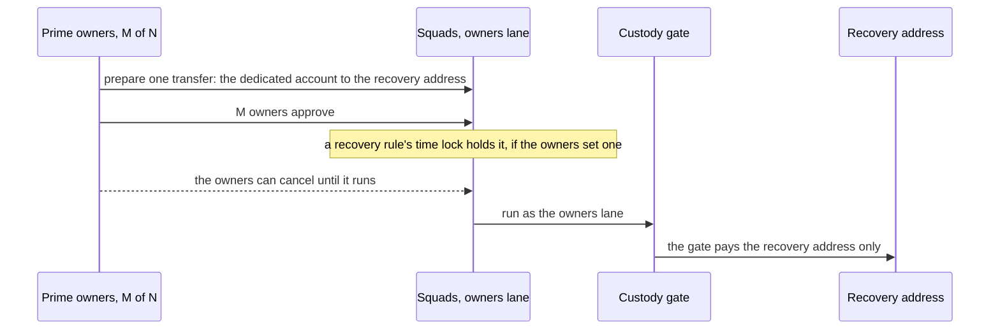

# Prime on Solana: set up the custody gate and recover custody funds

Date: 8 October 2026. Draft for review, written in the walkthrough style of the published Prime docs for [Stellar](https://docs.untangled.finance/docs/Prime/set-up-the-custody-gate/) and [EVM](https://docs.untangled.finance/docs/Prime/prime-on-evm/). The design background is in `docs/prime-solana.md`. This guide follows the final gate-owned build (`reports/gate-a4-min.md`, the design Tuan chose on 8 October 2026).

On Solana, custody hands the owner and the close authority of a dedicated token account to the custody gate, a small program of ours (91 lines as written, 253 after formatting, 50,464 bytes). The funds stay in that one account, and only the gate can sign for it. The gate pays the Prime Account's agent within a cap, to addresses fixed at creation. Custody's identity is an SPL Token multisig of custody and a trustee, so a release back to custody needs both. If custody loses its keys, the Prime Account's owners can pay the recovery address without custody signing, with no cap and at any time.

**Status tags:** each step ends with one of three tags:

- **Verified:** it ran and passed. The tag names the evidence: check ids and counts from the gate-owned build's harness (`reports/gate-a4-min.md`, logs in `logs/gate/a4/`).
- **Pending:** the run is queued or the work is open. The tag says which.
- **Design only:** decided and written down, with no code or run behind it.

**The gate's instructions:** the first data byte is the tag. `0` is `create`, `1` is `transfer`, `2` is `allow` and `3` is `release`. Each step names the instruction it sends, and the fields and account lists are in section 4.

**Screens:** the Prime app for Solana is still to be built. Each step says what the app does and which transaction it sends. The command lines come from the [SPL Token documentation](https://www.solana-program.com/docs/token), and every other flag is left to the app.

**Where it ran:** the gate ran on a local validator with the mainnet feature set (mainnet Squads, Token-2022, Orca Whirlpool and Kamino Lend programs, with mainnet state cloned read-only). A devnet deploy of the gate needs more SOL than the payer holds (section 4 has the figures). The independent security review of this build is done, with the verdict adopt with fixes (section 14). The fixes sit in the app checks (section 13) and in this guide. Mainnet stays untouched until the external audit and the `--final` deploy of the gate.

**Read first: two limits that no setup removes.**

- **A freezable mint can be frozen by its issuer:** USDC and USDT carry a freeze authority. The issuer can freeze any token account of the mint, and while the account is frozen the token program refuses every transfer and every ownership change on it. Recovery and release both fail until the issuer unfreezes it, and the balance waits in the gate-owned account (review probes FZ2 to FZ5b). Custody, the trustee, the owners and the gate hold no key that overrides a freeze. This holds on every chain and for every custody design, so the gate adds no risk of its own here. The app reads the mint before funds move and shows the warning: "the issuer can freeze this account; while frozen, recovery and release are refused". Recovery is reliable for a mint whose issuer holds no freeze authority (section 5).
- **An owner majority reaches the recovery address and the cap:** M owners can pay the fixed recovery address with no cap at any time, and can draw up to the cap to any listed destination. Custody cannot stop a recovery once the owners sign. The wait before a recovery exists only when the Prime Account's own time lock is above 0 (section 11).

```mermaid
flowchart LR
  A["Decide<br/>threshold, trustee, recovery,<br/>list, end time, cap"] --> B["Prime Account<br/>autonomous, two lanes"]
  B --> C["1. Custody multisig<br/>custody + trustee<br/>test signature"]
  C --> D["2. create<br/>fixed for good"]
  D --> D2["3. Read the gate back<br/>checkGate against the plan"]
  D2 --> E["4. Check the mint,<br/>open an empty dedicated account"]
  E --> F["5. Hand over:<br/>close, then owner"]
  F --> G["6. Read back"]
  G --> H["7. Fund it"]
  H --> I["8. allow: the cap"]
  I --> J["9. Owners read the gate again<br/>and install rules"]
  J --> K["Live"]
```



## 1. Before you start

### Who is involved

| Who | Role | Signs |
|---|---|---|
| Prime owners | The shared account's N owners, with an approval count M. M owners together change anything on the account: rules, owners, recovery. | Votes in the Prime Account |
| Custody | The institution that holds the funds, usually with an MPC wallet such as Fordefi that has one Solana address. | The multisig's transactions: the hand-over, `create` (any one multisig signer), `allow` and `release` |
| Trustee | A trusted third party that represents the investor side of the institution or asset manager, as on Stellar. It holds its own key, in its own wallet or custody, independent of custody and of the Prime owners. It is the mandatory signer in custody's multisig and the default recovery address. | The multisig's transactions: a release and a higher cap. It can also lower the cap alone. |
| Agent | One plain key with no SOL. It is the signer of each rule the owners install. | Moves, inside the rules |
| Relayer | A server of ours that pays fees. It signs as fee payer, and as rent payer for stored batches. | Fees only |

The owners, custody and the trustee are three separate parties in a real set-up. The trustee's key must be one that custody and the Prime owners cannot use. A second vault at custody's own provider does not count as independent: the provider's administrators, or custody's own policy, can sign for both vaults, so custody would hold the trustee's slots too and the multisig would require nothing from the investor side. Fordefi works as the trustee only when the trustee holds its own Fordefi organisation.

### What to decide first

The gate can never be edited, so decide these before you build anything.

| Decision | What it sets | Advice |
|---|---|---|
| Owners' threshold (M of N) | How many owners approve any change, any recovery and any rule | 2 of 3 is the tested baseline. The same contracts ran from 1 of 1 up to 7 of 12. |
| Trustee | The mandatory signer in custody's multisig, and the default recovery address | The investors' representative, with its own wallet or custody. See the roles table above. |
| Recovery address | Where the owners can send custody's funds if custody loses its keys | The trustee's wallet, as in the Stellar walkthrough. See section 4. |
| Allow-list | The addresses the agent lane may pay | The venues the agent will use, as short as you can make it. |
| End time | When the agent lane stops | After it the agent's moves are refused and the owners' recovery stays open. Pick the date by which custody wants to review the arrangement, then build a new gate if it continues. |
| Cap per token account | The most the agent lane can draw, enforced by the token program | Start low. Raising it later needs the multisig's threshold, and lowering it needs one signer. |

### Checklist

- [ ] The owners, the threshold and the agent's key are agreed, and each owner holds a wallet that can sign Solana transactions.
- [ ] Custody's signers and the trustee are agreed, and each holds a plain ed25519 key that can sign a transaction.
- [ ] The recovery address is chosen, and its holder has confirmed they control it today.
- [ ] The allow-list holds only addresses the owners have checked.
- [ ] The end time is a date everyone has written down.
- [ ] The tokens are known. Each needs its own dedicated token account. Fee, hook, permanent-delegate, non-transferable, frozen-by-default and confidential mints are out, and a mint with a freeze authority (USDC, USDT) shows the freeze warning (section 5).
- [ ] The plan is written down in one place: recovery address, destinations, lanes, end time, run window and seed. The app compares the gate with it before the hand-over, and the owners compare it again (sections 4 and 7).
- [ ] Enough SOL is on hand for rent: 0.0034 SOL for the multisig (3,361,680 lamports), 0.0020 SOL for each token account (2,039,280) and 0.0026 SOL for a gate with two destinations (2,596,080). The relayer pays move fees and the rent of stored batches. The rent in a gate-owned account stays locked until a release (section 5).
- [ ] The whole run is rehearsed on devnet first, with small amounts and the same signers.

### The order

The setup runs in nine steps, in this order. The Prime Account (section 2) exists before step 2, because `create` reads its settings.

| Step | Who | What | Section |
|---|---|---|---|
| 1 | Custody and the trustee | Create the multisig (2 of 2, or `[custody, backup, trustee, trustee]` with m = 3). The app runs the multisig check and the test signature. | 3 |
| 2 | One multisig signer | `create` the gate | 4 |
| 3 | The app, with custody | Read the gate back (`checkGate`) and compare every field with the plan. Any difference stops the setup | 4 |
| 4 | The app, then custody | Read the token's mint (`checkMint`) and show its warnings. Then custody opens an empty dedicated account `X` (165 bytes, owner custody) | 5 |
| 5 | Custody | Sign `SetAuthority` for the close authority and then for the owner, both to the gate, in one transaction | 5 |
| 6 | The app | Read `X` back: owner and close authority are the gate, no delegate, 165 bytes | 5 |
| 7 | Custody | Fund `X` | 5 |
| 8 | The multisig's threshold | `allow` sets the cap | 6 |
| 9 | The owners | Read the gate back again (`checkGate`), then install the agent rule and the recovery rule | 7 |

The hand-over comes after the gate read-back, because only a release by custody and the trustee reverses it. Funding comes after the account's read-back so that a wrong hand-over never holds funds (section 12).

### Testnet first

Run every step on devnet with test tokens before mainnet. A mistake in the gate's fixed fields has no edit, only a release by custody and the trustee, and a wrong multisig can stop that release (section 12). The app checks in section 13 run before any funds move. The gate's own devnet run follows once the payer can cover the deploy (section 4).

## 2. Create the Prime Account

The Prime Account is a [Squads Smart Account](https://github.com/Squads-Protocol/smart-account-program), a shared account with its own vaults. The owners do this step.

1. Connect an owner's wallet and choose **Create a Prime Account**. The app shows the account's address before it exists.
2. Add the other owners' addresses and set how many must approve. The Stellar walkthrough uses 2 of 3, and so does the Solana baseline.
3. Leave the **settings authority** empty. The account must be autonomous. A settings authority could add itself as an owner, so the gate refuses a Prime Account that has one.
4. Pick the two **vault numbers** the gate will use:
   - **Agent lane:** the vault whose rules move custody's funds to the allow-list.
   - **Owners lane:** the vault the owners sign as at their approval count, for recovery.
   Each number is 1 or higher and the two differ. Vault 0 stays out of both lanes, because Prime's session rules sign as vault 0 and a rule there must never reach the gate. The tests used 1 for the agent and 3 for the owners, and lanes 2 and 4 in a second gate (G20).
5. Review the address, the owners, the count and the lanes, then select **Create account** and sign. Other owners co-sign from the queue when your signature is not enough.

The account has no reach to custody's funds until the gate exists and custody hands it a token account.

**Status:** verified. Account creation, a rule at the owners' count and the agent as policy signer ran 13 of 13 in the gate spike, from 1 of 1 up to 7 of 12 owners. In the gate-owned build `create` refuses an account with a settings authority, a settings account that Squads does not own, and lane numbers below 1 or equal to each other (G1 to G20f, 41 of 41), and a rule at vault 0 reaches nothing of the gate (P1 to P10b, 14 of 14).

## 3. Set up custody's multisig

Custody's identity in the gate is an [SPL Token multisig](https://www.solana-program.com/docs/token) (see "Multisig usage"): an M-of-N group of up to 11 signers that can own a token account, close it and set its authorities. Custody creates it with the trustee.

### Create it

The SPL Token documentation shows the shape. The count comes first, then the signers' addresses:

```
spl-token create-multisig 2 <SIGNER_1> <SIGNER_2>
```

Replace the addresses with custody's key and the trustee's key. The app does the same with its own transaction, and creates the multisig under the same token program as the token account it will own (Token or Token-2022). A multisig from the wrong program does not authorise a token account of the other one.

### Make the trustee mandatory

A signer counts once for each slot it fills. The documentation says duplicates are allowed "for very simple weighting systems", and the example gives one key double voting power. Use that to keep the trustee needed even when custody has a backup key. **Recommended:** the weighted layout, so custody's keys can never act without the trustee.

| Layout | Slots | m | Who can act |
|---|---|---|---|
| Weighted, with a backup (recommended) | custody, backup, trustee, trustee | 3 | the trustee plus custody's key or its backup |
| 2 of 2 | custody, trustee | 2 | custody and the trustee together |

In the weighted layout, custody's key and its backup together reach 2 of 3 and cannot act. The trustee alone holds weight 2 and cannot act either. A plain 2 of 3 with two custody keys would let custody act alone, so the app refuses it. With the weighted layout, the trustee and the backup can still act if custody's main key is lost. The 2 of 2 layout stops at the first lost key, and the owners' recovery is then the way out.

### m can never exceed n

The token program accepts a multisig with m greater than n, for example 3 of 2. No set of signers can ever satisfy it. The app reads the multisig back and refuses it, as in section 13.

### Prove the signers with a test signature

Before any funds move, prove that the signers you intend can authorise, and that custody alone cannot:

1. Create a small token account owned by the multisig and send it one base unit of the token.
2. Build a transfer of zero from that account to itself, with the multisig as owner. The docs show how a multisig is used: the `--owner` argument points to the multisig's address, and each signer is passed with its own `--multisig-signer`.
3. Sign it with the intended signers and simulate it. It must pass.
4. Sign it with custody's key alone and simulate it. It must fail with the token program's signature error.
5. Move the one base unit out with the intended signers and back in. This round trip proves that the signers can move real funds.

A transaction that carries eleven multisig signers does not fit in the 1,232 bytes a legacy transaction allows: an `allow` by 11 signers is 1,314 bytes. As a version 0 transaction with an address lookup table it is 1,195 bytes when one of the signers pays the fee. With the relayer as fee payer it needs a 12th signature and reaches 1,291 bytes even with the table. The app therefore lets a multisig signer pay the fee, builds the version 0 transaction and the table, or keeps n at 10 or below.

### The trustee as a Prime vault

A Prime vault can fill a multisig slot, because Squads signs vault addresses on inner calls. With custody and Prime vault 5 as a 2 of 2, the owners at their approval count sign as vault 5 with custody's signature, and raise the cap (30,299 compute units, 761 bytes) or release (29,494, 751). Either side alone is refused (`trustee-a4.ts`, 9 of 9). Custody plus the owners at M can then release without an external trustee, so this choice trades the independent second party for fewer parties to manage. The trustee wording of this guide, a party independent of custody and of the owners, stays the recommendation.

### Fordefi as a signer

A Fordefi vault address is an ed25519 key whose signature goes into the transaction. Fordefi's [raw Solana transaction API](https://docs.fordefi.com/developers/transaction-types/solana-raw-transactions) supports multi-signer transactions: the caller pre-signs for the other signers and passes those partial signatures, and Fordefi adds its own and sends. A Fordefi key can therefore be custody's key, or the trustee's if the trustee holds its own Fordefi organisation.

**Status:**

- **Verified:** multisig creation, the refusal of custody alone for transfer, approve, revoke, close and re-own, and m signers doing each of them: gate-a3, 162 of 162 on Token, Token-2022 and wrapped SOL, local validator. Duplicate slots as weights: gate-a3, B5 to B9. The weighted multisig with custody's key lost: R12 to R12g.
- **Verified:** the token program accepts m greater than n (gate-a3, M5 and M5b), and `checkMultisig` flags it. The test signature works with no funds: a zero-amount transfer passes on an empty account. A 3 of 2 multisig fails it even with both signers, and a 2 of 3 whose custody keys reach 2 passes it with custody's keys alone, and `checkMultisig` flags both (SC1 to SC5, `setup-checks.ts`: 43 unit tests, 54 live checks and 88 of 88 mutants in all, section 13).
- **Verified:** the eleven-signer sizes above (SC8 to SC8e), and the trustee as a Prime vault (9 of 9).
- **Design only:** a live run through Fordefi's policy engine. The transactions carry SPL Token instructions that the policy must allow, and the multisig's partial signatures come from the caller.

## 4. Create the gate

Any one signer of custody's multisig sends `create` (tag 0), and that signer pays the gate's rent. The gate is a program-derived address of the gate program, made from the custody multisig, the Prime Account's settings address and an 8-byte seed: `["gate", multisig, settings, seed]`.

| Field | What it means |
|---|---|
| Custody multisig | The SPL multisig from section 3. Its signers raise the cap, lower it and release funds. The creator signs and holds a slot of it, and the multisig is a Token or Token-2022 multisig with m at most n. Any one signer can create a gate, so the creator alone writes every field below. |
| Prime Account (settings) | The autonomous Squads account whose lanes may call the gate. The gate refuses any other caller, a settings account that Squads does not own, and an account with a settings authority. |
| Agent lane | The vault number from section 2 whose rules draw from custody. |
| Owners lane | The vault number from section 2 that the owners sign as. It pays the recovery address only. |
| Recovery address | The wallet that receives custody's funds in a recovery (32 bytes). |
| End time (`until`, i64) | A unix time. After it the agent lane pays nothing. The owners' recovery works before and after it. |
| Run window (`window`, u32) | Custody's bound, in seconds, on how far ahead a batch's not-after may lie. A stored batch cannot sit ready for months. |
| Seed (8 bytes) | Lets one custody multisig run more than one gate for the same Prime Account. Each gate needs its own token account. A pre-funded gate address does not block `create` (G17 to G18c). The app picks a random seed. Another multisig signer can take that seed first, and the app then picks a new one (see "Seed squatting" below). |
| Destinations | The allow-list, 32 bytes each, as owner addresses. The gate reads the owner of each destination token account and compares it with this list, so one entry covers every token that owner holds. |

**Data after the tag:** recovery (32) | until i64 | window u32 | seed (8) | agent lane u8 | owners lane u8 | destinations (32 each).

**Accounts, in order:** the member (signer, writable, pays rent), the gate address (writable), the Prime settings account, the system program, the custody multisig.

The gate account holds 181 bytes plus 32 for each destination: the multisig, the settings address, the two lane vaults, the recovery address, the end time, the run window, the seed, the bump and the destinations. A gate with two destinations is 245 bytes and costs 2,596,080 lamports (0.0026 SOL) of rent.

**The gate can never be edited:** nothing writes to the gate's account after creation (Y1), and the program deploys non-upgradeable. A different list, recovery address or end time means a new gate under a new seed, with a release of the funds from the old one (section 10). Gate accounts cannot be closed, so a retired gate keeps its 2,596,080 lamports. The app refuses a gate program that still has an upgrade authority.

### Read the gate back before the hand-over

The creator alone fixes the recovery address, the destinations, the lanes, the end time and the window, and a hand-over has no undo except a release by custody and the trustee. So the app reads the gate account back and compares it with the plan before custody hands over any token account. The function is `checkGate` (section 13). It compares:

| Field | Expected |
|---|---|
| Owner of the account | The gate program |
| Address and stored bump | The program-derived address of the multisig, the settings address and the seed, and the bump that derivation gives |
| Custody multisig and Prime settings | The ones in the plan |
| Agent lane and owners lane | The two lane vaults of the plan |
| Recovery address | The address agreed with its holder. It is set, differs from custody's own address and the multisig, and is absent from the destination list |
| End time, run window and seed | The plan's values |
| Destinations | The plan's list, entry for entry |
| Size | 181 bytes plus 32 for each destination |

Any difference stops the setup, and custody builds a new gate under a new seed. The rejected gate holds no funds. Its rent stays in it, because gate accounts cannot be closed. The owners run the same check when they confirm the gate (section 7), with the plan they agreed, so they rely on their own read.

### Seed squatting and locked rent

Any multisig signer can create a gate at a seed of its choosing, and `create` refuses an address that is taken (G10). A signer can therefore take the seed the app planned and force the app to pick another. A random 8-byte seed makes an accidental collision negligible, so this is a nuisance for the app to retry past and no loss of funds. Rent follows the same pattern: every gate account keeps its 2,596,080 lamports (two destinations), and every gate-owned token account keeps its 2,039,280 lamports while the gate owns it (section 5).

### The other three instructions

| Tag | Name | Who | Data after the tag | Accounts |
|---|---|---|---|---|
| 1 | `transfer` | The agent lane or the owners lane, through Squads | amount u64 \| not_after i64 | gate, lane vault (signer), source, destination, token program, cap address |
| 2 | `allow` | The multisig's signers: m raise the cap, one lowers it | cap u64 | gate, source, token program, custody multisig, cap address, then the signers |
| 3 | `release` | The multisig's threshold | new owner (32) | gate, source, token program, custody multisig, then the signers |

The cap address is `["cap", gate]`. The gate approves it as the delegate of the token account, and the token program stops a draw at the cap amount. Errors are `Custom(1)` for a caller that is no lane or too few multisig signers, `2` for a destination that is not allowed or a gate that has ended, `4` for a call outside the batch's run window and `5` for a wrong account.

**The not-after is mandatory:** each `transfer` carries one, and the gate requires now <= not_after <= now + window, on both lanes. A stored batch that waits past it is refused.

### The program

The gate program is 91 lines as written and 253 after `rustfmt`, a 50,464-byte binary. It calls only the Token and Token-2022 programs. Deploy rent is 0.354 SOL on the local validator (6,960 lamports per byte), and with prime-session 0.732 SOL.

Devnet charges 5,080 lamports per byte. A `--final` deploy there costs 0.258 SOL net: the program data account 257,235,960 lamports and the program account 833,120. The deploy peaks at 0.515 SOL, because the buffer (257,195,320 lamports) and the program data coexist until the loader returns the buffer. The devnet payer holds 0.276 SOL, so the peak does not fit. It needs about 0.24 SOL more, plus fees of a few thousandths of a SOL for the write transactions.

### Choose the recovery address

The recovery address is where every token of the gate goes if the owners run a recovery. Choose it as if custody's keys were already gone:

- **The trustee's wallet is the default:** as in the Stellar walkthrough, where the trustee is the recovery address. A recovery then pays the investors' representative. Custody's funds go to the party that holds the investor side's claim, so the owners, custody and the investors must all trust the trustee.
- **A wallet whose keys survive the loss of custody's keys:** the trustee's wallet already does, because its key is independent of custody. An address that custody's lost keys control would receive the funds with no key able to move them.
- **Its holder has confirmed it:** send a small test amount of each token to its token account and have the holder move it out.
- **A wallet and no program-owned account** that lacks a signer, and no deposit address that needs a memo.
- **Different from the gate's own token accounts and the multisig, and not on the allow-list.** The agent lane cannot reach the recovery address unless custody lists it as a destination, because the two lanes are different vaults (T3, T13, T13b). The app warns about that listing.
- **The bound on a majority of owners:** the recovery has no cap, so the recovery address custody fixes at creation is the only bound on M owners acting in bad faith. A custody that wants a firmer bound picks an address under its own control. With the trustee's wallet as the recovery address, the owner majority can send every gate-owned balance to the trustee at any time (section 11).

**Warning:** every gate carries a recovery address, and the app shows a warning if you leave it empty, set it to custody's own address, or name an address with no known holder. A recovery address that no key controls loses the funds. Without one that a surviving party controls, no key can reach the funds once all custody keys are lost, apart from the agent's moves inside the cap before the end time. The owners' recovery pays the recovery address only.

**Status:**

- **Verified:** `create` with its Prime Account checks and the multisig checks: signer and slot, m greater than n, a Squads-owned settings account, autonomy, the 8-byte seed, the stored lane vaults and the data lengths (G1 to G20f, 41 of 41). A pre-funded gate address works and the creator pays the full rent (G17 to G18c). The gate's account is byte-identical after creation (Y1). The `create` mutants all die: o05 to o08, o11, o12, o37 and o49 to o52 (56 of 56 gate mutants killed overall).
- **Verified:** `checkGate` reads a live gate back and passes it, and refuses a gate with another recovery address, an extra destination, another end time or window, swapped lanes, a recovery address that is custody's own, another multisig and another Prime Account (SX8 to SX16b, live; 24 unit tests of the mint and gate checks).
- **Design only:** the **Connect a custody gate** screen and the app's recovery-address warnings.

## 5. Hand the funds to the gate

Steps 4 to 7 of the order: check the mint and open an empty account, hand it over, read it back, then fund it.

### Check the mint first

A token account is only as safe as its mint. Before custody opens the dedicated account, the app reads the mint account and the program that owns it (`checkMint`, section 13). The mint to read is the one the token account names. The app shows the result and stops on a refusal.

**The gate refuses these mints:**

| Mint feature (Token-2022) | Why it is refused | Evidence |
|---|---|---|
| Permanent delegate | The delegate moves any account of the mint with a plain `TransferChecked`, with no gate call and no cap. In the review's probe a third party emptied a gate-owned account this way. The extension sits on the mint, so the token account stays 165 bytes and `checkSourceAccount` alone passes it | PD1, PD2 (review), SX4 |
| Transfer hook | The mint runs another program on every transfer, and its authority can change that program later, so the gate's transfers can be blocked | Z8b, SX5 |
| Transfer fee | The fee takes a cut of every transfer, and Token-2022 refuses the gate's plain transfer with error 0x1f. A fee of zero today can rise later | Z8a, SX5b |
| Default account state: frozen | Every new account of the mint starts frozen, so no funds move | SX6 |
| Confidential transfer, its fee and confidential mint and burn | The balances are hidden from the gate and from the app's checks | unit tests |
| Non-transferable | The tokens cannot be transferred, so the agent, recovery and release all fail | SX5c |
| Any extension the check cannot parse or does not know | The check fails closed: a new extension can give a third party power over the account | SX7 |

**The app warns about these and lets the setup continue:**

- **A freeze authority** (USDC, USDT): "the issuer can freeze this account; while frozen, recovery and release are refused". The app shows it before any funds move, with the freeze authority's address. A frozen account refuses a recovery and a release with `AccountFrozen` (0x11), and the balance stays in the gate-owned account until the issuer unfreezes it (FZ2 to FZ5b). The gate cannot change that.
- **A pause authority** (the pausable extension): the issuer can pause every transfer of the mint, with the same effect.
- **Token-2022 itself:** the classic Token program is immutable, and Token-2022 is upgradeable on mainnet, so its upgrade authority becomes a trusted party. Prefer the classic Token program where the asset allows. The app says so for every Token-2022 mint.

Token-2022 mints with a metadata pointer, a group pointer, a close authority, interest-bearing or scaled-amount display pass, because they leave the raw amount and the account's authorities alone.

### Use a dedicated token account

A token account holds one token for one owner. Custody opens an empty **dedicated token account** for each token and each gate: 165 bytes, owned by custody, at a new address of its own with no link to anyone's wallet address.

Do not use an [associated token account](https://www.solana-program.com/docs/token), the default account at an address derived from the owner and the mint. The documentation says: "The wallet should never use `TokenInstruction::SetAuthority` to set the `AccountOwner` authority of the associated token account to another address." Wallets and apps work out an associated address from its owner, so after a hand-over the address would name an owner that no longer owns it.

On Token-2022 the associated account is stronger still: it carries the [ImmutableOwner extension](https://solana.com/docs/tokens/extensions/immutable-owner), and "later SetAuthority instructions cannot change its AccountOwner authority." Token-2022 refuses the hand-over with error 0x22 (Z7b). A classic associated account hands over, and its address then still names custody, so the associated token program refuses to create custody's own account for that mint (Z7d, Z7e). Funds in an associated account go into the dedicated account with an ordinary transfer, and the app flags the associated address and picks that route.

An account of exactly 165 bytes carries no extension. The app refuses a longer account (a CPI guard, memo, fee or hook extension can block the gate's token calls) and a frozen one. The Token-2022 CPI guard blocks the owner change with error 0x2f while it is on (Z9b), so an account with the guard never reaches the gate. Fee and hook mints fail closed (error 0x1f, Z8), and the mint check refuses them before any account is opened.

### Wrapped SOL

The token program holds only tokens, so native SOL is wrapped first. Wrapped SOL is a token account of the native mint that holds lamports. Custody opens the dedicated account for the native mint, and the app wraps SOL into it after the hand-over with a system transfer and a `SyncNative`. Only wrapped SOL sits behind the gate. SOL in custody's own system account stays under custody's key.

### The two hand-overs

Custody, as the account's owner, makes two `SetAuthority` calls on the empty account, in this order and in one transaction:

1. **Close authority to the gate:** `spl-token authorize <ACCOUNT> close <GATE>`
2. **Owner to the gate:** `spl-token authorize <ACCOUNT> owner <GATE>`

`<ACCOUNT>` is the dedicated token account and `<GATE>` is the gate's address. The command shape follows the documentation's `spl-token authorize <ACCOUNT> mint <ADDRESS>` example.

The token program does not clear a close authority on a hand-over of an ordinary account. The old holder keeps it, can close the account once a draw empties it, and can reopen the address as its own to receive a venue's proceeds there, where only custody can move them. That is why the close authority goes to the gate too. The gate also refuses the exposure on its own: `allow` will not set a cap on a source whose close authority is neither the gate nor unset (X1 to X8e), and a cap is the only way an agent draw becomes possible.

| Account | Close authority first, then owner | Owner first |
|---|---|---|
| Token, dedicated | Both authorities end at the gate. | The second call is refused (Token error 0x4: the signer must now be the gate). The close authority stays unset and falls back to the owner, the gate. |
| Token-2022, dedicated | Same as Token. | Same as Token (Token-2022 error 0x4). |
| Wrapped SOL | The owner change clears the close authority, so none is set afterwards. | The same end state: the gate is the owner and the close authority is unset. |

An account whose close authority is unset and whose owner is the gate is safe: `allow` accepts it and `release` hands it back (H4e, H4f). The app still reports it, so the guide has one canonical end state. A delegate set before the hand-over is cleared by the owner change (H11 to H11d), so a backdoor delegate does not survive.

### Read the account back

Before the cap and before any funds move, the app reads the account (`checkHandedOver`) and shows each field:

| Field | Expected |
|---|---|
| Token program | Token or Token-2022, the same as the multisig's |
| Owner | the gate's address |
| Close authority | the gate's address (none for wrapped SOL, with the gate as owner) |
| Delegate | none |
| Size | 165 bytes |
| Balance | 0 |

Open it in an explorer as well, and compare the owner and close authority with the gate's address from section 4. If a third party holds the close authority, it blocks both the cap and the release for that account (the token program refuses the gate's `SetAuthority`), and recovery still empties the account (X8 to X8e). Reading the empty account first keeps that mistake free.

### Fund the account

Custody sends the token to the dedicated account. Anyone can send tokens to it, and only a release or a recovery takes them out, so add tokens only to a dedicated account.

### What custody can and can't do afterwards

| | Custody |
|---|---|
| Transfer, approve, re-own or close the account | No. The token program refuses, because the gate owns it (H5 to H10). |
| Lower or suspend the cap | Yes, one signer of the multisig. |
| Raise the cap, release the funds | Yes, with custody and the trustee together (the multisig's threshold). |
| Create another gate | Yes, any one multisig signer. |
| Move the funds out alone | No. Custody leaves through a release (custody and the trustee), through an agent move to a listed destination, or through the owners' recovery. |

The agent's reach is whatever the owners' rules allow, to the allow-list, within the cap.

**Rent stays locked:** the gate has no close instruction and never calls `CloseAccount`, so each gate-owned token account keeps its rent (2,039,280 lamports, about 0.002 SOL) while the gate owns it. A recovery empties the balance and leaves the account open. The rent returns after a release hands the account back and the new owner closes it.

**Status:**

- **Verified:** after the hand-over custody alone is refused for transfer, close, `SetAuthority`, approve and revoke, and so are the trustee alone, the threshold acting as owner and a stranger (H5 to H10). Both orders and the three account kinds behave as the table shows (H1 to H4g, Z1c to Z1e, N1 to N2). A wrapped SOL account hands over, serves the agent, takes a cap, recovers, releases and closes (N1 to N7c, 16 of 16). Token-2022: agent, cap, recovery and release work on a dedicated account, and the associated-account, CPI-guard, fee and hook cases fail as described (Z1 to Z9b, 28 of 28).
- **Verified:** the foreign-close-authority attack and its refusal: the scripted bypass on a fresh account captures 0, and on mutant o28, which lacks the check, custody moves 50 tokens alone (X5). `checkHandedOver` and `checkSourceAccount` flag the cases before funds arrive (H2b, X1b, N2, Z7 to Z9).
- **Verified:** `checkMint` refuses a permanent-delegate, transfer-hook, transfer-fee, non-transferable and frozen-by-default mint and an unknown extension, and warns for a freeze authority, as live checks on mints made on the validator (SX1 to SX7b) and as unit tests.

## 6. Set the cap

The cap is the most the agent lane can draw from one dedicated account. The gate approves a cap address (`["cap", gate]`) as the delegate of the account with the cap amount, and the token program stops a draw at that amount. Each draw uses it up.

1. Custody and the trustee, at the multisig's threshold, sign an `allow` (tag 2) for the account, with the amount. Start with a few draws of the largest band in the owners' rules.
2. The app reads the account back and shows the delegate and the delegated amount.

Raising the cap needs the multisig's threshold. Lowering it, down to 0, needs one signer (section 9). `allow` also checks that the delegate is this gate's cap address and that the close authority is the gate or unset. The owners' recovery ignores the cap, so a low cap bounds the agent without trapping the funds. A used-up cap gives the agent no uncapped fallback (A16e).

**Status:** verified. The threshold sets the cap, one signer lowers or suspends it, a raise needs m signers, and a wrong cap address, a wrong multisig, a hostile program and a foreign close authority are refused (A1 to A16e, 36 of 36). The `allow` mutants die: o24 to o29, o38 and o45.

## 7. The owners confirm the gate and install rules

### Confirm the gate

The owners cannot change the gate, so they read it. In the Prime app, **Connect a custody gate** and paste its address. The app reads the gate from the chain, runs `checkGate` against the plan the owners agreed and shows every field. A mismatch blocks the install step. Each owner checks:

- the multisig's signers, count and slot list match what custody told them;
- the recovery address is the one agreed, and its holder confirmed it;
- the allow-list holds only the venues planned, and the owners' lane vault and the recovery address are not both on it by accident;
- the end time and run window match the plan;
- the lanes are the vault numbers the owners chose;
- the gate program has no upgrade authority;
- the dedicated account's read-back matches section 5, and the cap matches the plan.

The owners run this before they install any rule. Custody's run before the hand-over (section 4) covers custody's side, and each owner's own read covers theirs. If any field is wrong, custody builds a new gate and the owners confirm that one (section 12).

### Install agent rules

A rule is a Squads [`ProgramInteraction`](https://github.com/Squads-Protocol/smart-account-program/blob/80bf1f7ad28fd1176c364879776982730b8e9c80/programs/squads_smart_account_program/src/state/policies/implementations/program_interaction.rs) policy. The agent is the rule's only signer. M owners vote to install each one. A rule fixes:

- **One venue:** the program it may call and the accounts it may touch: the gate, the dedicated token account and the destination.
- **One direction:** a draw to a listed destination, then a payback to custody.
- **An amount band per move:** a smallest and a largest amount, read from the call data.
- **Who approves:** the agent alone for a small band, the agent and a second approver for a large one.
- **A not-after:** the rule requires a non-zero deadline in each batch.
- **A time lock:** the wait for the whole batch. The next paragraph explains it.
- **An expiry (optional):** Squads' own rule `expiration` ends every stored batch of the rule.

In the Prime app, use **Policies**, pick a template such as **Swap on Orca, proceeds to custody** or **Deposit into Kamino**, choose the venue's pool or reserve, set the amount band, and select **Install rule**. Real venues take the caller's signature, so the destination listed in the gate is the agent lane's vault, and the rule pins custody's proceeds account as the output. A rule with four constraints needs a 256 KB heap request to install and takes 1,219 of the 1,232 bytes a transaction allows. It installs in three transactions and costs 0.0062 to 0.0104 SOL of rent.

### The time lock on the rule

The wait belongs to the owners' rule, as in Tuan's "option 2". When the agent signs under a rule with a [time lock](https://github.com/Squads-Protocol/smart-account-program/blob/80bf1f7ad28fd1176c364879776982730b8e9c80/programs/squads_smart_account_program/src/state/policies/policy_core/policy.rs), Squads stores the **whole batch**: the draw from custody, the venue call and the payback. After the wait anyone can run it, and it runs as one transaction. M owners can change the wait at any time.

Custody does not control the minimum wait. Custody's own protection is the cap, the end time, the fixed allow-list and the owners' rule being the only route in. Squads has no run window, so a stored batch stays runnable. Three bounds close it: the not-after in each batch with custody's run window, the gate's end time and the rule's expiry.

**Status:**

- **Verified:** the whole batch is stored, an early run is refused, the batch runs atomically after the wait and a second run is refused. The owners cancel, custody lowers the cap and the run fails, the not-after lapses, a not-after beyond the window is refused, and so are a run after the gate's end time and a run after the rule's expiry (TL1 to TL11b, 24 of 24). The same whole batch ran on real Orca state under a 6-second time lock: 50 USDC became about 50 USDT in one run (119,159 compute units to run). A rule that pins the band, the accounts, the atomic draw and payback, rolls back on a failed leg and leaves vault 0 session rules with no reach (P1 to P10b, 14 of 14).
- **Verified:** the owners' read-back of the gate is the same `checkGate` call as custody's, and it refuses every tampered gate of section 4 (SX8 to SX16b).
- **Design only:** the Solana templates and the Policies screens, and the Squads close call that returns a stored batch's rent.

## 8. Day to day

### An agent move

1. The agent builds a batch under one rule: the draw through the gate, the venue call and the payback to custody. A batch can be a swap on Orca or a deposit into Kamino.
2. If the rule has no wait, the agent signs and the move runs at once. The relayer pays the fee, about 10,000 lamports.
3. The gate checks the lane, the destination against the allow-list, the cap, the end time and the batch's not-after before it pays.

### The queue of time-locked batches

If the rule has a wait, signing stores the batch in three steps: create, propose and approve. The relayer pays the rent of the stored batch, and it returns when the batch runs or is cancelled. The app lists stored batches under **Transactions**, then **Queue**, as waiting, with the time left, and then as ready to run. Once a batch is ready, any wallet can run it with no new approval. A batch that passes its not-after, or whose gate has passed its end time, is refused by the gate, and the batch stays approved until it is cancelled.

Kamino reads the transaction's instruction list, so a Kamino batch needs a `refresh_reserve` as a top-level instruction. The relayer adds it at the run.

### Cancel by the owners

Until a batch runs, the owners at the rule's approval count can cancel it, through a vote seat the rule gives the owners lane. The agent and custody cannot cancel. Custody stops a stored batch by lowering the cap, and the same batch runs again if the cap is restored before its not-after.

Measured on the local validator (compute units and bytes of the whole transaction):

| Move | Compute units | Bytes |
|---|---|---|
| Agent draw through a rule | 43,226 | 583 |
| Agent batch, draw and venue payback | 51,630 | 666 |
| Agent stores a batch under a time lock | 81,848 | 845 |
| The stored batch runs | 81,974 | 711 |
| Owners cancel a stored batch | 52,140 | 564 |

**Status:** verified on real venues, 53 of 53 (`venues-a4`): a Kamino deposit (119,676 compute units, 1,002 bytes) leaves custody holding 83.03 collateral tokens in a gate-owned account; a Kamino redeem returns 48 USDC; an Orca swap through the rule turns 100 USDC into 100.05 USDT in custody's gate-owned account (83,328 compute units, 978 bytes). The Prime vault of the agent lane is the one listed destination, and a venue's proceeds land in a gate-owned account of custody. The agent's rule and the whole-batch time lock are verified as in section 7. The call depth is 3 of the 5 that the runtime allows.

## 9. Emergency: lower or suspend the cap

Any one signer of custody's multisig, custody's key or the trustee, can lower the cap or set it to 0. The agent lane then stops at once, and so does a stored batch that has not run. One signature does it, because it only reduces what can happen.

1. A multisig signer opens **Custody gate**, selects the token and selects **Lower cap**.
2. Enter the new cap. 0 suspends the agent for that token.
3. Sign. The app shows the new cap once the transaction confirms.

A stolen single key can stop the agent and nothing more. Raising the cap again needs the multisig's threshold. The cap at 0 is the whole stop. There is no separate call that ends the gate, and the end time stays as it was.

**Status:** verified. One signer lowers or suspends the cap (A4, A7), a ready stored batch then fails (TL7), and the stop holds on real Orca state (V22, V30; V30c shows recovery still works with the cap at 0). The one-signature rule costs one line and 56 bytes of the gate. A threshold-only variant (90 lines, 348 of 348 checks) offers custody no single-signature stop, so a bad batch would wait for m signers. A stolen single key can lower the cap to 0 and stop the agent lane, and it cannot raise the cap, release or touch recovery.

## 10. Take funds back: a release by custody and the trustee

A release hands the dedicated account back to the key it names. Use it to leave the arrangement, to move to a new gate with a corrected list or recovery address, or to fix a wrong set-up.

1. Custody and the trustee agree the release and the new owner: custody's own address, or a multisig.
2. They sign a `release` (tag 3) at the multisig's threshold, with the new owner's address as its data. The accounts are the gate, the source, the token program, the custody multisig and the signers. The gate hands the owner and the close authority of the account to the new owner. The balance stays in the account.
3. The app reads the account back: the owner is the new owner, the close authority is the new owner, and the cap's delegate is gone.
4. To move to a new gate, custody builds it (section 4), hands the account (or a fresh dedicated account) to it (section 5) and sets the cap (section 6). The owners confirm it and move their rules to its address.

A release needs custody and the trustee. The owners take no part, and it works before and after the end time (R14). It needs an unfrozen account: a frozen one refuses the ownership change (FZ5).

**Status:** verified. The threshold releases an account to a new key, which hands it back to the gate (close authority first, then owner) and gets a cap and an agent draw again (R7, R10 to R10d). A release to a multisig address works, custody alone is refused on the released account, and the multisig's threshold moves it (R11 to R11c). Custody alone, the trustee alone, a stranger, a wrong multisig and the owners' lanes are refused (R1 to R6), and a second release of the same account is refused by the token program (R9d). The release with custody's key lost, through the weighted multisig, runs as R12 to R12g. In all, 33 of 33. The `release` mutants die: o30 to o34 and o46.

## 11. Recover custody funds

Use this when custody's keys are lost and the multisig can no longer reach its threshold, so a release and a cap raise are out of reach. The Prime Account's owners then pay the gate's recovery address. Custody signs nothing.

What the owners do when they recover:

- They sign at their **normal approval count** M, as the owners lane vault.
- The gate pays **the recovery address only**. A venue, a stranger or any other address is refused.
- A single owner cannot do it.
- A stored recovery lapses: the owners lane carries a not-after as well, so an approved recovery that waits past its window is refused (T15).
- With custody's key lost, no recovery transaction holds a custody signature. With the weighted multisig `[custody, backup, trustee, trustee]`, the trustee and the backup raise the cap, release and keep the agent lane working (R12c, R12e to R12g).
- A recovery needs an unfrozen account. A frozen one refuses it with `AccountFrozen` (0x11), and the balance stays until the issuer unfreezes it (FZ3).

### The full reach of an owner majority

M owners act with no signature from custody or the agent. Their reach has two parts:

| What M owners can do | Cap | When | Evidence |
|---|---|---|---|
| Pay the fixed recovery address, as the owners lane | None | At any time, before and after the end time, with the cap at 0 | T12, E3b, A7d, RR7 |
| Draw to any listed destination, by signing as the agent lane through the account's settings path | Up to the cap | Before the end time. They need no agent key and no installed rule | T1 |

They cannot pay an address outside those two sets, release an account, set a close authority or approve an arbitrary delegate. If a listed destination is a Prime vault that the owners control, M owners can draw the cap to themselves.

**Custody cannot stop a recovery once the owners sign it:** lowering the cap with one signature stops the agent-lane draw and has no effect on a recovery (A7d, RR3b). Custody's one defence against owners acting in bad faith is a release back to itself. That races the recovery and needs custody, the trustee and an unfrozen account. With the trustee's wallet as the recovery address, the owner majority can send every gate-owned balance to the trustee at any time, so custody, the owners and the investors must all trust the trustee.

**The wait exists only when the Prime Account's own time lock is above 0:** at 0, the owners at M pay the recovery address at once through the settings path (RR7). With the account's time lock at 5 seconds, that path is refused with `TimeLockNotZero`, and only the stored recovery under the owners' rule runs, after the rule's wait (RR8d, RR8e). The owners' cancel window exists in the same case. Set the account's time lock above 0 when a wait before recovery matters. It then delays every settings change as well.



### Step by step

1. **Confirm the loss:** custody and the trustee cannot sign a release, and the owners agree that waiting for them is over. If custody's multisig can still sign, use section 10 and skip the recovery.
2. **Stop the agent:** open the **Custody gate** card on **Policies**. It shows the end time, the cap and the recovery address. The agent lane keeps working inside the cap until the end time or until the cap is 0. The owners can remove the agent's rules with M votes, and any surviving multisig signer can set the cap to 0.
3. **Check the recovery address:** ask its holder to confirm that they control the wallet today. The gate pays a token account whose owner is that address, so the destination token account for each token must exist. The app creates it for the recovery address when it does not exist yet.
4. **Prepare:** select **Recover custody funds**, choose the token and the amount. The amount starts at the dedicated account's whole balance. Select **Prepare in Prime Execution**. It opens with one call: the gate pays the recovery address, as the owners lane.
5. **Approve at M:** the owners' wallets sign from the queue, until the approval count is reached. Each owner reads the destination before signing.
6. **Wait, if the owners set a wait:** a recovery rule on the owners lane can carry a time lock. The owners store the move, approve it and run it after the wait, and they can cancel with their votes until then. The wait binds only when the Prime Account's own time lock is above 0 (see the reach above).
7. **Run:** once the wait has passed and before the move's not-after, anyone selects **Run**. The relayer pays the fee.
8. **Check:** the recovery address's token account holds the amount. The dedicated account shows what is left. Repeat for each token.

### After a recovery

The gate stays on chain with an empty account. Recreate the arrangement with new multisig keys, a new gate under a new seed, and a new dedicated account, if custody wants to continue.

**Status:**

- **Verified:** the owners lane pays the recovery address before the end time, after it, with the cap at 0 and above any cap that was ever set (T12, E1b, E3, E3b, A7d, RR4, V30c). A venue or a stranger as destination is refused, and the agent lane cannot reach the recovery address unless custody lists it (T3, T13, T13b). On real Orca state, recovery of 500 USDC with the cap at 0 costs 29,240 compute units.
- **Verified:** the recovery rule with a time lock stores, waits, runs and is cancelled by the owners (RR1 to RR8g, 21 of 21). The owners at M pay at once through the settings path (RR7). After the Prime Account's time lock is set to 5 seconds, the synchronous path is refused with `TimeLockNotZero` and only the stored recovery under the owners' rule runs, after the rule's wait (RR8 to RR8g). A rule's time lock binds those who use the rule. A Prime Account time lock also delays every settings change.
- **Design only:** the **Recover custody funds** screen, and the app creating the recovery address's token account.
- **Reading of the code:** an upgrade of Squads that signs as the owners lane vault can move custody's gate-owned funds, with no cap, to the recovery address custody fixed at creation, and nowhere else. An upgrade that signs as the agent lane reaches the listed destinations within the cap. Both reaches stop at addresses custody chose.

## 12. Mistakes and how to fix them

| Mistake | Symptom | Fix | Funds at risk |
|---|---|---|---|
| Wrong cap, too low | The agent's move is refused by the token program or the gate. | Custody and the trustee raise the cap. | None. |
| Wrong cap, too high | The agent can draw more than planned. | One signer lowers it at once. | Up to the cap, only to listed destinations and only inside the owners' rules. |
| Wrong allow-list | The gate refuses a venue, or it lists an address that should not be there. | The list is fixed. Lower the cap to 0 for a wrong entry, release the funds, build a new gate with the right list and have the owners confirm it. | A wrong entry could receive up to the cap if a rule also reaches it. Lower the cap first. |
| Wrong recovery address | `checkGate` refuses the gate, the owners' read shows another address, or its holder cannot confirm it. | Found before funding, build a new gate. Found after, release the funds to custody, build a new gate and hand the funds over again. | From the first funds in the gate, because the owners' recovery works at any time and would pay the wrong address. Release the funds before anything else. |
| Wrong multisig | The test signature fails, or the app reports m greater than n, an unknown signer slot, or custody's keys reaching m. | Caught before the hand-over, create a new multisig and a new gate for it. Found after, see below. | None before the hand-over. After it, see below. |
| An associated token account used | The app refuses it, or on Token-2022 the hand-over fails with error 0x22. | Move the funds into a dedicated account by an ordinary transfer, then hand over that one. | None on Token-2022, as nothing changed hands. A classic associated account that was handed over still works, and the app flags it. Release it and move to a dedicated account. |
| The close authority not handed over | The read-back shows a close authority other than the gate, and `allow` is refused with error 5. | Custody, as the close authority, sets it to the gate with `spl-token authorize <ACCOUNT> close <GATE>` (X7), and the read-back is clean. | None. With no cap the agent lane is refused by the token program (X3), and the gate refuses to set a cap on such an account (X2). |
| A third party holds the close authority | The cap and the release are refused for that account, because the token program refuses the gate's `SetAuthority`. | Found on the empty account, open a new one and hand it over. Found after funding, the owners' recovery empties the account (X8 to X8e). | The funds move only through recovery, to the recovery address. The app prevents this by reading the account back before it is funded. |
| A Token-2022 account with the CPI guard on | The hand-over fails with error 0x2f, and the app flags the extension before custody tries. | Open a dedicated 165-byte account without the guard. | None. Nothing changed hands. |
| The gate differs from the plan | `checkGate` refuses it before the hand-over, with the field that differs. | Do not hand anything over. Build a new gate under a new seed. | None. The rejected gate holds no funds. Its rent stays in it. |
| A refused mint | `checkMint` refuses a permanent-delegate, hook, fee, non-transferable, frozen-by-default or confidential mint, or an extension it does not know. | Choose another asset. The gate cannot hold that mint. | None before funds move. A permanent delegate can empty the account at any time after funding. |
| The issuer freezes the account | A recovery and a release are refused with `AccountFrozen` (0x11). | Nothing in the gate unfreezes it. The issuer must. | The whole balance of that account, until the issuer unfreezes it. |
| Another signer took the seed | `create` is refused because the address is taken (G10). | The app picks a new random seed and creates again. | None. |

**A wrong multisig after the hand-over:** the gate is built for one multisig, so the multisig cannot be swapped. If m is greater than n, no release and no cap raise can ever be signed, and the funds leave through the agent's moves inside the cap and through the owners' recovery. If custody's own keys can reach m without the trustee, custody and the trustee are not both required, and the trustee has no say. Treat both as a reason to build a new multisig and a new gate, and to move the funds with a release if one can be signed, or with the owners' recovery to a recovery address that custody controls.

**Status:** verified. The multisig faults are caught by the app checks (SC3 to SC5) and a weighted multisig releases with custody's key lost (R12 to R12g). The close-and-reopen bypass is refused, its fix works and a stranger as close authority is handled (X1 to X8e, 16 of 16). The Token-2022 associated account, the CPI guard and the fee and hook mints behave as the table says (Z7 to Z9b). A wrong multisig after the hand-over has no fix in the gate: it is a reason to release or recover and rebuild. `checkGate` refuses a gate with a wrong recovery address, destination, lane, end time or window before the hand-over, and `checkMint` refuses the mints the gate cannot hold (SX1 to SX16b).

## 13. Checks the app runs before funds move

These checks read bytes or build instructions. None holds a key or sends a transaction. They are the functions of `setup-checks.ts` (265 lines, `tsc --strict` clean) in the gate-owned build's directory, and each blocks the next step until it passes.

| Function | What it checks or builds | Issue codes | Evidence |
|---|---|---|---|
| `parseMultisig`, `weight` | Reads the multisig account (355 bytes, m, n, initialised flag, the first n slots) and counts a key once for each slot it holds, as the token program does | refuses a length other than 355 and n above 11 | unit tests, SC1 |
| `checkMultisig` | The multisig is initialised, m is at least 2 and at most n, every slot is a key custody or the trustee controls, custody's keys cannot reach m and the trustee alone cannot reach m | `multisig-uninitialized`, `m-below-two`, `m-greater-than-n`, `unknown-signer`, `custody-reaches-m`, `trustee-reaches-m` | unit tests, SC3 to SC5 |
| `weightedSlots` | Builds the slot list that keeps the trustee mandatory: custody's keys once each and the trustee m - 1 times. It refuses a layout where custody alone reaches m, and a list above 11 slots | throws | unit tests, SC5, R12 |
| `testSignatureIx`, `simulateTestSignature` | A zero-amount transfer on a multisig-owned account, simulated with signature verification: the intended signers pass and custody alone fails | simulation result | SC2 to SC5 |
| `checkSourceAccount` | A Token or Token-2022 account that is dedicated (the address is no associated account of either program), exactly 165 bytes with no extension, and unfrozen | `not-a-token-program`, `associated-account`, `extensions`, `frozen` | Z7 to Z9 |
| `checkMint` | Reads a mint account and the program that owns it. It refuses a Token-2022 mint with a permanent delegate, transfer hook, transfer fee, confidential transfer (and its fee and confidential mint and burn variants), non-transferable tokens or frozen-by-default accounts, and any extension it cannot parse or does not know. It warns for a freeze authority ("the issuer can freeze this account; while frozen, recovery and release are refused"), a pause authority and Token-2022 itself (prefer the classic Token program). It returns `program`, `refuse` and `warn` | refuses: `not-a-token-program`, `malformed-mint`, `permanent-delegate`, `transfer-hook`, `transfer-fee`, `confidential-transfer`, `confidential-transfer-fee`, `confidential-mint-burn`, `non-transferable`, `default-account-state-frozen`, `unknown-extension`. Warns: `freeze-authority`, `pausable`, `token-2022` | unit tests, SX1 to SX7b |
| `parseGate`, `gateAddress`, `checkGate` | Decodes the gate account (181 bytes plus 32 for each destination) and derives its address. `checkGate` compares the owner, the address, the stored bump and every fixed field with the plan: multisig, Prime settings, both lane vaults, recovery address, end time, window, seed and destination list. It also refuses a recovery address that is empty, custody's own, the multisig or a destination | `gate-owner`, `gate-malformed`, `gate-address`, `gate-bump`, `gate-multisig`, `gate-settings`, `gate-agent-lane`, `gate-owners-lane`, `gate-recovery`, `gate-until`, `gate-window`, `gate-seed`, `gate-destinations`, `recovery-unset`, `recovery-is-custody`, `recovery-is-destination` | unit tests, SX8 to SX16b |
| `handOverIxs` | The two `SetAuthority` calls, close authority first, then owner, both to the gate | none | H1, Z1, N1 |
| `checkHandedOver` | The read-back: owner is the gate, close authority is the gate (none for wrapped SOL), no delegate, 165 bytes. It runs before the cap is raised | `owner-not-gate`, `close-authority-not-gate`, `stale-delegate`, `extensions` | H2b, X1b, N2 |
| `txShape`, `legacySize`, `v0BestSize`, `lookupTableIxs`, `compileV0` | Picks legacy, version 0 with a lookup table, or too large for a transaction with many signers, and builds the table and the version 0 transaction | `legacy`, `v0+lookup-table`, `too-large` | SC8 to SC8e |

The gate enforces on chain what the app also checks before funds move: the Prime Account is autonomous and Squads-owned, each lane number is 1 or higher and differs from the other, the multisig has m at most n, and the destination list is whole entries (G1 to G20f).

**The order they run in:** `checkMultisig` and the test signature, then `checkGate` against the plan, then `checkMint` and `checkSourceAccount`, then the hand-over, then `checkHandedOver`. The owners run `checkGate` again before they install a rule.

The app also checks, with no code behind these yet:

- the multisig and the token account belong to the same token program;
- the gate program has no upgrade authority;
- the recovery address has a token account for each token;
- the agent rules pin the destination accounts: the gate checks the owner of the destination, and anyone can open a token account owned by a listed address.

**Status:**

- **Verified:** `setup-checks.ts` ran as 43 unit tests on synthetic bytes (the 19 earlier ones and 24 for `checkMint` and `checkGate`) and 54 live checks: the 22 earlier ones (SC1 to SC8e) that run the token program, a simulation and a version 0 transaction, and 32 for the mint and gate checks (SX1 to SX16b) on a local validator with the mainnet feature set. A mutation pass of 88 mutants (the 28 earlier ones and 60 for the new code) killed 88 of 88 (`ts-mutants.fix.log`).
- **Design only:** the checks in the second list, and the app screens that show the results.

## 14. Independent review of the gate-owned build

The independent review is done: **adopt with fixes** (`reports/gate-owned-review.md`, 8 October 2026). The reviewer rebuilt the gate byte for byte, ran the harness on an own validator (345 of 345 and 348 of 348), re-ran the 19 unit tests and a mutation pass (21 mutants killed), and found no way for custody, the trustee, the owners, the agent, the relayer or a stranger alone to move funds off the fixed paths. The fixes concern the assets the gate may hold, the app's checks and this guide. The gate's logic is unchanged.

| # | Finding | Fix | Status |
|---|---|---|---|
| F1 | High for freezable assets: the mint's freeze authority stops recovery and release (FZ2 to FZ5b) | `checkMint` warns for a freeze authority. The caveat is at the top of this guide and in section 5 | Done in code, tests and this guide. The app screen is design only |
| F2 | Medium: a permanent-delegate mint bypasses the gate and `checkSourceAccount` passes it (PD1, PD2) | `checkMint` refuses the mints in section 5 and any extension it cannot parse | Done in code and tests (SX4 to SX7) |
| F3 | Medium: no gate read-back, and any one multisig member fixes the gate's fields | `checkGate`, run before the hand-over and again by the owners (sections 4 and 7) | Done in code and tests (SX8 to SX16b) |
| F4 | Medium, by design: the owner majority's full reach, and custody cannot stop a recovery | Stated in full in section 11, with the wait and the Prime Account's time lock | Done in this guide |
| F5 | Informational: Squads and Token-2022 are upgradeable on mainnet, classic Token is immutable, and the gate deploys with `--final` | Stated in section 15. The app's refusal of a gate program that has an upgrade authority is still design only | Done in this guide |
| F6 | Low: rent stays locked in gate-owned accounts until a release | Stated in sections 4 and 5 | Done in this guide |
| F7 | Low: seed squatting | Stated in section 4. The app retries with a new seed | Done in this guide |

## 15. Who you trust

- **Squads Smart Account** (`SMRTzfY6...`) is upgradeable on mainnet. Its upgrade authority is `HT3JknwuufXdtVJggz5Z9JcnYtanPpLzTCqLWsVX1Vu2`, with no time lock. The gate's two lanes are Squads vaults, so whoever holds that authority can change how the vaults sign. The reach stays inside the gate's fixed recovery address, cap and destination list, which bounds that party the same way an owner majority is bounded (section 11). Re-check the gate after each Squads upgrade.
- **Token-2022** (`TokenzQd...`) is upgradeable on mainnet. Its upgrade authority is `AeLmXCbPaQHGWRLr2saFsEVfmMNuKnxRAbWCT9P5twgz`. Holding assets there adds that authority as a trusted party. The classic Token program (`Tokenkeg...`) is immutable, so prefer it where the asset allows. The app says so for each Token-2022 mint.
- **The gate deploys with `--final`:** a latent bug in the gate then cannot be patched, and the way out is a release to a fresh gate, which needs custody, the trustee and an unfrozen account. The small surface (253 formatted lines) and the external audit carry that risk. The app refuses a gate program that still has an upgrade authority, and the harness loads the gate as non-upgradeable.

Upgrade authorities read on chain on 8 October 2026 (read-only, through the public RPC).

## References

- SPL Token documentation: [`SetAuthority`, Multisig usage, the associated token account warning](https://www.solana-program.com/docs/token)
- [ImmutableOwner extension](https://solana.com/docs/tokens/extensions/immutable-owner); [wrapped SOL](https://solana.com/docs/tokens/basics/sync-native); [permanent delegate](https://solana.com/docs/tokens/extensions/permanent-delegate)
- Squads Smart Account, source at commit `80bf1f7`: [`ProgramInteraction`](https://github.com/Squads-Protocol/smart-account-program/blob/80bf1f7ad28fd1176c364879776982730b8e9c80/programs/squads_smart_account_program/src/state/policies/implementations/program_interaction.rs), [`Policy`](https://github.com/Squads-Protocol/smart-account-program/blob/80bf1f7ad28fd1176c364879776982730b8e9c80/programs/squads_smart_account_program/src/state/policies/policy_core/policy.rs) (time lock), [`transaction_execute.rs`](https://github.com/Squads-Protocol/smart-account-program/blob/80bf1f7ad28fd1176c364879776982730b8e9c80/programs/squads_smart_account_program/src/instructions/transaction_execute.rs) (the wait on execute), [`synchronous_transaction_message.rs`](https://github.com/Squads-Protocol/smart-account-program/blob/80bf1f7ad28fd1176c364879776982730b8e9c80/programs/squads_smart_account_program/src/utils/synchronous_transaction_message.rs) (synchronous execution)
- [Fordefi Solana raw transactions](https://docs.fordefi.com/developers/transaction-types/solana-raw-transactions)
- Prime docs on Stellar and EVM: [Set up the custody gate](https://docs.untangled.finance/docs/Prime/set-up-the-custody-gate/), [Recover custody funds](https://docs.untangled.finance/docs/Prime/recover-custody-funds/), [Prime on EVM](https://docs.untangled.finance/docs/Prime/prime-on-evm/)
- Our own evidence (internal, in `/home/ubuntu/work/prime-refine/`): `reports/gate-a4-min.md` (the final build), `reports/gate-owned-review.md` (the independent review), `reports/gate-owned-fixes.md` (its fixes), `reports/gate-a3-multisig.md`, `reports/gate-a2.md`, `reports/solana-minimal.md`, `reports/gate-review.md`, `reports/solana-devnet.md`, `reports/solana-real-wallets.md`, `docs/prime-solana.md` and `DECISIONS.md`; the logs in `logs/gate/a4/`; the gate sources and `setup-checks.ts` in `/home/ubuntu/work/gate-spike/a4-min/`
