# Prime on Solana

Date: 8 October 2026, updated 9 October 2026 for the line-cut gate and for the size pass (formatted sLOC is the official count). Status: testnet and local-validator results only. `prime-session` and the custody gate run on Solana devnet as the 9 October 2026 builds, deployed with `--final`, and pass 145 of 145 and 84 of 84 checks there; the first devnet builds stay on the cluster as previous builds. The custody gate also runs on a local validator with the mainnet feature set, and its independent security reviews are done, with the verdicts adopt with fixes and, for the line cut, adopt (section 17). Sources: the Prime session architecture document, the 64-line `prime-session` program, the line-cut custody gate (126 lines formatted, built from the gate-owned design of [`contracts/prime/spike/matrix/near-minimal/round9/gate-a4/gate-a4-min.md`](../spike/matrix/near-minimal/round9/gate-a4/gate-a4-min.md)), the devnet runs of the new builds ([`contracts/prime/spike/matrix/near-minimal/round9/solana-devnet-sloc2/`](../spike/matrix/near-minimal/round9/solana-devnet-sloc2); the first builds' runs are in [`round9/solana-devnet/`](../spike/matrix/near-minimal/round9/solana-devnet) and [`round9/solana-devnet-gate/`](../spike/matrix/near-minimal/round9/solana-devnet-gate)), the real-wallet run and the refinement reports of 8 October 2026. Every number below comes from those.

**How to read the status tags:** each claim about the custody gate carries one of three tags:

- **Verified:** it ran and passed. The tag names the evidence: a check id or a count (N of N checks) from the gate-owned build's harness, or an earlier spike.
- **Pending:** the run is queued or the work is open, and the tag says which.
- **Design only:** it is written down, with no code and no run behind it.

## 1. Prime on Solana in one minute

A Prime Account on Solana is a **Squads Smart Account**: a shared account made by Squads, an open-source Solana program. The funds stay in the institution's own custody, in a dedicated token account that a small **custody gate** program owns, and the gate lets the Prime Account's agent draw from it under rules.

- **Owners:** the account has N owners and a threshold M. Any M owners together can change anything: add an owner, change the rules, approve a recovery. Fewer than M can change nothing. The tested baseline is 2-of-3, and the same contracts ran from 1-of-1 up to 7-of-12.
- **Custody:** the institution's wallet, usually an MPC wallet with one Solana address. It hands the owner and the close authority of a dedicated token account to the gate. Any one custody signer can lower the cap on the agent at any time, and releasing the account back takes custody plus a trustee.
- **Rules:** each rule lets the agent make one kind of move: one venue, one direction, an amount band. The owners install the rules at their threshold.
- **Time lock:** the owners' rule asks for a wait. The whole batch (draw, venue call and proceeds back) is stored, waits, then runs as one transaction.
- **Recovery:** if custody loses its keys, the owners at their normal approval count can send custody's funds to the recovery address fixed in the gate. It has no cap and stays open at any time. The recovery address is the trustee's wallet by default.
- **Session:** an owner signs one readable text in their wallet. That text lets a short-lived **session key** make the moves the account's rules allow, for at most 7 days.
- **Fees:** our **relayer** (a server of ours that sends transactions) pays the fee for each move. If the relayer is down, the signing key pays its own fee.

Prime on Stellar and on EVM work the same way: funds stay in custody, a gate limits what Prime can draw, and the owners hold the recovery path. Section 4 to section 9 show how each part works on Solana and how far each has been proven.

**Two limits to know first:**

- **A freezable mint can be frozen by its issuer:** USDC and USDT carry a freeze authority. While the issuer freezes a token account, the token program refuses every transfer and ownership change on it, so recovery and release both fail until the issuer unfreezes it. This holds on every chain and for every custody design, so the gate adds no risk of its own here. The app reads the mint before funds move and warns: "the issuer can freeze this account; while frozen, recovery and release are refused" (section 4).
- **An owner majority reaches the recovery address and the cap:** M owners can pay the fixed recovery address with no cap at any time, and draw up to the cap to any listed destination. Custody cannot stop a recovery once the owners sign. The wait before a recovery exists only when the Prime Account's own time lock is above 0 (section 9).

## 2. The building blocks

Terms used from here on:

- **Policy:** a rule inside the Smart Account. It lists which programs a signer may call, which accounts they may touch and what the call data may contain.
- **Settings signer:** an address allowed to vote on changes to the account itself. In Prime a settings signer is a **seat**: one owner's vote.
- **[PDA (program-derived address)](https://solana.com/docs/core/pda):** an address with no private key. Only the program it belongs to can sign for it.
- **Vault:** an address of the Smart Account that can hold tokens and sign for them. An account has many vaults, numbered from 0.
- **ed25519:** the signature type Solana wallets use. Solana has a built-in [**ed25519 program**](https://docs.rs/solana-ed25519-program/latest/solana_ed25519_program/) that checks such a signature inside a transaction.
- **[SPL token authorities](https://www.solana-program.com/docs/token):** a token account has an **owner**, who can transfer, approve and re-own it, and an optional **close authority**, who can close it once it is empty. It can also have one **delegate**, which the owner lets spend up to an amount. `SetAuthority` hands the owner or the close authority to another address.

| Piece | Who made it | What it does |
|---|---|---|
| Squads Smart Account | Squads | Holds the Prime Account's vaults. Its settings signers are the seats. Its policies are the rules. |
| Custody gate | Us, 126 lines formatted (47,472 bytes) | A PDA of the gate program owns custody's dedicated token account. It pays only listed destinations within a cap, only for one Prime Account, and pays the recovery address on the owners' say. |
| prime-session | Us, 64 lines formatted (53,720 bytes) | Checks an owner's grant on each move, then signs the Squads call for the owner's session PDA. |
| Session PDA | Derived, one per owner per account | The address that carries a session's authority. It sits in the policy only. |
| ed25519 program | Built into Solana | Verifies the owner's signature on the grant text inside the move transaction. |
| Relayer | Us | Pays the fee for moves and revokes. It signs only as fee payer, and as rent payer for stored moves and revokes. |
| NEAR MPC | NEAR | A signing service that holds an ed25519 key for wallets that cannot sign Solana text. Used by MetaMask and Freighter when they take the NEAR route (section 14). |

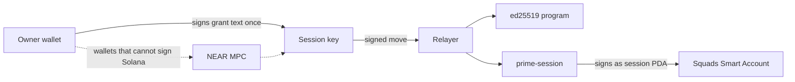

## 3. Seats vs sessions

A seat is a vote. A session is permission to make allowed moves. On Solana they sit in different lists of the Squads account. The owner's key is a settings signer. The owner's session PDA is a signer of the policy only. Squads lets only settings signers vote, so a session key cannot vote, change the rules, add owners or move funds outside the policy.

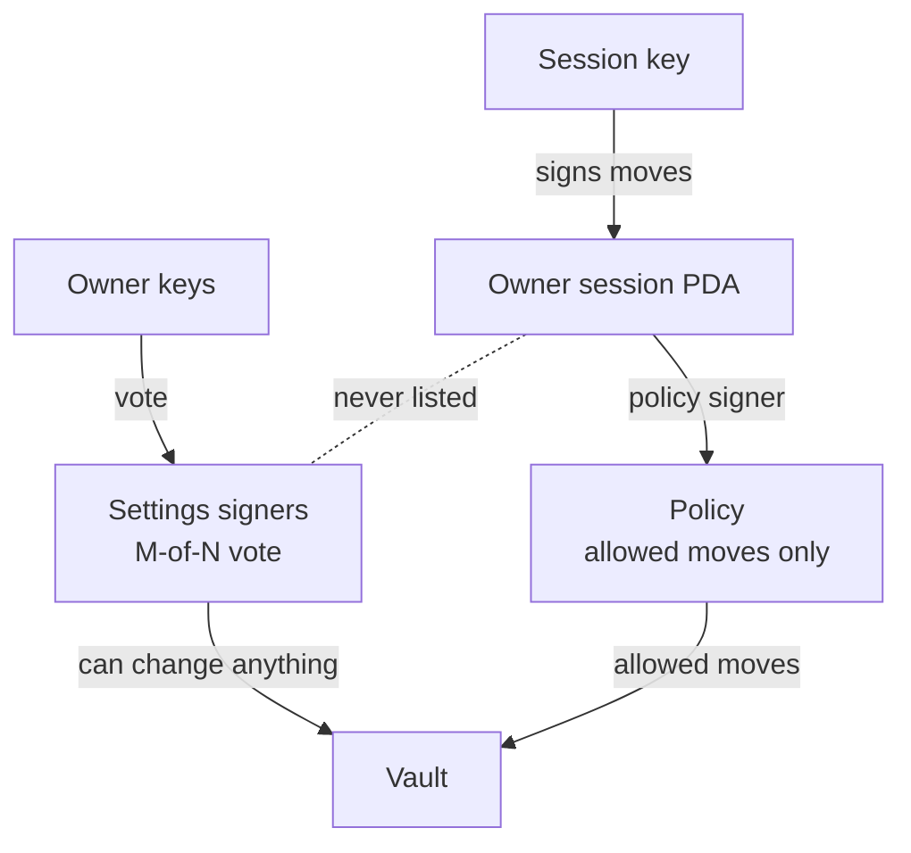

A stolen session key can make allowed moves until it expires or the owner revokes it. The Solana tests tried to make a session vote, and every attempt was refused.

## 4. Funds stay in custody

On Stellar, OctoGate keeps the funds in custody and lets the Prime Account draw through a gate. On EVM, a gate on custody's Safe does the same. On Solana the gate is a small program of ours, and the funds sit in a token account that custody hands to it (section 5).

How a draw works:

1. **Custody creates the gate:** the gate is a PDA of the gate program, made from custody's multisig, the Prime Account's settings address and an 8-byte seed. Custody fixes the destinations, the recovery address, the end time and the run window when it creates the gate. Nothing can change them afterwards.
2. **The agent draws through a rule:** the rule signs as a vault of the Prime Account, the agent lane. The gate checks that vault, the destination, the end time and the batch's not-after, then signs for the token account as the cap address, and the token program stops the draw at the cap.
3. **Proceeds go back:** with a real venue, the venue pays the proceeds into a gate-owned account of custody in the same transaction.

| Piece | What it does |
|---|---|
| Two lanes | The agent lane (a Squads vault) draws to listed destinations within the cap. The owners lane (a second vault, signed by the owners at their approval count) pays the recovery address and nothing else. Each lane number is 1 or higher and the two differ. |
| Fixed destinations | The gate reads the owner of each destination token account and compares it with the list set at creation. The list holds venues and the Prime Account's vault. One entry covers every token that owner holds. |
| One Prime Account | The gate accepts calls only from vaults of the Prime Account it was made for. A Prime Account with a settings authority is refused at creation, because that authority could add itself as an owner. |
| Cap | The token program enforces the cap on the agent lane. Section 5 has who can lower and raise it. |
| End time and not-after | The gate pays the agent lane nothing after its end time. Every batch carries a mandatory not-after that lies at most the run window ahead, on both lanes. |
| Wait | The owners' rule carries the wait for the whole batch (section 8). The gate has no queue of its own. |
| Tokens | Only the Token and Token-2022 programs are called. |

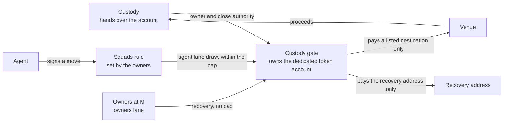

### Which mints the gate holds

The gate holds tokens of the Token and Token-2022 programs. The app reads the mint (`checkMint`) before custody opens the dedicated account and applies these rules:

| Mint | App result | Why |
|---|---|---|
| Permanent delegate (Token-2022) | Refused | The delegate moves any account of the mint with no gate call and no cap |
| Transfer hook | Refused | Another program runs on every transfer, and its authority can change it later |
| Transfer fee | Refused | Token-2022 refuses the gate's plain transfer (error 0x1f) |
| Default account state: frozen | Refused | New accounts start frozen |
| Confidential transfer, its fee, confidential mint and burn | Refused | The balances are hidden from the gate and its checks |
| Non-transferable | Refused | The tokens cannot move |
| An extension the check cannot parse or does not know | Refused | The check fails closed |
| A freeze authority (USDC, USDT) | Warning | The issuer can freeze this account; while frozen, recovery and release are refused (`AccountFrozen`, 0x11) |
| A pause authority | Warning | The issuer can pause every transfer of the mint, with the same effect |
| Token-2022 | Warning | Token-2022 is upgradeable on mainnet, and the classic Token program is immutable: prefer the classic Token program |

The app shows each warning before any funds move. The gate cannot lift a freeze, so recovery is reliable for a mint whose issuer holds no freeze authority.

### What is proven

**Gate status (line-cut gate with the multisig length check, [`contracts/prime/solana/custody-gate/src/lib.rs`](custody-gate/src/lib.rs), 9 October 2026):** on the mainnet feature set, the mock venue harness passes 345 of 345 checks, and the real venues 53 of 53 (Kamino deposit and redeem, an Orca swap, the whole-batch time lock on a real Orca swap, recovery, release and `prime-session` in the path). The trustee run passes 9 of 9 and the forged-multisig probe 4 of 4. A mutation pass kills 63 of 63 gate mutants and 88 of 88 [`contracts/prime/solana/custody-gate/app-checks/setup-checks.ts`](custody-gate/app-checks/setup-checks.ts) mutants. The gate is 126 sLOC formatted and 47,472 bytes (sha256 `a5d19edb879e75d054f1025d710753ce5150726130c3dd74887236fbdbdc94e2`). The build the reviews tested was 84 as written, 241 after `rustfmt` and 47,160 bytes (sha256 `6d196cab5b6c6d29bc6cf650a1526b4be56c0550bed479b55090364d7a04dfd7`), against 91, 253 and 50,464 for the gate-owned build before the line cut and 119, 276 and 87,160 for the earlier hardened build. The 9 October 2026 size pass rebuilt the gate from the formatted source and re-ran the harnesses against it (345 of 345, 53 of 53, 9 of 9 and 4 of 4), with 78 of 78 gate mutants killed and 12 million differential scenarios against the build above with no mismatch. It uses the standard `solana_program` crate. A Pinocchio port (86 sLOC, 36,000 bytes) was built and is not adopted. The independent security reviews of both builds are done (adopt with fixes, then adopt), and their findings are listed in section 17.

| Claim | Status | Evidence |
|---|---|---|
| The agent lane pays listed owners only, within the cap, inside the not-after window and before the end time. Over-cap draws are refused by the token program | Verified | T1 to T5d, E1 to E5; the venue destination and the Prime vault's own account are both listed (T1c) |
| The owners lane pays the recovery address and nothing else. One owner alone is refused by Squads | Verified | T12 to T16, T13b, T14 |
| Only the Prime Account's two lane vaults can call the gate: another Prime Account's owners, a non-lane vault, custody, a stranger and an unsigned lane are refused | Verified | T6 to T6f |
| The gate refuses a Prime Account with a settings authority, a settings account that Squads does not own, lane numbers below 1 or equal to each other, and a creator who is no signer of the custody multisig | Verified | G1 to G20f, 41 of 41 |
| A pre-funded gate address does not block `create`, and the creator pays the full rent | Verified | G17 to G18c |
| Nothing writes to the gate's account after creation | Verified | Y1 |
| A forged gate account, a hostile token program, a non-token destination and a cap address that is not this gate's are refused | Verified | T7 to T11 |
| The end time and the not-after are exact to the second | Verified | B1, B2, with calls every 300 ms across each boundary |
| Token-2022 mints without fee or hook extensions work. Fee and hook mints fail closed (error 0x1f) | Verified | Z1 to Z9b, 28 of 28 |
| The app reads a token's mint before funds move. It refuses a permanent-delegate, transfer-hook, transfer-fee, non-transferable, frozen-by-default or confidential mint and any extension it cannot parse. It warns for a freeze authority, and prefers the classic Token program | Verified | `checkMint`: unit tests, SX1 to SX7b; PD1, PD2 and FZ2 to FZ5b of the independent review |
| The app reads the gate back and refuses any field that differs from the plan, before the hand-over and again when the owners confirm | Verified | `checkGate`: unit tests, SX8 to SX16b |
| Native SOL moves as [wrapped SOL](https://solana.com/docs/tokens/basics/sync-native) | Verified | N1 to N7c, 16 of 16 |
| One custody multisig can run two gates for the same Prime Account | Verified | seed in the gate address; lanes 2 and 4 in a second gate (G20). Each gate needs its own token account |
| Moves with real venue programs: Kamino deposit and redeem, Orca swap, with the whole-batch time lock on Orca and `prime-session` in the path | Verified | `venues-a4`, 53 of 53, call depth 3 of 5 (4 with `prime-session`). Real venues take the caller's signature, so the listed destination is the Prime Account's vault. A venue's proceeds land in a gate-owned account of custody. The Kamino deposit leaves custody holding collateral tokens |
| Custody's MPC provider signs the gate's instructions | Design only | custody signs the hand-over (two `SetAuthority` calls), `allow` and `release` as a multisig signer. Fordefi can be that signer, as an untested design from Fordefi's documentation |
| The gate deploys non-upgradeable | Design only | the harness loads the gate as non-upgradeable. Production needs a `--final` deploy and a published build. The app refuses a gate that still has an upgrade authority |
| An independent security review of the gate-owned build | Verified: adopt with fixes | [`contracts/prime/spike/matrix/near-minimal/round9/gate-a4/gate-owned-review.md`](../spike/matrix/near-minimal/round9/gate-a4/gate-owned-review.md); the fixes are in section 17 |

## 5. Gate-owned custody

On Stellar, the docs restrict custody's own keys with signer weights: custody's key alone no longer carries enough weight, and custody plus a trustee does. On Solana the same idea sits on the token account, and the gate owns it.

**Two terms first:**

- **Token program:** the built-in Solana program (SPL Token) that keeps every token balance and moves it.
- **Token account:** a balance is not stored in a wallet. It sits in a token account, one per wallet and token, with an **owner** field and an optional **close authority**. Whoever the owner field names can transfer, approve, close or re-own it. Native SOL must be wrapped first, because the token program only handles tokens.

**The hand-over:** custody opens an empty dedicated token account (165 bytes, at an address of its own, no associated account) and signs two `SetAuthority` calls on it, in one transaction: the close authority to the gate PDA first, the owner second. From then on only the gate signs for the account. The app reads the account back (owner is the gate, close authority is the gate, no delegate) before custody funds it.

**Who can do what afterwards:**

| Who | Power | How |
|---|---|---|
| Custody alone | None over the funds. Transfer, close, `SetAuthority`, approve and revoke are all refused | the token program, because the gate owns the account (H5 to H10) |
| Any one custody signer | Lowers or suspends the cap | `allow`, one signature |
| Custody plus the trustee (the multisig's threshold) | Raises the cap. Releases the account back to a key they name | `allow`, `release` |
| The agent | Draws to listed destinations within the cap, under the owners' rules | `transfer` on the agent lane |
| The owners at M | Pay the recovery address with no cap, at any time | `transfer` on the owners lane (section 9) |

**Custody's identity is a multisig:** an [SPL Token multisig](https://www.solana-program.com/docs/token) of up to 11 signers, M of N ("Multisig usage": "Multisig accounts can be used for any authority on an SPL Token mint or token account."). Two layouts: 2 of 2 (custody plus the trustee), or the weighted `[custody, backup, trustee, trustee]` with m = 3, which keeps the trustee mandatory while custody's backup key can stand in for custody's main key. The gate reads the multisig, so a release and a raise of the cap need the multisig's threshold. The gate accepts only an account of exactly 355 bytes owned by a token program as that multisig, the length `InitializeMultisig` writes.

**The trustee:** as on Stellar, a trusted third party that represents the investor side of the institution or asset manager. It holds its own key, in its own wallet or custody, independent of custody and of the Prime owners. The trustee is the mandatory signer in custody's multisig and the default recovery address. A Prime vault can fill the trustee slot (9 of 9 checks), which trades the independent second party for fewer parties to manage.

**The cap is the stop:** the gate approves a cap address as the delegate of the token account with the cap amount, and the token program refuses a draw above it. Any one custody signer lowers it, down to 0. Raising it takes the multisig's threshold. A stolen single key can stop the agent lane, and it cannot raise the cap, release or touch recovery. A threshold-only variant (90 lines, 348 of 348 checks) saves one line and gives custody no single-signature stop.

**Rent stays locked:** the gate has no close instruction, so each gate-owned token account keeps its rent (2,039,280 lamports) while the gate owns it, and a recovery leaves the emptied account open. The rent returns after a release hands the account back and the new owner closes it. Each gate account keeps its own 2,596,080 lamports too.

**Release:** `release` hands the owner and the close authority back to the key the multisig names. It needs the multisig's threshold, works before and after the end time and leaves the balance in the account.

**Recovery:** uncapped and always open to the recovery address, by default the trustee's wallet (section 9).

**Why the close authority goes too:** the token program keeps a close authority through an owner change on an ordinary account. If custody kept it, an agent that draws the account empty would let custody close it, reopen the same address as its own account and receive a venue's proceeds there, where custody alone can move them. The gate refuses it: `allow` sets no cap on a source whose close authority is neither the gate nor unset (X1 to X8e), and a cap is the only way an agent draw becomes possible.

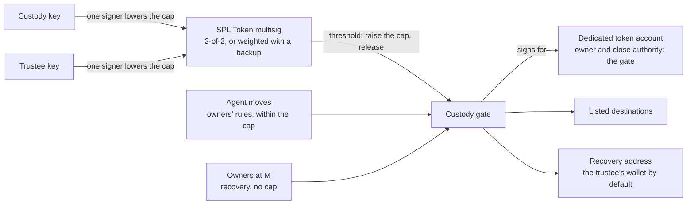

**Design history:** the first locked design handed the token account to the gate with no way back. A second design made an SPL Token multisig the owner of the account and approved the gate as delegate. It kept custody alone out and let custody plus the trustee reverse the set-up, with 162 of 162 checks in its spike (`gate-a3-multisig`). It left the close authority with custody and let a multisig with m greater than n through, both fixed by checks. Tuan chose the gate-owned design on 8 October 2026 as the more suitable for Prime, with a more minimal gate, a clear setup guide and a recovery mechanism. The multisig now serves as custody's identity in the gate, and the gate-owned account answers to the gate.

| Claim | Status | Evidence |
|---|---|---|
| Custody alone is refused for transfer, close, `SetAuthority`, approve and revoke on a gate-owned account. So are the trustee alone, the threshold acting as owner and a stranger | Verified | H5 to H10 |
| Both hand-over orders end in a safe state, on Token, Token-2022 and wrapped SOL. A delegate set before the hand-over is cleared | Verified | H1 to H4g, H11 to H11d, Z1c to Z1e, N1 to N2 |
| The threshold sets the cap, one signer lowers or suspends it, a raise needs m signers. A used-up cap gives no uncapped fallback | Verified | A1 to A16e, 36 of 36 |
| The threshold releases the account and the owners' lanes cannot. Custody alone, the trustee alone and a stranger are refused | Verified | R1 to R14, 33 of 33 |
| A weighted multisig releases and raises the cap with custody's key lost | Verified | R12c, R12e to R12g |
| The close-and-reopen bypass is refused, and recovery still empties an account with a foreign close authority | Verified | X0 to X8e, 16 of 16; X5 on mutant o28 |
| A Token-2022 account with the CPI guard on cannot be handed over. Fee and hook mints fail closed | Verified | Z9b, Z8 |
| The app's checks: m at most n, a trustee who is mandatory, a test signature, a dedicated 165-byte account, the read-back, the shape of an 11-signer transaction, the mint, the gate read-back | Verified | [`contracts/prime/solana/custody-gate/app-checks/setup-checks.ts`](custody-gate/app-checks/setup-checks.ts): 43 unit tests, 54 live checks (SC1 to SC8e, SX1 to SX16b), 88 of 88 mutants |

## 6. Setting up

Custody drives the setup, with the trustee. The Prime Account exists first. Each step is one decision or one transaction, and [`contracts/prime/solana/SETUP-AND-RECOVERY.md`](SETUP-AND-RECOVERY.md) walks through all of them.

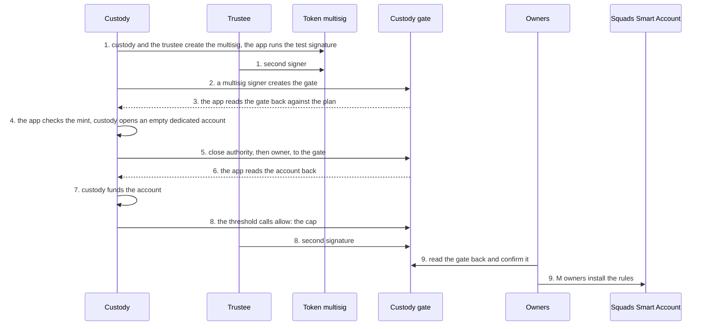

1. **Create the multisig:** custody and the trustee make the SPL Token multisig, 2 of 2 or `[custody, backup, trustee, trustee]` with m = 3. The app checks that m is at most n, that custody's keys cannot reach m alone and that a zero-amount test signature passes with the intended signers and fails with custody alone.
2. **Create the gate (`create`):** any one multisig signer fixes the destinations, the recovery address, the end time, the run window and the seed, with the Prime Account's settings address and the two lane numbers. A gate with two destinations holds 245 bytes and costs 0.0026 SOL of rent. The lane number for the owners is not 0, because the session rules sign as vault 0. The Prime Account has no settings authority, which the gate checks.
3. **Read the gate back:** any one multisig signer can create a gate, so the app compares the gate account with the plan (`checkGate`): the owner program, the address, the multisig, the Prime settings, both lanes, the recovery address, the end time, the run window, the seed and the destinations. Any difference stops the setup, before custody hands anything over.
4. **Check the mint and open the account:** the app reads the token's mint (`checkMint`, section 4) and shows its warnings. Then custody opens an empty dedicated token account of 165 bytes, owned by custody.
5. **Hand over:** custody signs `SetAuthority` for the close authority and then for the owner, both to the gate, in one transaction.
6. **Read back:** the app confirms that the owner and the close authority are the gate, that no delegate exists and that the account is 165 bytes.
7. **Fund it:** custody sends the token to the account. Wrapped SOL is wrapped here, after the hand-over.
8. **Set the cap (`allow`):** custody and the trustee, at the multisig's threshold, set the cap for the account.
9. **Confirm and install:** the owners read the gate and run the same `checkGate` against the plan they agreed, with the destinations, the recovery address, the end time and the run window. Then M owners vote to add one Squads policy for each rule (section 7) and one for recovery (section 9). A rule takes three transactions.

**A new allow-list means a new gate:** the destinations are fixed at creation. Custody and the trustee release the account, a signer creates a gate with the new list under a new seed, and the same steps follow. Gate accounts cannot be closed, so a retired gate keeps its rent of 2,596,080 lamports. Another multisig signer can take a seed first (`create` refuses a taken address), so the app picks a random 8-byte seed and retries with a new one if the address is in use.

| Step | Status | Evidence |
|---|---|---|
| Create the account, install a rule at the owners' count, and the agent as policy signer | Verified | gate spike, 13 of 13 on the Prime side; 1-of-1 up to 7-of-12 owners ran |
| The multisig checks and the test signature | Verified | SC1 to SC5, R12; the token program accepts m greater than n and the app refuses it |
| The gate read-back and the mint check, before the hand-over | Verified | SX1 to SX16b; unit tests |
| `create` with its Prime Account checks, lanes off vault 0, an end time and a seed | Verified | G1 to G20f, 41 of 41 |
| The hand-over, read-back and fund | Verified | H1 to H4g, X1 to X8e, N1 to N7c, Z1 to Z9b |
| The cap by the multisig's threshold | Verified | A1 to A16e, 36 of 36 |
| An 11-signer `allow` or `release` | Verified | needs a version 0 transaction with a lookup table and a signer as the fee payer: 1,195 bytes, against 1,314 as a legacy transaction and 1,291 with a relayer paying (SC8). The app lets a multisig signer pay the fee or keeps n at 10 or below |
| Custody's setup through an MPC provider | Design only | section 4 |

## 7. The agent's rules

A rule is a Squads [**ProgramInteraction**](https://github.com/Squads-Protocol/smart-account-program/blob/80bf1f7ad28fd1176c364879776982730b8e9c80/programs/squads_smart_account_program/src/state/policies/implementations/program_interaction.rs) policy. The agent is the policy's signer: one plain key with no SOL, because the relayer pays. The owners install each rule at their approval count.

What a rule fixes:

- **One venue:** the program it may call, and the accounts it may touch (the gate, custody's dedicated token account and the destination token account).
- **One direction:** a draw to a listed destination, followed by a payback to custody.
- **An amount band per move:** a smallest and a largest amount, read from the call data.
- **Who must approve:** a small band needs the agent alone, and a large band needs the agent and a second approver.
- **A wait:** a time lock on the rule, set by the owners, that covers the whole batch (section 8).
- **Atomic batches:** if one call in a batch fails, none runs.

A rule at vault number k signs as that vault only, so an agent's rule reaches the agent's lane and nothing else. The agent cannot vote, change a rule or sign as the owners.

The agent needs no `prime-session` grant. The agent's key is a policy signer from the day the owners install the rule, and the rule limits what it can do. A session key is for an owner's own wallet that wants a short-lived key. The gate sees the same vault in both cases.

| Claim | Status | Evidence |
|---|---|---|
| An agent draws from custody and the venue pays back in one transaction: 51,630 compute units, 666 bytes, relayer pays (a draw alone: 43,226 and 583) | Verified | gate-owned build, P1 to P10b and the cost runs |
| The rule holds the band, the pinned accounts and the atomic draw and payback, and a failed leg rolls the batch back | Verified | P1 to P10b, 14 of 14 |
| The agent cannot change rules, vote or sign as the owners. A rule at vault 0 (the session rules) reaches nothing of the gate | Verified | P1 to P10b; gate spike, 10 of 10 |
| A stolen agent key moves only what a rule allows and the gate permits | Verified | T1 to T11, the cap and the rule checks above, plus the earlier independent review's attack list |
| The same rules work with a real venue program | Verified | `venues-a4`, 53 of 53: an Orca swap (83,328 compute units), a Kamino deposit (119,676) and a redeem (111,049) |

Sizes to know: a rule with four constraints needs a 256 KB heap request to install and takes 1,219 of the [1,232 bytes a transaction allows](https://solana.com/docs/core/transactions), and it costs 0.0104 SOL of rent. A rule with two constraints installs at the default heap and costs 0.0062 SOL.

## 8. Time lock

The wait belongs to the owners' rule. The agent's rule is a Squads policy with a **time lock**. When the agent signs, Squads stores the **whole batch**: the draw from custody, the venue call and the proceeds back. After the wait, anyone can run it, and it runs as one transaction. The draw, the venue call and the payback succeed or fail together.

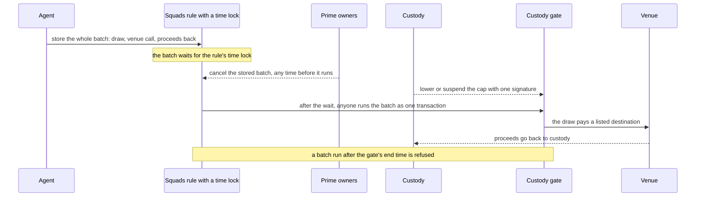

**Who controls what:**

- **The owners** set the wait. M of N can change it, as they change any rule. They cancel a stored batch with a vote.
- **Custody** protects itself by other means: the cap, which any one signer lowers or suspends at any time; the gate's end time; the destinations fixed at creation; and gate-owned custody (section 5).
- **The agent** cannot cancel.

**The trade-off Tuan accepted:** custody does not control the minimum wait. The owners' rule carries it, so the owners can set it low, and custody cannot raise it. Custody's protection is the cap, the end time, the fixed destinations and the gate-owned account, which bound what a batch can take whatever the wait.

**Lapse:** Squads has no run window, and an approved batch stays runnable. Three bounds close it: a mandatory not-after in each batch that lies at most the run window ahead (custody's own bound, 60 seconds in the tests), the gate's end time and the rule's expiry. The gate refuses a batch that runs past its not-after, and the batch stays approved until the owners cancel it.

**No queue in the gate:** the earlier spike gate stored moves itself, with a record, a run, a cancel, a minimum wait and a run window. That queue delayed the draw alone, and the venue call was a separate move. The final gate has none, because the rule's time lock replaces it.

Stellar and EVM compare as follows. On Stellar the whole batch waits, the gate holds the minimum and a move lapses after its run window. On EVM the stored move does not lapse. On Solana the whole batch waits as on Stellar, the minimum sits with the owners, and a move lapses at its not-after.

| Claim | Status | Evidence |
|---|---|---|
| A Squads rule with its own time lock stores a call, refuses an early run, runs it after the wait, checks the rule at run time and lets the owners cancel. The sync path of a rule with a wait is refused | Verified | spike of the other design (custody inside its own Squads account), 225 of 225; the stored call there was a single call |
| The whole batch (draw, venue call, proceeds back) is stored by the rule, an early run is refused, and it runs as one transaction after the wait. A second run is refused | Verified | TL1 to TL11b, 24 of 24; on real Orca state, 50 USDC became about 50 USDT in one run under a 6-second time lock (119,159 compute units) |
| The owners set the wait, change it at M of N and cancel a stored batch | Verified | TL1 to TL11b; the cancel on real Orca state (48,709 compute units) |
| Custody stops a stored batch by lowering or suspending the cap | Verified | TL7, V22, V23: the run fails once the cap is lowered |
| Lapse through the not-after, a not-after beyond the window, the gate's end time and the rule's expiry | Verified | TL1 to TL11b; the lapse on real Orca state (V28c) |
| The gate has no queue of its own | Verified | the final gate has four instructions: `create`, `transfer`, `allow`, `release` |
| The Squads close call that returns a stored batch's rent | Design only | a later run |

A rule with a time lock cannot use Squads' synchronous path, so the agent stores the batch in three steps (create, propose, approve) and a run follows. The relayer pays the rent for a stored batch, and the rent returns when the batch runs or is cancelled. A stored mock batch took 468 bytes and 4,148,160 lamports plus a 294-byte proposal at 2,937,120; a stored Orca batch took 733 bytes and 5,992,560 lamports plus the proposal.

## 9. Recovery

If custody's keys are lost, custody can sign nothing. Recovery lets the Prime Account's owners send custody's funds to the recovery address that custody fixed in the gate. The recovery address is the trustee's wallet by default, as in the Stellar walkthrough. On Stellar and EVM the same feature is called **Recover custody funds**.

How it works:

- The owners, at the **normal approval count** M, sign as the owners' lane. One owner alone is refused by Squads.
- The gate pays **only the recovery address**. The owners can pay no other address with this lane.
- **Custody signs nothing:** with the weighted multisig `[custody, backup, trustee, trustee]`, the trustee and the backup also raise the cap and release.
- **Recovery has no cap:** it runs before the end time, after it, with the cap at 0 and above any cap that was set. The cap bounds the agent. The recovery address is fixed by custody at creation, so a payment there takes nothing from custody, and a low cap does not freeze the funds.
- **It is always open:** the end time stops the agent lane only.
- **A recovery rule can carry a time lock:** the owners store the move, approve it and run it after the wait, and cancel it with their votes until then. A stored recovery lapses at its not-after.
- **The wait binds only when the Prime Account's own time lock is above 0:** at the plain approval count the owners can also sign through the account's settings path at once (RR7). With the account's time lock above 0 that path is refused with `TimeLockNotZero`, and only the stored recovery under the owners' rule runs (RR8d, RR8e). The owners' cancel window exists in the same case. A Prime Account time lock also delays every settings change.
- **A frozen account refuses it:** if the mint's issuer freezes the gate-owned account, the recovery fails with `AccountFrozen` (0x11) until the issuer unfreezes it (FZ3).

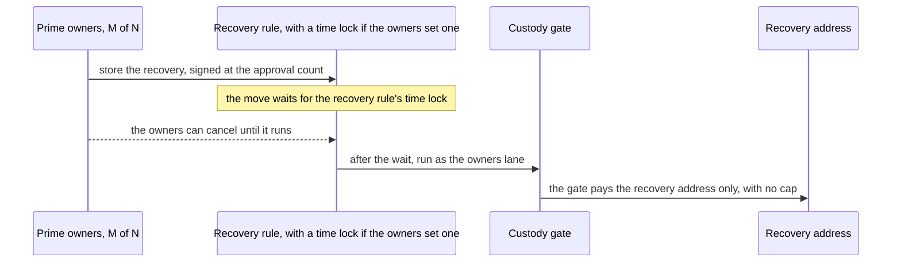

**The full reach of an owner majority:** M owners act with no signature from custody or the agent, and they reach two things:

- **The recovery address, with no cap:** at any time, while custody is still active, before and after the end time and with the cap at 0 (T12, E3b, A7d, RR7).
- **Any listed destination, up to the cap:** they sign as the agent lane through the account's settings path, with no agent key and no installed rule (T1). If a listed destination is a Prime vault the owners control, M owners can draw the cap to themselves.

They cannot pay an address outside those two sets, release an account, set a close authority or approve an arbitrary delegate.

**Custody cannot stop a recovery once the owners sign it:** lowering the cap with one signature stops the agent-lane draw and has no effect on a recovery (A7d, RR3b). Custody's defence is a release back to itself, which races the recovery and needs custody, the trustee and an unfrozen account. The recovery address is the whole bound on the owner majority. With the trustee's wallet as the recovery address, the majority can send every gate-owned balance to the trustee at any time, so custody, the owners and the investors must all trust the trustee. A custody that wants a firmer bound picks a recovery address under its own control. A recovery address that no key controls loses the funds, so the app warns when it equals a destination or has no known holder.

**A reading of the code:** an upgrade of Squads that signs as the owners lane vault can move custody's gate-owned funds, with no cap, to the recovery address, and nowhere else. An upgrade that signs as the agent lane reaches the listed destinations within the cap. Both reaches stop at addresses custody chose.

The agent lane cannot reach the recovery address unless custody lists it as a destination, because the lanes are different vaults. The Stellar gate lets the account's full approval count draw to any listed address, and the Solana gate keeps the owners' lane to one address. The owners can still sign as the agent lane. That gives them the agent's reach, without a band, to listed destinations within the cap.

| Claim | Status | Evidence |
|---|---|---|
| The owners at full count pay the recovery address only, with no custody signature | Verified | T12 to T16, T13b; on real Orca state 500 USDC to the recovery address, 29,240 compute units |
| Recovery is not bounded by the cap and works before and after the end time | Verified | T12, E1b, E3, E3b, A7d, RR4, V30c |
| The agent lane cannot reach the recovery address unless it is listed | Verified | T3, T13, T13b |
| The recovery rule's own time lock: store, wait, run, cancel by the owners | Verified | RR1 to RR8g, 21 of 21 |
| The wait exists only when the Prime Account's own time lock is above 0 | Verified | RR7 (pay at once), RR8 to RR8g (`TimeLockNotZero` on the sync path) |
| The owners can also draw to listed destinations up to the cap as the agent lane. Custody's cap lowering stops that and has no effect on a recovery | Verified | T1, A7d, RR3b (independent review) |
| A frozen gate-owned account refuses recovery and release | Verified | FZ2 to FZ5b (independent review) |
| A stored recovery lapses | Verified | T15 |
| Recovery from a gate-owned account with a foreign close authority | Verified | X6, X8 to X8e |
| A recover button in the Prime app on Solana | Design only | the Solana client does not exist yet |

## 10. Starting a session

The app makes a fresh session key, and the owner's wallet signs this text once. The text is plain, so the wallet shows it in full:

```
Prime session
signer: <session PDA of this owner and this account>
session key: <public key of the new session key>
valid until (unix time): <end time>
cluster: <devnet or mainnet>
```

An example, with shortened addresses:

```
Prime session
signer: 7mQ2...xK9p
session key: 3Fd8...vR1c
valid until (unix time): 1792065600
cluster: devnet
```

The end time above is 15 October 2026, 12:00 UTC. The text leaves out the program id, because the PDA already commits to it. Nothing goes on chain at this step. The signature stays with the session key, and every move carries it.

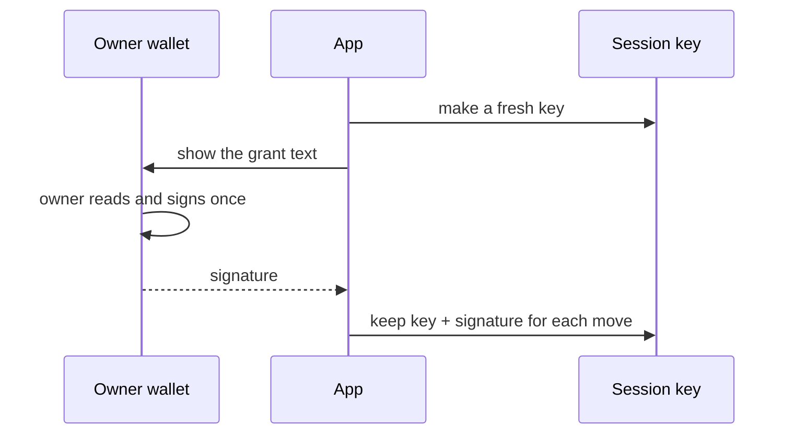

Phantom, Solflare, Backpack and Glow sign this text with their own key, and MetaMask can too. Freighter goes through NEAR. Section 14 lists what we ran.

## 11. Making a move

A move is one transaction with two instructions that the Solana runtime runs together. The session key signs the transaction. The relayer adds its signature as fee payer and sends it.

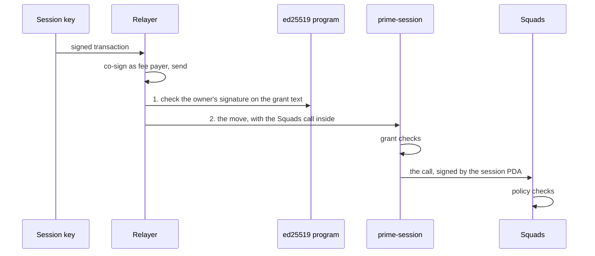

**What prime-session checks:**

1. The session key signed this transaction.
2. The ed25519 instruction in the same transaction verified the owner's signature over the grant text. prime-session rebuilds the text itself from the key that signed, the PDA and the cluster it was built for.
3. The end time has not passed, and it lies at most 7 days ahead.
4. The PDA in the move matches the owner and the account in the grant.
5. The session key has no revoke marker (section 13).

**What Squads checks:** the PDA is a policy signer and has signed, and the call fits the policy (program, data, accounts, number of instructions).

**Who pays:** the relayer pays 15,000 lamports (0.000015 SOL) per move. If the relayer is down, the session key is the fee payer and sends the transaction itself. Both paths are tested, and a session key with no SOL is refused.

An agent's move under the custody gate has the same shape without the ed25519 check. The agent signs as the policy signer and the gate's draw sits inside the Squads call.

## 12. What a session can do

A session can make any call the policy allows. prime-session adds no permission of its own, and its inner call always goes to the Squads program (an address fixed in its code). The policy can pin the program, the call data at fixed positions (equal, different, greater or less than), the accounts, the data stored in an account and the number of instructions.

We tested two calls that move no token, on a local validator cloned from devnet, with a small venue program that keeps a ledger of deposits:

- **Deposit with a cap:** the policy allows a `deposit` of at most 1,000 on one ledger, and only with the vault as beneficiary. A deposit of 100 and of exactly 1,000 went through. A deposit of 1,001, a stranger as beneficiary, the session key as beneficiary, a `withdraw` and a second ledger were refused.
- **Memo prefix:** the policy allows a Solana Memo whose text starts with `prime:`. The memo `prime:rebalance 2026-10-08` went through. `hello world` and `Prime:x` were refused.

A third constraint allowed a deposit to a second ledger only while that ledger's own total stood at 50 or less. One move can hold a deposit and a memo together. If either one fails, nothing runs.

**Result:** 89 of 89 checks passed. The session made 7 allowed calls and the policy refused 30. For 6 of the refusals we also had the owners' seats make the same call, and it succeeded, which shows that the policy did the refusing and the venue accepted the call. A deposit move used 58,380 compute units in a 1,005-byte transaction.

Limits to know when writing a policy: extra bytes after the last checked field pass, so a policy should pin the program. Data is read at fixed positions, so a field after a variable-length field cannot be checked. One policy covers every live session of a wallet.

## 13. Ending a session

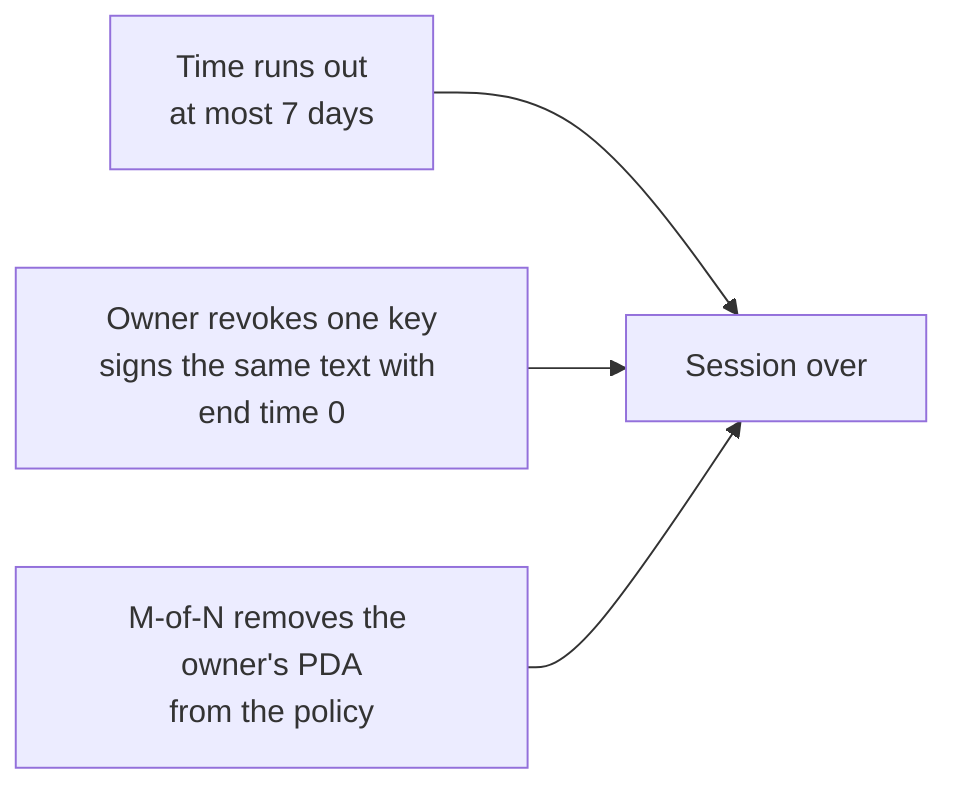

- **Expiry:** prime-session reads the Solana clock and refuses a move after the end time.
- **Revoke one session:** the owner signs the grant text again with the end time set to 0. prime-session then creates an empty account, the **marker**, at an address made from the owner, the account and the session key. Every move checks that address and is refused once the program owns it. Only the owner's signature can start a revoke, so only the owner can end one session. A revoke is final for that key: a new session needs a new key. A revoke for a key that was never granted blocks it too.
- **Remove the PDA:** M owners vote to take the owner's PDA out of the policy. Every session of that owner stops at once. A revoke made earlier stays in force if the PDA returns.

The agent's key follows a separate path. The owners removing the rule, or any one custody signer lowering the cap to 0, ends its reach (sections 5 and 7).

## 14. Wallets

Each wallet follows one of two routes.

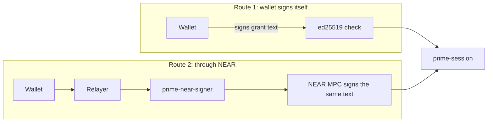

| Wallet | Route | What we ran |
|---|---|---|
| Phantom | Native | The real extension (26.32.0) signed the grant and revoke texts, 16 of 16 checks, and two seat votes that executed. |
| Solflare | Native | The real extension (2.40.0) signed the grant and revoke texts, 16 of 16 checks, including a relayer-paid move. Its seat votes need a devnet account. |
| Backpack | Native | The real extension (0.10.216) signed the grant and revoke texts, 16 of 16 checks, and two seat votes that executed. |
| Glow | Native for text | The real extension (0.61.0) signed the grant and revoke texts, 16 of 16 checks. Its transaction prompt shows no Approve button in our runs. |
| MetaMask | Native or NEAR | Native: MetaMask 13.50.0 signed 12 grant and revoke requests with its own Solana account (145 of 145 checks). Seat-vote transactions used a stand-in with the same key, because MetaMask's simulation refuses the local validator's accounts. NEAR route: stock NEAR code only. |
| Freighter | NEAR | Freighter adds a Stellar prefix to every message, so it cannot sign the Solana text. It goes through our 42-line NEAR contract, `prime-near-signer`. |

On the NEAR route the MPC key signs the same grant text, and prime-session checks that key as the owner. A NEAR-routed wallet uses one MPC key for seat votes and another for sessions, so a session signature can never count as a vote. The NEAR route adds about 8 seconds per signature. The native route took 4.8 seconds for MetaMask's `signMessage` in our runs, browser automation included. Moves never use NEAR.

MetaMask changes a transaction that lacks compute-budget instructions. The client therefore builds MetaMask transactions with both instructions in place, and the relayer checks the returned message before it co-signs.

### Real-wallet results

The real Phantom, Solflare, Backpack and Glow extensions signed the exact grant and revoke texts that prime-session rebuilds. Each signature then ran on a local validator: relayed moves, self-paid moves, a revoke, and the refusal of the revoked key. The wallet runs are **Verified** (the real-wallet run, 8 October 2026).

| Run | Result |
|---|---|
| Setup: two 2-of-3 Prime Accounts with a transfer policy | 8 of 8 |
| Per-wallet runs: grant, move, revoke and refusal, four wallets with 16 checks each | 64 of 64 |
| Cross-wallet and cross-account checks | 41 of 41 |
| Seat votes: 12 checks on 4 real signatures, plus 2 findings on wallets that refuse | 14 of 14 |

What each wallet did with a seat vote (a transaction the wallet signs with [`signTransaction`](https://github.com/anza-xyz/wallet-standard/blob/master/packages/core/features/src/signTransaction.ts)):

| Wallet | Result on the local validator |
|---|---|
| Backpack | Signed 2 votes with the message unchanged. The wallet shows "Simulation not supported on custom RPCs" and leaves Approve enabled. |
| Phantom | Signed 2 votes in Localnet mode after a "Confirm (unsafe)" screen. It adds a priority fee to every transaction it signs. |
| Solflare | Refuses a local blockhash with "Network mismatch". A vote with a devnet blockhash signs. |
| Glow | Shows "Glow detected an issue with the requested transaction" and no Approve button. |

**Phantom's fee:** Phantom returns a transaction with two added compute-budget instructions: a price of 375,000 micro-lamports and a limit of 200,000 units. That is a priority fee of 75,000 lamports, 15 times the base fee of one signature. The relayer's cap in the harness is 25,000 lamports, so the relayer refuses Phantom's vote at that cap. The votes ran with a cap of 100,000 lamports. Grants and revokes use `signMessage` and add nothing. The cap is a decision for the relayer's rules (section 17).

**Prompts:** all four prompts show the session PDA, the session key, the end time and the cluster. Glow flattens the five lines into one paragraph and is the hardest to read. A revoke prompt differs from a grant prompt in one number: the end time reads 0.

What the real-wallet run does not cover, and we still need to run: seat votes through Solflare and Glow on devnet, the grant text with `cluster: devnet`, the NEAR-routed owners, a hardware wallet and a mobile wallet, and a production origin. The agent's own key never goes through a wallet, so these runs concern the owners.

## 15. Safety in plain words

| Attack | What stops it |
|---|---|
| Replay of a grant or a move | The session key must sign every transaction, and Solana refuses a transaction it has already processed. The grant also expires within 7 days. |
| Use in another account | The grant text names the session PDA, which comes from the owner key and this account's address. prime-session works the PDA out again and refuses a mismatch. A second account with the same three owners is refused too. |
| Use on another cluster | The cluster is fixed when the program is built, and a build without it fails to compile. A devnet grant is refused on mainnet. |
| Stolen session key | It can make allowed moves until expiry or revoke, within the policy's limits. It cannot vote, change rules or add owners. |
| Another owner's signature | The signature must be the owner's, over this exact text. Anything else is refused. |
| Compromised relayer | The relayer cannot forge a grant, because that needs the owner's signature, and it cannot make a move without the session key's signature. It can refuse to send. The session key then pays its own fee. The relayer also pays rent for revokes, so it must rate-limit them per owner and per account. |
| Upgraded program | prime-session is planned to deploy on mainnet with `--final`, which locks the code for good. |

Attacks on the custody gate:

| Attack | What stops it | Status |
|---|---|---|
| Draw to an address that is not listed | The gate refuses it, even for the owners at full approval | Verified: T2, T13, T13b |
| A call from another Prime Account or another vault | The gate accepts only the two lane vaults of the Prime Account it was made for | Verified: T6 to T6f |
| Skip the wait | The rule's time lock holds the whole batch. Custody does not control that minimum | Verified: TL1 to TL11b, 24 of 24 |
| Run a stored batch late | The batch's mandatory not-after, the gate's end time and the rule's expiry refuse it | Verified: T5 to T5c, E2, TL checks |
| The agent cancels, votes or reaches the owners' lane | A rule signs only as the vault at its own number, and the agent holds no cancel call | Verified: P1 to P10b; gate spike, 10 of 10 |
| A hostile program posing as a token program | The gate accepts only the two Solana token programs | Verified: T10, T10b, R6 |
| A forged gate account or a cap address that is not this gate's | The gate checks its own account's owner, and the runtime signs only for derived addresses | Verified: T7, T7b, T9, T9b |
| A rule at vault 0 reaching the owners' lane | Both lanes sit at vault 1 or above, and vault 0 reaches nothing of the gate | Verified: G1 to G20f, P1 to P10b |
| Custody's own key moves funds | The gate owns the account. Custody alone is refused for transfer, close, `SetAuthority`, approve and revoke | Verified: H5 to H10 |
| Custody keeps the close authority, drains the account through the agent, closes and reopens the address | `allow` sets no cap on a source with a foreign close authority, so no agent draw is possible | Verified: X1 to X8e; mutant o28, which lacks the check, completes the attack |
| A stolen single custody key | It can lower the cap to 0 and stop the agent lane. It cannot raise the cap, release or touch recovery | Verified: A2, A4, A5, A7, A7e, R1 |
| A majority of owners acting in bad faith | Their reach is the recovery address with no cap, and the listed destinations up to the cap. Custody cannot stop a recovery once it is signed (section 9) | Verified: T1, T13, T13b, A7d, RR3b; the address is custody's choice |
| Another delegate on the token account | The hand-over clears a delegate set before it, and `allow` sets the cap address as the only delegate | Verified: H11 to H11d, A3b, A9 |
| A [permanent delegate](https://solana.com/docs/tokens/extensions/permanent-delegate) on a Token-2022 mint | It moves custody's tokens with no gate involved. `checkMint` refuses such a mint before funds move | Verified: PD1, PD2 (independent review), SX4 |
| An issuer that freezes the gate-owned account | Nothing in the gate stops it. `checkMint` warns for a freeze authority, and recovery and release wait for the issuer to unfreeze | Verified: FZ2 to FZ5b (independent review), SX2 |
| A multisig signer who creates a gate with its own recovery address | `checkGate` compares every field with the plan before the hand-over, and the owners run it again before they install a rule | Verified: SX9b to SX16b |
| A gate bug or an upgrade of the gate | The gate deploys non-upgradeable | Design only |
| A bug in the final gate that the harness did not meet | An independent security review of the gate-owned build | Verified: adopt with fixes, with no way found for one party alone to move funds off the fixed paths |

**What we rely on:**

- **The Squads program:** it can be upgraded by a 3-of-5 multisig ([on-chain read, 8 October 2026](#references)) with no time lock. It was last deployed on 31 August 2026, and no verified build is published. An upgrade of it reaches the account itself. With the custody gate, an upgrade that signs as the owners lane reaches the recovery address only, with no cap, and an upgrade that signs as the agent lane reaches the listed destinations within the cap. Both stop at addresses custody chose. We re-run the gate harness after each Squads upgrade.
- **Token-2022:** the program is upgradeable on mainnet, with upgrade authority `AeLmXCbPaQHGWRLr2saFsEVfmMNuKnxRAbWCT9P5twgz` (read on chain on 8 October 2026). Holding assets there adds that authority as a trusted party. The classic Token program is immutable, so prefer it where the asset allows.
- **The gate program:** it owns the dedicated token accounts, so its code can pay out as far as its lanes allow. It deploys with `--final`, so a latent bug cannot be patched, and the way out is a release to a fresh gate (custody, the trustee and an unfrozen account).
- **The relayer's rules:** the relayer signs only as fee payer, as rent payer for a revoke and as rent payer for a stored move. prime-session and Squads forward a transaction's outer signers into the inner call, so the relayer must refuse any transaction that lists its key anywhere else.

## 16. Costs and limits

Measured on a local validator, with the relayer paying, on the round 9 build. The 9 October 2026 build costs 89 compute units more per session move (53,423 against 53,334 in the same deterministic run) and 32 more per revoke; the gate costs 32 to 305 more per call.

| Item | Value |
|---|---|
| Move | 975 bytes, median 53,205 **compute units** (the work a transaction asks of Solana, range 52,455 to 61,455), fee 15,000 lamports |
| Move with more owners | About 900 more compute units per owner: 50,648 with 1 owner, 60,267 to 61,860 with 12 |
| Revoke | 726 bytes, 22,229 compute units, fee 10,000 lamports |
| Revoke rent | 890,880 lamports (0.00089 SOL) per revoked key. The relayer pays it, and it stays locked. |
| Program size | 53,720 bytes, 64 lines of code (formatted), about 0.375 SOL of deploy rent. The round 9 build was 54,024 bytes and 0.377 SOL. On devnet (5,080 lamports per byte) the program costs 0.2738 SOL |
| Cost per owner | 0.00046 SOL of refundable rent for the larger settings and policy |
| Owners | 62 at most in one account. 25 fit in the create transaction, then each extra owner is added in its own transaction. |
| Owners tested | 1-of-1, 2-of-2, 2-of-3, 3-of-5 and 7-of-12 |

An owner who wants a revoke without the relayer can fund the marker address first and let anyone send the signed revoke.

Custody gate, gate-owned build, on a local validator (compute units vary run to run, because the PDA searches take a variable number of failed bump steps of about 1,500 units each). The figures come from the gate-owned build before the line cut; the line cut's own share is lower ([`contracts/prime/spike/matrix/near-minimal/round9/opt/solana-opt.md`](../spike/matrix/near-minimal/round9/opt/solana-opt.md)):

| Item | Value |
|---|---|
| Gate account, two destinations | 245 bytes, 2,596,080 lamports (0.0026 SOL) of rent, 12,171 to 22,671 compute units to create (517 bytes) |
| A dedicated token account for each gate | 2,039,280 lamports of rent |
| The SPL multisig | 355 bytes, 3,361,680 lamports of rent |
| The hand-over, two `SetAuthority` calls | 251 compute units, 374 bytes |
| `allow`, the threshold sets the cap (2 signers) | 5,455 to 10,232 compute units, 537 bytes |
| `allow`, one signer lowers or suspends | 5,204 to 9,909 compute units, 440 bytes |
| `release`, 2 signers | 5,156 to 5,433 compute units, 528 bytes |
| `allow` or `release` by 11 signers | 8,281 and 7,985 compute units, 1,195 and 1,217 bytes as a version 0 transaction with a lookup table and a signer paying the fee |
| Agent draw through a rule | 43,226 compute units, 583 bytes (the gate's own share: 5,307) |
| Agent batch, draw and venue payback | 51,630 compute units, 666 bytes |
| Stored batch: store, run, owners cancel | 81,848, 81,974 and 52,140 compute units |
| Recovery by the owners (sync) | 23,090 to 36,590 compute units, 671 bytes (the gate's own share: 3,662) |
| A stored recovery runs | 65,464 compute units, 645 bytes |
| Agent rule, install | 0.0060 to 0.0104 SOL of rent, three transactions |
| The gate program, once | 47,472 bytes. Deploy rent is 0.333 SOL on the local validator (6,960 lamports per byte), and 0.709 SOL with prime-session. On devnet (5,080 per byte) the previous gate (47,160 bytes) cost 0.241 SOL net and peaked at 0.482 SOL; the new one cost 0.2429 SOL net and peaked at 0.4849 SOL |

Real venue runs: a Kamino deposit 119,676 compute units, a Kamino redeem 111,049, an Orca swap through a rule 83,328, the same through `prime-session` as a version 0 transaction 107,462 (897 bytes, depth 4; the legacy form is 1,512 bytes and refused as too large).

### prime-session on devnet

`prime-session` of 9 October 2026 (64 lines formatted, 53,720 bytes) is deployed on Solana devnet with `--final` and runs the full matrix with the 2-of-3 Squads Smart Account, all three wallet routes (Phantom's own key, MetaMask and Freighter through NEAR), the refusals and the two-program checks. The first devnet build (`8db245ab…`, 54,024 bytes) stays at [`4tXCkZW2...BRoPRa`](https://explorer.solana.com/address/4tXCkZW255iZNT4gPHDuAbqR3eG8Zs3tRsgLRc1BoPRa?cluster=devnet) as a previous build; it is final too and passed 136 of 136 on 8 October 2026.

| Item | Value |
|---|---|
| Program id | [`6JyReewxbo6D6UQNHEWWTXnC1CdBU8CqcQjoQbGNj9Ba`](https://explorer.solana.com/address/6JyReewxbo6D6UQNHEWWTXnC1CdBU8CqcQjoQbGNj9Ba?cluster=devnet); a second program id for the two-program checks: [`GLabPwsshHoaXMrHM6nHsHEkf51MFkKP86WCdRpXg3SD`](https://explorer.solana.com/address/GLabPwsshHoaXMrHM6nHsHEkf51MFkKP86WCdRpXg3SD?cluster=devnet) |
| Program data account | [`2o1PtHRJ...hRaC`](https://explorer.solana.com/address/2o1PtHRJguYDbihKyutSRTyGXkgMo8ZRPD7dGgKdhRaC?cluster=devnet), 53,720 bytes of code space (`--max-len` equal to the `.so`); program B [`6CEGGuVY...XndHd`](https://explorer.solana.com/address/6CEGGuVY6vEaoCGczVyDSYhqPjd9uQrrY3tAAzBXndHd?cluster=devnet) |
| Build | `PRIME_CLUSTER=devnet`, sha256 `c883636111dfda411ef0dc80e7e73646cb6ee4d1fa9e924f645c0b6c33e68263`, equal to the pin in `build-hashes.json`. `pdhash-ids.ts` on devnet: the on-chain code starts with the local `.so`, the rest is zero, and its sha256 equals the build hash, for both ids |
| Deploy transaction | A [`tMwr9cvd...fbw1a`](https://explorer.solana.com/tx/tMwr9cvddu6qLMyXDALLyEmGLHBmPMeEtHQLJw7sJFKCEEo1NM1HCgP9s5GKkrpBj2GW39am93XLQnSLUYfbw1a?cluster=devnet) (slot 509,142,527), B [`2LkKLseB...JU7nG`](https://explorer.solana.com/tx/2LkKLseBnQAVgifWXZVMiEYbAocrs56hqQoneokb4o3DRDz1NFvU7owdJqy3asa2aDQ1ta7E37MQYug1QHnJU7nG?cluster=devnet) (slot 509,142,601), each after `write-buffer` into a buffer I created |
| Final transaction | A [`4G22erQA...7VbJ1`](https://explorer.solana.com/tx/4G22erQAK37eMssFnPyXfgwXYNrEsJJ3PgWZyguvsCvafak4Bh2562t5CRNKHTQXFQP7X8UfPB5xAF7cnxG7VbJ1?cluster=devnet), B [`539WAf1c...cF4mY`](https://explorer.solana.com/tx/539WAf1c43uGLCfkPZLyK7VpCQBYTtptTq8Bszj6RBRmV7a8Jcyf4B1sjDV3WWZPFSRnzHb9aP9Dr6rviTEcF4mY?cluster=devnet): `set-upgrade-authority --final` (slots 509,142,809 and 509,142,814). After it `pdhash-ids.ts` reads executable true, upgrade authority none, same hash. The matrix ran against the final programs |
| Smart Accounts (settings addresses) | A [`BADcvrN6...UYb`](https://explorer.solana.com/address/BADcvrN6ym7xekL4LVoid4RXPqPpzgrj57zibU2DXYUb?cluster=devnet), B [`68xJKwva...rh5`](https://explorer.solana.com/address/68xJKwva4kanNWAVsHMRGtk56iX7RJgaJgbJKJ1q2rh5?cluster=devnet). [`tx-signatures-session.md`](../spike/matrix/near-minimal/round9/solana-devnet-sloc2/tx-signatures-session.md) lists 61 transactions with explorer links |
| Result | 145/145 distinct checks: 144 in the main run, with F4 (a signature instruction from another program) passing in a re-run on the same accounts once its no-op program stood on devnet at [`AARnE8m3...R4v`](https://explorer.solana.com/address/AARnE8m37ewaTZq4ksPZhGJAsizXQD37JHiGf4mP3R6v?cluster=devnet). 41 NEAR MPC signatures, 8.3 s average |

What ran on devnet: every pair of the three seats reaches 2-of-3 and a single seat is refused (`InvalidProposalStatus`); an outsider is refused; a session-path key cannot vote as a seat. Per wallet route: one grant signature, a relayed move, a self-paid move (the session key pays its own fee), a session key without SOL refused, a wrong recipient and an over-limit move refused, a stretched `valid until` refused, and a replay by another key refused. Revoke: Phantom through the V section, and MetaMask and Freighter through block W (grant, relayed move, self-paid move, revoke by one relayed signature, then the revoked session refused both ways with error 2, and the wallet's other session still works). A grant for account A is refused in account B and the reverse. A grant text signed for `cluster: mainnet` is refused on devnet with error 7. The two-program checks run too: a grant that names program A's PDA is refused at program B with error 2 (X7a) and error 7 (X7b), and the grant that names B's PDA is refused at A the same way (X7c, X7d). Block F sends forged signature offsets and a signature instruction from another program (F4), and every one is refused with error 7 or 2 while the control F0 passes. Removing Freighter's PDA from the policy stops its live session and leaves MetaMask's working.

### The custody gate on devnet

The gate of 9 October 2026 (126 lines formatted, 47,472 bytes) is deployed the same way and passes the gate-owned custody flow with plain local keys and a Squads Smart Account as the Prime Account. The first gate build (`6d196cab…`, 47,160 bytes) stays at [`58L4q3Dg...69iYx`](https://explorer.solana.com/address/58L4q3DgvPdvRh7kX4v148EwEwd29WHh4RfaZJR69iYx?cluster=devnet) as a previous build; it is final too and passed 84 of 84.

| Item | Value |
|---|---|
| Program id | [`6ieR7WUs2M2VxEFYosRLuMtCdrWs7sqUeM1P4d5jiUnz`](https://explorer.solana.com/address/6ieR7WUs2M2VxEFYosRLuMtCdrWs7sqUeM1P4d5jiUnz?cluster=devnet) |
| Program data account | [`BFMMi5dh...LBu`](https://explorer.solana.com/address/BFMMi5dhPNXpF1PwBzGHCK4u46VUikmsxoEBqUdXsLbu?cluster=devnet), 47,472 bytes of code space (`--max-len` 47,472) |
| Build | `cargo-build-sbf` from `contracts/prime/solana/custody-gate`, sha256 `a5d19edb879e75d054f1025d710753ce5150726130c3dd74887236fbdbdc94e2`, equal to the pin in `build-hashes.json`. `pdhash-ids.ts`: on-chain code equals the `.so` before and after `--final` |
| Deploy transaction | [`4bVXEsmJ...bFvyG`](https://explorer.solana.com/tx/4bVXEsmJuWJDBWs3S35iy8LbVQddC6g3zth9dQPyPj2pw4H3AaCsSCDEQp5AJf7JBfz1q7if8ojAGkc2n4KbFvyG?cluster=devnet) (slot 509,142,706) |
| Final transaction | [`2GGEZ3LW...6aHDM`](https://explorer.solana.com/tx/2GGEZ3LW5JoeMUVBFdSWFAPSVrdPLKb1AQmrT9oAFPd2DxGhkANxyUwayKYFCA92n397hpChHHg6XuvNreF6aHDM?cluster=devnet) (slot 509,142,819) |
| Result | 84/84 checks of the gate-owned custody flow, including the forged multisig (F1 to F4: the gate refuses it with error 5, `parseMultisig` refuses it, a gate on the real multisig still creates). [`tx-signatures-gate.md`](../spike/matrix/near-minimal/round9/solana-devnet-sloc2/tx-signatures-gate.md) lists every transaction |
| Cost | the deploy 0.2429 SOL net (program data 242,036,600 lamports, program account 833,120) with a peak of 0.4849 SOL while the buffer (241,995,960) and the program data coexist; the flow 0.0266 SOL gross and 0.0135 SOL after the clean-up |

| Metric | Devnet | Local run (9 October 2026 build) |
|---|---|---|
| Move, ten Phantom samples, relayer pays | median 51,940 compute units, max 54,940, 973 bytes, fee 15,000 lamports | median 53,423 |
| Move, one per wallet route | MetaMask 54,942, Freighter 53,473, Phantom 60,974 | |
| Revoke | 22,261 compute units, 724 bytes, fee 10,000 lamports | 22,261 |
| Revoke marker rent | 650,240 lamports | 890,880 lamports |
| Gate: create, 2 signatures | 30,411 compute units, 485 bytes | |
| Gate: agent move through the Squads rule | 40,424 compute units, 583 bytes | |
| Gate: recovery by the owners (2 of 3) | 27,749 compute units, 671 bytes | |
| Gate: set the cap by the multisig, lower it by one signer, release | 5,836, 5,506 and 5,595 compute units | |

Compute units vary by up to 3,000 per move between samples, because each random session key needs a different number of failed bump steps (about 1,500 units each) in the marker search; the gate's create and recovery calls vary more, since their PDA searches also take a variable number of failed steps. The local figures come from a deterministic run with fixed keys.

The round spent 0.9724 SOL net. The payer held 10.2296 SOL before the first deploy and holds 9.2572 SOL after the clean-up. The four final programs hold 0.8168 SOL of rent: prime-session A 0.2738 SOL, prime-session B 0.2738 SOL, the gate 0.2420 SOL, the no-op program 0.0238 SOL and 0.0008 SOL for each program account. The session run kept about 0.141 SOL (fees, the two settings accounts, six revoke markers and the Squads rent that cannot be closed), the gate flow 0.0135 SOL, and the write transactions of the four deploys about 0.001 SOL. The clean-up returned the vault leftovers (0.1509 SOL), the rent of the closed Squads transactions, proposals and policies, the float of 50 session keys (0.0999 SOL, their secrets were saved for this) and the gate flow's token accounts and agent rule. Devnet charges 5,080 lamports per byte of account size plus 128 bytes of overhead, so a program costs (code length + 173) bytes at that rate.

## 17. Choices we made and what's open

**Custody gate, gate-owned custody (Tuan, 8 October 2026):** Tuan chose the gate-owned design as the more suitable for Prime, with a gate that is much more minimal and secure, a clear setup guide and a recovery mechanism, so that the solution builds reliability. Custody hands the owner and the close authority of a dedicated token account to the gate. Custody plus the trustee can release it. Recovery is uncapped and always open to the recovery address, by default the trustee's wallet. The cap is the stop: any one custody signer lowers it and the multisig's threshold raises it. The trustee is a trusted third party that represents the investor side, as on Stellar, with its own key.

**Time lock, the decision (Tuan, 8 October 2026):** three designs were on the table.

- **Option 1, a wait inside the gate (set aside):** the gate holds the minimum wait, so custody controls it and no owner can go below it. Only the draw waits, and the venue call is a separate move, so the batch is no longer atomic with its wait. The earlier spike built this.
- **Option 2, the whole batch waits on the owners' rule (chosen):** the rule's time lock stores the draw, the venue call and the proceeds, and runs them as one transaction. The owners set the minimum wait and can change it at M of N. Custody gives up control of the minimum and keeps the cap, the end time, the fixed destinations and the gate-owned account. It matches Stellar, where the whole batch waits.
- **Option 3, the gate checks Squads' stored transaction (set aside):** the gate would read the stored batch to enforce a floor. It would add gate code that depends on Squads' internal layout.

**What is verified:** the whole-batch time lock, gate-owned custody, recovery and the setup checks ran in the gate-owned build's harness (sections 4 to 9). The independent security review of that build is done (below).

**Open items:**

- **Independent security review: done, adopt with fixes** ([`contracts/prime/spike/matrix/near-minimal/round9/gate-a4/gate-owned-review.md`](../spike/matrix/near-minimal/round9/gate-a4/gate-owned-review.md)). The reviewer rebuilt the gate byte for byte, ran 345 of 345 and 348 of 348 harness checks, 19 unit tests and a 21-mutant pass with no survivors, and found no way for one party alone to move funds off the fixed paths. The fixes:

| # | Finding | Fix | Status |
|---|---|---|---|
| F1 | A mint's freeze authority stops recovery and release (high for freezable assets) | `checkMint` warns; the caveat is in sections 1, 4 and 9 and in the setup guide | Done in code, tests and docs. The app screen is design only |
| F2 | A permanent-delegate mint bypasses the gate and the old checks passed it | `checkMint` refuses it, the other unsafe mints and any unknown extension | Done in code and tests |
| F3 | No gate read-back, and any one multisig member fixes the gate's fields | `checkGate` before the hand-over and again by the owners | Done in code and tests |
| F4 | The owner majority's full reach, and custody cannot stop a recovery | Stated in full in section 9 | Done in docs |
| F5 | Squads and Token-2022 are upgradeable, classic Token is immutable, the gate deploys with `--final` | Stated in section 15 | Done in docs. The app's refusal of a gate program with an upgrade authority is design only |
| F6 | Rent stays locked in gate-owned accounts until a release | Stated in sections 5 and 6 | Done in docs |
| F7 | Seed squatting | Stated in section 6, with the app's retry | Done in docs |
| L1 | Low, found in the line-cut review and present in the gate-owned build too: a classic Token account can pose as custody's multisig with a threshold of 0 | The gate accepts a multisig account of exactly 355 bytes only, an extra condition in the existing check of `votes` | Done in the gate with no extra line, tested (4 of 4 on the forged-multisig probe) and covered by a mutant |

- **Independent review of the line cut: done, adopt** ([`contracts/prime/spike/matrix/near-minimal/round9/opt/gate-linecut-review.md`](../spike/matrix/near-minimal/round9/opt/gate-linecut-review.md)). The line cut is a refactor of the gate-owned build. A host differential test on 3 million random inputs per seed found no difference except one signer flag on a System `Transfer` that the System program ignores, and the harnesses pass unchanged. Finding L1, the one issue the review added, is fixed in the gate (table above); the fixed build is the one this document describes.
- **Fordefi:** Fordefi can be a multisig signer for custody's key or the trustee's key, as an untested design from Fordefi's raw Solana transaction API. The harness signs with raw keys.
- **Gate deploy:** a published verifiable build and a `--final` deploy. The app refuses a gate program that still has an upgrade authority.
- **Gate on devnet:** the 9 October 2026 gate (`a5d19edb…`, 47,472 bytes) is deployed with `--final` on devnet at `6ieR7WUs2M2VxEFYosRLuMtCdrWs7sqUeM1P4d5jiUnz` and passes 84 of 84 checks there, and prime-session (`c8836361…`) runs at `6JyReewxbo6D6UQNHEWWTXnC1CdBU8CqcQjoQbGNj9Ba` with 145 of 145. The first builds (`6d196cab…` at `58L4q3DgvPdvRh7kX4v148EwEwd29WHh4RfaZJR69iYx` and `8db245ab…` at `4tXCkZW255iZNT4gPHDuAbqR3eG8Zs3tRsgLRc1BoPRa`) stay on devnet as previous builds (section 16).
- **Squads upgrades:** the program upgrades on mainnet with no time lock, so the gate harness re-runs after each upgrade.
- **Devnet seat votes:** Solflare's and Glow's seat votes through the real extensions and the grant text with `cluster: devnet` signed by the real extensions can run now that the devnet payer holds SOL. The devnet runs of `prime-session` used keys and the NEAR MPC.
- **Relayer cap:** Phantom adds a 75,000-lamport priority fee, and the harness cap is 25,000. Tuan decides whether the cap rises for Phantom votes or the app sets the fee before Phantom signs.
- **Recovery wait:** the wait before a recovery binds only when the Prime Account's own time lock is above 0, which also delays every settings change. Tuan decides whether the Prime Account sets its own time lock.
- **Trustee:** Tuan decides who the trustee is: a person's key, a Fordefi vault of its own, or a Prime vault, which trades the independent second party for fewer parties to manage.

**Swig set aside:** we tested Swig, a third-party Solana wallet program with session keys, in place of prime-session. It works for all four owner routes (256 of 256 checks) and would save bytes, compute units, fee and revoke rent. We kept prime-session because Swig counts the 7-day cap in slots, which last 4.3 to 6.9 days as slot time changes. Swig also allows one live session per role, needs an admin-role design, shows weaker prompts and adds upgradeable third-party code. The decision flips if we accept a slot-based cap, the real extensions accept its prompts, a time lock bounds its upgrades, or Squads ships session keys for policy signers.

**Seat voting, spiked and advised against:** in a spike, each owner's PDA also became a settings signer, so a session key with a vote flag could vote for its owner. It works on Solana for 7 more lines (292 of 292 checks). The independent review recommends keeping plain-key seats, with wider policies for routine actions, because the full design puts every seat behind one program and a bug or upgrade there would reach the account's governance. The production contracts are unchanged. Decision for Tuan.

**Next step, a Solana app:** the Prime apps are built for other chains first. The Solana client needs the move and revoke layouts, the gate's create, hand-over, cap, release and recover screens, the setup checks, the relayer rules above, and the MetaMask compute-budget rule.

## References

External links were checked on 8 October 2026 and resolve. Squads source links point at the commit the spike read (`80bf1f7`). Internal items are our own evidence and have no public page.

### Solana basics

- [Program derived addresses](https://solana.com/docs/core/pda), [cross-program invocation](https://solana.com/docs/core/cpi) (with the call depth limit in [program limitations](https://solana.com/docs/programs/limitations))
- [Transactions](https://solana.com/docs/core/transactions) (1,232 bytes), [Fees](https://solana.com/docs/core/fees) (rent and priority fees), [compute budget](https://solana.com/developers/cookbook/transactions/optimize-compute)
- [Ed25519 program](https://docs.rs/solana-ed25519-program/latest/solana_ed25519_program/) and the [instructions sysvar](https://docs.rs/solana-sdk-ids/latest/solana_sdk_ids/sysvar/instructions/index.html) (instruction introspection); [clusters](https://solana.com/docs/references/clusters)

### SPL Token and Token-2022

- [SPL Token documentation](https://www.solana-program.com/docs/token): `SetAuthority` and account owner, the warning against reassigning an associated token account (Wallet Integration Guide), `Approve` and delegates (Authority delegation)
- [ImmutableOwner extension](https://solana.com/docs/tokens/extensions/immutable-owner); [`AuthorityType` reference](https://docs.rs/spl-token/latest/spl_token/instruction/enum.AuthorityType.html)
- [Transfer fee](https://solana.com/docs/tokens/extensions/transfer-fees), [transfer hook](https://solana.com/docs/tokens/extensions/transfer-hook), [permanent delegate](https://solana.com/docs/tokens/extensions/permanent-delegate); [wrapped SOL](https://solana.com/docs/tokens/basics/sync-native)

### Squads Smart Account

- [smart-account-program](https://github.com/Squads-Protocol/smart-account-program) (program repository); source files at commit `80bf1f7`: [`ProgramInteraction`](https://github.com/Squads-Protocol/smart-account-program/blob/80bf1f7ad28fd1176c364879776982730b8e9c80/programs/squads_smart_account_program/src/state/policies/implementations/program_interaction.rs), [`SpendingLimit`](https://github.com/Squads-Protocol/smart-account-program/blob/80bf1f7ad28fd1176c364879776982730b8e9c80/programs/squads_smart_account_program/src/state/policies/implementations/spending_limit_policy.rs), [`SettingsChange`](https://github.com/Squads-Protocol/smart-account-program/blob/80bf1f7ad28fd1176c364879776982730b8e9c80/programs/squads_smart_account_program/src/state/policies/implementations/settings_change.rs), [`Policy`](https://github.com/Squads-Protocol/smart-account-program/blob/80bf1f7ad28fd1176c364879776982730b8e9c80/programs/squads_smart_account_program/src/state/policies/policy_core/policy.rs) (policy `time_lock`), [`synchronous_transaction_message.rs`](https://github.com/Squads-Protocol/smart-account-program/blob/80bf1f7ad28fd1176c364879776982730b8e9c80/programs/squads_smart_account_program/src/utils/synchronous_transaction_message.rs) (synchronous execution), [`transaction_execute.rs`](https://github.com/Squads-Protocol/smart-account-program/blob/80bf1f7ad28fd1176c364879776982730b8e9c80/programs/squads_smart_account_program/src/instructions/transaction_execute.rs) (time lock on execute)
- On-chain reads of 8 October 2026 (internal, kept in the refinement workspace outside this repository: `gate-b-squads.md` and `trust-b.log`): program id `SMRTzfY6DfH5ik3TKiyLFfXexV8uSG3d2UksSCYdunG`; mainnet upgrade authority `HT3JknwuufXdtVJggz5Z9JcnYtanPpLzTCqLWsVX1Vu2`, vault 0 of Squads v4 multisig `DtgsedPQi8DdsgGLZiFii3ShwhrQN8v14EYsWAjmroxC` (3 of 5, time lock 0); devnet upgrade authority `J496LGUhsKvBE6yRvet4FtMgxxox82fMiDKb3qtScUh2`

### Wallets

- [Solana wallet standard](https://github.com/anza-xyz/wallet-standard/tree/master/packages/core/features/src) ([signMessage](https://github.com/anza-xyz/wallet-standard/blob/master/packages/core/features/src/signMessage.ts), [signTransaction](https://github.com/anza-xyz/wallet-standard/blob/master/packages/core/features/src/signTransaction.ts))
- Phantom: [sign messages](https://docs.phantom.com/sdks/browser-sdk/sign-messages), [sign transactions](https://docs.phantom.com/sdks/browser-sdk/sign-and-send-transaction), [Testnet Mode](https://docs.phantom.com/developer-powertools/testnet-mode) (lists devnet and testnet; no page documents localnet, so our localnet result is an internal observation)
- Solflare: [signMessage](https://docs.solflare.com/solflare/technical/deeplinks/provider-methods/signmessage), [signTransaction](https://docs.solflare.com/solflare/technical/deeplinks/provider-methods/signtransaction). Backpack: [signMessage](https://docs.backpack.app/deeplinks/provider-methods/signmessage), [signTransaction](https://docs.backpack.app/deeplinks/provider-methods/signtransaction)

### NEAR chain signatures

- [Chain signatures](https://docs.near.org/chain-abstraction/chain-signatures) (NEAR docs); the signer contract we call is `v1.signer-prod.testnet` (our receipts are internal evidence)

### Prime on Stellar and EVM

- Prime docs: [How Prime works](https://docs.untangled.finance/docs/Prime/how-prime-works/), [Set up the custody gate](https://docs.untangled.finance/docs/Prime/set-up-the-custody-gate/), [Recover custody funds](https://docs.untangled.finance/docs/Prime/recover-custody-funds/), [Prime on EVM](https://docs.untangled.finance/docs/Prime/prime-on-evm/)

### Our own evidence (internal)

- Spike and review reports. In this repository: [`contracts/prime/spike/matrix/near-minimal/round9/gate-a4/gate-a4-min.md`](../spike/matrix/near-minimal/round9/gate-a4/gate-a4-min.md) (the gate-owned build), [`contracts/prime/spike/matrix/near-minimal/round9/gate-a4/gate-owned-review.md`](../spike/matrix/near-minimal/round9/gate-a4/gate-owned-review.md) (its independent review), [`contracts/prime/spike/matrix/near-minimal/round9/gate-a4/gate-owned-fixes.md`](../spike/matrix/near-minimal/round9/gate-a4/gate-owned-fixes.md) (its fixes) and [`contracts/prime/spike/matrix/near-minimal/round9/opt/solana-opt.md`](../spike/matrix/near-minimal/round9/opt/solana-opt.md) (the line cut). The earlier reports are kept in the refinement workspace outside this repository: `solana-devnet.md` (`prime-session` on devnet), `gate-a-spl.md`, `gate-b-squads.md`, `gate-review.md`, `seat-spike-solana.md`, `seat-spike-review.md`, `solana-real-wallets.md`, `wallet-matrix.md`, `near-refine.md`, `solana-refine.md`, `swig-spike.md`, `swig-spike-review.md`, `doc-factcheck.md`, `doc-factcheck-r2.md`.
- Logs and harnesses live in the bundle [`contracts/prime/spike/matrix/near-minimal/round9/`](../spike/matrix/near-minimal/round9) (`gate-a4/` for the gate-owned build, `opt/` for the line cut, `solana-devnet/`, `solana-devnet-gate/` and `solana-devnet-sloc2/` for the devnet runs, `near/proof-near.log` for the NEAR signer) and the gate harness in [`contracts/prime/spike/matrix/near-minimal/opt/gate/`](../spike/matrix/near-minimal/opt/gate).
