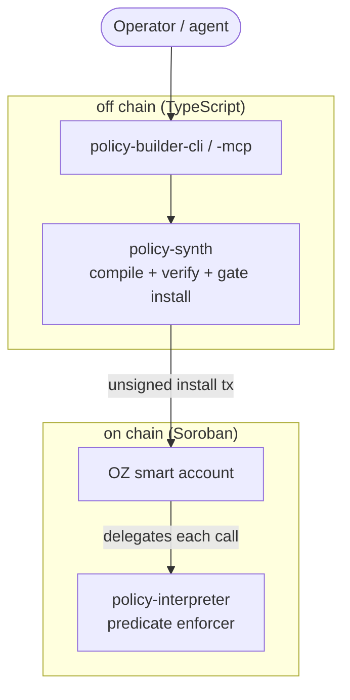
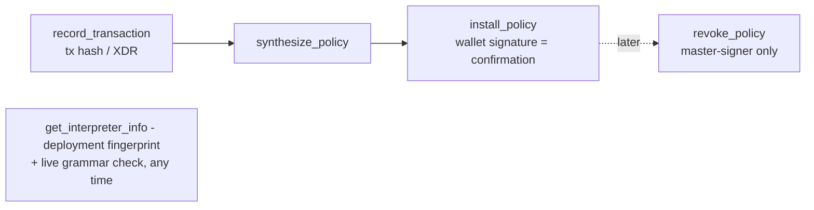
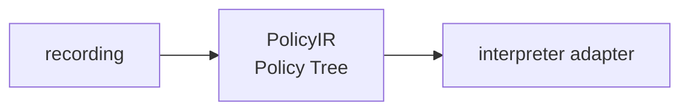

# OZ Policy Builder architecture

The OZ Policy Builder governs a **key**: what a smart account is allowed to
do on each call. This document describes each piece, and is careful about
where enforcement actually lives.

A note on the trust boundary, because it is the thing most easily gotten
wrong: the on-chain interpreter is the enforcer; the off-chain synthesiser is
only a compiler. Nothing off chain is a security boundary.

## Architecture at a glance

The boundary that matters is off chain (compiles, never enforces) versus on
chain (enforces).

---

## The problem

An OpenZeppelin smart account on Soroban delegates each call to a context
rule. A rule can carry OZ's built-in policies (a spending limit, an
M-of-N threshold) and it can delegate to an external **policy contract** that
returns permit or deny. OZ's built-ins cover common cases but cannot express
"only these three recipients", "only this method on this contract", "only when
this argument is under X", or an arbitrary boolean combination of those.

The OZ Policy Builder fills that gap with one audit-once on-chain interpreter that evaluates a
predicate, plus an off-chain toolkit that writes the predicate for you from a
recorded transaction.

## The pieces

| Piece | Package | Runs |
| --- | --- | --- |
| Synthesiser + install/verify flow | `@crediolabs/policy-synth` | off chain (TypeScript) |
| CLI front-end | `@crediolabs/policy-builder-cli` | off chain |
| MCP front-end | `@crediolabs/policy-builder-mcp` | off chain |
| Predicate interpreter | `policy-interpreter` | on chain (Soroban) |

## The pipeline

The off-chain flow is seven steps, exposed identically as seven MCP tools and
as CLI subcommands. Each is a thin adapter over a pure core; nothing holds
session state.

1. **record_transaction** - given a mainnet or testnet tx hash (or raw XDR),
   decode it into a normalised `RecordedTransaction`: the contract, method,
   arguments and token movements the flow actually performed.
2. **synthesize_policy** - `synthesizeFromRecording` lowers the recorded flow
   to an interpreter predicate that pins the contract, the method and the
   arguments the recording carried. It requires `interpreter.smartAccountAddress`;
   without it there is no backend to lower to and the call fails closed.
3. **install_policy** - emit the unsigned Soroban transaction that adds the
   context rule to the smart account. The wallet signature IS the user
   confirmation; there is no two-call action-id handshake because the server
   is stateless.
4. **revoke_policy** - emit the unsigned `remove_context_rule` transaction.
   Master-signer-only.
7. **get_interpreter_info** - return the pinned deployment fingerprint and,
   optionally, a live `grammar_version()` read to confirm the on-chain
   contract still matches the pin.

## The custody-agnostic IR

The synthesiser never lowers a recording straight to the on-chain
format. It lowers to a chain-neutral **PolicyIR** ("Policy Tree"), then a
`CustodyAdapter` compiles the IR to a specific backend. The IR generalises the
NEAR-V2 policy schema (roles / scope filter / guard / constraint / comparison
leaves / default behaviour) and extends it with the selectors only a richer
backend needs (token amount moved, time).

One adapter lowers FROM the IR:

- **Interpreter adapter** (`adapters/interpreter`) - emits a single encoded
  predicate carried to the `policy-interpreter` contract, plus the context
  rule scoped to the recorded contract.

An IR construct the interpreter cannot express is **named in `uncovered`,
never silently dropped**: expiry, for one, belongs to the context rule's
`valid_until` rather than to the predicate.
Keeping the IR as a separate step is what lets a second backend be added
later without touching the synthesiser.

## The predicate grammar

A predicate is a boolean tree of leaves. The **Rust decoder in
`policy-interpreter/src/dsl.rs` is authoritative**; the TypeScript encoder in
`policy-synth/src/predicate/encode.ts` must agree with it byte for byte, and an
unknown tag is fail-closed at decode.

Boolean combinators: `and`, `or`, `not`. Terminal nodes are a comparison
(`eq`, `lt`, `lte`, `gt`, `gte`) or an `in` set-membership test. Selectors
(what a leaf reads from the authorised call):

| Selector | Reads |
| --- | --- |
| `call_contract` | the contract being called |
| `call_fn` | the method symbol |
| `call_arg(i)` | argument `i` as a scalar |
| `call_arg_len(i)` | length of a vector argument |
| `call_arg_field(i, elem, field)` | a field of a map element inside a vector arg |
| `now` | ledger sequence |

Every selector is answered from the authorised call alone. That is the whole
shape of the grammar: **at `enforce` the interpreter writes nothing and reads
only the two entries install fixed** - the predicate document and the signer-set
hash - so a permit costs no ledger writes and no counter exists that could
drift, replay, or archive out from under a rule.

Several selector symbols are deliberately **not** in the grammar and are
refused at decode:

- `amount` - the interpreter sees one authorised call, not the transaction's
  token movements, so it cannot read what a transaction actually moved. A cap
  on value is therefore expressed against the call's own amount argument
  (`call_arg(i) <= limit`), which the synthesiser locates from the protocol
  ABI. A rolling per-window total has no representation at all: accumulating
  one needs stored state the interpreter does not keep.
- `invocation_count(window)` - counting prior calls needs stored state.
  Frequency is therefore not a guarantee this contract makes, and the
  synthesiser says so explicitly rather than implying a cap it cannot keep.
- `valid_until` - expiry belongs to the context rule's own `valid_until` field,
  which the smart account owns.

Structural caps (authoritative in Rust, mirrored in TS): depth 5, 200 leaves,
32 operands in an `in` list, 32 KB encoded.

### What a predicate is actually matched against

`call_fn` and `call_contract` read the AUTHORISED call - the call the smart
account was asked to approve. That is not always the action a person would
name, and two cases catch predicate authors out.

**A wrapper changes the call.** Invoking a token directly, so the token calls
`account.require_auth()`, makes the transfer itself the authorised call:
`call_fn` is `transfer` and `call_contract` is the token. Routing the same
intent through an account-side wrapper such as `execute(token, "transfer",
args)` makes the WRAPPER the authorised call - `call_fn` becomes `execute`,
`call_contract` becomes the account, and the token and method move to
`call_arg(0)` and `call_arg(1)`. A predicate synthesised from a recording pins
the first shape, so running it against a wrapping client denies its own happy
path. The e2e harness calls tokens directly for this reason.

**One call can be several contexts.** A nested sub-invocation is its own
authorization context. A Blend supply is `pool.submit` with a nested
`token.transfer`, so it presents TWO authorised calls, each matched separately
and each needing its own context rule. A predicate pinning
`eq(call_fn, "submit")` governs the outer context ONLY; whatever rule covers
the nested `transfer` governs that. Write predicates per context, not per
user-visible action.

**The account matches the rule the CALLER NAMES, not the strictest rule that
could apply.** Authority is the maximum over the named rules, never the
intersection. So a predicate only constrains a key if the policed rule is the
ONLY rule that key is on. A key that also sits on an unpoliced rule is not
constrained at all - it names the unpoliced rule and the predicate never runs.
Verified on testnet: the identical forbidden call is denied `#100` naming the
policed rule and PERMITTED naming an unpoliced one, same key, same account.

This is the difference between "the interpreter denied that call" and "this key
cannot make that call", and only the second is a security property. Getting it
means signer separation, not predicate strength: put the constrained key on the
policed rule and nowhere else. The e2e harness asserts the closure rather than
assuming it, and `docs/audit/evidence/e2e-network.log` carries the result.

**Nothing here checks that for you.** `install_policy` does not read the
account's other rules, so it cannot tell you the key you are policing holds
unpoliced authority elsewhere. That check has to happen in the integrating
client, or by reading the account's rules by hand before installing. See
`docs/audit/README.md` finding 6.

## The interpreter contract

`policy-interpreter` is a single Soroban contract with this surface:

| Entry point | Purpose |
| --- | --- |
| `grammar_version()` | the grammar version this binary enforces (`SELF_VERSION`) |
| `install(...)` | validate and store a predicate + master signer set for a rule |
| `enforce(...)` | evaluate the stored predicate against one authorised call |
| `uninstall(...)` | remove a rule's stored entries (master-only) |
| `rotate_master_signer_set(...)` | change the master set (master-only) |

**Install is where the fail-closed checks live**, because a predicate that
could fail unsafely at evaluation must never become installable in the first
place:

- grammar version must equal `SELF_VERSION`;
- the encoded predicate must be within the 32 KB byte cap;
- `sha256(predicate)` must equal the caller-supplied `predicate_hash`, so a
  same-shape-but-different-bytes predicate cannot be installed under a stale
  hash;
- the predicate must decode cleanly;
- the rule's signer set must be non-empty (an empty set pins no master and is
  unguardable forever), and must not contain an `External` signer (the
  interpreter cannot re-implement OZ's verifier protocol in v1, so it refuses
  rather than store a master set it can never authorise);
- the predicate must constrain at least one property of the call - a predicate
  of literals only (no `call_contract` / `call_fn` / `call_arg*` / `now`) binds
  nothing and is refused rather than installed as a permanent allow;
- the signer set is capped at 16 (`MAX_SIGNERS`).

And install requires `smart_account.require_auth()` on **every** install,
including the first on a fresh rule id, so an attacker cannot pre-seed a rule
id with their own master set and permanently poison it. A re-install on an
existing rule additionally requires the existing master set to authorise and to
match, and the install nonce to increment (replay protection).

**Enforce** requires `smart_account.require_auth()` (so it is only reachable
through the account it guards), requires a non-empty authenticated-signer set,
checks the rule's live signer hash against the one stored at install (a rule
whose signers changed behind the policy's back denies `RULE_SIGNERS_CHANGED`),
decodes the stored predicate, extends the TTL of the rule's stored entries, and
evaluates. A deny panics with the **specific** `DenyReason` so a review card can
say "not on the allowlist" rather than a generic "predicate false". The TTL
extend runs before the predicate check on purpose: a deny panics and the host
rolls the bump back with the frame, so only a permit keeps it.

Enforce writes nothing else. The four persistent entries a rule owns (doc,
nonce, signers hash, master set) are all written at install and share one
lifecycle; the TTL bump keeps them alive as long as the rule is used.

`test-blend-pool` exists only for testnet verification (a real Blend pool
cannot be stood up in a unit test) - it is never deployed to mainnet.

## The default-deny install gates (off chain)

`install_policy`, `revoke_policy` and `get_interpreter_info` (when it makes a
live call) refuse two things unless the caller explicitly opts in:

- an **interpreter policy address** other than the pinned interpreter for the
  selected network - otherwise the smart account would delegate authorisation
  to an interpreter the caller controls;
- an **RPC URL** other than the pinned endpoint - the auth nonce and root
  invocation the wallet signs come from whichever RPC answered, so a non-pinned
  host could silently bind the caller.

Both gates take an `allowUnpinned...` flag for the deliberate exception.

---

## What each piece does and does not enforce

| Piece | Enforces | Does not enforce |
| --- | --- | --- |
| `policy-synth` (off chain) | nothing on chain; it compiles and default-deny gates the install | the policy itself - that is the interpreter's job |
| `policy-interpreter` (on chain) | the predicate, per call, fail-closed at install and enforce | anything about token movement amounts (it sees one authorised call) |

