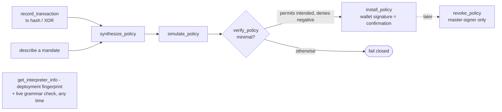
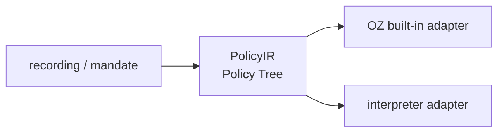

# OZ Policy Builder architecture

The OZ Policy Builder governs a **key**: what a smart account is allowed to
do on each call. This document describes each piece, and is careful about
where enforcement actually lives.

A note on the trust boundary, because it is the thing most easily gotten
wrong: the on-chain interpreter is the enforcer; the off-chain synthesiser is
only a compiler. Nothing off chain is a security boundary.

## Architecture at a glance

The boundary that matters is off chain (compiles, never enforces) versus on
chain (enforces).

---

## The problem

An OpenZeppelin smart account on Soroban delegates each call to a context
rule. A rule can carry OZ's built-in policies (a spending limit, an
M-of-N threshold) and it can delegate to an external **policy contract** that
returns permit or deny. OZ's built-ins cover common cases but cannot express
"only these three recipients", "only this method on this contract", "only while
the oracle price is above X", or an arbitrary boolean combination of those.

The OZ Policy Builder fills that gap with one audit-once on-chain interpreter that evaluates a
predicate, plus an off-chain toolkit that writes the predicate for you from a
recorded transaction or a stated mandate.

## The pieces

| Piece | Package | Runs |
| --- | --- | --- |
| Synthesiser + install/verify flow | `@crediolabs/policy-synth` | off chain (TypeScript) |
| CLI front-end | `@crediolabs/policy-builder-cli` | off chain |
| MCP front-end | `@crediolabs/policy-builder-mcp` | off chain |
| Predicate interpreter | `policy-interpreter` | on chain (Soroban) |

## The pipeline

The off-chain flow is seven steps, exposed identically as seven MCP tools and
as CLI subcommands. Each is a thin adapter over a pure core; nothing holds
session state.

1. **record_transaction** - given a mainnet or testnet tx hash (or raw XDR),
   decode it into a normalised `RecordedTransaction`: the contract, method,
   arguments and token movements the flow actually performed.
2. **synthesize_policy** - one tool, two front-ends on a discriminated union:
   - `recording` -> `synthesizeFromRecording`: infer the minimal policy that
     permits exactly the recorded flow.
   - `mandate` -> `synthesizeFromMandate`: compile a deterministic
     English-shaped mandate ("only `transfer` USDC, cap 50, to these three").
3. **simulate_policy** - stateless: run the proposed predicate against the
   permit transaction (and any deny cases) and report the decision.
4. **verify_policy** - the minimality check: the predicate must permit the
   intended call and deny the paired negative case, or it fails closed.
5. **install_policy** - emit the unsigned Soroban transaction that adds the
   context rule to the smart account. The wallet signature IS the user
   confirmation; there is no two-call action-id handshake because the server
   is stateless.
6. **revoke_policy** - emit the unsigned `remove_context_rule` transaction.
   Master-signer-only.
7. **get_interpreter_info** - return the pinned deployment fingerprint and,
   optionally, a live `grammar_version()` read to confirm the on-chain
   contract still matches the pin.

## The custody-agnostic IR

The synthesiser never lowers a recording or mandate straight to the on-chain
format. It lowers to a chain-neutral **PolicyIR** ("Policy Tree"), then a
`CustodyAdapter` compiles the IR to a specific backend. The IR generalises the
NEAR-V2 policy schema (roles / scope filter / guard / constraint / comparison
leaves / default behaviour) and extends it with the selectors only a richer
backend needs (spend window, oracle price, invocation count, time).

Two adapters lower FROM the IR today:

- **OZ built-in adapter** (`adapters/oz`) - emits OZ's native primitives only:
  `spending_limit` from a windowed spend cap, `simple_threshold` /
  `weighted_threshold` from an M-of-N approval, a `call_contract` scope, an
  expiry ledger. Anything OZ cannot say natively (oracle price, invocation
  count, per-argument allowlist, guard, nested boolean) is **named in
  `uncovered`, never silently dropped**.
- **Interpreter adapter** (`adapters/interpreter`) - emits a single encoded
  predicate carried to the `policy-interpreter` contract. This is the backend
  that expresses the constructs OZ's built-ins cannot.

The compose step routes each IR construct to whichever adapter can express it,
so a policy can be part OZ built-in and part interpreter predicate. The design
goal that makes an IR worth having: the same Policy Tree can later gain a
third adapter (an EVM backend, another custody vendor) without touching the
synthesiser.

## The predicate grammar

A predicate is a boolean tree of leaves. The **Rust decoder in
`policy-interpreter/src/dsl.rs` is authoritative**; the TypeScript encoder in
`policy-synth/src/predicate/encode.ts` must agree with it byte for byte, and an
unknown tag is fail-closed at decode.

Boolean combinators: `and`, `or`, `not`. Terminal nodes are a comparison
(`eq`, `lt`, `lte`, `gt`, `gte`) or an `in` set-membership test. Selectors
(what a leaf reads from the authorised call):

| Selector | Reads |
| --- | --- |
| `call_contract` | the contract being called |
| `call_fn` | the method symbol |
| `call_arg(i)` | argument `i` as a scalar |
| `call_arg_len(i)` | length of a vector argument |
| `call_arg_field(i, elem, field)` | a field of a map element inside a vector arg |
| `call_arg_scaled(i, num, den)` | `arg[i] * num / den`, the slippage-floor leaf |
| `now` | ledger timestamp |
| `oracle_price(asset)` | a Reflector price, normalised to 9 decimals |
| `oracle_threshold` | the right-hand side of an oracle comparison, carrying its declared decimal basis |
| `invocation_count(window)` | stateful count of permits in a rolling window |

Two selector symbols are deliberately **not** in the grammar and are refused at
install: `amount` and `window_spent`. The interpreter sees one authorised
call, not the transaction's token movements, so it has no per-call amount to
read and no way to accumulate one. Rolling spend caps belong to the OZ
`spending_limit` primitive; a per-call cap is a `call_arg_field` comparison.

Structural caps (authoritative in Rust, mirrored in TS): depth 5, 200 leaves,
32 operands in an `in` list, 32 KB encoded, 8 distinct invocation-count
windows.

## The interpreter contract

`policy-interpreter` is a single Soroban contract with this surface:

| Entry point | Purpose |
| --- | --- |
| `grammar_version()` | the grammar version this binary enforces (`SELF_VERSION`) |
| `install(...)` | validate and store a predicate + master signer set for a rule |
| `enforce(...)` | evaluate the stored predicate against one authorised call |
| `uninstall(...)` | remove a rule's predicate + counters (master-only) |
| `rotate_master_signer_set(...)` | change the master set (master-only) |
| `pause_oracle_policies[_all](...)` | circuit-breaker: deny oracle leaves while paused (master-only) |
| `unpause_oracle_policies[_all](...)` | lift the pause (master-only) |

**Install is where the fail-closed checks live**, because a predicate that
could fail unsafely at evaluation must never become installable in the first
place:

- grammar version must equal `SELF_VERSION`;
- the encoded predicate must be within the 32 KB byte cap;
- `sha256(predicate)` must equal the caller-supplied `predicate_hash`, so a
  same-shape-but-different-bytes predicate cannot be installed under a stale
  hash;
- the predicate must decode cleanly;
- the rule's signer set must be non-empty (an empty set pins no master and is
  unguardable forever), and must not contain an `External` signer (the
  interpreter cannot re-implement OZ's verifier protocol in v1, so it refuses
  rather than store a master set it can never authorise);
- oracle leaves must sit directly under the top-level `and` (never under `not`
  / `or`), within the read limit, alongside a non-oracle envelope;
- at most 8 distinct invocation-count windows (Soroban caps writes at 50 per
  tx; each window is one write per permit);
- no `valid_until` leaf (the smart account owns expiry; the interpreter would
  always deny it);
- slippage-floor ratios must have `num > 0` and `den > 0`;
- oracle thresholds must declare a decimal basis (prices normalise to 9 dp, so
  an undeclared 14-dp threshold would be ~10^5 too large and permit everything
  it was written to deny);
- oracle bounds (staleness, deviation) may only **tighten** the compiled-in
  defaults, never widen them.

And install requires `smart_account.require_auth()` on **every** install,
including the first on a fresh rule id, so an attacker cannot pre-seed a rule
id with their own master set and permanently poison it. A re-install on an
existing rule additionally requires the existing master set to authorise and to
match, and the install nonce to increment (replay protection).

**Enforce** requires `smart_account.require_auth()` (it mutates counters, so it
must only be reachable through the account it guards), requires a non-empty
authenticated-signer set, checks the rule's live signer hash against the one
stored at install (a rule whose signers changed behind the policy's back denies
`RULE_SIGNERS_CHANGED`), decodes the stored predicate, extends state TTL, and
evaluates. A permit commits counter updates; a deny panics with the **specific**
`DenyReason` so a review card can say "not on the allowlist" or "oracle stale"
rather than a generic "predicate false". The TTL extend runs before the
predicate check on purpose: a deny panics and the host rolls the bump back with
the frame, so only a permit keeps it.

## The oracle path

`oracle_price` reads a Reflector-Pulse feed, normalised to 9 decimals. Because
an oracle failure is fatal, oracle leaves are constrained at install (position,
read count, declared threshold basis, tighten-only bounds) rather than trusted
at evaluation. The master signer set has a circuit breaker
(`pause_oracle_policies`) that denies every oracle leaf on the account while
tripped, keyed on the account so one call covers all its rules.

`test-oracle` and `test-blend-pool`
exist only for testnet verification (real testnet Reflector carries no price
records for our test assets, and a real Blend pool cannot be stood up in a unit
test) - they are never deployed to mainnet.

## The default-deny install gates (off chain)

`install_policy`, `revoke_policy` and `get_interpreter_info` (when it makes a
live call) refuse two things unless the caller explicitly opts in:

- an **interpreter policy address** other than the pinned interpreter for the
  selected network - otherwise the smart account would delegate authorisation
  to an interpreter the caller controls;
- an **RPC URL** other than the pinned endpoint - the auth nonce and root
  invocation the wallet signs come from whichever RPC answered, so a non-pinned
  host could silently bind the caller.

Both gates take an `allowUnpinned...` flag for the deliberate exception.

---

## What each piece does and does not enforce

| Piece | Enforces | Does not enforce |
| --- | --- | --- |
| `policy-synth` (off chain) | nothing on chain; it compiles and default-deny gates the install | the policy itself - that is the interpreter's job |
| `policy-interpreter` (on chain) | the predicate, per call, fail-closed at install and enforce | anything about token movement amounts (it sees one authorised call) |

