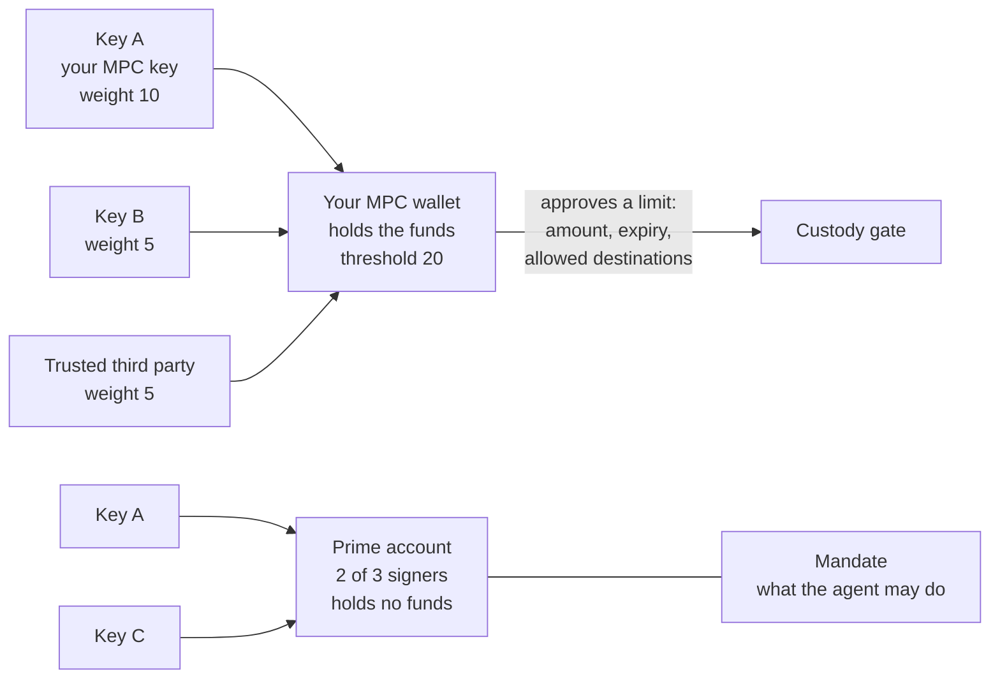
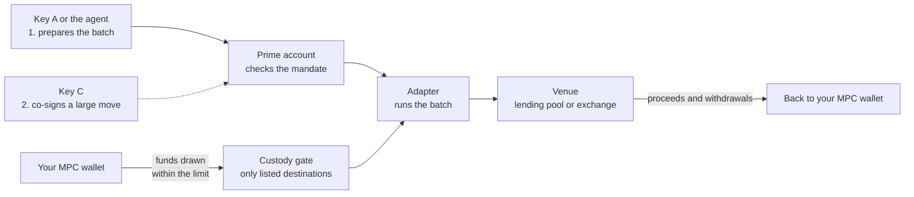
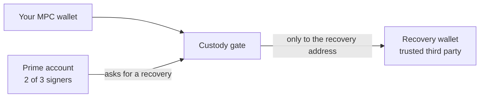

# Prime custody architecture

Untangled Prime lets an agent put part of your treasury to work while the funds
stay in your MPC wallet and can reach only the destinations you listed.
Chain-level detail is in [stellar.md](stellar.md) and [evm.md](evm.md).

## The use case

You hold your treasury in an MPC wallet, such as a Fordefi vault. You want an
agent to put part of it to work: swap it, supply it to a lending pool, withdraw
it again. You do not want to move the treasury anywhere to make that happen,
and you do not want anyone, us included, to be able to take it somewhere you
did not agree to.

The setup below gives you two guarantees:

1. **Your MPC wallet always controls the funds.** The money stays in your
   wallet. Nothing moves unless your wallet's own signers approved the limit it
   moves under, and your signers can stop it at any time.
2. **Only the destinations on your custody gate's list can receive funds.**
   Your wallet grants its limit to a gate. The gate holds a list of the places
   money may go, and it refuses everything else.

## The setup

The setup has three steps. Stellar and EVM implement each one differently;
the table after Step 3 compares them.

### Step 1: set up

Your MPC wallet needs all of its signers to move anything. In the setup we
demonstrated, key A (your MPC key) carries weight 10, key B weight 5 and a
trusted third party weight 5, against a threshold of 20. Any two keys reach 15
at most, so no pair can act without the third.

Your wallet approves one thing: a limit for its custody gate. The limit has an
amount and, on Stellar, an expiry date. The gate carries the list of addresses
the funds may go to. The Prime account is a separate smart account with three
signers, any two of which can approve. It holds no funds. The mandate, meaning what the agent may do, how
much per move and at which venue, is installed on the Prime account.

```mermaid
flowchart LR
    A["Key A<br/>your MPC key<br/>weight 10"] --> MPC
    B["Key B<br/>weight 5"] --> MPC
    T["Trusted third party<br/>weight 5"] --> MPC
    MPC["Your MPC wallet<br/>holds the funds<br/>threshold 20"]
    MPC -->|"approves a limit:<br/>amount, expiry,<br/>allowed destinations"| GATE["Custody gate"]
    A2["Key A"] --> PRIME
    C["Key C"] --> PRIME
    PRIME["Prime account<br/>2 of 3 signers<br/>holds no funds"]
    PRIME --- MANDATE["Mandate<br/>what the agent may do"]
```

### Step 2: execution

A move is one transaction. Key A, or the agent acting for it, prepares a batch
of calls that moves funds from your wallet to a venue. The Prime account checks
the batch against the mandate. Small moves need one signature; larger ones need
a second Prime signer, key C in the diagram, before they run. The batch then
runs through the adapter: the gate draws the funds from your wallet within the
limit, the venue receives them, and whatever comes back goes to your wallet.

On Stellar a move can also wait. The batch is stored, anyone can run it once
the wait is over, and your wallet or the Prime account can cancel it until
then. Every move waits at least the minimum your wallet agreed to when it
created the gate.

```mermaid
flowchart LR
    A["Key A or the agent<br/>1. prepares the batch"] --> PRIME
    C["Key C<br/>2. co-signs a large move"] -.-> PRIME
    PRIME["Prime account<br/>checks the mandate"] --> AD
    MPC["Your MPC wallet"] -->|"funds drawn<br/>within the limit"| GATE["Custody gate<br/>only listed destinations"]
    GATE --> AD["Adapter<br/>runs the batch"]
    AD --> VENUE["Venue<br/>lending pool or exchange"]
    VENUE -->|"proceeds and withdrawals"| BACK["Back to your MPC wallet"]
```

If any call in the batch fails, the whole transaction reverses and the money is
back where it started.

### Step 3: recovery

If your wallet's signers lose access, the funds still need a way out that does
not depend on them. A recovery address, such as a wallet held by the trusted
third party, is set when the gate is created. The Prime account's own signers,
two of three, can then move funds from your wallet to that address, and only to
that address. An agent's mandate cannot reach it. Your wallet can cancel a
recovery while it waits: on EVM it always waits, and on Stellar it waits the
minimum you set for the gate.

```mermaid
flowchart LR
    MPC["Your MPC wallet"] --> GATE["Custody gate"]
    PRIME["Prime account<br/>2 of 3 signers"] -->|"asks for a recovery"| GATE
    GATE -->|"only to the recovery address"| REC["Recovery wallet<br/>trusted third party"]
```

## How each chain keeps the two guarantees

| | Stellar | EVM (Base) |
|---|---|---|
| Network | Stellar mainnet since 1 October 2026, and testnet | Base Sepolia testnet |
| Your MPC wallet | A classic Stellar account. The weights and the threshold of 20 are enforced by the network itself. | A Fordefi address. EVM cannot put weights on an address, so the rule that all your signers must approve has to live in your Fordefi policy, with Prime's automated co-signer and the trusted third party as required approvers. |
| What your wallet approves | A token allowance to the custody gate, per asset, with an amount and an expiry of up to 180 days. | A token approval to the custody gate, per asset, with an amount. That amount is the gate's total budget. |
| The custody gate | A small contract you deploy and own. It has no admin and no settings, and it releases funds only to addresses on its list. | A Safe that your wallet alone owns. Its rules name the only venues and addresses a move may reach, and only your wallet can change them. |
| Where results go | Withdrawals and swap proceeds go straight to your wallet. While money is supplied to a lending pool, the position is held in the Prime account's name, and the mandate pins every withdrawal to your wallet. | Every result, including the lending position itself, goes to your wallet. |
| Per-move limits | Amount bands in the mandate. Above the band, a second Prime signer must approve. | The same, plus a daily cap for the agent and a daily cap on everything leaving your wallet. |
| Stopping it | Your wallet sets the allowance to zero, or lets it expire, and can cancel any move still waiting. | Your wallet turns off the gate's trading rules in one transaction. Recovery keeps working unless you stop that too. |
| Recovery | Two of the Prime account's three signers pull funds to the recovery address. The pull waits at least the minimum wait your wallet agreed to when it created the gate, and your wallet or the Prime account can cancel it until it runs. A minimum of 0 lets it run at once. | Two of the Prime account's three signers schedule it, and it can run only after a waiting period (for example 48 hours) during which your wallet can cancel it. |
| Contracts | Our own Soroban contracts: the gate, the adapter and the policy interpreter. | No contracts of ours. Only unmodified deployments of audited code: Safe, Zodiac Roles and OpenZeppelin's TimelockController. |

## What you control, and what we run

You control your MPC wallet and every signer on it. You also control the
limit, the gate's list of destinations and the recovery address, and on
Stellar the limit's expiry, the minimum wait before a move runs and how long a
move stays runnable after that.
Setting or changing any of these is a transaction from your wallet, so it needs
your wallet's signing quorum.

We run the Prime account's tooling, the agent and the mandate. The mandate can
only narrow what your limit and your gate already allow.

The most money at risk at any moment is the limit you granted, plus anything
currently supplied to a venue.

## What has been tested

We ran both chains end to end on test networks against real venues and
checked every refusal for the reason it was refused.

- **Stellar testnet:** swaps on Aquarius, and supply and withdrawal on Blend.
  The MPC wallet paid out exactly what each move required. Recovery moved
  1,000 XLM and then 500 XLM to a trustee wallet with two Prime signatures and
  none from the MPC wallet. A single MPC wallet key was refused on every route
  out of the account. Stored moves ran after their wait, including a recovery
  to the trustee; the Prime account and the custody wallet each cancelled one; an
  agent or a stranger trying to cancel was refused.
- **Base Sepolia:** supply, swap and withdrawal on Aave and Uniswap, with every
  result returned to the MPC wallet. All 48 attempts to act outside the rules were
  refused. Recovery waited out its delay, a cancelled recovery never ran, and
  recovery still worked with trading switched off.
