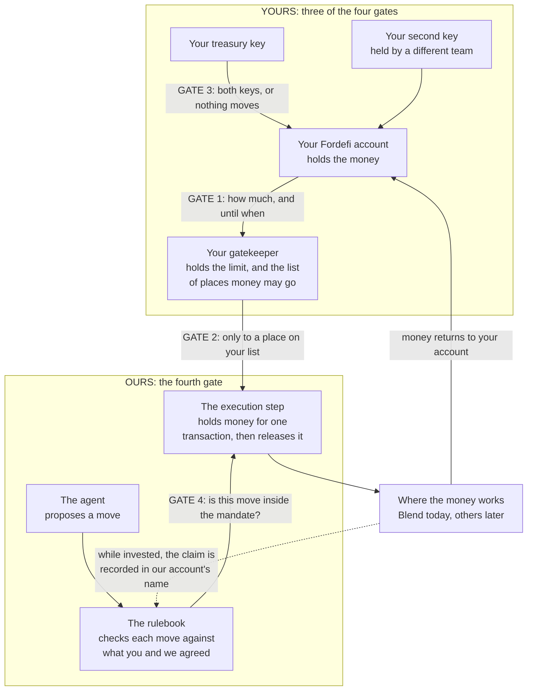

# Custody stays where it is

Prepared for Gami Capital, 21 September 2026.

Plain-language companion to [custody-preserving-execution.md](custody-preserving-execution.md),
which carries the same claims with the protocol detail behind them.

You want an agent to work your treasury. You do not want to hand your treasury
to anyone. This page explains how that works, what we have tested, and what we
have not.

## 1. What you told us

> "It is a challenge if we ask them to move custody — therefore we need to think
> how it can still work without moving funds to Prime."

> "Under what scenario, at set-up, can an MPC not itself bypass the policies on
> Prime?"

> "Agent autonomous action on reward claim. We could start with that first to
> make them comfortable before major allocation use cases."

## 2. The short answer

Your money stays in your Fordefi account.

You give that account a spending limit. The limit has an amount, an end date,
and a short list of places the money may go. Our software can spend inside that
limit. It can do nothing outside it.

You can cancel the limit at any time. Cancelling uses your keys only. We are not
asked and we cannot refuse.

So the amount at risk is a number you choose, plus whatever is invested at that
moment. The rest of the account is out of reach, including out of our reach.

## 3. The picture



Four gates stand between the agent and your money. You own three of them. Ours
is the only one we run.

## 4. Four gates, and three are yours

Every move the agent wants to make passes four checks. You own three. We cannot
turn any of those three off.

**Gate 1 is yours: how much, and until when.** You give your account a spending
limit. It has an amount and an end date. Nothing can spend more than the amount.
When the date passes, everything stops until you set a new limit. Setting it
needs both your keys.

**Gate 2 is yours: where the money may go.** Your gatekeeper is a small contract
that you deploy and you own. It holds the limit. It also holds the list of places
money may go. It has no admin and no settings, so nobody can edit that list. To
change the list you deploy a new gatekeeper and set the limit again, and that
needs your two keys.

**Gate 3 is yours: who can change any of this.** Your account is set so that one
key alone moves nothing. Your treasury key is half the weight needed. Your second
key is the other half. Section 5 shows what someone could do with your treasury
key on its own.

**Gate 4 is ours: is this move inside the mandate.** Before any money moves, our
rulebook reads the proposed move. It checks the move against the mandate you and
we agreed: how much per move, which venue, which direction, and where the money
must return. This is the only gate we run.

> Our gate can refuse a move that your three gates would have allowed. It can
> never allow a move that your gates would refuse. Adding us makes fewer things
> possible with your money, never more.

## 5. Real examples

These use the real numbers from our test run: a limit of 20,000,000, moves of
2,000,000 into a lending pool, and a mandate ceiling of 3,000,000.

| Someone tries to | Stopped by | What happens | Proven |
|---|---|---|---|
| Spend 25,000,000 when your limit is 20,000,000 | Gate 1, yours | The limit is a hard ceiling. The money does not leave. | Our tests |
| Keep trading after the limit's end date | Gate 1, yours | Everything stops until you set a new limit. | By design |
| Send money to an address that is not on your list | Gate 2, yours | Your gatekeeper refuses. The money stays where it is. | Our tests |
| Set a new limit using your treasury key alone | Gate 3, yours | Refused. One key is half the weight needed. | Live network |
| Weaken the account settings so one key is enough | Gate 3, yours | Refused. Every other refusal depends on this one. | Live network |
| Close the account and take the whole balance | Gate 3, yours | Refused. | Live network |
| Put 3,000,000 into the pool when the ceiling is 3,000,000 | Gate 4, ours | Refused. The ceiling is the first amount refused, not the last amount allowed. | Live network |
| Withdraw the position to an address that is not yours | Gate 4, ours | Refused. We aimed one at a funded stranger to check. | Live network |
| Take 2,000,000 from you and put one unit less to work | Gate 4, ours | Refused. The amount taken and the amount invested must match exactly. | Live network |
| Add an extra step to the batch that nobody declared | Gate 4, ours | The whole batch reverses. No part of it happens. | Live network |

You can run every row in this table yourself:

```
bun scripts/prime.ts demo setup     # once
bun scripts/prime.ts demo run all   # each gate, each scenario
```

It prints the on-chain state before each attempt and names which layer refused.
`--dry-run` shows what a step would do without touching the network, and
`prime gate info` / `prime accounts info` show what each gate is holding.

**Live network** means we ran it against Stellar's test network and read the
network's own answer. **Our tests** means the contract's test suite covers it,
and we have not driven it over the network. **By design** means this is how the
mechanism works, and we have not built a separate test for it.

## 6. How one move happens

1. You set the spending limit and deploy your gatekeeper. Both need your two
   keys. You do this once. *(Gates 1, 2 and 3.)*
2. The agent proposes a move: put 2,000,000 into the pool.
3. Our rulebook reads the move and checks it against the mandate. If the amount,
   the venue or the destination is wrong, it refuses and no money moves.
   *(Gate 4.)*
4. If the move passes, your gatekeeper releases the money. Never more than your
   limit, and only to the place on your list. *(Gates 1 and 2.)*
5. The money is put to work. When it is withdrawn, it returns to your account.

Steps 2 to 5 happen inside one transaction. If any part fails, every part
reverses and the money is back where it started. There is no state where half the
move has happened.

## 7. What we ran

A full round trip through a real lending pool on Stellar's test network. Money
left custody, arrived as a real position, and came back. This was not a
simulation, and the pool was not one of ours.

| | |
|---|---|
| Put into the pool | 2,000,000 |
| Returned to your account | 2,000,000 |
| Spending limit used | exactly that amount, no more |
| Spending limit held by us | none |
| Withdrawal aimed elsewhere | refused |
| Checks run, all passing | 29 of 29 |

We checked every refusal for the reason it was refused, not only that it failed.
A test that fails for an unrelated reason proves nothing. Three of ours did
exactly that before we caught them.

## 8. Where we would start

With reward claiming, as you suggested. A claim is small, it repeats often, and
it stays inside tight bounds. That makes it a calm way to watch the controls work
on real money before anything larger is delegated. It should also open and close
inside a single transaction, so nothing stays invested in between. We have not
built claiming yet, so that last part is our intent and not something we have run.

Before any of it, four things need to happen:

- You set your account thresholds.
- You deploy your gatekeeper, with the destination on it.
- You set a first limit, small enough that losing it would not matter.
- We agree what the agent may do.

The first three are yours alone. None of the four moves custody.

## 9. What this is not, yet

**Test network only.** Everything above ran against a live pool, but on Stellar's
test network. Nothing is deployed for real money. We would not ask you to be
first without that step.

**No outside audit.** Our contracts carry 177 of our own tests and internal
review. That is not an outside audit and we will not call it one.

**One venue proven.** The lending pool is tested from end to end. The swap path is
built, and it has not been run against a live venue.

**While money is invested, the claim sits in our account's name.** A pool credits
whoever authorised the deposit. Making that your Fordefi account would need both
your keys on every single action. That is the problem this design exists to
solve. Our rulebook fixes the way out to your account, and we tested that by
aiming a withdrawal at a funded stranger. It was refused.

## 10. Questions you may ask

**Do we have to move our money to you?**
No. It stays in your Fordefi account the whole time. No step in this design
begins by transferring your treasury.

**Can you move our money?**
Only inside the limit you set, and only to the place you listed. We hold none of
your keys and we hold no limit of our own. Outside that limit we have the same
access to your account as a stranger.

**Does our money ever touch your systems?**
Yes, for the length of one transaction. It passes through our execution step on
the way to the venue, and it cannot stop there. If the rest of that transaction
fails, the whole thing reverses and the money is back in your account. Between
transactions we hold nothing.

**How do we stop it?**
Cancel the spending limit. That is a transaction from your own account using your
own two keys. We are not asked and we cannot refuse. The limit also ends on its
own date, so doing nothing stops it too.

**What is the worst case?**
The limit you set, plus whatever is invested at that moment. That is the number
to think hard about when you size the first limit, and it is why we suggest
starting small.

**What happens to an open position if you disappear?**
Money sitting in your account is untouched, and the limit simply ends on its date.
Money invested in a pool has to be withdrawn through our software. So we recommend
pointing the recovery key at a multi-signature account you control, which lets you
bring positions home without us. We have read this in the underlying code and we
have not yet run it on the network.

**Where does our own Fordefi policy engine fit?**
At Gate 1. Setting the limit is an ordinary transaction from your own account, so
your existing approval rules see it and apply to it. Our rulebook only sees what
happens afterwards, inside batches your engine cannot look into. Neither is asked
to do the other's job.

One question we need to put to you: can your policy engine read the *amount*
inside a contract call, or only the token being approved? If it reads only the
token, then Gate 1 is approved on your side without being sized, and the limit
figure carries the whole weight.

**Has any of this been audited?**
Not by an outside firm. This is the honest gap. We would close it before real
money, alongside a first deployment at a small limit.

**What do you need from us?**
Three answers. Can your Fordefi setup hold a second key the way section 4
describes? Who on your side holds that second key? And is reward claiming the
right first mandate, or is there something smaller?

## Next step

If the answers hold up, the next step is a deployment for real money with one
mandate and a first limit small enough that losing it would not matter. Everything
widens from there by agreement, and never by default.

Every contract, every transaction and every test named here is on Stellar's test
network, and anyone you ask can inspect them.
