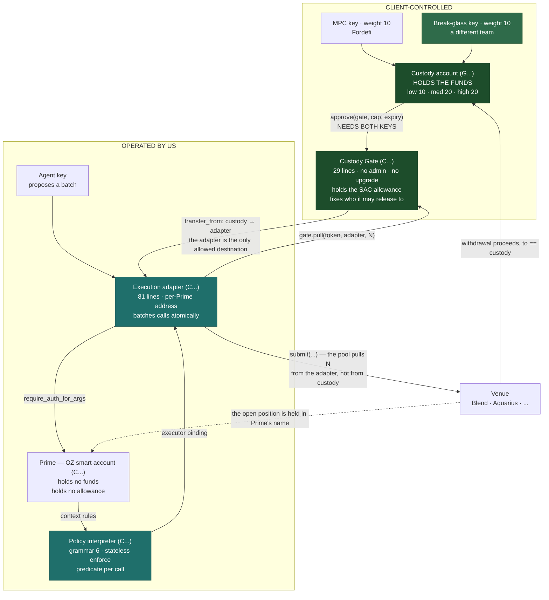
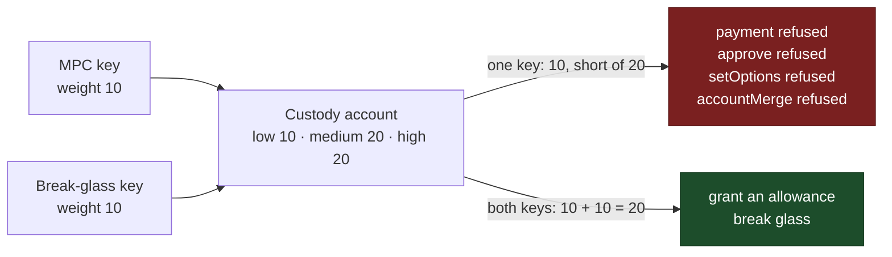
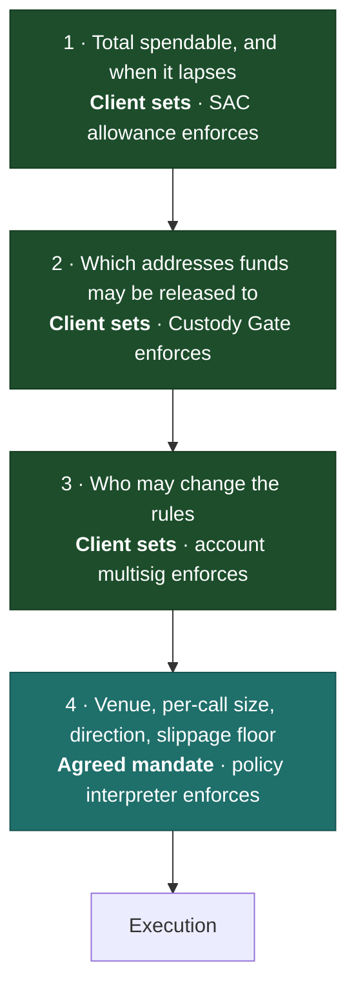
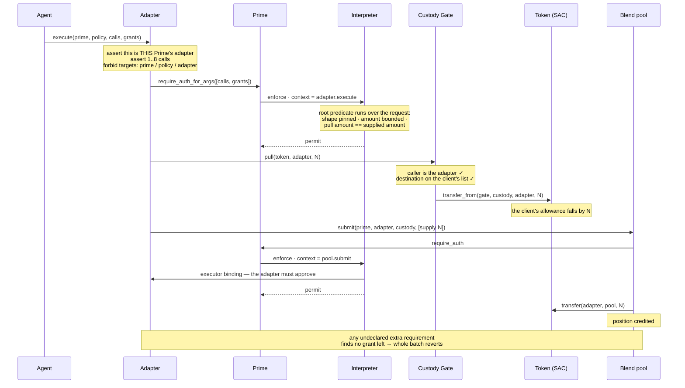

# Custody-preserving execution

Architecture proposal — 2026-09-21

For a non-technical reader, [custody-explained.md](custody-explained.md) makes the
same claims in plain language.

An institutional asset manager wants an agent to act on their treasury without
handing that treasury to anyone. This describes how Prime does that on Stellar,
what enforces each bound, and which parts have been run against the network.

Every claim below is labelled as one of three kinds:

| | |
|---|---|
| **Verified** | Ran against Stellar testnet or the contract test suites. Transaction outcomes and error codes are quoted as the network returned them. |
| **From source** | Read from a protocol specification or from contract source, not executed. |
| **Proposed** | Design intent. Not built. |

---

## 1. The problem

Three constraints, in the words they were raised in.

**1.1 Custody cannot move.** *"It is a challenge if we ask them to move custody
— therefore we need to think how it can still work without moving funds to
Prime."* An asset manager's mandate, insurance and operating procedure are
written around assets sitting in a named custody account. A design that begins
"first, transfer the treasury into our contract" does not survive their risk
review, whatever its merits afterwards.

**1.2 The custody key must not be able to bypass the policy.** *"Under what
scenario, at set-up, can an MPC not itself bypass the policies on Prime?"* If the
MPC key can move funds unilaterally, the policy engine only describes what the
agent may propose, not what may happen.

**1.3 Start where the stakes are smallest.** *"Agent autonomous action on reward
claim, risk management is a value add. We could start with that first to make
them comfortable before major allocation use cases."*

There is a fourth, not addressed here: acting on external risk signals
(Hypernative, Blockaid) through one interface. It fits this architecture but
nothing is built for it. See §9.

### 1.1a Why the obvious answer is not available

The natural shape is to make the policy contract a co-signer on the custody
account: give the MPC key weight 10, the contract weight 10, and require 20 to
move funds. The contract cannot be socially engineered, so the network itself
would refuse anything the policy declined.

**That is CAP-72, "Contract signers for Stellar accounts", and it is a Draft
with no protocol version.** *(From source — the CAP's own header.)* Mainnet runs
Protocol 28. Its prerequisite CAP-71 did ship (Final, Protocol 27) but covers
only contract accounts, not classic `G` accounts.

A classic Stellar account accepts exactly four signer kinds — an ed25519 key,
a pre-authorised transaction hash, a hash preimage, and a signed payload. There
is no contract signer among them. *(From source, and the same enumeration
appears in our own multisig code.)*

One correction to carry for when CAP-72 does land: delegated signers add weight
only to `SorobanAuthorizationEntry` and are *"ignored during the transaction
signature verification"*. A classic payment would therefore never reach the
policy contract — it would be **frozen** by insufficient weight, not policed.

So the architecture below reaches the same three outcomes by a different route,
available today.

---

## 2. Design principles

1. **The custody account holds the cash, and a position leaves it only as a
   claim Prime cannot redirect.** The principal passes through the adapter
   inside one atomic transaction. While a venue position is open, the claim on
   it is recorded against Prime, and the policy pins every exit to the custody
   account.
2. **Every bound the client cares about is enforced by something the client
   owns.** Our policy contract only narrows what is already permitted.
3. **The worst case is a number the client chose.** If everything we operate
   failed at once, the loss is capped by the spending limit they granted plus
   any position still open, and reachable only at destinations they listed.
4. **Fail closed, and fail for a legible reason.** A refusal should name which
   rule refused, not merely that something went wrong.

### Non-goals

- Custody. We never hold client assets.
- Being the only enforcement point. Two independent engines is the design, not
  a transitional state.
- Replacing the client's existing MPC policy engine. It keeps its job; see §5.1.

---

## 3. Components



### 3.1 Custody account

An ordinary Stellar account the client already operates. It holds the assets
throughout. Its thresholds are configured once at set-up (§4).

### 3.2 Custody Gate — the client's contract

Twenty-nine lines. It holds the SAC allowance the custody account grants, so
**Prime holds none**, and it answers one question: may funds go to this address?

```rust
pub fn pull(e: Env, token: Address, to: Address, amount: i128) {
    let c: Cfg = e.storage().instance().get(&CFG).unwrap();
    c.caller.require_auth();                          // only the adapter may ask
    assert!(c.allowed.contains(&to), "destination");  // the client's list
    token::Client::new(&e, &token).transfer_from(
        &e.current_contract_address(), &c.custody, &to, &amount);
}
```

The allow-list holds the address the gate may hand funds to, which is the
adapter: a pool takes payment from whoever authorises the deposit, so that is
the only destination a supply needs. The **venue** is pinned by the policy
(§6), not here. This bound exists so funds cannot be released to an address
outside the agreed set at all.

There is deliberately no setter, no admin and no upgrade path. To change the
destination list you deploy another gate and re-approve — and re-approving is
the custody signing ceremony anyway, so the change and its authorisation are the
same act.

The gate does not bound the amount a third time: the allowance bounds it and the
agreed mandate bounds it, and a third number in a third place would drift out of
step with both.

### 3.3 Prime — the OZ smart account

Holds no funds and no allowance. A batch runs only if Prime authorises it, and
Prime's authorisation is resolved against installed context rules.

### 3.4 Execution adapter

Soroban permits one host-function invocation per transaction, so a contract is
required to make several calls atomically. The adapter does that and nothing
else: 81 lines of code, no storage, deployed at an address derived from Prime
and a salt baked into its own code.

Authorization grants are passed to it **as data**. It therefore knows neither
what enforces the rules nor what that entrypoint is called, and it authorises
exactly the grants it was handed — so a call that quietly raises an extra
requirement finds no grant left and the batch reverts.

### 3.5 Policy interpreter — grammar 6

A single predicate evaluator: every policy is declarative data fed into it, so a
new mandate is new data, not new code to review. `enforce` keeps no counters and
reads no clock, so whole classes of failure do not arise.

Grammar 6 adds one leaf, `call_path`, which walks into the authorised call's
arguments: each step is a vector index, a map key, or a terminal length. That is
what lets a predicate constrain a *batch* — including a relation between two
calls — instead of requiring the adapter to flatten the request first.

---

## 4. Why the custody key cannot bypass the policy

### 4.1 The threshold configuration



`low` stays at 10 so the account remains usable as a transaction source and can
manage its own trustlines. Everything that moves value sits at medium or high.

### 4.2 The Soroban route is closed by the same threshold

Soroban could be a side door: could the MPC key grant itself a fresh allowance
through a contract call and walk out?

It cannot, and the reason is in the protocol. **CAP-46-11, the Soroban
Authorization Framework** (Final, Protocol 20) specifies that when a classic
account authorises a contract invocation through `SOROBAN_CREDENTIALS_ADDRESS`,
*"Medium signature threshold has to be reached."* The signature structure it
prescribes is a vector of `AccountEd25519Signature` sorted by public key — the
classic multisig set, carried into the contract world intact.

So medium threshold closes **both** rails at once.

### 4.3 Verified

Four escape routes, each attempted on live testnet with the MPC key alone:

| Attempt | Threshold class | Network response |
|---|---|---|
| `payment` out | medium (20) | `txFailed` / `opBadAuth` |
| Soroban `approve` — grant a new allowance | medium (20) | `Error(Auth, InvalidAction)`, host diagnostic `"signature weight is lower than threshold", 10, 20` |
| `setOptions` to lower the threshold | high (20) | `txFailed` / `opBadAuth` |
| `accountMerge` — take the account away whole | high (20) | `txFailed` / `opBadAuth` |

And the counterpart: the same `payment` and the same `approve` **succeed** when
both keys sign. A configuration that refused everything would pass the four rows
above and be useless.

*(Verified — 7 of 7. The Soroban refusal was submitted to the network, not left
at simulation, because simulation and consensus are not the same claim. The
`setOptions` row is the load-bearing one: if one key could lower the thresholds,
every other refusal here would be decorative.)*

The classic failures come back as `txFailed` with an operation result of
`opBadAuth`, not top-level `txBadAuth`. The transaction is valid — `low` is met,
so the account can source it — and the *operation* is what fails. That is the
intended behaviour: the account stays usable, only value movement is locked.

### 4.4 What the break-glass key is for

Without a second weight-10 signer nothing ever reaches 20 and the account is
permanently frozen: if the allowance lapses, the funds are unreachable. So a
second key must exist.

**Proposed:** it is held by the client, by a different team from the one running
treasury day to day, and it never signs a routine transaction. Its two jobs are
renewing the spending limit and breaking glass. Renewal is then a deliberate
two-person act, and we hold no key at all.

If the client would rather we held it, the design still works but the honest
description changes from "you control the exit" to "dual control with your
operator".

---

## 5. The four bounds



Three of four are set and enforced on the client's side. Our interpreter only
narrows what the client's own controls already allow — it can refuse a call the
client would have permitted, it can never permit one the client would not.

**The allowance is the real exposure and should be sized as such.** Institutions
already reason about this shape: a credit line has a limit, a utilisation, an
expiry and a revocation, and so does this.

### 5.1 Two policy engines, one boundary each

The client's MPC provider already runs a transaction policy engine, and this
architecture does not ask it to stand down. The two engines divide by what each
can actually read:

| Boundary | Engine | Why it belongs there |
|---|---|---|
| `approve(gate, cap, expiry)` — the grant itself | **The client's MPC policy engine** | An ordinary, decodable contract call originating in their own account. Their amount, allowlist and approver rules apply to it exactly as they do today. |
| Everything spent under that grant | **Our policy interpreter** | Happens under Prime's authority, inside a batch their engine has no view into. |

Neither can be the sole enforcement point. Their engine cannot see inside a
Soroban batch; we cannot police their account.

One question decides how strong their half is, and it is for them to answer:
**does their policy engine enforce amount conditions on an `i128` inside a
contract call's arguments, or only allowlist the token?** If only the latter,
their engine permits the grant without policing its size, and the allowance
figure carries the whole weight. *(Open — see §11.)*

---

## 6. Execution flow

A Blend supply. The gate holds the allowance, the pool raises a requirement that
needs a grant, the pool draws from the adapter so that transfer travels as an
executor authorization, and the amount is tied across the two calls.



### 6.1 Exhaustiveness

The adapter authorises exactly the grants it was given. A venue that tries to
raise an additional Prime requirement mid-batch finds none left, and because the
grant list is committed by the same signature that commits the calls, it cannot
be extended after the agent signed. The root predicate pins the count.

*(Verified — a batch carrying one extra grant is refused `#100`; a batch whose
grant list is short cannot run at all.)*

---

## 7. What has been verified

Four suites run against Stellar testnet, **29 checks**, all passing on the run
recorded here. Each deploys fresh keys and contracts, so a pass is not carried
over from a previous run.

| Suite | Checks | What it settles |
|---|---|---|
| `verify-invoker-auth-testnet.ts` | 3 | A contract can spend an allowance as itself, and can gate on its direct caller — the two mechanics the gate rests on |
| `verify-mpc-threshold-testnet.ts` | 7 | Every route out of the custody account, refused with one key and permitted with two |
| `e2e-grammar6-testnet.ts` | 14 | The whole flow against the live Blend pool, including the refusals |
| `grants-v1-blend-testnet.ts` (SDK) | 5 | The same flow driven by the shipped SDK builders and the pinned manifest |

Alongside them, **375 local tests**: 151 interpreter, 22 adapter, 4 gate, 198
SDK.

### 7.1 End to end, live testnet, against the public Blend pool

Pool `CCEBVDYM32YNYCVNRXQKDFFPISJJCV557CDZEIRBEE4NCV4KHPQ44HGF`.

| Check | Result |
|---|---|
| Interpreter reports grammar 6 | `grammar_version() = 6` |
| Prime holds no allowance, before and after | `0` |
| Blend supply executes, spends exactly N | allowance `20,000,000 → 18,000,000` |
| The supply is a real position, held in Prime's name | `get_positions(prime).supply` non-zero — 959,272 shares on this run |
| A withdrawal aimed at any address but custody | refused `#100` — attempted against a funded account the pool would have paid |
| Withdrawal returns funds to custody | custody `+2,000,000` — exactly what was supplied |
| Draw N, commit less than N | refused `#100 ArgMismatch` |
| Amount at the agreed ceiling | refused `#100` |
| An extra, uncounted grant | refused `#100` |
| A short grant list | cannot run |
| A batch of nine calls | refused by the adapter |
| A rule whose expiry is already past | refused at install |
| A predicate path deeper than the cap | refused at install `#201` |

**14 of 14.** Each refusal was checked for its *code*, not merely for failure.
Three separate checks in this work passed for the wrong reason before being
corrected, the last of them an at-cap case the token contract was refusing for
want of allowance before the policy ever ran.

The share figure moves between runs — 959,846, then 959,748, then 959,636, then
959,272 — because Blend's exchange rate does. The number that must hold exactly is the
**withdrawal**, and it does.

### 7.2 Through the SDK's own builders

Five further checks drive the same flow through `prime-ts-sdk` against the pinned
manifest, not a freshly deployed interpreter, so a wrong pin fails in testing.
**5 of 5.** This is how the salt-domain mismatch in §8.2 was found — the
hand-written test script had been deploying at the old salt all along and never
touched the mismatch.

### 7.3 Cost

| Predicate size | Bytes | Instructions |
|---|---|---|
| A two-call Blend supply | — | 14.6 M |
| The matching withdrawal | — | 10.4 M |
| 10 comparisons | 1,864 | 14.3 M |
| 45 comparisons | 6,624 | 28.4 M |
| 95 comparisons (~200 leaves, the cap) | 13,424 | 48.5 M |

Against a 100 M ceiling, a maximum-size predicate spends about half. Roughly
400 K instructions per six-step comparison. The existing leaf cap is calibrated
for this; doubling it would not fit.

---

## 8. Deployment and migration

### 8.1 Coexistence, not replacement

The adapter address derives from Prime plus a salt. A Prime that already
activated the previous adapter has a contract at that address, and a different
code hash cannot take its place. So this version claims a **second** address
per Prime, and accounts on the previous version keep working untouched. The SDK
carries both as explicitly-selected manifests (`stateless-v1`, `grants-v1`); the
app pins both side by side.

### 8.2 The salt domain belongs to the code

The salt string is hashed *inside* the adapter, and its first assert compares
its own running address against that hash. Moving the manifest to a new salt
while the contract still hashed the old one produced an adapter that refused
every call with an identity assert — a fault invisible until something is
actually deployed at that address.

*(Verified, the hard way. A test now derives both addresses and requires them to
differ, and the constant carries a comment saying the domain moves with the
ABI.)*

### 8.3 Current state

| | |
|---|---|
| Testnet interpreter | `CDPR5VTX6R2ZPKREPD7FBW5ANVWXMVJIBIH2GMF36XPOFNMHRDIRUAZQ` |
| Adapter code hash | `75781757…` · 11,029 bytes |
| Gate code hash | `c7c9238c…` · 6,605 bytes |
| Adapter salt domain | `prime.execution.adapter.v2` |
| Mainnet | **nothing deployed** |

The deployment script reads `grammar_version()` back off the chain and compares
the on-chain code hash against the artifact before recording anything, so the
record cannot claim a deployment it did not make.

---

## 9. Limitations

**9.1 Testnet only.** A mainnet deployment and a deliberately small first limit
are the next step.

**9.2 No external audit.** The contracts are covered by 177 contract tests and
internal review. That is not an audit and will not be described as one.

**9.3 Blend is proven on chain; Aquarius is not.** The swap path exists and is
covered by local tests, but has not been run against the live venue. Its shape
differs — proceeds land on Prime and must be swept back — so it needs its own
verification.

**9.4 The exposure is the spending limit plus any open position.** Autonomy
requires standing authority; that is what the allowance *is*. It can be bounded
in amount, time and destination. Eliminating it means a human signature per
action, and that is not autonomy.

While a venue position is open, the claim on it is recorded against Prime rather
than the custody account, because a pool credits the address that authorises the
deposit and `from = custody` would demand both custody keys on every action —
the same CAP-46-11 threshold as §4.2. The policy pins the exit to custody, and a
withdrawal aimed anywhere else is refused `#100` *(Verified)*. What stands behind
that pin is rule 0, so §9.7 is the control that matters most here, not a separate
concern. Positions closed within the batch that opens them — the reward claiming
in §10 step 1 — never raise this at all. *(Proposed: nothing is built for
claiming yet.)*

**9.5 A predicate can be written that constrains nothing.** Grammar 6 resolves
both sides of a comparison, and that is what makes a cross-call relation
expressible. The same change lets a predicate compare a selector with itself,
vacuously true and installing cleanly. A test pins that self-comparison case, so
it cannot regress unnoticed. Mitigation is review of installed mandates, not a
contract change.

**9.6 External risk signals are not built.** Hypernative and Blockaid fit this
shape — a signal becomes a proposal, and the policy that bounds an entry bounds
an exit — but no integration exists. *(Proposed.)*

**9.7 The recovery rule.** An OZ smart account's rule 0 carries unpoliced,
permanent authority and its signer is fixed when the account is activated.
Whoever holds it can install any rule, and the app's guards against that are
client-side only. **Recommended:** point rule 0 at a classic multisig `G`
account so break-glass authority is M-of-N. This is also what bounds the open
position in §9.4.
*(From source — OZ delegated signers verify through `require_auth_for_args`, so
the target account's own thresholds apply. Not yet run on testnet.)*

---

## 10. Proposed rollout


Before step 1: set the account thresholds, deploy the gate with the destination
list, grant a first limit small enough to be uninteresting, and agree the
mandate. Each of those is a client action; none of them transfers custody.

---

## 11. Open questions for the client

1. Does the threshold arrangement in §4 fit how the MPC provider is configured
   on their side — specifically, can it hold a weight-10 signer on an account
   whose medium threshold is 20?
2. Who holds the break-glass key (§4.4)? What we can honestly claim depends on
   it.
3. Is reward claiming the right first mandate, or is there a smaller one?
4. What destination set should the gate carry at launch — venue contracts only,
   or does an operational address belong on it?
5. Does the MPC policy engine enforce amount conditions on an `i128` *inside* a
   contract call's arguments, or does it only allowlist the token being
   approved? This decides whether the grant is policed on their side or merely
   permitted (§5.1), and therefore how conservatively the first limit should be
   sized.

---

## Sources

Protocol claims are from the CAP texts: CAP-46-11 (Soroban Authorization
Framework, Final, Protocol 20), CAP-71 (Final, Protocol 27), CAP-72 (Draft).
Network state read from `getNetwork` on Stellar mainnet, Protocol 28.
Contract claims are from source at `contracts/` in this repository.
Testnet results are reproducible with `scripts/e2e-grammar6-testnet.ts`,
`scripts/verify-mpc-threshold-testnet.ts` and
`scripts/verify-invoker-auth-testnet.ts`; each run deploys fresh keys and
contracts.
