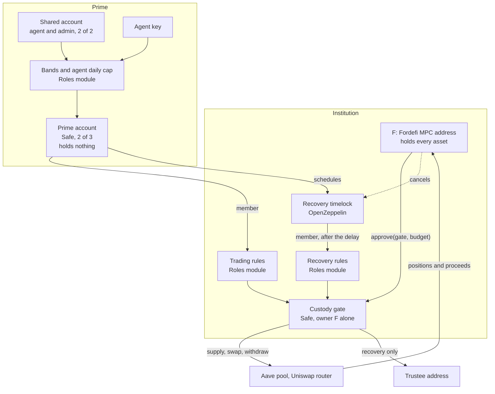
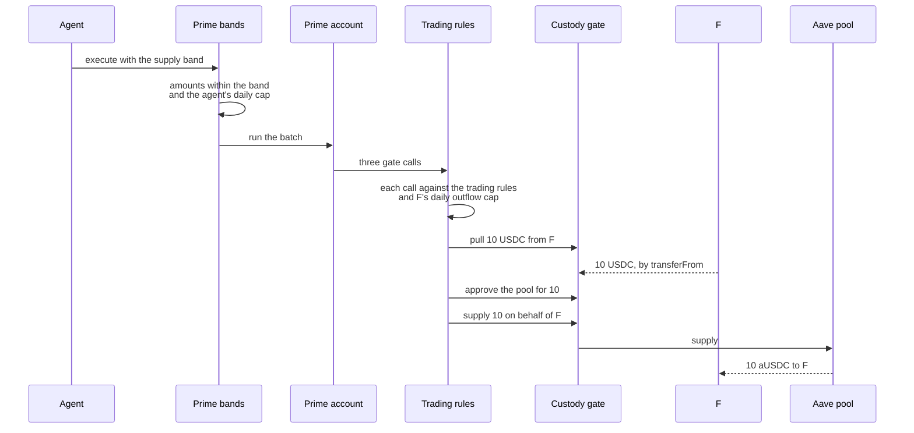

# Prime on EVM: technical detail

This is the EVM half of [architecture.md](architecture.md), which covers the
use case and the three-step setup in plain terms. It describes the design
tested on Base Sepolia on 29 September 2026. There are no contracts of ours on
EVM: every contract is an unmodified deployment of audited code, and this
repository holds no EVM source.

## The use case and the setup

An institution keeps its treasury at a Fordefi MPC address, **F**, and wants an
agent to swap and lend part of it without moving custody. The two guarantees,
and what keeps each on EVM:

- **The MPC wallet always controls the funds.** Every asset, including a
  lending position, stays at F. F approves one contract, the custody gate, for
  a fixed budget. Only F can change the gate or stop it. EVM cannot put signing
  weights on an address, so the rule that F's signers must all approve lives in
  F's Fordefi policy.
- **Only the custody gate's listed destinations can receive funds.** The gate's
  rules let a move reach the Aave pool, the Uniswap router or F itself, and
  recovery reach one trustee address. Every other destination is refused by the
  chain.

| | |
|---|---|
| F | The institution's Fordefi address. Holds every asset. Its signers (the MPC key, a second signer and a trusted third party) are required approvers in its Fordefi policy, with Prime's automated co-signer. |
| Custody gate | A Safe 1.4.1 whose only owner is F, threshold 1, with no fallback handler and no guard. The only contract F approves, and the contract that carries out every move. |
| Trading rules | A Zodiac Roles v2.1.1 module on the gate. Its one member is the Prime account. |
| Recovery rules | A second Roles v2.1.1 module on the gate. Its one member is the recovery timelock. |
| Recovery timelock | OpenZeppelin TimelockController 5.6.0. The Prime proposes, F and the Prime can cancel, anyone executes after the delay. |
| Prime account | A Safe with 3 owners, 2 of whom approve, and a Roles module holding the agent's bands. Holds nothing. |
| Shared account | A Safe with 2 owners (the agent and an admin), both of whom approve. The member of the high bands. |
| Agent | A member of the Prime's low bands. |

## Components

### F and its Fordefi policy

F signs no message in this design, so its Fordefi policy can block every typed
and personal message outright. That matters because a signed message from F
can move funds with no transaction at all: tested on Base Sepolia, an EIP-2612
`permit` on USDC and on aUSDC let a stranger pull F's tokens, and Base mainnet
USDC also accepts EIP-3009 signed transfers. The intended policy:

1. Block every EIP-712 typed message and personal message.
2. Allow the gate configuration and the `approve(gate, budget)` transactions
   only when Prime's co-signer (a Fordefi API-user approver) has rebuilt them
   from the agreed inputs (F, the Prime's owners, the trustee, the salt and the
   budgets) and they match byte for byte.
3. Require F's signers and Prime's co-signer for everything else.
4. Block by default.
5. Put the trusted third party in a required group of Fordefi's admin quorum,
   and in the access list of the key backup escrow (CoinCover or Station70).

### Custody gate and its rules

The gate is a Safe with F as its only owner, so only F can change its modules
or rules. It has no fallback handler, so it answers no EIP-1271 signature
check. The trading rules let the Prime make the gate do exactly this:

- pull USDC or aUSDC **from F into the gate**, counted against F's daily
  outflow cap;
- approve USDC only to the Aave pool or the Uniswap router;
- `supply(USDC, …, onBehalfOf F)` and `withdraw(USDC, …, to F)`;
- swap USDC for WETH with **recipient F** and a minimum output above zero;
- send anything left in the gate **to F**.

The recovery rules let the timelock make the gate pull F's USDC, aUSDC or
WETH, or send anything held in the gate, **to the trustee address** and nowhere
else.

F's ERC-20 approvals to the gate are the gate's lifetime budget: every move and
every recovery spends them down. WETH is approved for recovery only; no trading
rule touches it. There is no Permit2 approval anywhere, so no Permit2 signature
can move F's funds.

### Prime account and the bands

The Prime account's Roles module holds six bands: swap, supply and withdraw,
each in a low range (under 100 per move, the agent alone, 50 per day across all
of the agent's moves) and a high range (100 and up, the shared account, so the
admin co-signs). A band pins every gate call it may make, the amounts, the
trading role key and `shouldRevert = true`, so a failing step reverts the whole
batch. The Prime can use only the trading rules. It cannot reach the recovery
rules except through the timelock.

## Setting it up

Five transactions. F signs no message in any of them.

| # | Sent by | What |
|---|---|---|
| T1 | anyone | One transaction creates the Prime account, the shared account and a bare gate owned by F, then runs the Prime's configuration (its Roles module, the MultiSend unwrapper, the agent's daily cap and the six bands), pre-signed by 2 of the Prime's 3 owners. |
| T2 | F | Configures the gate: the trading rules, the daily outflow cap, the timelock and the recovery rules. The timelock gives F the canceller role, then F gives up the admin role. New contracts are deployed through Safe 1.4.1's CreateCall library. Safe accepts F as the sender, so no signature is needed. |
| T3 to T5 | F | `approve(gate, budget)` for USDC, aUSDC and WETH. |

A Safe cannot enable its own module from its creation data, because the
module's address depends on the Safe's address, which depends on that data.
The only way around it is an unaudited helper contract. So T1 creates the gate
bare and F configures it in T2. The gate's address commits to "owner F alone",
so only F can ever configure it.

## One move

The agent supplies 10 USDC. One transaction:

On Base Sepolia this cost 1.08M gas. F gained 10 aUSDC less one unit of Aave
rounding, and the gate and the Prime account held nothing afterwards.

## Recovery

If F's signers lose access, the Prime's owners schedule a recovery on the
timelock with 2 of 3 signatures. Nothing moves when it is scheduled. After the
delay (60 seconds on testnet, for example 48 hours in production) anyone can
execute it. The timelock then calls the recovery rules, and the gate pays F's
funds to the trustee address.

F can cancel a scheduled recovery at any time during the delay, in one
transaction. Changing the timelock's own delay or roles also goes through the
delay, so F can cancel that too. The Prime cannot shorten the delay directly.

## Stopping it

| Action | Who | How |
|---|---|---|
| Kill switch | F | Turns off the trading rules module. Trading stops; recovery still works. |
| Full stop | F | Turns off both modules. Trading and recovery stop. |
| Resume | F | Turns both modules back on and cancels anything scheduled in the meantime, in one transaction. |
| Change the budget | F | `approve(0)` first, then the new amount, so the spender cannot use both. |

Each is one transaction from F and signs no message. Which of them F may send
without the trusted third party is a decision for the institution's Fordefi
policy. If F alone may cancel a recovery, F alone can also block one.

## What was tested

On Base Sepolia, against the real Aave v3 pool, Uniswap v3 router, Safe,
Roles and OpenZeppelin contracts. Each refusal was checked by simulation at
the latest state, for the contract's own error.

| Area | Result |
|---|---|
| State read back from chain | 43 of 43 checks when the stack was first deployed, and 20 of 20 after its recovery was moved to the timelock: owners, thresholds, modules, no guards, no fallback handler on the gate, each Roles module and the timelock owned and wired as designed, the timelock's code identical to OpenZeppelin's build, no Permit2 approval |
| Moves | Agent supply 10, swap 10 and withdraw 5, and a shared-account supply of 150, all landed at F. The gate and the Prime account held nothing after each. |
| Caps | The agent's daily cap refused a move over it and allowed a smaller twin. F's daily outflow cap refused a pull over it, even from the Prime. |
| Refused | 48 attempts: a pull to the Prime or a stranger; another holder's funds; an approval, supply, withdrawal or swap paying a stranger; a swap with no minimum; WETH through trading; a delegatecall; changing the gate's owners, modules or rules; shortening the delay; skipping the timelock; scheduling or cancelling by anyone but the Prime and F; one Prime owner alone; a batch with `shouldRevert = false` |
| Recovery | Executed after the delay by a third party; a cancelled recovery never ran; with trading switched off, recovery still moved all of F's WETH; during a full stop it could not run, and resuming cancelled it |

Testnet addresses from that run: F `0xD2b7126a24C1271c5714194C71AC1A8CDc6c7DE5`,
gate `0xAC00d5cAE9206367C4500a70d48BD0090876e4DB`, timelock
`0xf6A426D1529fd6305f643057B739d40bC1E73904`, Prime account
`0x5F2E70c757900e967D8a84C9605539ba82802ab2`.

## Contracts and their audits

| Contract | Address | Audit | Checked |
|---|---|---|---|
| Safe 1.4.1 (SafeL2, SafeProxyFactory, MultiSendCallOnly, MultiSend, CreateCall, CompatibilityFallbackHandler) | canonical Safe deployments | Core: Ackee Blockchain audited 1.4.0. 1.4.1 adds one ERC-4337 opcode fix that Safe and the auditors agreed needed no re-audit. Libraries: their own 1.4.1 audit. | canonical addresses |
| Zodiac Roles v2.1.1 | `0xF2964CE6161ce0e75964Fe7927cE114cb0B283D5` | G0 Group and Omniscia, 2023. Signature-check patch audited June 2026. | every Roles module is an ERC-1167 proxy to this address |
| Roles MultiSend unwrapper | `0x93B7fCbc63ED8a3a24B59e1C3e6649D50B7427c0` | covered by the Roles audits | verified source equals the audited commit; runtime identical on Ethereum, Base and Base Sepolia |
| OpenZeppelin TimelockController 5.6.0 | one per gate | OpenZeppelin audits for each release; Certora formal verification (2022) | runtime equals the official npm build byte for byte |
| Aave v3 pool, Uniswap v3 SwapRouter02, USDC | canonical | their own audits | canonical addresses |

Not used, and why:

- **Roles v2.1.0.** Its signature check accepts EIP-1271 revert data that
  carries the valid-signature code. A Safe member's own signature check can
  call into an attacker's contract, so this looks exploitable with our setup;
  that is read from the Safe code, not tested. v2.1.1 is the patch.
- **Zodiac Delay.** Every deployed version contains code changed after its 2021
  audit. The OpenZeppelin timelock replaces it.
- **Zodiac ModuleProxyFactory 1.2.0.** It differs from the audited v1.0.0, so
  modules are deployed through CreateCall instead.
- **The newer MultiSend unwrapper (`0xB4Cd…`).** Changed after its audit.
- **Permit2.** It added two signature routes out of F.
- **Any custom or oracle condition.** None exists as audited code.

## Limits

- **F's own key is limited only by Fordefi.** No chain can restrict a plain
  address: EIP-7702 delegation leaves the key in control, and Base's native
  account abstraction launched without key revocation. The chain guarantees that nobody
  else, the Prime, the agent or a stranger, can move F's funds except as above.
- **Swap prices are bounded, not checked.** A swap must name a minimum output
  above zero, but no audited Roles condition can compare it with a price. The
  band, the agent's daily cap, the gate's daily cap and the admin's co-signature
  on large moves limit what a bad price can cost.
- **A pull on its own parks funds in the gate.** The gate belongs to F, the only
  exits lead to F or the trustee, and the recovery rules include what sits
  there.
- **T1 can be blocked, not exploited.** If someone deploys one of the plain
  Safes first, T1 reverts and is sent again with a new salt.
- **Base's sequencer could delay F's kill switch.** F is a plain address, so it
  can force the transaction through Base's L1 portal on Ethereum, up to about
  12 hours later. Not tested.
- **The venues are trusted.** Aave, Uniswap and USDC can be upgraded by their
  own governance, and Circle can freeze USDC.
- **Safe 1.4.1 or 1.5.0.** 1.4.1 carries one post-audit fix the auditors
  waived. Safe 1.5.0 is fully audited (Ackee and Certora) if that is not
  acceptable, at the cost of re-testing everything on it.
