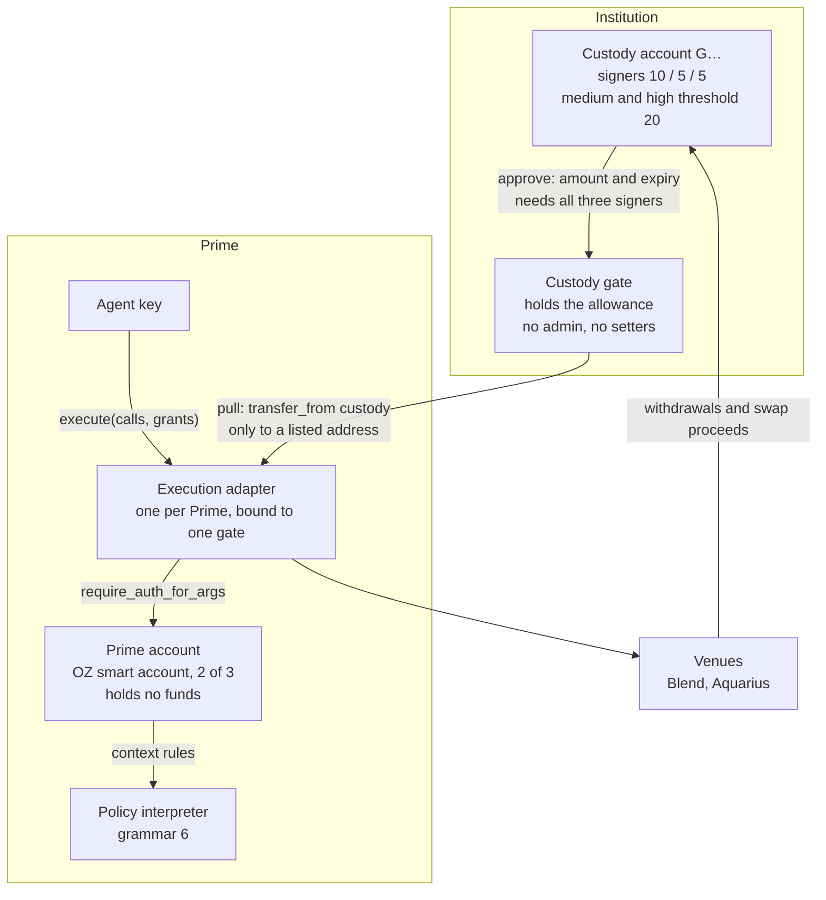
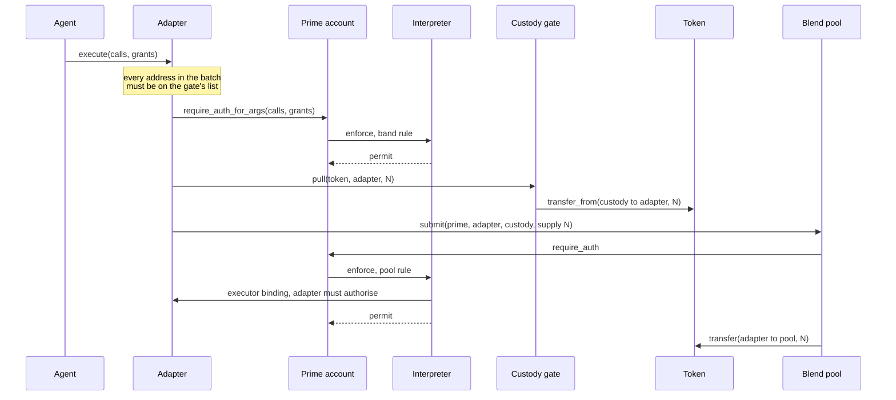

# Prime on Stellar: technical detail

This is the Stellar half of [architecture.md](architecture.md), which covers
the use case and the three-step setup in plain terms. Everything named here is
in this repository, in `contracts/`, `packages/` and `scripts/`, or in the
Prime app that drives it.

## The use case and the setup

An institution keeps its treasury in an MPC wallet and wants an agent to swap
and lend part of it without moving custody. Two guarantees make that safe, and
on Stellar each rests on something the network or our contracts enforce:

- **The MPC wallet always controls the funds.** The custody account is a
  classic Stellar account whose signing thresholds need every custody signer,
  and it only ever grants a bounded allowance.
- **Only the custody gate's listed addresses can receive funds.** The allowance
  is granted to a gate the custody account deploys itself, and the gate
  releases only to addresses on a list fixed when it was deployed.

The setup we tested, and the one the app builds:

| | |
|---|---|
| Custody account | Classic `G…` account. Signers weighted **10** (the MPC key), **5** and **5** (a second signer and a trusted third party). Medium and high thresholds **20**, so every value-moving operation needs all three. The low threshold stays low (1 in our test setup) so the account can still start a transaction. |
| Custody gate | `contracts/custody-gate-v3`, deployed by the custody account itself. Holds the allowance, answers to one caller running one build, releases only to listed addresses. |
| Prime account | An OpenZeppelin smart account with **3 signers, any 2 of which approve**. Holds no funds. |
| Execution adapter | `contracts/execution-adapter-v3`, one per Prime, bound to one gate. Runs a batch of calls in one transaction. |
| Policy interpreter | `contracts/policy-interpreter`, grammar 6. Evaluates the mandate on every call a band rule authorises. |
| Agent | A signer on the band rules, not on rule 0. Under a band's top it acts alone; a larger move uses a high-band rule that also needs a second approver. |

## Components

### Custody account

`scripts/scenario/fordefi-custody.ts` builds the test version.

Soroban does not open a side door. CAP-46-11, the Soroban Authorization
Framework, requires the medium threshold when a classic account authorises a
contract call, so granting a fresh allowance through a contract needs the same
20 as a payment. `scripts/verify-mpc-threshold-testnet.ts` checks every route
out of the account on testnet, submitted to the network and not only
simulated. With one key, `payment`, Soroban `approve`, `setOptions` and
`accountMerge` are all refused; with enough weight, the same `payment` and
`approve` succeed. That script uses weights of 10 and 10 against the same
thresholds. The 10 / 5 / 5 account was walked through the app, where two of the
three signers reach 15 of 20 and are still refused.

### Custody gate

`contracts/custody-gate-v3/src/lib.rs`, 91 lines including comments. Its
configuration is written once by the constructor:

| Field | Meaning |
|---|---|
| `custody` | Whose money. The allowance is granted from here. |
| `caller` | The one adapter that may call `pull`. |
| `caller_code` | The wasm hash that adapter must be running. A Soroban contract id commits to deployer and salt, not to code, so the gate checks the running build on every draw. |
| `allowed` | Every address a batch through that adapter may name, and every address `pull` may pay. |

`pull(token, to, amount)` requires the caller's authorisation, refuses a caller
running any other build (`WrongCallerCode`, 2), refuses a destination not on
the list (`DestinationNotAllowed`, 1), and then spends the allowance with
`transfer_from`. There is no admin, no setter and no upgrade path. Changing the
list means deploying another gate and granting a new allowance, which needs the
custody account's full threshold again.

The gate keeps no list of assets. A SAC allowance is granted per token, so a
token the custody account never approved has nothing to spend.

The Prime app's gate wizard (`apps/web/ui/octopos/onboard-gate-page.tsx`)
fills `allowed` with:

- the execution adapter;
- the Prime account;
- the custody account;
- the grammar-6 policy interpreter;
- the asset contracts;
- the venues the institution adds;
- the recovery address, if one is set.

The Prime account, the interpreter and the asset contracts are on the list
because the adapter refuses any batch that names an address the gate does not.
A Blend `submit` names the Prime, a grant names the interpreter, and a pull
names its token.

### Execution adapter

`contracts/execution-adapter-v3/src/lib.rs`. It exists because Soroban allows
one host-function invocation per transaction, so a contract has to make several
calls atomically. It has one rule: **a batch may not mention an address the
gate does not name.** Before any call runs, it checks:

- every call target;
- every argument, however deeply nested, including 32-byte and 56-byte values
  that could be read back as an address;
- every authorisation it is about to hand out as itself.

It also refuses:

- a batch that targets the Prime account itself (`PrimeTarget`, 1);
- any address outside the list (`AddressNotAllowed`, 2);
- an authorisation to deploy a contract (`Uncheckable`, 3).

Only then does it ask the Prime to authorise the whole batch and run the calls.

The adapter is deployed by the Prime at an address derived from
`sha256("prime.execution.adapter.v3" + gate)`, so the custody account can name
it on the gate before it exists. `rebind` moves it to a successor gate. Only
the current gate's custody account can call it, and it refuses a successor
that cannot answer `custody()`.

### Prime account and the mandate

The Prime account is an OpenZeppelin smart account. Its rule 0 holds the three
signers and a threshold of two. The mandate is a set of further context rules,
each scoped to the adapter and carrying a policy-interpreter predicate. The
predicate pins the shape of the batch: which calls, which venue, which
direction, amounts within the band. The venue call also carries an
authorisation naming the exact token transfer, and Soroban matches an
authorisation to its context exactly, so the amount the venue takes is fixed
too.

A band is one such rule. In the test setup, swaps and Blend supply and
withdrawal each have a low band (the agent alone, 1 approval) and a high band
(agent and admin, 2 approvals, enforced by OpenZeppelin's threshold policy).
An over-band amount named on the low rule is refused by the predicate, not
merely left waiting for a second signature.

Blend credits a supply to whoever authorises it, so a supplied position is held
in the Prime account's name. Blend's `submit` takes `(from, spender, to, …)`,
and the mandate pins `to` to the custody account, so a withdrawal can only pay
the custody account. Swap proceeds go straight to the custody account.

### Policy interpreter

`contracts/policy-interpreter`, grammar 6 (`SELF_VERSION` in
`src/version.rs`). The smart account calls `enforce` on every call a policed
rule authorises. The predicate grammar, its structural caps and the install
checks are documented in
[contracts/policy-interpreter/README.md](../contracts/policy-interpreter/README.md).
The properties the custody design leans on:

- **`enforce` changes no value.** It reads the predicate document and the
  signer-set hash that install wrote, and nothing else. A permit bumps the
  rule's storage TTL; a deny rolls that back.
- **It fails closed.** An undecodable predicate, an unknown node or a selector
  the call cannot answer all deny, with a specific deny code.
- **Grammar 6 adds `call_path`**, which walks into the batch the adapter
  submits (`calls[n].args[i]`, map keys, lengths). That is what lets one
  predicate bound a whole batch and relate two of its calls.
- **An executor binding** (`bind_executor`) makes a venue rule demand the
  adapter's own authorisation as well, so a venue call that did not come
  through the adapter is refused.

The interpreter answers one question: is this call one the policy permits? It
does not see what a transaction moved, keep rolling totals, count calls or read
a clock. Amount limits over time come from the allowance and its expiry.

## Setting it up

In the Prime app, against testnet:

| Step | Where | Signatures |
|---|---|---|
| 1. Create the Prime account | `#/onboard/stellar` | one |
| 2. Deploy the gate and grant the limit | `#/onboard/stellar/gate`, signed by the custody account | all three custody signers, for the deploy and again for each asset's allowance |
| 3. Create the execution adapter | Accounts, then Manage execution | 2 of the Prime's 3 |
| 4. Install the bands | Policies, then Custody-funded action | 2 of 3, per band. A Blend pool is first allowed and bound to the adapter. |
| 5. Run a batch | Apps, then Prime Execution | what the chosen band requires |

The custody account picks the gate's salt, which fixes the gate's address, and
the gate's address fixes the adapter's. Either side can deploy first. The
allowance can last up to 180 days, the longest a Soroban ledger entry can live
(`max_entry_ttl`, 3,110,400 ledgers). An allowance set to the largest `i128` is
treated as unlimited in amount; the expiry still applies.

## One move

A Blend supply. The gate spends the allowance, the pool draws from the adapter,
and the interpreter checks both the batch and the nested venue call.

If any step fails, the whole transaction reverts.

## Recovery

A recovery address, a `G…` wallet other than the custody account, can be added
to the gate's list when the gate is set up. The Prime account's own authority,
2 of 3, can then run one call, `pull(asset, recoveryAddress, amount)`, through
the adapter. It moves the custody account's funds to that address and nowhere
else. A band pins every destination, so an agent's rules cannot reach it.
Nothing changed in the contracts to support this; it uses the gate's existing
list.

Walked on testnet through the Prime app (commit `f39950f5`): with a fresh
10 / 5 / 5 custody account, 1,000 XLM and then 500 XLM were recovered to the
trustee wallet, each signed by two Prime signers and none of the custody
signers.

## Stopping it

The custody account sets the allowance to zero, or lets it expire. Either needs
the custody account's full threshold. Once the allowance is gone the gate has
nothing to spend, and recovery stops with it.

## What has been run

| Check | Where | Result |
|---|---|---|
| Every route out of a threshold-20 account with one key | `scripts/verify-mpc-threshold-testnet.ts`, testnet | 7 of 7 |
| The v3 gate and adapter against a real Prime and live Blend and Aquarius | `scripts/verify-execution-v3-testnet.ts`, testnet | All 35 checks passed on a fresh run on 29 September 2026. A Blend supply, a withdrawal to custody and an Aquarius swap land. Refused: a stranger in any argument, nested value, strkey, raw 32 bytes or authorisation; a pull to the gate itself; a token custody never approved; a batch calling the Prime; a deploy authorisation; a Prime-signed rebind. Custody rebinding to a non-gate is refused and the binding stays put. |
| The full scenario in the Prime app | the Prime app's Fordefi scenario guide, on beta against testnet | 10 XLM under the low band lands with the agent alone; 150 XLM under the low band is refused; 150 XLM under the high band lands after the admin approves. Custody's XLM fell by exactly 315, the sum of the moves less the withdrawal. |
| Contract unit tests | `cargo test` in each crate | interpreter 153, adapter 14, gate 3 |

## Deployments

| | Network | Address or hash |
|---|---|---|
| Policy interpreter, grammar 6 (custody design) | testnet | `CDPR5VTX6R2ZPKREPD7FBW5ANVWXMVJIBIH2GMF36XPOFNMHRDIRUAZQ`, recorded in [`deployments/grammar6-testnet.json`](../deployments/grammar6-testnet.json) |
| Execution adapter v3 build | - | `5be8b08eefe704970fbb51612ef4f6222df3d4b0f2ab6704544e761e3576e708` (the first v3 release, `0e088421…`, is still recognised) |
| Custody gate v3 build | - | `2788f05bfef003d04cc189192e31c2f7469b21b7990c0edebad91ed3fa34824f` |
| Policy interpreter, grammar 4 (the npm packages' pin) | mainnet and testnet | pinned in `packages/policy-synth/src/run/schemas.ts` |

The grammar-6 interpreter and the v3 pair are not on mainnet. A gate pins its
adapter's build and has no setter, so adopting a new adapter build means a new
gate and adapter for that custody account. Earlier generations are still
deployed and still reachable by accounts that use them; their source is at tag
`archive/contracts-before-v3-only`.

## Limits

- **No external audit.** The contracts have been through internal adversarial
  review and a STRIDE threat model, last run on 25 September 2026
  ([report](https://github.com/untangledfinance/oz-policy-builder/blob/d89e17b/docs/stride-threat-model.md)).
  That is not an audit.
- **The Prime account is on the gate's list, so the gate will pay it.** The
  adapter needs the Prime on the list because venue calls name it, and `pull`
  releases to any listed address. A batch run under the Prime's own authority
  (rule 0, 2 of 3 in the app's setup) can therefore draw custody funds into the
  Prime account, within the allowance. Run on testnet on 29 September 2026: the
  gate paid 2,000,000 stroops of custody's XLM to the Prime under rule 0. An
  agent's bands cannot do this. Closing it needs a
  contract change: the gate would keep the addresses it may pay separate from
  the addresses a batch may name.
- **Rule 0 stands behind an open position.** A Blend position sits in the
  Prime's name, and rule 0's signers can install any rule, so while a position
  is open the Prime's own 2 of 3 are the control that matters.
- **Authority is the maximum over rules, not the intersection.** A key on both
  a policed rule and an unpoliced one names the unpoliced one and is not
  constrained. A constrained key must sit on the policed rule and nowhere else.
  `install_policy` reads the account and reports every rule a signer could name
  instead (`authorityScan`).
- **Transitive authority.** Once a policy permits calling a contract, it also
  permits whatever that contract can do with authority it already holds. A
  policed key should hold no standing allowances.
- **A predicate built outside the encoder can pin some calls and not the
  count.** The encoder refuses that shape. A hand-built one is its author's
  responsibility, and any extra call still has to pass the adapter's address
  rule.
- **A venue that decodes an address out of a longer blob** is outside the
  adapter's comparison, which covers the two encodings the host can turn back
  into an address. It would still have to be a listed venue.
- **Swap prices are bounded by the mandate, not checked against a market.** A
  band pins a minimum output, and the grammar can express a floor relative to
  the input (`call_arg_scaled`), but no contract reads a price feed.

## The policy builder

The rest of this repository is the OZ Policy Builder, which builds the
mandates above. `@crediolabs/policy-synth` records a transaction, lowers it to
a predicate, renders a review card for each leaf, and returns an unsigned
install transaction for the user's wallet. The CLI
(`packages/policy-builder-cli`) and the MCP server
(`packages/policy-builder-mcp`) wrap the same core.

Nothing off chain enforces anything. `policy-synth` compiles, and it refuses
two things by default: an interpreter address other than the pinned one for the
network, and an RPC URL other than the pinned endpoint. The auth nonce the
wallet signs comes from whichever RPC answered, so an unpinned host could bind
the caller. Both refusals take an explicit opt-out.
