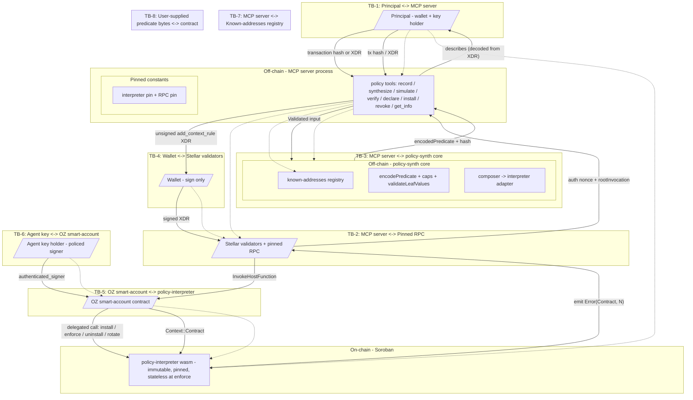

# OZ Policy Builder - STRIDE Threat Model

**Subject:** `policy-interpreter` Soroban contract plus the `@crediolabs/policy-synth`, `@crediolabs/policy-builder-cli`, `@crediolabs/policy-builder-mcp` off-chain toolchain.
**Date:** 2026-08-22
**Methodology:** Stellar STRIDE Threat Modeling, "STRIDE Threat Model Template" and "Threat Modeling How-To Guide" pages at `developers.stellar.org/docs/build/security-docs/threat-modeling`. The Stellar template's four-question scaffold (What are we working on / What can go wrong / What are we going to do about it / Did we do a good job) and its STRIDE-per-element format are followed.
**Repo:** `untangledfinance/oz-policy-builder`
**Grammar version:** 3 (`SELF_VERSION`, `src/version.rs`)
**Subject tree:** 842 nSLOC of on-chain production code.

---

## 1. Scope and version

### In scope

- `contracts/policy-interpreter/` - the on-chain Soroban contract that evaluates one predicate per `enforce` call.
- `packages/policy-synth/` - the off-chain core: predicate encoder/decoder, recording synthesis, install/revoke/info wrappers, registry, schemas.
- `packages/policy-builder-cli/` - the CLI front-end over the synth core.
- `packages/policy-builder-mcp/` - the MCP server (stdio and Streamable HTTP transports) and its tool registrations.

### Out of scope, named with their trust assumption

- `contracts/test-blend-pool/` - a test double. Trust assumption: NOT production code; testnet only. Not modelled.
- OpenZeppelin Stellar smart-account contracts. Trust assumption: OZ smart-account correctness is assumed - the interpreter is a delegate of one. OZ's `__check_auth`, `add_context_rule`, `remove_context_rule` and signer-threshold semantics are external dependencies.
- Stellar protocol, validators, RPC endpoints. Trust assumption: Stellar validators and pinned RPCs behave correctly; the install/revoke/info paths bind their signatures to whichever RPC answered.

### The property the model turns on

**`enforce` writes nothing, and reads only what install fixed.** Its only two
storage reads are the predicate document and the signer-set hash, both written
at install and removed at uninstall, so neither changes while a rule is live. It
performs no writes, reads no clock, and makes no cross-contract calls. Every
predicate leaf is answered from the authorized call itself. That is the sense in
which "stateless" is used below: not that the contract stores nothing, but that
`enforce` mutates nothing and depends on nothing that can move underneath it.

That removes several threat classes from the model outright rather than
mitigating them. There is no external price feed, so no feed spoofing,
fingerprint drift or feed-outage path. There are no counters, so no counter
integrity question: nothing can archive before its document and silently refill
a cap, and no window can be counted twice. There is no circuit breaker, so no
account-versus-rule scoping question about who may trip it.

### Methodology followed

The Stellar STRIDE Threat Model Template prescribes a four-question scaffold plus a STRIDE table per data flow. The How-To Guide adds: enumerate external entities, processes, data flows, data storage, trust boundaries; apply STRIDE per subprocess. Sections 2-8 follow that structure.

---

## 2. System decomposition

### Components

| ID | Component | Boundary | Purpose |
|---|---|---|---|
| C1 | `policy-interpreter` Soroban contract | on-chain | Stores `(predicate_bytes, signers_hash, master_set, nonce)` per rule; evaluates on `enforce`; gatekeeps install, uninstall, rotate. |
| C2 | OpenZeppelin smart-account contract | on-chain (out of scope but on the call path) | Calls `interpreter.install` / `enforce` / `uninstall` on the user's behalf; produces signed auth trees. |
| C3 | `policy-synth` core | off-chain (TypeScript) | Synthesises a `ProposedPolicy` from a `RecordedTransaction`; emits canonical ScVal predicate bytes + hash. |
| C4 | `policy-builder-mcp` server | off-chain (TypeScript) | Exposes the policy tools over stdio or Streamable HTTP. |
| C5 | `policy-builder-cli` | off-chain (TypeScript) | Thin command-line surface over the synth core. No key custody. |
| C6 | Wallet | user-side | Signs the unsigned XDR the MCP/CLI returns. The wallet signature is the user-confirmation step. |
| C7 | Pinned Soroban RPC | external network | Provides `getAccount`, `simulateTransaction`, `getLatestLedger`, `getTransaction`. URL is pinned per network. |

### Data storage

Four persistent entries per rule, all written at install, all sharing one
lifecycle. There is no entry that `enforce` writes.

| ID | Storage | Lifetime | Who writes | Notes |
|---|---|---|---|---|
| S1 | `(account, rule_id, K_DOC=1)` -> `StoredDoc { predicate_bytes, predicate_hash }` | persistent; TTL bumped on the permit path | `install` | `src/storage.rs` |
| S2 | `(account, rule_id, K_NONCE=2)` -> `u32` | persistent; bumped alongside K_DOC | `install` | replay protection |
| S3 | `(account, rule_id, K_SIGNERS_HASH=3)` -> `BytesN<32>` | persistent; bumped alongside K_DOC | `install`, `rotate_master_signer_set` | binds the policy to a signer set |
| S4 | `(account, rule_id, K_MASTER_SET=4)` -> `Vec<Signer>` | persistent; bumped alongside K_DOC | `install`, `rotate_master_signer_set` | governs install/uninstall/rotate |

TTL: `TTL_BUMP_THRESHOLD` 100, `TTL_BUMP_TO` 518,400 (`src/storage.rs`). All
four are extended together in `state::extend_state_ttl`, guarded on
`p.has(&key)` so the bump never creates state.

### External dependencies (named, with trust assumption)

- **Stellar validators + RPC** - assumed honest at the protocol level; install/revoke signature digests bind to whichever RPC answered. RPC URLs are pinned per network in `packages/policy-synth/src/run/schemas.ts`.
- **OpenZeppelin smart-account contracts** - assumed correct. The interpreter reads `Context::Contract` from OZ's `__check_auth` invocation tree (`src/state.rs`); OZ routes `enforce` calls into the interpreter.
- **Soroban host** - assumed correct; the interpreter calls `crypto().sha256` and `storage().persistent().set/get/has/remove/extend_ttl`.

There is **no external data feed**. The contract makes no
cross-contract calls during `enforce`.

### Actors

| Actor | Trust | Capability |
|---|---|---|
| Principal / account owner | trusted by self, untrusted by the interpreter | Holds the source wallet key; signs the install/revoke XDR; picks the signer set. |
| Agent key holder (the policed signer) | trusted by the policy author; treated by the contract as one of `authenticated_signers` on every enforced call | Holds a single `Signer::Delegated` key; the contract's policy bounds what that key may call. |
| Operator / deployer | trusted at deploy time | Deploys the interpreter wasm; pins the RPC URLs and the interpreter address; ships the synth core and the MCP server. |
| Auditor | untrusted; writes the audit | Reads the source and the test evidence. |
| Attacker classes | untrusted by definition | (a) Remote attacker probing the MCP HTTP server. (b) Local user-space attacker who can post to `127.0.0.1:PORT/mcp`. (c) Compromised LLM agent issuing malicious tool calls. (d) Policy author who mis-specifies the policy - not adversarial, but their mistakes are an elevation-of-privilege vector. (e) Adversary who submits a hand-crafted predicate bypassing the synth. |

### Design stance - the asymmetry the threat model must reflect

- **One immutable, audited, versioned predicate interpreter; policy is DATA.** A bad policy is a user error (a known-acceptable risk); a bad interpreter is a systemic failure. The interpreter is the audit-once surface; policy bytes are untrusted data validated fail-closed at install and re-validated at every `enforce`.
- **Wallet signature is the user-confirmation step.** The MCP server holds no key material; `install_policy` returns an unsigned XDR. The server is stateless, so there is no two-call handshake.
- **v1 scope is one authorised call.** `extract_call` handles `Context::Contract` only and panics `MissingState` on any other context shape.
- **Write-free enforcement is a security property.** `enforce` keeps no counter, accumulator or nonce of its own, so there is nothing at evaluation time to corrupt, replay, exhaust or let archive out from under a rule.

---

## 3. Assets

What an attacker wants:

1. **Account balances reachable by the policed signer.** The interpreter authorises one call at a time; the reachable surface is whatever the smart account's balances and allowances make available to that signer.
2. **Integrity of the installed predicate.** A predicate that "looks like" the author's intent but permits more. Mitigated by `sha256(predicate_bytes)` matching the caller-supplied `predicate_hash` at install.
3. **Interpreter immutability.** A future interpreter at a different address cannot authorise against the pinned interpreter; install is refused unless `allowUnpinnedInterpreter: true`.
4. **Availability of `enforce`.** A DoS on `enforce` bricks the policed account - it falls through to OZ's no-policy rule, which requires all-of-N signers (see Verified Constraints). The interpreter fails CLOSED on every deny code; `panic_with_error!` rolls back the frame.
5. **Master-set authority.** Whoever passes `require_master` can install, uninstall and rotate. The set is established at install and rotated only by itself.
6. **Cross-layer integrity: TS encoder vs Rust decoder.** If they diverge, a TS-encoded policy could install cleanly and evaluate differently than the author intended. The conformance suite is the structural witness.

### Verified constraints the model must respect

- **OZ no-policy rule vs POLICED rule.** On an OpenZeppelin smart account, a no-policy context rule requires the FULL signer set (all-of-N); attaching a POLICED rule lets any ONE signer act alone (any-of-N). The review card surfaces this via `signerNote` whenever `signers.length >= 2`. Adding a second signer "for two approvals" produces the opposite of the intent.
- **Fail-closed on every deny.** `panic_with_error!` rolls back the entire frame; the host emits `Error(Contract, N)`.
- **TTL bump only on the allow path.** `extend_state_ttl` runs before `evaluate`; a deny panics and the host rolls back. The bump is gated on `p.has(&key)` so it never creates state.
- **Install-time shape validation.** Every "would silently fail at enforce" shape is refused at install: grammar-version mismatch (200), oversized predicate (207), hash mismatch (208), undecodable predicate (201), empty signer set (209), more than `MAX_SIGNERS` 16 signers (217), an `External` signer in the master set (212), and a predicate carrying no selector leaf (216).
- **Grammar-version parity across layers.** The off-chain builder emits `grammar_version` equal to the contract's `SELF_VERSION`. A mismatch is refused at install, and a test asserts the two constants match so a skew fails the build rather than the install.

---

## 4. Trust boundaries and data flow diagram

### Trust boundaries (numbered)

| ID | Boundary | Crossing | Trust direction |
|---|---|---|---|
| TB-1 | Principal to MCP server | JSON-RPC over stdio or HTTP | untrusted -> server (loopback-only by default) |
| TB-2 | MCP server to pinned RPC | HTTPS | server -> pinned RPC (pinned; opt-in to override) |
| TB-3 | MCP server to policy-synth core | in-process function call | same process; one trust domain |
| TB-4 | Wallet to Stellar validators | signed transaction envelope over HTTPS | user-controlled -> validators |
| TB-5 | OZ smart-account to policy-interpreter | cross-contract call (soroban-sdk 27) | OZ auth tree binds -> interpreter evaluates |
| TB-6 | Agent key to OZ smart-account | signed auth entry per call | agent -> OZ (`authenticated_signers`; OZ fails the call if no signer authorises) |
| TB-7 | MCP server to known-addresses registry | in-process lookup | read-only; addresses are pinned constants |
| TB-8 | User-supplied predicate bytes to interpreter | `install` payload ScVal bytes | untrusted -> interpreter (fail-closed at install + re-validated every `enforce`) |

There is no trust boundary between the interpreter and any external contract
during evaluation: it makes no cross-contract calls.

---

## 5. STRIDE analysis per element

### Element C1 - `policy-interpreter` contract

| ID | Cat | Threat | Attack scenario | Likelihood | Impact | Mitigation | Residual |
|---|---|---|---|---|---|---|---|
| C1-S.1 | Spoofing | Attacker submits `enforce` as if it were the smart account | Anyone could drive the policy's evaluation path against an account they do not control | Low | High | `smart_account.require_auth()` is the first statement in `enforce` (`src/lib.rs`). | The require_auth is the host's guarantee; if the OZ smart-account contract is broken the bound moves. |
| C1-S.2 | Spoofing | `authenticated_signers` payload forged to claim authority | Attacker prepends a master signer to bypass a non-master check | Low | High | `authenticated_signers.is_empty()` panics (210); `require_master` calls `require_auth` on every stored master signer (`src/auth.rs`), and OZ enforces the signature map separately. | None beyond the host. |
| C1-T.1 | Tampering | Predicate bytes mutated between hash-check and store | A same-shape-but-different-bytes payload installed under a stale hash | Low | High | `sha256(predicate_bytes)` recomputed and compared against `predicate_hash`; mismatch panics 208. | None. |
| C1-T.2 | Tampering | Rule's live signer set changes behind the policy's back | A different signer set silently authorises a permit the policy was written against a stricter set | Medium | High | At every `enforce`, the live signer set's sha256 is compared against the value stored at install; mismatch panics 204. `rotate_master_signer_set` is the authorised mutation and updates both `signers_hash` and `master_set` together. | None - rotation is the only path. |
| C1-T.3 | Tampering | Non-master signer attempts to install or rotate | Any signer could overwrite the predicate | Medium | Critical | `require_master` calls `require_auth` on every member of the stored master set. Install additionally requires `smart_account.require_auth()` on **every** install, so an attacker cannot pre-seed a fresh `rule_id` with their own master set. | None. |
| C1-T.4 | Tampering | Master set rotation to an empty or External set bricks the rule | `Signer::External(_, _)` verifier contracts never satisfy `require_auth`; an empty set iterates zero times | Medium | Medium | `rotate_master_signer_set` refuses an empty set (209), an oversized set (217), and any External set (212). The same refusals apply at install. | None - the refusal is symmetric. |
| C1-R.1 | Repudiation | Action denied without a specific reason code | Off-chain tooling cannot distinguish "not on the allowlist" from "argument mismatch" | Low | Low | Every deny goes through `panic_deny_reason` with an exhaustive `From<DenyReason> for PolicyError` map; the contract emits `Error(Contract, N)`. Distinct reasons: `ArgMismatch` 100, `ContractScope` 101, `ArithmeticOverflow` 102, `UnsupportedNode` 103, `StatefulBound` 104, `NotInAllowlist` 105. | None within the interpreter. |
| C1-R.2 | Repudiation | Permit without an audit trail | An operator cannot tell which signer authorised a given permit | Medium | Low | `authenticated_signers` is passed into `enforce` from OZ and not stored; OZ is the source of truth for auth records. | The interpreter cannot authoritatively record the signer set; OZ's `__check_auth` is the audit path. |
| C1-I.1 | Info disclosure | Predicate bytes leak the policy shape | The predicate is stored as raw bytes; the ledger is public | Low | Low | All storage is `persistent()` and addressable by `(account, rule_id, K_DOC)`. | The interpreter does not encrypt the predicate; secrecy is the policy author's choice, and ledger state is public regardless. |
| C1-D.1 | DoS | `extend_ttl` precedes the predicate check, so a deny could extend TTL | A deny could keep the rule alive "for free" | Low | Medium | `extend_state_ttl` runs BEFORE `evaluate`; every deny panics and the host rolls back the frame including the bump. The bump is guarded on `p.has(&key)` so it never creates state. | None - the rollback is host-guaranteed for `panic_with_error!`. |
| C1-D.2 | DoS | Archive on the doc / nonce / signers_hash / master_set | Persistent entries that archive cannot be re-read; the next install cannot recreate them because the nonce check would loop | Low | High | All four share one lifecycle and are bumped together on the permit path; the doc is re-read on every `enforce`. | Accepted: a rule that is never used for longer than the TTL archives. That is the Soroban state model, not a contract defect. |
| C1-D.3 | DoS | Predicate walk is unbounded | A deeply nested or wide predicate exhausts the host budget | Low | Medium | `decode_with_byte_cap` rejects over `MAX_PREDICATE_BYTES` (32 KB) before parsing; `MAX_DEPTH` 5, `MAX_LEAVES` 200, `MAX_IN_OPERAND_COUNT` 32 are enforced after decode. | None - the byte cap dominates every walk. |
| C1-D.4 | DoS | Per-transaction write-entry cap exceeded at runtime | A predicate that installs and then aborts the host on every enforce | Low | High | **Structurally impossible.** `enforce` writes no ledger entries at all; the only writes are the four install-time entries and the TTL bump. | None. |
| C1-D.5 | DoS | Hand-crafted predicate installs and denies on every enforce | A predicate that decodes but never permits | Low | Medium | Every evaluation failure surfaces as a `DenyReason` mapped to a `PolicyError`; the deny is a clean revert, not a hang. | None - fails closed. |
| C1-E.1 | Elevation of privilege | Hand-crafted permissive predicate (only literal-vs-literal compares) installs and authorises everything | Bypassing the synth to submit raw bytes | Low | Critical | Install refuses any predicate carrying no selector leaf: `SelectorLeafRequired` 216 (`dsl::has_selector_leaf`). | None for the "binds nothing" case. The trust-boundary note sets out the limit of the guarantee. |
| C1-E.2 | Elevation of privilege | OZ no-policy rule is all-of-N; POLICED rule is any-of-N | User attaches a POLICED rule expecting "two approvals" by adding a 2nd signer | High | Critical | Surfaced via the review-card `signerNote` whenever `signers.length >= 2`, decoded from the FINAL transaction rather than the input args. When the caller supplies `existingRules`, `install_policy` also returns an `authorityScan` naming every rule a signer of the new policy could name instead. Off chain only. | Unmitigated at the protocol layer; the note is advisory, and the scan runs only on caller-supplied input. Tracked as R-2. |
| C1-E.3 | Elevation of privilege | External verifier in the master set becomes an unrecoverable state | `require_master` calls `require_auth` on the verifier address, which a plain verifier contract never satisfies | Low | Critical | Install and rotate both refuse External signers in the master set (212). | Tracked as R-3: refusing is the correct behaviour, not a limitation. |
| C1-E.4 | Elevation of privilege | `install_nonce` replay between two installs | A replayed install overwrites a fresh predicate | Low | High | `install_nonce` must equal `stored_nonce + 1`; mismatch panics 202. `uninstall` removes the nonce with the rest of the state, so a subsequent install starts again at 1. | None. |
| C1-E.5 | Elevation of privilege | Transitive authority through a permitted callee | The policy permits calling contract X; X then moves funds using a standing SEP-41 allowance the account granted earlier. That transfer needs no auth from this account, so it produces no `Context` and no `enforce` call | Medium | High | **Depth itself is covered:** OZ builds one `Context` per auth-tree node requiring this account's authorisation and calls `enforce` once per context, so a smuggled inner call that needs this account's auth IS evaluated on its own merits. `extract_call` handling only `Context::Contract` is a shape check, not a depth limit. | Residual by nature, not by scope. Mitigated operationally - a policed key must hold zero standing allowances. Tracked as R-1. |
| C1-E.6 | Elevation of privilege | Grammar-version skew between the builder and the contract | An off-chain builder emitting an older `grammar_version` produces installs the contract refuses - or, in the inverse case, a contract that accepts a document written against a different leaf set | Medium | High | `install_params.grammar_version != SELF_VERSION` panics 200, and a test asserts the builder's literal equals `SELF_VERSION`. | None on chain. The off-chain side is the fragile half, since the parity is held by a test rather than by the type system. |

### Data flow F1 - install pipeline (U -> MCP -> synth -> unsigned XDR -> wallet -> chain -> OZ -> interpreter)

| ID | Cat | Threat | Attack scenario | Likelihood | Impact | Mitigation | Residual |
|---|---|---|---|---|---|---|---|
| F1-S.1 | Spoofing | MCP server returns XDR for a different smart account than requested | `install_policy` is the canonical path | Low | Critical | The XDR is built from the caller-supplied `smartAccount` and a `describes` field is produced by decoding the assembled XDR; the user sees the address in the review card. The MCP server holds no key material. | The wallet signature is the user-confirmation step; the user must see and approve the address. |
| F1-T.1 | Tampering | Predicate bytes differ between synth-emit and chain-install | TS encoder and Rust decoder divergence | Low | High | `sha256` over the raw XDR is computed at encode time; the contract re-computes it on receipt and panics 208 on mismatch. The conformance suite pins encoder to decoder. | None. |
| F1-T.2 | Tampering | `authNonce` from a non-pinned RPC binds the caller to the wrong host | Caller supplies an `rpcUrl` other than the pinned URL | Medium | Medium | Default-deny on `rpcUrl` unless `allowUnpinnedRpcUrl: true`; the same gate applies to `revoke_policy` and `get_interpreter_info(verifyLive)`. | None - opt-in is explicit. |
| F1-T.3 | Tampering | `interpreterAddress` is an attacker-controlled contract | The smart account would delegate to an interpreter the caller controls | Low | Critical | `enforceInterpreterPin` runs BEFORE building the XDR; default-deny unless `allowUnpinnedInterpreter: true`. | None - opt-in is explicit. |
| F1-R.1 | Repudiation | Install succeeds but the user denies signing it | Wallet-side record | Low | Low | The XDR is unsigned; the wallet signature is the audit record. The MCP body is stateless and holds no key material. | None at the synth. |
| F1-I.1 | Info disclosure | Install error messages leak internal commentary | A throw's `message` includes source-code rationale | Low | Low | `safeStringify` strips `Error.stack`; message and details lengths are bounded. | None. |
| F1-D.1 | DoS | HTTP transport flooded with large requests | Any caller can hit `POST /mcp` if bound to a non-loopback host | Medium | Medium | Default-bind to loopback; 1 MB body cap; explicit `allowExternalHost: true` opt-in. | The opt-in is the auditable intent. |
| F1-E.1 | Elevation of privilege | `__testPredicateNode` seam in the public type | A downstream consumer bypassing the MCP/CLI gates could supply a permissive test predicate | Low | Critical | The seam lives on `__TestInterpreterAdapterOptions`, not the public options type; a runtime guard throws when `NODE_ENV !== 'test'`. | Mitigated at the seam. |

### Data flow F2 - enforce pipeline (agent key -> OZ -> interpreter)

| ID | Cat | Threat | Attack scenario | Likelihood | Impact | Mitigation | Residual |
|---|---|---|---|---|---|---|---|
| F2-S.1 | Spoofing | Attacker invokes `enforce` directly without going through the smart account | The host is the gate | Medium | High | `smart_account.require_auth()` is the first statement of `enforce`; OZ's `__check_auth` only authorises the call if it routed through the smart account's auth tree. | If OZ's `__check_auth` were broken, the bound moves. |
| F2-T.1 | Tampering | Stored predicate bytes tampered between `install` and `enforce` | Persistent storage is the source of truth | Low | High | Every `enforce` re-decodes via `decode_with_byte_cap`; a tampered or truncated predicate panics 201. | None. |
| F2-T.2 | Tampering | Live signer set changes between installs without rotation | A different signer set silently authorises a permit | Medium | High | At every `enforce`, `sha256(context_rule.signers)` is compared against the value stored at install; mismatch panics 204. | None. |
| F2-R.1 | Repudiation | Permit without signer record | OZ is the audit path | Low | Low | `authenticated_signers` is forwarded to the interpreter; OZ separately enforces the signature map. | None at the interpreter. |
| F2-I.1 | Info disclosure | `DenyReason` codes reveal internal evaluator state | Any observer of host events sees the numeric code | Low | Low | Codes are grouped (1xx evaluator, 2xx install/auth/state) and never renumbered or reused; the numeric codes are a public ABI. Retired codes are not recycled. | None. |
| F2-D.1 | DoS | Evaluation cost grows with predicate size | A large predicate slows every call | Low | Low | Structural caps are enforced at install and re-checked at decode; `enforce` performs no cross-contract calls and no storage writes, so its cost is bounded by the predicate walk alone. | None. |
| F2-E.1 | Elevation of privilege | `enforce` accepts an argument that bypasses the policy | A side-channel to inject a different predicate | Low | Critical | The contract is pure with respect to policy: `enforce` decodes stored bytes and walks the evaluator; there is no path to substitute a predicate. | None. |

### Data flow F3 - MCP HTTP transport

| ID | Cat | Threat | Attack scenario | Likelihood | Impact | Mitigation | Residual |
|---|---|---|---|---|---|---|---|
| F3-S.1 | Spoofing | Attacker supplies a forged `rpcUrl` to bind the auth digest | `verifyLive: true, rpcUrl: '<attacker>'` | Medium | Medium | `enforceRpcPin` runs before the live version lookup when `verifyLive === true`. | None. |
| F3-T.1 | Tampering | JSON-RPC batch request | A malicious batch smuggles extra calls | Low | Low | Array bodies are explicitly rejected. | None. |
| F3-R.1 | Repudiation | Tool-call log missing | Per-call stateless; no log | Low | Low | The wallet signature is the user-confirmation; OZ's auth tree is the audit path. | None. |
| F3-I.1 | Info disclosure | HTTP errors leak host/URL detail | `simulateTransaction` errors echoed | Low | Low | Errors are mapped to short stable reasons; the full payload stays in SDK logs. | None. |
| F3-D.1 | DoS | Non-loopback host exposes unauthenticated tools | `host: '0.0.0.0'` exposes the surface | Medium | Medium | Default-deny on non-loopback hosts; explicit `allowExternalHost: true` opt-in; 1 MB body cap enforced by the streaming reader. | The opt-in is auditable. |
| F3-E.1 | Elevation of privilege | No auth on `/mcp` | Any caller who can reach the port calls the tools | High | High | Default-bind to loopback; no bearer/HMAC exists. A production deployment is expected to gate at a reverse proxy. | Tracked as A-1. |

### Data flow F4 - policy-synth core (recording -> predicate bytes)

| ID | Cat | Threat | Attack scenario | Likelihood | Impact | Mitigation | Residual |
|---|---|---|---|---|---|---|---|
| F4-S.1 | Spoofing | Caller supplies a placeholder/LLM-seam smart-account marker | `VERIFY-*` / `PLACEHOLDER-*` / `TODO-*` | Low | High | The placeholder prefix is rejected before the C.../56-char check. | None. |
| F4-T.1 | Tampering | i128 wrapping at encode time | `2^127` overflows | Low | Medium | `scvI128FromDecimal` range-checks; out-of-range values throw at encode time. | None. |
| F4-D.1 | DoS | Predicate depth / leaf count explodes | | Low | Medium | `PREDICATE_CAPS` (depth 5, leaves 200, in-operand 32, 32 KB) enforced at encode and mirrored on the host. | None. |
| F4-D.2 | DoS | ScVal recursion stack overflow | | Low | Medium | `MAX_SCVAL_DEPTH = MAX_SCVAL_CLONE_DEPTH = 30` caps the decoder and the clone paths. | None. |
| F4-E.1 | Elevation of privilege | A hand-crafted predicate of only literal-vs-literal compares installs and permits everything | Bypass the synth and call `buildAddContextRuleArgs` directly | Low | Critical | `encodePredicate` refuses a predicate with no selector leaf, and the contract refuses it again at install with 216. | None on chain. The off-chain refusal is a convenience; the contract is the enforcing layer. |
| F4-E.2 | Elevation of privilege | The off-chain builder emits a `grammar_version` the contract does not speak | Every install fails, or a document is built against the wrong leaf set | Medium | High | `POLICY_INSTALL_PARAM_FIELDS` is the ABI the host unpacks by field count; the version literal is pinned in the `PolicyDocument` type so a skew is a type error at the emitting sites. | A CI test asserts the TS literal equals `SELF_VERSION` parsed from `version.rs`, so a skew fails the build rather than the install. Tracked as R-5. |

### Element C2 - OpenZeppelin smart-account (out of scope, named with trust assumption)

| ID | Cat | Threat | Attack scenario | Likelihood | Impact | Mitigation | Residual |
|---|---|---|---|---|---|---|---|
| C2-T.1 | Tampering | OZ `__check_auth` re-uses a stale nonce | | Low | High | OZ's nonce bookkeeping is OZ's responsibility. | Trust assumption: OZ is correct. |
| C2-E.1 | Elevation of privilege | OZ's no-policy rule is all-of-N; POLICED rule is any-of-N | Adding a 2nd signer to a rule with a POLICED policy | High | Critical | Surfaced in the review card `signerNote`; when the caller supplies `existingRules`, `install_policy` returns an `authorityScan` naming the authority a signer of this one already holds elsewhere. | Unmitigated at the protocol layer. Cross-rule authority is tracked as R-4. |

### Element C3 - Pinned Soroban RPC (out of scope, named with trust assumption)

| ID | Cat | Threat | Attack scenario | Likelihood | Impact | Mitigation | Residual |
|---|---|---|---|---|---|---|---|
| C3-S.1 | Spoofing | Compromised RPC returns forged auth nonces and root invocations | The auth digest binds the caller | Medium | High | Pin enforcement is default-deny; the wallet signature covers the same auth digest. | Trust assumption: pinned RPCs are honest. |

### Element C4 - Wallet (out of scope, named with trust assumption)

| ID | Cat | Threat | Attack scenario | Likelihood | Impact | Mitigation | Residual |
|---|---|---|---|---|---|---|---|
| C4-S.1 | Spoofing | Compromised wallet | | Low | Critical | Out of scope. | Trust assumption: the user's wallet is honest. |

---

## 6. Trust assumptions

What this model assumes and does NOT verify:

1. **Stellar validators and protocol.** Transaction ordering, ledger finality and `require_auth` semantics are honoured by the host.
2. **OpenZeppelin smart-account contracts.** `__check_auth`, `add_context_rule`, `remove_context_rule` and signer-threshold semantics are correct.
3. **User's own key custody.** A compromised source-account key signs whatever the wallet presents; the contract does not second-guess the signature.
4. **Soroban SDK 27 cross-contract execution semantics.** The interpreter reads `Context::Contract` only; deeper tree walking is out of scope (modelled as R-1).
5. **Pinned RPC URLs** - assumed honest; the install/revoke auth digests bind to whichever host answered.
6. **TS encoder / Rust decoder parity.** The conformance suite pins this: the same predicate encodes to the bytes the Rust decoder accepts, and the fixtures are regenerated from a checked-in recording.

---

## 7. Residual risks and accepted risks

### Residual risks (unmitigated)

| ID | Residual | Why it is accepted |
|---|---|---|
| R-1 | Transitive authority: once a policy permits calling contract X, it also permits whatever X can do with authority it ALREADY holds (standing SEP-41 allowances, its own admin rights), because those actions require no further auth from this account and so never produce a `Context`. | Not a gap in the interpreter, and not closable by any auth-based policy layer, Zodiac Roles on EVM included. Every invocation that DOES require this account's auth gets its own `Context` and its own `enforce` call, so depth is covered. Mitigated operationally: a policed key must hold zero standing allowances, so a permitted callee has nothing to abuse. |
| R-2 | OZ no-policy rule is all-of-N; POLICED rule is any-of-N. Adding a 2nd signer "for two approvals" produces the opposite of the intent. | OZ protocol-level semantic, not something the interpreter can override. Delivery of the warning was verified end to end: `signerNote` is set when `signers.length >= 2`, carried on `InstallCallDescribes`, and reachable on the `install_policy` response. It is decoded from the FINAL transaction rather than the input args, so it describes what will actually be signed. Residual: it is advisory text, not a hard gate. A hard gate would need a new field on `PolicyInstallParams` - a wire-format change across the contract, the synthesiser and the conformance fixtures. |
| R-3 | Master signer set cannot include `Signer::External(_, _)` because the interpreter cannot re-implement OZ's verifier protocol in v1. | **No action: refusing is the correct behaviour, not a limitation to fix.** An `External` master would be permanently unrecoverable, since `rotate_master_signer_set` and `uninstall` both gate on `require_master` and neither could ever satisfy it. Refusing at install converts an unrecoverable state into a loud, immediate error. Verified recoverable by contrast: with a valid master set, `rotate` and `uninstall` are direct calls that never route through `enforce`, so an account is never locked out of governing its own rule. |
| R-4 | A signer's effective authority for a given call is the MAXIMUM over every context rule they belong to whose `context_type` matches it. OpenZeppelin documents multiple rules per context type as intended. Adding a tighter rule restricts nothing. | OZ protocol-level semantic. `do_check_auth` enforces only the policies of the rule the caller named, and the rule id is bound into the auth digest, so the signer commits to the rule they exercise. Mitigated off chain: when the caller supplies `existingRules`, `install_policy` returns an `authorityScan` naming every rule a signer of the new policy could name instead. It reports rather than refuses, it never reads the account itself, and an absent `existingRules` yields `null` - "not checked", distinct from "checked, nothing found". |
| R-5 | Grammar-version parity between the Rust contract and the TypeScript builder rests on a test, not on a shared type. | The test parses `SELF_VERSION` out of `version.rs` and asserts the builder's literal matches, so a skew fails the build. A skew that slipped past it would still be loud rather than silent: the contract refuses the install with 200. |

### Accepted risks (open, in scope, accepted with reason)

| ID | Accepted risk | Reason |
|---|---|---|
| A-1 | MCP HTTP transport has no authentication. | Mitigated by default-loopback binding plus an explicit `allowExternalHost: true` opt-in. A reverse proxy or firewall is the expected deployment-time auth. The server holds no key material, so the worst case is unsigned-XDR generation, not signing. |
| A-2 | `argument_reorder` excluded from synth deny-case generation. | The Soroban host dispatches by function identity with positional args, so a reordered-argument call is a different call the predicate already fails to match. |

### Trust-boundary note: the scope of the on-chain guarantee

The interpreter guarantees exactly three properties on every enforced call:

1. the predicate it was given is **evaluated faithfully**;
2. it **fails closed** on every error path;
3. the predicate **binds at least one property of the call** (216).

All three concern the fidelity of evaluation rather than the adequacy of the
policy: a predicate pinning only `call_fn` satisfies every one of them and
permits that function with any arguments.

Policy adequacy is owned off chain. The review card states, leaf by leaf, what
the predicate binds, and the person approving the wallet signature accepts it.

### Where adjacent controls live

The interpreter answers one question: *is this specific call one the policy
permits?* Controls outside that question belong to other layers, and an
operator who needs one sources it there:

| Control | Where it lives |
|---|---|
| A cap on the value a call may move | The interpreter bounds the call's own amount argument (`call_arg(i) <= limit`), located from the protocol ABI. It is a per-call cap, not a rolling total: the interpreter is passed one authorised call, not the transaction's token movements, so it cannot accumulate spend across calls. |
| Policy expiry | The context rule's `valid_until`, owned by the smart account. |
| A bound on call frequency | Nowhere in this stack. The synthesiser reports `FREQUENCY_BOUND_MISSING` on incoming-only flows, so a caller is told rather than left to assume a cap. |
| Price-conditioned authorisation | Nowhere in this stack. |

---

## 8. Did we do a good job? (Stellar template closing reflection)

### How the model was validated

- Every control this document names is backed by a test or by an evidence log
  in `docs/audit/evidence/`.
- Each of the contract's five entry points was checked against the access
  control failures that dominate the Stellar Security Portal corpus (832
  Soroban findings, 150 critical/high).
- The review card is decoded from the final assembled transaction, and
  `summaryCrossCheck` fails if any predicate leaf is missing from the summary.
- Grammar parity between the contract and the builder is asserted by a test
  that reads `SELF_VERSION` out of the Rust source.
- Both gates run in CI on every push, including the two dependency-advisory
  scanners.

### Tool evidence

All logs in `docs/audit/evidence/` were produced against this tree:

| Tool | Result |
|---|---|
| `cargo fmt --check`, `clippy -D warnings`, `cargo test`, conformance, reproducible wasm build, hash pin parity | clean; 70 tests + 9 conformance pass; built wasm matches the pin |
| `biome check`, `tsc --noEmit`, `bun test` | clean; 611 pass, 1 skip, 0 fail across 612 tests |
| `cargo audit` | 0 vulnerabilities across 202 crates; 1 unmaintained-crate warning |
| `bun audit` | 0 vulnerabilities |
| `clippy -W pedantic -W nursery` | 170 style warnings, 0 security |
| `cargo scout-audit` | Analyzed: 0 Critical, 9 Medium, 0 Minor, 1 Enhancement |
| Stellar Security Portal corpus | 832 real Soroban findings; 150 critical/high cross-checked against this contract's five entry points |

### Where the model is weakest

- **R-1 and R-2 are structural**, inherited from the account model rather than
  from this contract, and no amount of interpreter work closes them.
- **The off-chain half carries more risk than the on-chain half.** The contract
  is 842 nSLOC and write-free at `enforce`; the toolchain is 6,652 nSLOC and
  holds the default-deny install gates.
- **Test files are outside the typecheck scope.** `tsconfig` excludes
  `src/**/*.test.ts`, so `bun run typecheck` never sees them and a test can
  reference a symbol that no longer exists while typecheck stays green. The
  test run catches it; the type checker does not.
- **Coverage of the MCP transport is thin** because the deployment model
  (loopback stdio) makes the HTTP surface a secondary path. If that changes, F3
  needs re-work and A-1 becomes load-bearing.

### What would raise confidence further

Bring test files into the typecheck scope, so a stale symbol in a test is a type
error rather than a runtime failure.
