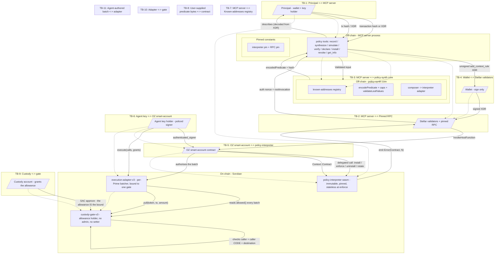

# OZ Policy Builder - STRIDE Threat Model

**Subject:** the `policy-interpreter`, `custody-gate-v3` and `execution-adapter-v3` Soroban contracts plus the `@crediolabs/policy-synth`, `@crediolabs/policy-builder-cli`, `@crediolabs/policy-builder-mcp` off-chain toolchain.
**Date:** 2026-09-25 (re-run; first written 2026-08-23)
**Methodology:** Stellar STRIDE Threat Modeling, "STRIDE Threat Model Template" and "Threat Modeling How-To Guide" pages at `developers.stellar.org/docs/build/security-docs/threat-modeling`. The Stellar template's four-question scaffold (What are we working on / What can go wrong / What are we going to do about it / Did we do a good job) and its STRIDE-per-element format are followed.
**Repo:** `untangledfinance/oz-policy-builder`
**Grammar version:** 6 (`SELF_VERSION`, `src/version.rs`)
**Subject tree:** 1074 nSLOC of on-chain production code - interpreter 893, adapter 128, gate 53.

### What changed since the 2026-08-23 run

Two things, and the second is why this is a re-run rather than a refresh.

**Grammar 4 became grammar 6.** The leaf set gained `call_path`, which reaches
into a BATCH - `calls[n].args[i]` - instead of addressing one call's arguments.
That is a new shape, not a new value, and section 5 asks of it the question the
last run learned to ask (C1-E.9).

**Two contracts were added that stand between an agent and custody's money**,
and neither was in the previous model: a custody gate that holds an allowance
and releases it only to a code-pinned caller, and a per-Prime adapter that
executes a batch and refuses any batch naming an address the gate does not.
They are modelled here as C8 and C9. The threat this run found and closed was
in that pair (C9-D.2).

---

## 1. Scope and version

### In scope

- `contracts/policy-interpreter/` - the on-chain Soroban contract that evaluates one predicate per `enforce` call.
- `contracts/custody-gate-v3/` - the client's gatekeeper. Holds no funds: it holds an allowance custody granted it, and releases inside that only to one code-pinned caller, only to a listed destination.
- `contracts/execution-adapter-v3/` - the per-Prime batcher, bound to one gate. Refuses any batch mentioning an address the gate does not name.
- `packages/policy-synth/` - the off-chain core: predicate encoder/decoder, recording synthesis, install/revoke/info wrappers, registry, schemas.
- `packages/policy-builder-cli/` - the CLI front-end over the synth core.
- `packages/policy-builder-mcp/` - the MCP server (stdio and Streamable HTTP transports) and its tool registrations.

### Out of scope, named with their trust assumption

- `contracts/test-blend-pool/`, `contracts/execution-test-venue/`, `contracts/invoker-auth-probe/` - test doubles and probes. Trust assumption: NOT production code; testnet only. Not modelled.
- `contracts/execution-adapter/`, `contracts/custody-gate/`, `contracts/execution-policy/` - the v1 and v2 generations, superseded by the pair above. Trust assumption: still deployed and still reachable by accounts holding v1 rules, but no longer the code this repo builds against. An account on them inherits the previous model, not this one.
- OpenZeppelin Stellar smart-account contracts. Trust assumption: OZ smart-account correctness is assumed - the interpreter is a delegate of one. OZ's `__check_auth`, `add_context_rule`, `remove_context_rule` and signer-threshold semantics are external dependencies.
- Stellar protocol, validators, RPC endpoints. Trust assumption: Stellar validators and pinned RPCs behave correctly; the install/revoke/info paths bind their signatures to whichever RPC answered.

### The property the model turns on

**`enforce` creates no state, changes none, and reads only what install fixed.**
Its two value reads are the predicate document and the signer-set hash, both
written at install and removed at uninstall, so neither changes while a rule is
live. It reads no clock and makes no cross-contract calls. Every predicate leaf
is answered from the authorized call itself.

The one write-shaped operation is a TTL bump on the permit path
(`state::extend_state_ttl`), which extends the four per-rule entries and is
guarded on `has` so it can never create one. It changes no value and adds no
entry - it only postpones archival - and it runs before `evaluate`, so a deny
panics and the host rolls it back. That is the sense in which "stateless" is
used below: not that the contract stores nothing, but that `enforce` mutates no
value and depends on nothing that can move underneath it.

That removes several threat classes from the model outright rather than
mitigating them. There is no external price feed, so no feed spoofing,
fingerprint drift or feed-outage path. There are no counters, so no counter
integrity question: nothing can archive before its document and silently refill
a cap, and no window can be counted twice. There is no circuit breaker, so no
account-versus-rule scoping question about who may trip it.

### The same property, in the two new contracts

Neither new contract keeps a counter, an accumulator or a nonce either. The
gate's configuration is written once by its constructor and has no setter; the
adapter's `prime` is write-once and its `gate` moves only under the current
custody's signature. So the questions state invites - replay, exhaustion, an
entry archiving out from under a rule, a counter refilling a cap - do not arise
for them any more than for `enforce`. What DOES carry state is the SAC
allowance the gate spends, and that is an asset, not a mechanism either
contract implements.

### Methodology followed

The Stellar STRIDE Threat Model Template prescribes a four-question scaffold plus a STRIDE table per data flow. The How-To Guide adds: enumerate external entities, processes, data flows, data storage, trust boundaries; apply STRIDE per subprocess. Sections 2-8 follow that structure.

---

## 2. System decomposition

### Components

| ID | Component | Boundary | Purpose |
|---|---|---|---|
| C1 | `policy-interpreter` Soroban contract | on-chain | Stores `(predicate_bytes, signers_hash, master_set, nonce)` per rule; evaluates on `enforce`; gatekeeps install, uninstall, rotate. |
| C2 | OpenZeppelin smart-account contract | on-chain (out of scope but on the call path) | Calls `interpreter.install` / `enforce` / `uninstall` on the user's behalf; produces signed auth trees. |
| C3 | `policy-synth` core | off-chain (TypeScript) | Synthesises a `ProposedPolicy` from a `RecordedTransaction`; emits canonical ScVal predicate bytes + hash. |
| C4 | `policy-builder-mcp` server | off-chain (TypeScript) | Exposes the policy tools over stdio or Streamable HTTP. |
| C5 | `policy-builder-cli` | off-chain (TypeScript) | Thin command-line surface over the synth core. No key custody. |
| C6 | Wallet | user-side | Signs the unsigned XDR the MCP/CLI returns. The wallet signature is the user-confirmation step. |
| C7 | Pinned Soroban RPC | external network | Provides `getAccount`, `simulateTransaction`, `getLatestLedger`, `getTransaction`. URL is pinned per network. |
| C8 | `custody-gate-v3` contract | on-chain | Holds an allowance custody granted it and spends strictly inside it. No admin, no setter, no upgrade. `pull` requires the pinned caller's auth, that caller's pinned CODE, and a listed destination. |
| C9 | `execution-adapter-v3` contract | on-chain | Per-Prime batcher, bound to one gate for life unless custody moves it. Runs a batch of calls under the Prime's authorisation and refuses any batch that mentions an address the gate does not name. |
| C10 | Custody account | user-side | The party whose money the gate spends. Deploys the gate, grants it the SAC allowance, and is the only party who may move the adapter to a successor gate. |

### Data storage

Four persistent entries per rule, all written at install, all sharing one
lifecycle. There is no entry that `enforce` writes.

| ID | Storage | Lifetime | Who writes | Notes |
|---|---|---|---|---|
| S1 | `(account, rule_id, K_DOC=1)` -> `StoredDoc { predicate_bytes }` | persistent; TTL bumped on the permit path | `install` | `src/storage.rs` |
| S2 | `(account, rule_id, K_NONCE=2)` -> `u32` | persistent; bumped alongside K_DOC | `install` | replay protection |
| S3 | `(account, rule_id, K_SIGNERS_HASH=3)` -> `BytesN<32>` | persistent; bumped alongside K_DOC | `install`, `rotate_master_signer_set` | binds the policy to a signer set |
| S4 | `(account, rule_id, K_MASTER_SET=4)` -> `Vec<Signer>` | persistent; bumped alongside K_DOC | `install`, `rotate_master_signer_set` | governs install/uninstall/rotate |
| S5 | gate instance: `Cfg { custody, caller, caller_code, allowed }` | instance; written once | gate `__constructor` | no setter exists; changing any field means a new gate |
| S6 | adapter instance: `prime`, `gate` | instance | adapter `__constructor`, `rebind` | `prime` is write-once; `gate` moves only with the CURRENT gate's custody signature |

TTL: `TTL_BUMP_THRESHOLD` 100, `TTL_BUMP_TO` 518,400 (`src/storage.rs`). All
four are extended together in `state::extend_state_ttl`, guarded on
`p.has(&key)` so the bump never creates state.

### External dependencies (named, with trust assumption)

- **Stellar validators + RPC** - assumed honest at the protocol level; install/revoke signature digests bind to whichever RPC answered. RPC URLs are pinned per network in `packages/policy-synth/src/run/schemas.ts`.
- **OpenZeppelin smart-account contracts** - assumed correct. The interpreter reads `Context::Contract` from OZ's `__check_auth` invocation tree (`src/state.rs`); OZ routes `enforce` calls into the interpreter.
- **Soroban host** - assumed correct; the interpreter calls `crypto().sha256` and `storage().persistent().set/get/has/remove/extend_ttl`.

There is **no external data feed**. The contract makes no
cross-contract calls during `enforce`.

### Actors

| Actor | Trust | Capability |
|---|---|---|
| Principal / account owner | trusted by self, untrusted by the interpreter | Holds the source wallet key; signs the install/revoke XDR; picks the signer set. |
| Agent key holder (the policed signer) | trusted by the policy author; treated by the contract as one of `authenticated_signers` on every enforced call | Holds a single `Signer::Delegated` key; the contract's policy bounds what that key may call. |
| Operator / deployer | trusted at deploy time | Deploys the interpreter wasm; pins the RPC URLs and the interpreter address; ships the synth core and the MCP server. |
| Auditor | untrusted; writes the audit | Reads the source and the test evidence. |
| Attacker classes | untrusted by definition | (a) Remote attacker probing the MCP HTTP server. (b) Local user-space attacker who can post to `127.0.0.1:PORT/mcp`. (c) Compromised LLM agent issuing malicious tool calls. (d) Policy author who mis-specifies the policy - not adversarial, but their mistakes are an elevation-of-privilege vector. (e) Adversary who submits a hand-crafted predicate bypassing the synth. |

### Design stance - the asymmetry the threat model must reflect

- **One immutable, audited, versioned predicate interpreter; policy is DATA.** A bad policy is a user error (a known-acceptable risk); a bad interpreter is a systemic failure. The interpreter is the audit-once surface; policy bytes are untrusted data validated fail-closed at install and re-validated at every `enforce`.
- **Wallet signature is the user-confirmation step.** The MCP server holds no key material; `install_policy` returns an unsigned XDR. The server is stateless, so there is no two-call handshake.
- **One authorised call per `enforce`, and grammar 6 can reach inside it.** `extract_call` handles `Context::Contract` only and panics `MissingState` on any other context shape. What changed at grammar 6 is reach, not count: `call_path` addresses the batch INSIDE the one authorised `execute` call, which is why a batch predicate has to pin the call count as well as the calls (C1-E.9).
- **Write-free enforcement is a security property.** `enforce` keeps no counter, accumulator or nonce of its own, so there is nothing at evaluation time to corrupt, replay, exhaust or let archive out from under a rule.

---

## 3. Assets

What an attacker wants:

1. **Account balances reachable by the policed signer.** The interpreter authorises one call at a time; the reachable surface is whatever the smart account's balances and allowances make available to that signer.
2. **Integrity of the installed predicate.** A predicate that "looks like" the author's intent but permits more. Mitigated by `sha256(predicate_bytes)` matching the caller-supplied `predicate_hash` at install.
3. **Interpreter immutability.** A future interpreter at a different address cannot authorise against the pinned interpreter; install is refused unless `allowUnpinnedInterpreter: true`.
4. **Availability of `enforce`.** A DoS on `enforce` bricks the policed account - it falls through to OZ's no-policy rule, which requires all-of-N signers (see Verified Constraints). The interpreter fails CLOSED on every deny code; `panic_with_error!` rolls back the frame.
5. **Master-set authority.** Whoever passes `require_master` can install, uninstall and rotate. The set is established at install and rotated only by itself.
6. **Cross-layer integrity: TS encoder vs Rust decoder.** If they diverge, a TS-encoded policy could install cleanly and evaluate differently than the author intended. The conformance suite is the structural witness.
7. **The custody allowance.** Not the custody balance: the gate can spend only what custody approved to it, so the allowance is the blast radius of everything downstream of it. What protects it is the gate's code pin and destination list, not the adapter's good behaviour.
8. **The adapter's reachability.** An adapter that cannot run is a Prime cut off from custody-funded execution, and a Prime deploys exactly one contract through rule 0, so there is no second attempt. Availability of the BINDING is therefore an asset in its own right - which is what C9-D.2 was about.

### Verified constraints the model must respect

- **OZ no-policy rule vs POLICED rule.** On an OpenZeppelin smart account, a no-policy context rule requires the FULL signer set (all-of-N); attaching a POLICED rule lets any ONE signer act alone (any-of-N). The review card surfaces this via `signerNote` whenever `signers.length >= 2`. Adding a second signer "for two approvals" produces the opposite of the intent.
- **Fail-closed on every deny.** `panic_with_error!` rolls back the entire frame; the host emits `Error(Contract, N)`.
- **TTL bump only on the allow path.** `extend_state_ttl` runs before `evaluate`; a deny panics and the host rolls back. The bump is gated on `p.has(&key)` so it never creates state.
- **Install-time shape validation.** Every "would silently fail at enforce" shape is refused at install: grammar-version mismatch (200), oversized predicate (207), hash mismatch (208), undecodable predicate (201), empty signer set (209), more than `MAX_SIGNERS` 16 signers (217), an `External` signer in the master set (212), a predicate carrying no selector leaf (216), and a `call_arg_scaled` whose ratio is zero or non-positive (214).
- **Multiple policies on one rule compose as ALL-OF.** Verified on testnet, not read from documentation: two interpreter instances were attached to one context rule with predicates that disagreed about the same call, and the refusing one was decisive (`docs/audit/evidence/oz-policy-composition.log`). A control rule carrying only the permitting policy allowed the identical call, so the denial is attributable to the second policy rather than to a malformed rule.
- **A real OZ `spending_limit` binds beside the interpreter.** The ALL-OF result above only says the composition semantics permit it; this was then demonstrated with OZ's own policy rather than a second copy of our code, on testnet AND mainnet: a 20000000-stroop transfer the interpreter permits is denied `#3221 SpendingLimitExceeded` when a 5000000 cap sits on the same rule, while a control rule without the cap allows the identical transfer and an under-cap transfer through the capped rule still passes (`docs/audit/evidence/oz-spending-limit-binding.log`). Raising the cap above the amount flips the verdict, so the refusal tracks the cap value and not the mere presence of a second policy.
- **`simple_threshold` restores the m-of-n that attaching a policy removes.** The any-of-N collapse above is not merely documented, it is demonstrated: on testnet AND mainnet a lone signer is permitted through an interpreter-only rule carrying two signers, and the SAME lone signer is denied `#3202` once `simple_threshold(2)` joins that rule, while the two-signer call passes (`docs/audit/evidence/oz-threshold-binding.log`). Dropping the threshold to 1 flips the lone-signer verdict, so it tracks the threshold value. Note the carried hazard: OZ's threshold is fixed at install and is not notified when the rule's signers change, so adding a signer would silently turn 2-of-2 into 2-of-3 - except that our interpreter's signer-set hash check (C1-T.2) denies `RuleSignersChanged` first, making the drift fail-closed rather than silent.
- **Grammar-version parity across layers.** The off-chain builder emits `grammar_version` equal to the contract's `SELF_VERSION`. A mismatch is refused at install, and a test asserts the two constants match so a skew fails the build rather than the install.

---

## 4. Trust boundaries and data flow diagram

### Trust boundaries (numbered)

| ID | Boundary | Crossing | Trust direction |
|---|---|---|---|
| TB-1 | Principal to MCP server | JSON-RPC over stdio or HTTP | untrusted -> server (loopback-only by default) |
| TB-2 | MCP server to pinned RPC | HTTPS | server -> pinned RPC (pinned; opt-in to override) |
| TB-3 | MCP server to policy-synth core | in-process function call | same process; one trust domain |
| TB-4 | Wallet to Stellar validators | signed transaction envelope over HTTPS | user-controlled -> validators |
| TB-5 | OZ smart-account to policy-interpreter | cross-contract call (soroban-sdk 27) | OZ auth tree binds -> interpreter evaluates |
| TB-6 | Agent key to OZ smart-account | signed auth entry per call | agent -> OZ (`authenticated_signers`; OZ fails the call if no signer authorises) |
| TB-7 | MCP server to known-addresses registry | in-process lookup | read-only; addresses are pinned constants |
| TB-8 | User-supplied predicate bytes to interpreter | `install` payload ScVal bytes | untrusted -> interpreter (fail-closed at install + re-validated every `enforce`) |
| TB-9 | Custody account to custody gate | SAC `approve` allowance, granted once | custody -> gate (the allowance is the bound; the gate holds no funds) |
| TB-10 | Adapter to gate | `pull` cross-contract call | untrusted caller -> gate (gate checks the caller's address, its CODE, and the destination) |
| TB-11 | Agent-authored batch to adapter | `execute(calls, grants)` | untrusted -> adapter (every target, argument, nested value and authorization checked against the gate's list before any call runs) |

There is no trust boundary between the interpreter and any external contract
during evaluation: it makes no cross-contract calls.

---

## 5. STRIDE analysis per element

### Element C1 - `policy-interpreter` contract

| ID | Cat | Threat | Attack scenario | Likelihood | Impact | Mitigation | Residual |
|---|---|---|---|---|---|---|---|
| C1-S.1 | Spoofing | Attacker submits `enforce` as if it were the smart account | Anyone could drive the policy's evaluation path against an account they do not control | Low | High | `smart_account.require_auth()` is the first statement in `enforce` (`src/lib.rs`). | The require_auth is the host's guarantee; if the OZ smart-account contract is broken the bound moves. |
| C1-S.2 | Spoofing | `authenticated_signers` payload forged to claim authority | Attacker prepends a master signer to bypass a non-master check | Low | High | `authenticated_signers.is_empty()` panics (210); `require_master` calls `require_auth` on every stored master signer (`src/auth.rs`), and OZ enforces the signature map separately. | None beyond the host. |
| C1-T.1 | Tampering | Predicate bytes mutated between hash-check and store | A same-shape-but-different-bytes payload installed under a stale hash | Low | High | `sha256(predicate_bytes)` recomputed and compared against `predicate_hash`; mismatch panics 208. | None. |
| C1-T.2 | Tampering | Rule's live signer set changes behind the policy's back | A different signer set silently authorises a permit the policy was written against a stricter set | Medium | High | At every `enforce`, the live signer set's sha256 is compared against the value stored at install; mismatch panics 204. `rotate_master_signer_set` is the authorised mutation and updates both `signers_hash` and `master_set` together. | None - rotation is the only path. |
| C1-T.3 | Tampering | Non-master signer attempts to install or rotate | Any signer could overwrite the predicate | Medium | Critical | `require_master` calls `require_auth` on every member of the stored master set. Install additionally requires `smart_account.require_auth()` on **every** install, so an attacker cannot pre-seed a fresh `rule_id` with their own master set. | None. |
| C1-T.4 | Tampering | Master set rotation to an empty or External set bricks the rule | `Signer::External(_, _)` verifier contracts never satisfy `require_auth`; an empty set iterates zero times | Medium | Medium | `rotate_master_signer_set` refuses an empty set (209), an oversized set (217), and any External set (212). The same refusals apply at install. | None - the refusal is symmetric. |
| C1-R.1 | Repudiation | Action denied without a specific reason code | Off-chain tooling cannot distinguish "not on the allowlist" from "argument mismatch" | Low | Low | Every deny goes through `panic_deny_reason` with an exhaustive `From<DenyReason> for PolicyError` map; the contract emits `Error(Contract, N)`. Distinct reasons: `ArgMismatch` 100, `ContractScope` 101, `ArithmeticOverflow` 102, `UnsupportedNode` 103, `StatefulBound` 104, `NotInAllowlist` 105. | None within the interpreter. |
| C1-R.2 | Repudiation | Permit without an audit trail | An operator cannot tell which signer authorised a given permit | Medium | Low | `authenticated_signers` is passed into `enforce` from OZ and not stored; OZ is the source of truth for auth records. | The interpreter cannot authoritatively record the signer set; OZ's `__check_auth` is the audit path. |
| C1-I.1 | Info disclosure | Predicate bytes leak the policy shape | The predicate is stored as raw bytes; the ledger is public | Low | Low | All storage is `persistent()` and addressable by `(account, rule_id, K_DOC)`. | The interpreter does not encrypt the predicate; secrecy is the policy author's choice, and ledger state is public regardless. |
| C1-D.1 | DoS | `extend_ttl` precedes the predicate check, so a deny could extend TTL | A deny could keep the rule alive "for free" | Low | Medium | `extend_state_ttl` runs BEFORE `evaluate`; every deny panics and the host rolls back the frame including the bump. The bump is guarded on `p.has(&key)` so it never creates state. | None - the rollback is host-guaranteed for `panic_with_error!`. |
| C1-D.2 | DoS | Archive on the doc / nonce / signers_hash / master_set | Persistent entries that archive cannot be re-read; the next install cannot recreate them because the nonce check would loop | Low | High | All four share one lifecycle and are bumped together on the permit path; the doc is re-read on every `enforce`. | Accepted: a rule that is never used for longer than the TTL archives. That is the Soroban state model, not a contract defect. |
| C1-D.3 | DoS | Predicate walk is unbounded | A deeply nested or wide predicate exhausts the host budget | Low | Medium | `decode_with_byte_cap` rejects over `MAX_PREDICATE_BYTES` (32 KB) before parsing; `MAX_DEPTH` 5, `MAX_LEAVES` 200, `MAX_IN_OPERAND_COUNT` 32 are enforced after decode. | None - the byte cap dominates every walk. |
| C1-D.4 | DoS | Per-transaction write-entry cap exceeded at runtime | A predicate that installs and then aborts the host on every enforce | Low | High | **Structurally impossible.** `enforce` writes no ledger entries at all; the only writes are the four install-time entries and the TTL bump. | None. |
| C1-D.5 | DoS | Hand-crafted predicate installs and denies on every enforce | A predicate that decodes but never permits | Low | Medium | Every evaluation failure surfaces as a `DenyReason` mapped to a `PolicyError`; the deny is a clean revert, not a hang. | None - fails closed. |
| C1-E.1 | Elevation of privilege | Hand-crafted permissive predicate (only literal-vs-literal compares) installs and authorises everything | Bypassing the synth to submit raw bytes | Low | Critical | Install refuses any predicate carrying no selector leaf: `SelectorLeafRequired` 216 (`dsl::has_selector_leaf`). | None for the "binds nothing" case. The trust-boundary note sets out the limit of the guarantee. |
| C1-E.2 | Elevation of privilege | OZ no-policy rule is all-of-N; POLICED rule is any-of-N | User attaches a POLICED rule expecting "two approvals" by adding a 2nd signer | High | Critical | Surfaced via the review-card `signerNote` whenever `signers.length >= 2`, decoded from the FINAL transaction rather than the input args. When the caller supplies `existingRules`, `install_policy` also returns an `authorityScan` naming every rule a signer of the new policy could name instead. Off chain only. | Unmitigated at the protocol layer; the note is advisory, and the scan runs only on caller-supplied input. Tracked as R-2. |
| C1-E.3 | Elevation of privilege | External verifier in the master set becomes an unrecoverable state | `require_master` calls `require_auth` on the verifier address, which a plain verifier contract never satisfies | Low | Critical | Install and rotate both refuse External signers in the master set (212). | Tracked as R-3: refusing is the correct behaviour, not a limitation. |
| C1-E.4 | Elevation of privilege | `install_nonce` replay between two installs | A replayed install overwrites a fresh predicate | Low | High | `install_nonce` must equal `stored_nonce + 1`; mismatch panics 202. `uninstall` removes the nonce with the rest of the state, so a subsequent install starts again at 1. | None. |
| C1-E.5 | Elevation of privilege | Transitive authority through a permitted callee | The policy permits calling contract X; X then moves funds using a standing SEP-41 allowance the account granted earlier. That transfer needs no auth from this account, so it produces no `Context` and no `enforce` call | Medium | High | **Depth itself is covered:** OZ builds one `Context` per auth-tree node requiring this account's authorisation and calls `enforce` once per context, so a smuggled inner call that needs this account's auth IS evaluated on its own merits. `extract_call` handling only `Context::Contract` is a shape check, not a depth limit. | Residual by nature, not by scope. Mitigated operationally - a policed key must hold zero standing allowances. Tracked as R-1. |
| C1-E.6 | Elevation of privilege | Grammar-version skew between the builder and the contract | An off-chain builder emitting an older `grammar_version` produces installs the contract refuses - or, in the inverse case, a contract that accepts a document written against a different leaf set | Medium | High | `install_params.grammar_version != SELF_VERSION` panics 200, and a test asserts the builder's literal equals `SELF_VERSION`. | None on chain. The off-chain side is the fragile half, since the parity is held by a test rather than by the type system. |
| C1-E.7 | Elevation of privilege | An inverting `call_arg_scaled` ratio turns a slippage floor into a permit | A negative `num` or `den` flips the comparison, so `call_arg >= call_arg_scaled(in, -1, 100)` permits exactly the trades the floor was written to refuse - and at evaluate it looks like a policy working normally | Medium | High | Install refuses a zero or non-positive ratio: `InvalidScaledRatio` 214 (`dsl::validate_scaled_ratios`, which walks into `or` branches and literal vectors). `encodePredicate` refuses the same shapes off chain, and `declare_policy` refuses them again at the point the ratio is stated. | None on chain. The gate is at install, where the mistake is knowable; at evaluate a wrong-but-valid ratio is indistinguishable from an intended one. |
| C1-E.9 | Elevation of privilege | A `call_path` bound reaches ONE call of a batch and says nothing about the others | Grammar 6 addresses `calls[n].args[i]`. A predicate pinning `calls[0]` and `calls[1]` permits a batch of five: the two it named are compliant and the other three are unexamined. Every extra call still has to survive the adapter's address rule, so the reachable set is the gate's own list - which names the gate. `gate.pull(token, adapter, amount)` appended to a compliant batch is therefore both listed and unbounded, and drains the allowance to its SAC limit | Medium | Critical | **A batch predicate needs a cardinality pin to be a bound at all**, exactly as `call_arg_field` needs one (F4-E.3). Every construction path emits `eq(call_arg_len(0), n)` over the calls vector and `eq(call_arg_len(1), m)` over the grants vector, and the OctoPos mandate encoder now REFUSES a predicate that reaches `calls[n]` without both - checked against the encoded tree, so a builder cannot forget. `PathStep::Len` makes the pin expressible for nested vectors too; a `call_path` ending in `Len` reads the length of the vector reached so far. | The interpreter cannot detect the omission: a predicate without the pin is well-formed and it enforces exactly what it was given, and telling a list of independent actions from an ordinary vector argument is venue ABI knowledge it deliberately does not hold. Anything assembling a grammar-6 batch predicate outside that encoder must emit the pair itself. |
| C1-E.8 | Elevation of privilege | `call_arg_scaled` arithmetic overflows and yields a bound the author did not write | `args[i] * num` exceeding i128 | Low | Medium | `checked_mul`/`checked_div` throughout; overflow and a zero denominator both deny with `ArithmeticOverflow` 102 rather than wrapping or panicking the frame. The TS reference evaluator applies the same i128 bounds so the two layers agree at the boundary. | None - fails closed. |

### Data flow F1 - install pipeline (U -> MCP -> synth -> unsigned XDR -> wallet -> chain -> OZ -> interpreter)

| ID | Cat | Threat | Attack scenario | Likelihood | Impact | Mitigation | Residual |
|---|---|---|---|---|---|---|---|
| F1-S.1 | Spoofing | MCP server returns XDR for a different smart account than requested | `install_policy` is the canonical path | Low | Critical | The XDR is built from the caller-supplied `smartAccount` and a `describes` field is produced by decoding the assembled XDR; the user sees the address in the review card. The MCP server holds no key material. | The wallet signature is the user-confirmation step; the user must see and approve the address. |
| F1-T.1 | Tampering | Predicate bytes differ between synth-emit and chain-install | TS encoder and Rust decoder divergence | Low | High | `sha256` over the raw XDR is computed at encode time; the contract re-computes it on receipt and panics 208 on mismatch. The conformance suite pins encoder to decoder. | None. |
| F1-T.2 | Tampering | `authNonce` from a non-pinned RPC binds the caller to the wrong host | Caller supplies an `rpcUrl` other than the pinned URL | Medium | Medium | Default-deny on `rpcUrl` unless `allowUnpinnedRpcUrl: true`; the same gate applies to `revoke_policy` and `get_interpreter_info(verifyLive)`. | None - opt-in is explicit. |
| F1-T.3 | Tampering | `interpreterAddress` is an attacker-controlled contract | The smart account would delegate to an interpreter the caller controls | Low | Critical | `enforceInterpreterPin` runs BEFORE building the XDR; default-deny unless `allowUnpinnedInterpreter: true`. | None - opt-in is explicit. |
| F1-R.1 | Repudiation | Install succeeds but the user denies signing it | Wallet-side record | Low | Low | The XDR is unsigned; the wallet signature is the audit record. The MCP body is stateless and holds no key material. | None at the synth. |
| F1-I.1 | Info disclosure | Install error messages leak internal commentary | A throw's `message` includes source-code rationale | Low | Low | `safeStringify` strips `Error.stack`; message and details lengths are bounded. | None. |
| F1-D.1 | DoS | HTTP transport flooded with large requests | Any caller can hit `POST /mcp` if bound to a non-loopback host | Medium | Medium | Default-bind to loopback; 1 MB body cap; explicit `allowExternalHost: true` opt-in. | The opt-in is the auditable intent. |
| F1-E.1 | Elevation of privilege | `__testPredicateNode` seam in the public type | A downstream consumer bypassing the MCP/CLI gates could supply a permissive test predicate | Low | Critical | The seam lives on `__TestInterpreterAdapterOptions`, not the public options type; a runtime guard throws when `NODE_ENV !== 'test'`. | Mitigated at the seam. |

### Data flow F2 - enforce pipeline (agent key -> OZ -> interpreter)

| ID | Cat | Threat | Attack scenario | Likelihood | Impact | Mitigation | Residual |
|---|---|---|---|---|---|---|---|
| F2-S.1 | Spoofing | Attacker invokes `enforce` directly without going through the smart account | The host is the gate | Medium | High | `smart_account.require_auth()` is the first statement of `enforce`; OZ's `__check_auth` only authorises the call if it routed through the smart account's auth tree. | If OZ's `__check_auth` were broken, the bound moves. |
| F2-T.1 | Tampering | Stored predicate bytes tampered between `install` and `enforce` | Persistent storage is the source of truth | Low | High | Every `enforce` re-decodes via `decode_with_byte_cap`; a tampered or truncated predicate panics 201. | None. |
| F2-T.2 | Tampering | Live signer set changes between installs without rotation | A different signer set silently authorises a permit | Medium | High | At every `enforce`, `sha256(context_rule.signers)` is compared against the value stored at install; mismatch panics 204. | None. |
| F2-R.1 | Repudiation | Permit without signer record | OZ is the audit path | Low | Low | `authenticated_signers` is forwarded to the interpreter; OZ separately enforces the signature map. | None at the interpreter. |
| F2-I.1 | Info disclosure | `DenyReason` codes reveal internal evaluator state | Any observer of host events sees the numeric code | Low | Low | Codes are grouped (1xx evaluator, 2xx install/auth/state) and never renumbered or reused; the numeric codes are a public ABI. Retired codes are not recycled. | None. |
| F2-D.1 | DoS | Evaluation cost grows with predicate size | A large predicate slows every call | Low | Low | Structural caps are enforced at install and re-checked at decode; `enforce` performs no cross-contract calls and no storage writes, so its cost is bounded by the predicate walk alone. | None. |
| F2-E.1 | Elevation of privilege | `enforce` accepts an argument that bypasses the policy | A side-channel to inject a different predicate | Low | Critical | The contract is pure with respect to policy: `enforce` decodes stored bytes and walks the evaluator; there is no path to substitute a predicate. | None. |

### Data flow F3 - MCP HTTP transport

| ID | Cat | Threat | Attack scenario | Likelihood | Impact | Mitigation | Residual |
|---|---|---|---|---|---|---|---|
| F3-S.1 | Spoofing | Attacker supplies a forged `rpcUrl` to bind the auth digest | `verifyLive: true, rpcUrl: '<attacker>'` | Medium | Medium | `enforceRpcPin` runs before the live version lookup when `verifyLive === true`. | None. |
| F3-T.1 | Tampering | JSON-RPC batch request | A malicious batch smuggles extra calls | Low | Low | Array bodies are explicitly rejected. | None. |
| F3-R.1 | Repudiation | Tool-call log missing | Per-call stateless; no log | Low | Low | The wallet signature is the user-confirmation; OZ's auth tree is the audit path. | None. |
| F3-I.1 | Info disclosure | HTTP errors leak host/URL detail | `simulateTransaction` errors echoed | Low | Low | Errors are mapped to short stable reasons; the full payload stays in SDK logs. | None. |
| F3-D.1 | DoS | Non-loopback host exposes unauthenticated tools | `host: '0.0.0.0'` exposes the surface | Medium | Medium | Default-deny on non-loopback hosts; explicit `allowExternalHost: true` opt-in; 1 MB body cap enforced by the streaming reader. | The opt-in is auditable. |
| F3-E.1 | Elevation of privilege | No auth on `/mcp` | Any caller who can reach the port calls the tools | High | High | Default-bind to loopback; no bearer/HMAC exists. A production deployment is expected to gate at a reverse proxy. | Tracked as A-1. |

### Data flow F4 - policy-synth core (recording -> predicate bytes)

| ID | Cat | Threat | Attack scenario | Likelihood | Impact | Mitigation | Residual |
|---|---|---|---|---|---|---|---|
| F4-S.1 | Spoofing | Caller supplies a placeholder/LLM-seam smart-account marker | `VERIFY-*` / `PLACEHOLDER-*` / `TODO-*` | Low | High | The placeholder prefix is rejected before the C.../56-char check. | None. |
| F4-T.1 | Tampering | i128 wrapping at encode time | `2^127` overflows | Low | Medium | `scvI128FromDecimal` range-checks; out-of-range values throw at encode time. | None. |
| F4-D.1 | DoS | Predicate depth / leaf count explodes | | Low | Medium | `PREDICATE_CAPS` (depth 5, leaves 200, in-operand 32, 32 KB) enforced at encode and mirrored on the host. | None. |
| F4-D.2 | DoS | ScVal recursion stack overflow | | Low | Medium | `MAX_SCVAL_DEPTH = MAX_SCVAL_CLONE_DEPTH = 30` caps the decoder and the clone paths. | None. |
| F4-E.1 | Elevation of privilege | A hand-crafted predicate of only literal-vs-literal compares installs and permits everything | Bypass the synth and call `buildAddContextRuleArgs` directly | Low | Critical | `encodePredicate` refuses a predicate with no selector leaf, and the contract refuses it again at install with 216. | None on chain. The off-chain refusal is a convenience; the contract is the enforcing layer. |
| F4-E.2 | Elevation of privilege | The off-chain builder emits a `grammar_version` the contract does not speak | Every install fails, or a document is built against the wrong leaf set | Medium | High | `POLICY_INSTALL_PARAM_FIELDS` is the ABI the host unpacks by field count; the version literal is pinned in the `PolicyDocument` type so a skew is a type error at the emitting sites. | A CI test asserts the TS literal equals `SELF_VERSION` parsed from `version.rs`, so a skew fails the build rather than the install. Tracked as R-5. |
| F4-E.3 | Elevation of privilege | A bound on one element of a vector argument reads as a cap and permits any amount through a sibling element | Author a predicate carrying `lte(call_arg_field(i, 0, "amount"), N)` with no `eq(call_arg_len(i), n)` pin, or with a pin whose range covers an element nothing bounds | Medium | Critical | `call_arg_field` binds ONE element and says nothing about the others, so a cap needs BOTH the per-element bounds and the length pin. The four construction paths emit both by design (`declare.ts`, `compose-from-recording.ts`, and the two in the OctoPos install card / edit dialog); the one path that accepts an author-supplied predicate, the skill's `build-predicate.ts --json`, validates the shape and refuses. | The interpreter cannot detect it: it enforces exactly the predicate it is given, and this one is well-formed. Anything that constructs a predicate outside those paths must enforce the pair itself. |

### Element C8 - `custody-gate-v3` contract

The gate never holds funds. It holds an allowance, and the whole of its job is
that the allowance can only be spent by one build of one contract, to one of a
fixed set of destinations.

| ID | Cat | Threat | Attack scenario | Likelihood | Impact | Mitigation | Residual |
|---|---|---|---|---|---|---|---|
| C8-S.1 | Spoofing | Anyone calls `pull` and spends custody's allowance | The gate is a public contract; `pull` moves money | High | Critical | `c.caller.require_auth()` - only the one adapter the config names can ask. | None beyond the host. |
| C8-S.2 | Spoofing | The named caller address is squatted by different code | A Soroban contract id is `hash(network, deployer, salt)` and does NOT commit to code, so whoever deploys at the named address chooses what runs there. Naming the address alone buys nothing | Medium | Critical | `caller.executable() != Executable::Wasm(caller_code)` panics `WrongCallerCode` (2). Custody approves a HASH, not an address, and `pull` re-checks it on every draw. | None. Demonstrated before the check existed: unchecked code was deployed at the trusted address and drained custody. |
| C8-T.1 | Tampering | The perimeter is widened after custody funded the gate | An admin call moves `allowed`, `caller` or `custody` | Low | Critical | **Structurally impossible.** No admin, no setter, no upgrade entry point exists. Changing anything means deploying another gate, which needs custody's signature. | None. |
| C8-T.2 | Tampering | A token custody never approved is drawn | `pull` takes the token as an argument | Low | Medium | Not a gate concern by construction: a SAC allowance is granted per token, so a token custody never approved has nothing to spend and `transfer_from` fails on its own (`Error(Contract, #101)`). A list here would repeat the allowance and be one more thing to get wrong. | None. |
| C8-I.1 | Info disclosure | The configuration is public | Instance storage is readable off chain | Low | Low | Deliberate: the approved code hash, the caller and the destination list are all readable, so a reviewer can check the whole perimeter without an accessor. | None; ledger state is public regardless. |
| C8-E.1 | Elevation of privilege | Value leaves to an address custody did not approve | The adapter asks for a pull to a stranger | Medium | Critical | `c.allowed.contains(&to)` panics `DestinationNotAllowed` (1). The gate itself is not a destination it will pay. | None. |

### Element C9 - `execution-adapter-v3` contract

One rule: a batch may not mention an address the gate does not name. Where
value can go therefore does not depend on this contract understanding any
venue's ABI - which it cannot, and which is why guarding only its own token
balance left a venue free to pay a stranger out of our position.

| ID | Cat | Threat | Attack scenario | Likelihood | Impact | Mitigation | Residual |
|---|---|---|---|---|---|---|---|
| C9-S.1 | Spoofing | A batch runs without the Prime's authorisation | Anyone calls `execute` | High | Critical | `prime.require_auth_for_args(args)` over the WHOLE batch, so the authorisation covers the calls and grants actually run. | None beyond the host. |
| C9-T.1 | Tampering | An early call moves value while a later one is still unexamined | Validate-and-invoke in one pass | Medium | Critical | Every call, argument, nested value and authorization is checked BEFORE any of them runs; the invocation loop is separate. | None. |
| C9-E.1 | Elevation of privilege | A batch calls the smart account itself and moves the Prime's funds with only the gate's list to stop it | `execute` targets the Prime; the mandate rules never see the inner call | Medium | Critical | `call.target == prime` panics `PrimeTarget` (1). Re-entering this contract needs no rule: the host forbids re-entering a contract already on the stack. | None. |
| C9-E.2 | Elevation of privilege | A stranger's address reaches a venue as DATA rather than as an `Address` | A venue that takes a destination as a string or as raw bytes would never be caught by an Address-typed walk | Medium | Critical | `scan_data` compares, rather than decodes: a 56-byte value is compared against each allowed address's strkey and a 32-byte value against its raw payload. Anything else passes untouched, so signatures, memos and identifiers still work. Those two lengths are the COMPLETE set a callee can turn back into an `Address` - `from_string`, `from_string_bytes` and `from_payload` are the only three constructors, and the host refuses a 69-character muxed strkey with "unexpected strkey length". Pinned by a unit test that fails if a protocol ever widens it. | A callee that writes its own decoder - slicing 32 bytes out of a longer blob - is outside any comparison. Tracked as R-8. |
| C9-E.3 | Elevation of privilege | An authorization handed out as this contract does something the walk never saw | `CreateContractHostFn` / `CreateContractWithCtorHostFn` authorise DEPLOYING a contract as the adapter, carrying constructor arguments no address walk inspects | Low | Critical | Both variants are refused outright: `Uncheckable` (3). The adapter has no reason to deploy anything. | None. |
| C9-D.1 | DoS | A batch too large or too deeply nested exhausts the host | A caller submits 400 calls or a value nested a thousand deep | Low | Low | The host bounds both first - 150 calls costs about a third of the instruction budget, 400 will not fit in a transaction, ~200 levels cannot be preflighted - and whoever submits it pays. A cap here refused nothing the host would have allowed and refused legitimate arguments deeper than a guess. Measured, not assumed. | None. |
| C9-D.2 | DoS | **The binding moves to an address that is not a gate, and cannot move back** | `rebind` stored whatever it was given. `execute` reads `allowed` from the binding and `rebind` reads `custody` from it, so an address answering neither left the adapter unusable AND unrebindable - by one custody signature on a mistyped argument. Recovery means abandoning the adapter for a whole new gate generation, and every band rule scoped to the old adapter address dies with it | Medium | High | **Closed in this run.** `rebind` now asks the successor `custody()` before storing it; an address that cannot answer is refused and the binding is unchanged. Checking `allowed` too would buy nothing - a successor missing THAT is merely unusable, and custody can still rebind away from it - so one call is what makes this reversible. | None. Same stance as R-3: refusing converts a state that costs a migration into a loud, immediate error. |
| C9-E.4 | Elevation of privilege | The Prime widens its own perimeter by moving to a gate it controls | The account, not custody, rebinds | Medium | Critical | `rebind` reads `custody()` from the CURRENT gate and requires ITS auth. The Prime can neither widen the perimeter nor point the adapter at a gate of its own. | None. |
| C9-I.1 | Info disclosure | The binding is public | Instance storage is readable | Low | Low | Deliberate: anyone can read which Prime and which gate this contract answers to, so no getter exists to say it twice. | None. |

### Element C2 - OpenZeppelin smart-account (out of scope, named with trust assumption)

| ID | Cat | Threat | Attack scenario | Likelihood | Impact | Mitigation | Residual |
|---|---|---|---|---|---|---|---|
| C2-T.1 | Tampering | OZ `__check_auth` re-uses a stale nonce | | Low | High | OZ's nonce bookkeeping is OZ's responsibility. | Trust assumption: OZ is correct. |
| C2-E.1 | Elevation of privilege | OZ's no-policy rule is all-of-N; POLICED rule is any-of-N | Adding a 2nd signer to a rule with a POLICED policy | High | Critical | Surfaced in the review card `signerNote`; when the caller supplies `existingRules`, `install_policy` returns an `authorityScan` naming the authority a signer of this one already holds elsewhere. | Unmitigated at the protocol layer. Cross-rule authority is tracked as R-4. |

### Element C3 - Pinned Soroban RPC (out of scope, named with trust assumption)

| ID | Cat | Threat | Attack scenario | Likelihood | Impact | Mitigation | Residual |
|---|---|---|---|---|---|---|---|
| C3-S.1 | Spoofing | Compromised RPC returns forged auth nonces and root invocations | The auth digest binds the caller | Medium | High | Pin enforcement is default-deny; the wallet signature covers the same auth digest. | Trust assumption: pinned RPCs are honest. |

### Element C4 - Wallet (out of scope, named with trust assumption)

| ID | Cat | Threat | Attack scenario | Likelihood | Impact | Mitigation | Residual |
|---|---|---|---|---|---|---|---|
| C4-S.1 | Spoofing | Compromised wallet | | Low | Critical | Out of scope. | Trust assumption: the user's wallet is honest. |

---

## 6. Trust assumptions

What this model assumes and does NOT verify:

1. **Stellar validators and protocol.** Transaction ordering, ledger finality and `require_auth` semantics are honoured by the host.
2. **OpenZeppelin smart-account contracts.** `__check_auth`, `add_context_rule`, `remove_context_rule` and signer-threshold semantics are correct.
3. **User's own key custody.** A compromised source-account key signs whatever the wallet presents; the contract does not second-guess the signature.
4. **Soroban SDK 27 cross-contract execution semantics.** The interpreter reads `Context::Contract` only; deeper tree walking is out of scope (modelled as R-1).
5. **Pinned RPC URLs** - assumed honest; the install/revoke auth digests bind to whichever host answered.
6. **Custody's own key custody and its choice of successor gate.** `rebind` now refuses an address that cannot answer `custody()`, which catches the typo; it does not and cannot judge whether a well-formed successor is a GOOD gate. A custodian who deliberately rebinds to a permissive gate is spending their own allowance.
7. **TS encoder / Rust decoder parity.** The conformance suite pins this: the same predicate encodes to the bytes the Rust decoder accepts, and the fixtures are regenerated from a checked-in recording.

---

## 7. Residual risks and accepted risks

### Residual risks (unmitigated)

| ID | Residual | Why it is accepted |
|---|---|---|
| R-1 | Transitive authority: once a policy permits calling contract X, it also permits whatever X can do with authority it ALREADY holds (standing SEP-41 allowances, its own admin rights), because those actions require no further auth from this account and so never produce a `Context`. | Not a gap in the interpreter, and not closable by any auth-based policy layer, Zodiac Roles on EVM included. Every invocation that DOES require this account's auth gets its own `Context` and its own `enforce` call, so depth is covered. Mitigated operationally: a policed key must hold zero standing allowances, so a permitted callee has nothing to abuse. |
| R-2 | OZ no-policy rule is all-of-N; POLICED rule is any-of-N. Adding a 2nd signer "for two approvals" produces the opposite of the intent. | OZ protocol-level semantic, not something the interpreter can override. Delivery of the warning was verified end to end: `signerNote` is set when `signers.length >= 2`, carried on `InstallCallDescribes`, and reachable on the `install_policy` response. It is decoded from the FINAL transaction rather than the input args, so it describes what will actually be signed. Residual: it is advisory text, not a hard gate. A hard gate would need a new field on `PolicyInstallParams` - a wire-format change across the contract, the synthesiser and the conformance fixtures. |
| R-3 | Master signer set cannot include `Signer::External(_, _)` because the interpreter cannot re-implement OZ's verifier protocol in v1. | **No action: refusing is the correct behaviour, not a limitation to fix.** An `External` master would be permanently unrecoverable, since `rotate_master_signer_set` and `uninstall` both gate on `require_master` and neither could ever satisfy it. Refusing at install converts an unrecoverable state into a loud, immediate error. Verified recoverable by contrast: with a valid master set, `rotate` and `uninstall` are direct calls that never route through `enforce`, so an account is never locked out of governing its own rule. |
| R-4 | A signer's effective authority for a given call is the MAXIMUM over every context rule they belong to whose `context_type` matches it. OpenZeppelin documents multiple rules per context type as intended. Adding a tighter rule restricts nothing. | OZ protocol-level semantic. `do_check_auth` enforces only the policies of the rule the caller named, and the rule id is bound into the auth digest, so the signer commits to the rule they exercise. Mitigated off chain: `install_policy` READS the account and returns an `authorityScan` naming every rule a signer of the new policy could name instead (`existingRules` supplies them directly instead, for offline use). It REFUSES the two provable cases and reports the rest. Provable: a neighbour carrying no policy at all, and - when the install includes a rolling total - a neighbour whose policies are ALL recognised and include no spend cap, since a cap is stored per rule and a signer simply spends around it through that neighbour (`docs/audit/evidence/oz-two-rule-blend-cap.log`). A neighbour carrying any unrecognised policy stays advisory, because that policy could itself be a cap and refusing on "cannot decode" would be a guess. `allowAuthorityOverlap: true` installs anyway. `null` means "not checked" - covering a failed or incomplete read - distinct from "checked, nothing found". |
| R-6 | Our builder gives every interpreter policy on one rule the SAME predicate. `encodePoliciesMap` applies one set of install params across the whole policies map, so a caller cannot express two interpreter policies with different predicates through `buildAddContextRuleArgs`. | A builder limitation, not a protocol one: OZ's `add_context_rule` takes `Map<Address, PolicyInstallParams>` and accepts distinct params per policy, as `scripts/oz-policy-composition.ts` demonstrates by hand-building the map. Fail-safe in direction - the worst case is a rule stricter than intended, since the same predicate applied twice cannot permit more than it does once. A policy kind that is NOT `interpreter` is now refused (`INSTALL_BUILD_FAILED`) rather than skipped: it was previously dropped in silence, so a caller attaching an OZ built-in beside the interpreter received a rule without it and no indication. |
| R-7 | A grammar-6 batch predicate that pins some calls and not the count permits the rest. | Enforced where a batch mandate is actually assembled: the encoder refuses a predicate reaching `calls[n]` without pins for the call and grant counts, and refuses a pin that does not cover the highest call it reaches. Read off the encoded tree, so it sees what will be signed rather than what the builder meant. It cannot be enforced on chain - the interpreter would have to know which argument is a list of independent actions rather than an ordinary vector argument, which is exactly the venue ABI knowledge the adapter was designed not to need. **Residual:** a predicate assembled outside that encoder is still the author's responsibility, and an unexamined call still has to survive the adapter's address rule, so the reachable set is the gate's own list rather than the whole ledger. |
| R-8 | The adapter's address rule compares the two encodings a callee can turn back into an `Address`. A callee that writes its OWN decoder - slicing 32 bytes out of a longer blob, parsing hex - is outside it. | **Narrower than the first draft of this row, which was wrong.** The complete constructible set was measured, not assumed: `from_string` and `from_string_bytes` take a 56-character G or C strkey and `from_payload` takes the raw 32 bytes, and the host refuses a 69-character muxed strkey outright ("unexpected strkey length"). So the two lengths the walk compares ARE the set, and there is no third encoding of an address for it to miss. What remains is a venue that decodes an address out of data the host would not, which no comparison can anticipate - and it still has to be a LISTED venue, with the target check in front of it. A unit test fails if a future protocol widens what `from_string` accepts. |
| R-5 | Grammar-version parity between the Rust contract and the TypeScript builder rests on a test, not on a shared type. | The test parses `SELF_VERSION` out of `version.rs` and asserts the builder's literal matches, so a skew fails the build. A skew that slipped past it would still be loud rather than silent: the contract refuses the install with 200. |

### Accepted risks (open, in scope, accepted with reason)

| ID | Accepted risk | Reason |
|---|---|---|
| A-1 | MCP HTTP transport has no authentication. | Mitigated by default-loopback binding plus an explicit `allowExternalHost: true` opt-in. A reverse proxy or firewall is the expected deployment-time auth. The server holds no key material, so the worst case is unsigned-XDR generation, not signing. |
| A-3 | The v1 and v2 execution generations remain deployed and reachable by accounts holding rules against them. | Superseding code does not retire an installed rule: the account stores bytes, and an account on the old adapter keeps working against the old model. Retiring them is a product decision about existing accounts, not a defect. Named in scope above so a reader is not left assuming this model covers them. |
| A-2 | `argument_reorder` excluded from synth deny-case generation. | The Soroban host dispatches by function identity with positional args, so a reordered-argument call is a different call the predicate already fails to match. |

### Trust-boundary note: the scope of the on-chain guarantee

The interpreter guarantees exactly three properties on every enforced call:

1. the predicate it was given is **evaluated faithfully**;
2. it **fails closed** on every error path;
3. the predicate **binds at least one property of the call** (216).

All three concern the fidelity of evaluation rather than the adequacy of the
policy: a predicate pinning only `call_fn` satisfies every one of them and
permits that function with any arguments.

Policy adequacy is owned off chain. The review card states, leaf by leaf, what
the predicate binds, and the person approving the wallet signature accepts it.

### Where adjacent controls live

The interpreter answers one question: *is this specific call one the policy
permits?* Controls outside that question belong to other layers, and an
operator who needs one sources it there:

| Control | Where it lives |
|---|---|
| A cap on the value a call may move | The interpreter bounds the call's own amount argument (`call_arg(i) <= limit`), located from the protocol ABI. It is a per-call cap, not a rolling total: the interpreter is passed one authorised call, not the transaction's token movements, so it cannot accumulate spend across calls. |
| Policy expiry | The context rule's `valid_until`, owned by the smart account. |
| A cap on what a BATCH as a whole may do | Split across two layers, deliberately. The adapter bounds WHERE value can go - no batch may mention an address the gate does not name - and the interpreter bounds WHAT each call may be, per `call_path`. Neither bounds how many batches run; the allowance does. |
| A bound on call frequency | Nowhere in this stack. The synthesiser reports `FREQUENCY_BOUND_MISSING` on incoming-only flows, so a caller is told rather than left to assume a cap. |
| Price-conditioned authorisation | Nowhere in this stack. |

---

## 8. Did we do a good job? (Stellar template closing reflection)

### What this run found

| # | Finding | Status |
|---|---|---|
| 1 | **`rebind` to an address that is not a gate was final for that adapter.** One custody signature on a mistyped argument left it unusable and unrebindable; recovery means a whole new gate generation, and every rule scoped to the old adapter address dies with it. Reproduced on testnet before the fix: rebound to a SAC, both `execute` and the next `rebind` failed `Error(Value, InvalidInput)` for good. | **Fixed.** `rebind` asks the successor `custody()` first. Two unit tests and two live cases in `scripts/verify-execution-v3-testnet.ts`. |
| 2 | **The two contracts that gate custody's money were outside CI.** The matrix listed `policy-interpreter` and `test-blend-pool`; `custody-gate-v3` and `execution-adapter-v3` had unit tests that had never run on a push. | **Fixed.** Both added to the matrix. |
| 3 | **Three gates were already red on `main` and nobody was told.** `cargo fmt --check` failed on the interpreter (4 diffs), `cargo clippy -D warnings` failed on the adapter (3 doc-list errors), and `bun run check` failed repo-wide. The first two were invisible because nothing ran them; the third runs in CI and was simply red. | Two fixed. The lint backlog is **open**: see below. |
| 4 | **`call_path` needs a cardinality pin to bound a batch** - the F4-E.3 shape one level up. Every construction path emitted it; nothing enforced it. | **Enforced.** The OctoPos mandate encoder now refuses a predicate that reaches `calls[n]` without pinning the call and grant counts, checked against the ENCODED tree at the one funnel every mandate passes through. It cannot go on chain: the interpreter would have to know which argument is a list of independent actions rather than an ordinary vector, which is the venue ABI knowledge the design keeps out of it. Modelled as C1-E.9 / R-7. |
| 5 | **The address rule's coverage was understated, and the first draft of R-8 was wrong.** | **Corrected, with a tripwire.** The two lengths it compares are the COMPLETE set a callee can turn back into an `Address`: `from_string`, `from_string_bytes` and `from_payload` are the only constructors, and the host refuses a muxed strkey with "unexpected strkey length" - measured, not read. A unit test fails if that ever widens. Modelled as C9-E.2 / R-8. |

### How the model was validated

- Every control this document names is backed by a test or by an evidence log
  in `docs/audit/evidence/`.
- Each of the contract's five entry points was checked against the access
  control failures that dominate the Stellar Security Portal corpus, pulled
  2026-08-04 (832 Soroban findings, 150 critical/high; not re-verified for
  grammar 4 - the portal API did not resolve, and no entry point changed).
- The review card is decoded from the final assembled transaction, and
  `summaryCrossCheck` fails if any predicate leaf is missing from the summary.
- Grammar parity between the contract and the builder is asserted by a test
  that reads `SELF_VERSION` out of the Rust source.
- Both gates run in CI on every push, including the two dependency-advisory
  scanners.

### Tool evidence

Re-run 2026-09-25 against this tree:

| Tool | Result |
|---|---|
| `cargo fmt --check`, `clippy --all-targets -D warnings`, `cargo test` - per crate, all four now in the CI matrix | clean after the two fixes above; 167 tests (interpreter 151, adapter 13, gate 3) |
| `scripts/verify-execution-v3-testnet.ts` - live testnet, fresh Prime, real Blend and Aquarius | all checks passed, including the two new refusals on `rebind` |
| `bun test` | 771 pass, 1 skip, 0 fail across 772 tests in 52 files (was 681/682) |
| `bun run check` (biome) | **FAILS**: 65 errors, 196 warnings across 180 files. 41 are auto-fixable formatting; ~24 are `noExplicitAny` / `noNonNullAssertion` in 19 testnet verification scripts added since the last run. Red on `main`, so the CI TypeScript job is red. |
| `bun run typecheck` | not run in isolation: it resolves `@crediolabs/policy-synth` types from `dist/`, which CI builds first. |
| `cargo audit` | 0 vulnerabilities across 202 crates; 1 unmaintained-crate warning |
| `bun audit` | 0 vulnerabilities |
| `clippy -W pedantic -W nursery` | 191 style warnings, 0 security |
| `cargo scout-audit` | Analyzed: 0 Critical, 9 Medium, 0 Minor, 1 Enhancement |
| Stellar Security Portal corpus | 832 findings, 150 critical/high, pulled 2026-08-04 and cross-checked against this contract's five entry points. Dated, not re-verified for grammar 4. |

### Where the model is weakest

- **R-1 and R-2 are structural**, inherited from the account model rather than
  from this contract, and no amount of interpreter work closes them.
- **The off-chain half carries more risk than the on-chain half.** The on-chain
  tree is 1074 nSLOC and write-free at `enforce`; the toolchain is 12,069 nSLOC
  and holds the default-deny install gates.
- **A gate nobody runs is not a gate, and this run found three of them.** The
  fund-guarding contracts had tests that had never executed, and two lint gates
  had been failing on `main` unnoticed - one because no job ran it, one because
  the job that did was simply red. The previous run's "Both gates run in CI on
  every push" was true when written and quietly stopped being true as contracts
  were added beside a hard-coded matrix. Worth re-deriving the matrix from the
  contracts directory rather than listing it.
- **The lint backlog is real and unpriced.** 24 of the 65 errors are not
  auto-fixable: `noExplicitAny` and `noNonNullAssertion` across 19 testnet
  verification scripts. Auto-fixing the rest rewrites 2,696 lines across 29
  files, including a 1,391-line reformat of the mainnet verification script,
  which is why this run left it rather than burying a security fix underneath
  it. It should be its own commit.
- **Test files are outside the typecheck scope.** `tsconfig` excludes
  `src/**/*.test.ts`, so `bun run typecheck` never sees them and a test can
  reference a symbol that no longer exists while typecheck stays green. The
  test run catches it; the type checker does not.
- **Coverage of the MCP transport is thin** because the deployment model
  (loopback stdio) makes the HTTP surface a secondary path. If that changes, F3
  needs re-work and A-1 becomes load-bearing.
- **The model reasoned per LEAF, not per SHAPE, and missed F4-E.3 on the first
  pass.** It already held two entries for a bound that reads as a limit and
  permits - C1-E.7 and C1-E.8, both on `call_arg_scaled` - but nothing for the
  structural sibling: a bound on ONE element of a collection, which says
  nothing about the others. `call_arg_field` was listed in the grammar table
  and never asked what it does not constrain. A bound over a collection needs a
  cardinality pin to be a bound at all, and that question should be asked of
  any future leaf that addresses part of a larger value.

### What would raise confidence further

Bring test files into the typecheck scope, so a stale symbol in a test is a type
error rather than a runtime failure.

MEASURED 2026-08-27, because the sentence above reads cheaper than it is.
Dropping `"exclude": ["src/**/*.test.ts"]` from `packages/policy-synth/tsconfig.json`
surfaces **106 errors across 35 files**:

- **35 are one config gap**, not defects: `Cannot find module 'bun:test'`, because
  `types` names only `node`. Adding bun's types clears all of them at once.
- **71 are real**, and they are strictness rather than rot: 18 argument-type
  mismatches, 14 implicit `any` parameters, 9 possibly-undefined accesses, and 8
  property accesses - six of which are `.children` read off `PredicateNode`
  without narrowing to the `and`/`or` arm, which is correct at runtime.

**Not one is a stale symbol.** The failure this remedy exists to catch has not
happened yet, so the work is a strictness migration with a latent-defect yield of
zero today. Worth doing to stop the first one landing silently; worth scoping as
71 errors rather than as a config edit.

