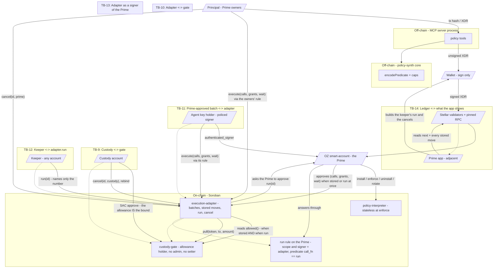

# OZ Policy Builder - STRIDE Threat Model

**Subject:** the `policy-interpreter`, `custody-gate` and `execution-adapter` Soroban contracts plus the `@crediolabs/policy-synth`, `@crediolabs/policy-builder-cli`, `@crediolabs/policy-builder-mcp` off-chain toolchain, and, from this run, their deployment on Stellar mainnet. Two parts of the Prime app (OctoPos `apps/web`) are modelled as adjacent data flows: F5, where stored moves meet the people who run and cancel them, and F6, where a venue pool is picked for a rule or a gate's destination list.
**Date:** 2026-10-01 (re-run for the mainnet deployment; first written 2026-08-23, re-run 2026-09-25 and 2026-09-29)
**Methodology:** Stellar STRIDE Threat Modeling, "STRIDE Threat Model Template" and "Threat Modeling How-To Guide" pages at `developers.stellar.org/docs/build/security-docs/threat-modeling`. The four-question scaffold (What are we working on / What can go wrong / What are we going to do about it / Did we do a good job) and the STRIDE-per-element format are followed.
**Repo:** `untangledfinance/oz-policy-builder`
**Grammar version:** 6 (`SELF_VERSION`, `src/version.rs`)
**Subject tree:** 1353 lines of on-chain production code - interpreter 1082, adapter 216, gate 55 - counted as non-blank, non-comment lines of each crate's production source. The 2026-09-25 run reported 1074 with a different count; the same count over that tree gives 1267 (interpreter 1082, adapter 130, gate 55), so the whole on-chain delta is the adapter's +86 (+79 for the wait, +7 for finding 2's fix).

### What changed since the 2026-09-29 run

**The Prime contracts are on mainnet, and the Prime app uses them.** On
1 October 2026 `scripts/deploy-prime-mainnet.ts` uploaded the gate code
`b01024f3…`, the adapter code `68d012e7…` and the grammar-6 interpreter code
`5143e641…`, created the interpreter instance
`CAOBQ4ZXANKXAGEJWJLIGQJDFCTHMEZVUPLPX277KSDMEU4MEWVVXO2R`, and extended
those four entries. Fees came to 158.36 XLM; every transaction is in
`deployments/prime-mainnet.json`. The app at app.untangled.finance pins these
hashes and the instance for mainnet.

The contract source is the one the 2026-09-29 run modelled; no on-chain code
changed. This run asks what the deployment itself adds:

- who deployed it and what that key can still do (section 5, D1);
- whether mainnet runs the code that was reviewed (D1);
- what happens as mainnet entries archive, now that we have decided not to
  keep them live on a schedule (D1-D.1, C8-D.1, C9-D.5, F5-D.2, A-5);
- how the app chooses venue pools on mainnet, where it lists every Aquarius
  and Blend pool from the portfolio API instead of a fixed testnet list (F6).

Findings are in section 8. Three were fixed before this report. The one that
mattered most: the pool list and the venue names trusted the API and the
contract's own answers about what a pool is, so a lookalike contract could be
put on a gate's destination list, which cannot be changed afterwards (F6-S.1).

### What changed in the 2026-09-29 run, against 2026-09-25

**The adapter can hold a move back.** `execute(calls, grants, wait)` runs at
once when `wait` is 0, as before; with a wait it stores the batch, and anyone
may `run(id)` it once the wait is over and until a run window closes. The
Prime or custody may `cancel(id, by)` it first. The adapter's address now
commits to its minimum wait and run window, and a stored batch runs under a
Prime rule the adapter itself signs.

That breaks a property the last run leaned on: *"Neither new contract keeps a
counter, an accumulator or a nonce."* The adapter now keeps a counter and a
store of approved-but-unrun batches, so the questions state invites - how long
it lives, what outlives what, who can see it, who has to act on it - are asked
here for the first time (section 5, C9 and F5).

**Everything else is the same code.** The interpreter and the three packages
differ from the 2026-09-25 tree only in ten comment and path lines, and CI's
interpreter build parity still matches the deployed hash. The gate is the same
source under a new folder name (`contracts/custody-gate`, was
`custody-gate-v3`). Their rows are carried forward and were re-verified by
this run's tool evidence (section 8), not re-derived.

**Builds are reproducible.** The gate and adapter hashes the app pins are
Linux builds recorded in `deployments/execution-testnet.json`, and CI rebuilds
both and compares. That closes the last run's note that "anything that pins a
hash moves with prose edits" without a check to catch it.

---

## 1. Scope and version

### In scope

- `contracts/policy-interpreter/` - the on-chain Soroban contract that evaluates one predicate per `enforce` call.
- `contracts/custody-gate/` - the client's gatekeeper. Holds no funds: it holds an allowance custody granted it, and releases inside that only to one code-pinned caller, only to a listed destination.
- `contracts/execution-adapter/` - the per-Prime batcher, bound to one gate. Refuses any batch mentioning an address the gate does not name, and can store a batch to run after a wait.
- `packages/policy-synth/`, `packages/policy-builder-cli/`, `packages/policy-builder-mcp/` - the off-chain core, CLI and MCP server.
- **Adjacent, data flow F5:** OctoPos `apps/web` - Prime Execution's wait field and stored-moves list, the keeper path that runs a stored move, the cancel paths, and Manage execution's install of the run rule.
- **Adjacent, data flow F6 (new):** OctoPos `apps/web` - the venue pool picker used by the rule dialogs and by gate setup, and the code that names a venue contract.
- **The mainnet deployment (new, D1):** `scripts/deploy-prime-mainnet.ts`, the deployer account, and the entries it created, with their lifetimes.

### Out of scope, named with their trust assumption

- `contracts/test-blend-pool/` - a test double, testnet only. Not modelled.
- The v1, v2 and v3 adapter generations and the older gate builds. v1/v2 source is at tag `archive/contracts-before-v3-only`, v3 at `archive/execution-adapter-v3`. Trust assumption: still deployed and reachable by accounts that use them; an account on them inherits the model of its generation, not this one. The Prime app still recognises v3 pairs.
- OpenZeppelin Stellar smart-account contracts (v0.7.2). Trust assumption: `__check_auth`, context-rule selection and signer semantics are correct. This run relies on one more of their behaviours than the last - a `Delegated` contract signer is verified with `require_auth_for_args`, which a contract passes only when it is the one that asked (measured, C9-S.3).
- Stellar protocol, validators, RPC endpoints, and the network's state-archival settings (measured in C9-D.4/D.5, not assumed).

### The property the model turns on

**`enforce` creates no state, changes none, and reads only what install fixed.**
Unchanged from the last run and still true: the interpreter source is
identical. Its two value reads are the predicate document and the signer-set
hash, both written at install; the one write-shaped operation is a TTL bump on
the permit path that can never create an entry and is rolled back on a deny.

### What the adapter now keeps, and what that brings

| State | Where | Written by | Lives |
|---|---|---|---|
| `prime`, `gate`, `min_wait`, `window` | instance | constructor; `gate` also by `rebind` (custody only) | the instance's lifetime |
| `next` - the last stored batch number | instance | `execute` with a wait | the instance's lifetime; a `u32` that only grows |
| each stored batch `(calls, grants, run_at)` | persistent, keyed by its number | `execute` with a wait; removed by `run` and `cancel` | until its window closes, capped at the network maximum (~180 days) - extended when stored; the first build of the 2026-09-29 run left it the network minimum (C9-D.4) |

The gate still keeps nothing but its constructor's configuration.

### Methodology followed

As the last run: enumerate external entities, processes, data flows, data storage and trust boundaries, then apply STRIDE per element. Sections 2-8 follow that structure.

---

## 2. System decomposition

### Components

| ID | Component | Boundary | Purpose |
|---|---|---|---|
| C1 | `policy-interpreter` Soroban contract | on-chain | Stores `(predicate_bytes, signers_hash, master_set, nonce)` per rule; evaluates on `enforce`; gatekeeps install, uninstall, rotate. |
| C2 | OpenZeppelin smart-account contract | on-chain (out of scope but on the call path) | The Prime Account. Calls `interpreter.install` / `enforce` / `uninstall`; produces signed auth trees; selects the context rule each authorisation context is checked against. |
| C3 | `policy-synth` core | off-chain (TypeScript) | Synthesises a `ProposedPolicy` from a `RecordedTransaction`; emits canonical ScVal predicate bytes + hash. |
| C4 | `policy-builder-mcp` server | off-chain (TypeScript) | Exposes the policy tools over stdio or Streamable HTTP. |
| C5 | `policy-builder-cli` | off-chain (TypeScript) | Thin command-line surface over the synth core. No key custody. |
| C6 | Wallet | user-side | Signs what the tools and the app present. |
| C7 | Pinned Soroban RPC | external network | `getAccount`, `simulateTransaction`, `getLatestLedger`, `getLedgerEntries`, `getTransaction`. |
| C8 | `custody-gate` contract | on-chain | Holds an allowance custody granted it and spends strictly inside it. No admin, no setter, no upgrade. `pull` requires the pinned caller's auth, that caller's pinned CODE, and a listed destination. |
| C9 | `execution-adapter` contract (v4) | on-chain | Per-Prime batcher bound to one gate. Runs a batch at once or stores it; runs a stored batch once its wait is over and before its window closes; lets the Prime or custody cancel one. Refuses any batch that mentions an address the gate does not name, when stored AND again when run. |
| C10 | Custody account | user-side | Deploys the gate, grants its allowance, may cancel a stored batch and rebind the adapter. |
| C11 | Prime app (OctoPos `apps/web`) | off-chain, adjacent | Sets gates up for v4, creates the adapter and its run rule, stores and lists moves, runs a ready one from any wallet, cancels as the Prime or as custody. |

### Data storage

| ID | Storage | Lifetime | Who writes | Notes |
|---|---|---|---|---|
| S1 | `(account, rule_id, K_DOC=1)` -> `StoredDoc { predicate_bytes }` | persistent; TTL bumped on the permit path | `install` | `src/storage.rs` |
| S2 | `(account, rule_id, K_NONCE=2)` -> `u32` | persistent; bumped alongside K_DOC | `install` | replay protection |
| S3 | `(account, rule_id, K_SIGNERS_HASH=3)` -> `BytesN<32>` | persistent; bumped alongside K_DOC | `install`, `rotate_master_signer_set` | binds the policy to a signer set |
| S4 | `(account, rule_id, K_MASTER_SET=4)` -> `Vec<Signer>` | persistent; bumped alongside K_DOC | `install`, `rotate_master_signer_set` | governs install/uninstall/rotate |
| S5 | gate instance: `Cfg { custody, caller, caller_code, allowed }` | instance; written once; **never extended** | gate `__constructor` | no setter exists |
| S6 | adapter instance: `prime`, `gate`, `min_wait`, `window`, `next` | instance; **extended by `execute` and `run`** to ~30 days once fewer than ~7 remain (fixed 2026-09-29) | constructor, `rebind` (`gate`), `execute` (`next`) | `prime`, `min_wait`, `window` write-once; the address commits to the last two |
| S7 | adapter persistent `u32 id` -> `(calls, grants, run_at)` | persistent; **extended when stored to last until its window closes**, capped at the network maximum (fixed 2026-09-29) | `execute` with a wait; removed by `run`, `cancel` | public; one entry per pending move |

Interpreter TTL: `TTL_BUMP_THRESHOLD` 100, `TTL_BUMP_TO` 518,400 on the permit
path. When the 2026-09-29 run began nothing else in the stack extended anything, and on
Soroban a write does not extend an entry's lifetime either - measured, not assumed: the beta adapter
`CA3OJ25D…` was last written at ledger 4,931,927 and still expires at
5,052,059, exactly 120,960 ledgers after it was created. Network minimums,
read from each network's `StateArchival` config on 2026-09-29:

| Network | Minimum persistent lifetime | Maximum |
|---|---|---|
| testnet | 120,960 ledgers (~7 days) | 3,110,400 |
| mainnet | 2,073,600 ledgers (~120 days) | 3,110,400 |

### External dependencies (named, with trust assumption)

- **Stellar validators + RPC** - assumed honest at the protocol level; RPC URLs pinned per network in `packages/policy-synth/src/run/schemas.ts`.
- **OpenZeppelin smart-account contracts** - assumed correct. The run path depends on their `Delegated` signer check (`require_auth_for_args` on the signer), which the adapter satisfies only as the contract that asked.
- **Soroban host** - assumed correct: `require_auth`, `authorize_as_current_contract`, the refusal to re-enter a contract already on the stack, overflow traps in release builds, and state archival.

There is **no external data feed**, and the interpreter makes no
cross-contract calls during `enforce`.

### Actors

| Actor | Trust | Capability |
|---|---|---|
| Principal / Prime owners | trusted by self | The Prime's own authority (rule 0 or the approval team): anything the account may do, including storing moves with any wait at or above the adapter's minimum, cancelling them, and adding or removing rules - the run rule included. |
| Agent key holder (policed signer) | trusted by the policy author, bounded by the rule | Stores or runs moves only as its rule's predicate allows, including a minimum wait of the rule's own (`call_arg(2) >= N`). Cannot cancel. |
| Custody account | trusted for its own funds | Grants and revokes the allowance; cancels any stored move; rebinds the adapter. |
| **Keeper** (new) | untrusted | ANY account. Runs a ready stored move by naming its number; chooses only WHEN, inside the run window. Pays the fee; signs nothing for the Prime. |
| Operator / deployer | trusted at deploy time only | Uploads the builds, pins hashes and addresses. On mainnet, account `GCIVG2AI…7NFN` uploaded the code and created the interpreter. None of the three contracts has an admin, a setter or an upgrade entry point, so the key holds no power over them once they exist (D1-E.1). |
| Portfolio API (new) | untrusted for what a pool is | Lists venue pools for the picker (F6). The app checks each listed contract's code before offering it. |
| Attacker classes | untrusted | As the last run (MCP transport, local user, compromised LLM agent, mistaken policy author, hand-crafted predicate), plus **(f) anyone who reads pending moves off the ledger** and **(g) a compromised or revoked agent with moves already stored**. |

### Design stance

- **Policy is DATA; the interpreter is the audit-once surface.** Unchanged.
- **Wallet signature is the user-confirmation step.** Unchanged for the tools; in the app a stored move is approved once, when it is stored, and never re-approved when it runs.
- **Approval is at store time; running is permissionless within a window.** What runs is fixed by the Prime's approval of `(calls, grants, wait)`; the runner adds only timing. That is the whole trade: a wait custody can act inside, in exchange for approval that no longer tracks later changes to the rules (C9-E.5).
- **Write-free enforcement is still a security property of the interpreter.** It is no longer a property of the adapter.

---

## 3. Assets

What an attacker wants:

1. **Account balances reachable by the policed signer.** The interpreter authorises one call at a time; the reachable surface is whatever the smart account's balances and allowances make available to that signer.
2. **Integrity of the installed predicate.** Mitigated by `sha256(predicate_bytes)` matching the caller-supplied `predicate_hash` at install.
3. **Interpreter immutability.** Install is refused unless the interpreter is the pinned one or `allowUnpinnedInterpreter: true`.
4. **Availability of `enforce`.** The interpreter fails CLOSED on every deny code.
5. **Master-set authority.** Established at install, rotated only by itself.
6. **Cross-layer integrity: TS encoder vs Rust decoder.** Pinned by the conformance suite.
7. **The custody allowance.** The blast radius of everything downstream of the gate. Protected by the gate's code pin and destination list.
8. **The adapter's reachability.** An adapter that cannot run cuts a Prime off from custody-funded execution until it is replaced.
9. **The wait itself (new).** Custody's protection against the Prime's own owners is the time between a move being stored and it becoming runnable. Anything that shortens it - a lower `min_wait` than custody agreed, a wait the approver did not see, a run before `run_at` - defeats the feature.
10. **The integrity of a stored move (new).** What runs must be exactly what was approved, once, and only while it is still meant to run.
11. **Liveness of the pieces a move needs (new).** A stored move needs its own entry, the adapter's instance, the gate's instance, the Prime's rules, the run rule and the uploaded code all to be live when it runs - and only the adapter and its stored moves extend themselves (C9-D.4, C9-D.5).

### Verified constraints the model must respect

Carried forward, re-verified by this run's test evidence where marked:

- **OZ no-policy rule vs POLICED rule.** A no-policy context rule requires the FULL signer set (all-of-N); attaching a POLICED rule lets any ONE signer act alone (any-of-N). Surfaced via `signerNote`.
- **Fail-closed on every deny.** `panic_with_error!` rolls back the frame.
- **TTL bump only on the allow path**, gated on `p.has(&key)`.
- **Install-time shape validation** - codes 200, 201, 207, 208, 209, 212, 214, 216, 217 as listed in the last run; the interpreter source is unchanged and its 151 unit tests and 18 conformance tests pass (section 8).
- **Multiple policies on one rule compose as ALL-OF** (`evidence/oz-policy-composition.log`).
- **A real OZ `spending_limit` binds beside the interpreter** (`evidence/oz-spending-limit-binding.log`).
- **`simple_threshold` restores the m-of-n that attaching a policy removes** (`evidence/oz-threshold-binding.log`).
- **Grammar-version parity across layers**, asserted by a test.

New in the 2026-09-29 run, all measured on testnet (`evidence/execution-wait-testnet.log`,
`evidence/execution-address-rule-testnet.log`) or in the adapter's unit tests:

- **A stored move can be run by anyone, and needs no Prime key.** Run from an account with no role: a Blend supply, a recovery pull to the trustee and an agent's move all landed.
- **The run rule approves `run` and nothing else.** Named for an immediate `execute`, a stored `execute` or a `cancel`, it was refused `#100` each time.
- **Revoking an agent does not reach its stored moves.** With the agent's rule removed, its stored move still ran.
- **Removing the run rule pauses every stored move at once**, and they stay stored.
- **A stored move lives the network minimum from when it is stored, whatever its wait** (first v4 build; fixed in `68d012e7…`, C9-D.4): 120,959 ledgers left on a move stored with a 50-ledger wait, against a minimum of 120,960.
- **The adapter's address commits to its numbers.** Created at custody's named address with a minimum wait of 0, or with a longer window, it was refused `#8 NotWhereAgreed`.
- **The adapter's floor binds the owners.** Waits below it refused `#4`, for rule 0 too.
- **A batch cannot call the adapter back.** `Error(Context, InvalidAction)` - the host refuses re-entry - so a stored move cannot cancel or run another.

---

## 4. Trust boundaries and data flow diagram

### Trust boundaries (numbered)

TB-1 to TB-8 are as in the last run and their elements are unchanged:
Principal <-> MCP server, MCP server <-> pinned RPC, MCP server <-> synth core,
wallet <-> validators, OZ <-> interpreter, agent key <-> OZ, MCP <-> registry,
user-supplied predicate bytes <-> contract.

| ID | Boundary | Crossing | Trust direction |
|---|---|---|---|
| TB-9 | Custody account to custody gate | SAC `approve`, granted per token | custody -> gate (the allowance is the bound) |
| TB-10 | Adapter to gate | `pull` cross-contract call | untrusted caller -> gate (checks caller address, its CODE, the destination) |
| TB-11 | Prime-approved batch to adapter | `execute(calls, grants, wait)` | untrusted content -> adapter (address rule before storing and before running; the Prime approves all three arguments) |
| **TB-12** | Keeper to adapter | `run(id)` | untrusted -> adapter (the keeper names only a number; the adapter decides what runs and whether now is inside the window) |
| **TB-13** | Adapter to the Prime's run rule | `prime.require_auth_for_args((id,))` answered by a rule whose one signer is the adapter | contract-signed, no key -> Prime (the rule's predicate is the whole of the restriction) |
| **TB-14** | Ledger to the app's stored-moves list | `getLedgerEntries` over every stored number | public state -> the people who decide to cancel (what they do not see, they cannot stop) |

---

## 5. STRIDE analysis per element

C1 and F1-F4 are carried forward unchanged: their code is identical to the 2026-09-25 tree, and this run's tool evidence (section 8) re-verified them. C8, C9 and F5 are carried from the 2026-09-29 run, with their archival rows updated for mainnet; D1 and F6 are new. C2-C4 are out of scope and named with their trust assumption.

### Element C1 - `policy-interpreter` contract

| ID | Cat | Threat | Attack scenario | Likelihood | Impact | Mitigation | Residual |
|---|---|---|---|---|---|---|---|
| C1-S.1 | Spoofing | Attacker submits `enforce` as if it were the smart account | Anyone could drive the policy's evaluation path against an account they do not control | Low | High | `smart_account.require_auth()` is the first statement in `enforce` (`src/lib.rs`). | The require_auth is the host's guarantee; if the OZ smart-account contract is broken the bound moves. |
| C1-S.2 | Spoofing | `authenticated_signers` payload forged to claim authority | Attacker prepends a master signer to bypass a non-master check | Low | High | `authenticated_signers.is_empty()` panics (210); `require_master` calls `require_auth` on every stored master signer (`src/auth.rs`), and OZ enforces the signature map separately. | None beyond the host. |
| C1-T.1 | Tampering | Predicate bytes mutated between hash-check and store | A same-shape-but-different-bytes payload installed under a stale hash | Low | High | `sha256(predicate_bytes)` recomputed and compared against `predicate_hash`; mismatch panics 208. | None. |
| C1-T.2 | Tampering | Rule's live signer set changes behind the policy's back | A different signer set silently authorises a permit the policy was written against a stricter set | Medium | High | At every `enforce`, the live signer set's sha256 is compared against the value stored at install; mismatch panics 204. `rotate_master_signer_set` is the authorised mutation and updates both `signers_hash` and `master_set` together. | None - rotation is the only path. |
| C1-T.3 | Tampering | Non-master signer attempts to install or rotate | Any signer could overwrite the predicate | Medium | Critical | `require_master` calls `require_auth` on every member of the stored master set. Install additionally requires `smart_account.require_auth()` on **every** install, so an attacker cannot pre-seed a fresh `rule_id` with their own master set. | None. |
| C1-T.4 | Tampering | Master set rotation to an empty or External set bricks the rule | `Signer::External(_, _)` verifier contracts never satisfy `require_auth`; an empty set iterates zero times | Medium | Medium | `rotate_master_signer_set` refuses an empty set (209), an oversized set (217), and any External set (212). The same refusals apply at install. | None - the refusal is symmetric. |
| C1-R.1 | Repudiation | Action denied without a specific reason code | Off-chain tooling cannot distinguish "not on the allowlist" from "argument mismatch" | Low | Low | Every deny goes through `panic_deny_reason` with an exhaustive `From<DenyReason> for PolicyError` map; the contract emits `Error(Contract, N)`. Distinct reasons: `ArgMismatch` 100, `ContractScope` 101, `ArithmeticOverflow` 102, `UnsupportedNode` 103, `StatefulBound` 104, `NotInAllowlist` 105. | None within the interpreter. |
| C1-R.2 | Repudiation | Permit without an audit trail | An operator cannot tell which signer authorised a given permit | Medium | Low | `authenticated_signers` is passed into `enforce` from OZ and not stored; OZ is the source of truth for auth records. | The interpreter cannot authoritatively record the signer set; OZ's `__check_auth` is the audit path. |
| C1-I.1 | Info disclosure | Predicate bytes leak the policy shape | The predicate is stored as raw bytes; the ledger is public | Low | Low | All storage is `persistent()` and addressable by `(account, rule_id, K_DOC)`. | The interpreter does not encrypt the predicate; secrecy is the policy author's choice, and ledger state is public regardless. |
| C1-D.1 | DoS | `extend_ttl` precedes the predicate check, so a deny could extend TTL | A deny could keep the rule alive "for free" | Low | Medium | `extend_state_ttl` runs BEFORE `evaluate`; every deny panics and the host rolls back the frame including the bump. The bump is guarded on `p.has(&key)` so it never creates state. | None - the rollback is host-guaranteed for `panic_with_error!`. |
| C1-D.2 | DoS | Archive on the doc / nonce / signers_hash / master_set | Persistent entries that archive cannot be re-read; the next install cannot recreate them because the nonce check would loop | Low | High | All four share one lifecycle and are bumped together on the permit path; the doc is re-read on every `enforce`. | Accepted: a rule that is never used for longer than the TTL archives. That is the Soroban state model, not a contract defect. |
| C1-D.3 | DoS | Predicate walk is unbounded | A deeply nested or wide predicate exhausts the host budget | Low | Medium | `decode_with_byte_cap` rejects over `MAX_PREDICATE_BYTES` (32 KB) before parsing; `MAX_DEPTH` 5, `MAX_LEAVES` 200, `MAX_IN_OPERAND_COUNT` 32 are enforced after decode. | None - the byte cap dominates every walk. |
| C1-D.4 | DoS | Per-transaction write-entry cap exceeded at runtime | A predicate that installs and then aborts the host on every enforce | Low | High | **Structurally impossible.** `enforce` writes no ledger entries at all; the only writes are the four install-time entries and the TTL bump. | None. |
| C1-D.5 | DoS | Hand-crafted predicate installs and denies on every enforce | A predicate that decodes but never permits | Low | Medium | Every evaluation failure surfaces as a `DenyReason` mapped to a `PolicyError`; the deny is a clean revert, not a hang. | None - fails closed. |
| C1-E.1 | Elevation of privilege | Hand-crafted permissive predicate (only literal-vs-literal compares) installs and authorises everything | Bypassing the synth to submit raw bytes | Low | Critical | Install refuses any predicate carrying no selector leaf: `SelectorLeafRequired` 216 (`dsl::has_selector_leaf`). | None for the "binds nothing" case. The trust-boundary note sets out the limit of the guarantee. |
| C1-E.2 | Elevation of privilege | OZ no-policy rule is all-of-N; POLICED rule is any-of-N | User attaches a POLICED rule expecting "two approvals" by adding a 2nd signer | High | Critical | Surfaced via the review-card `signerNote` whenever `signers.length >= 2`, decoded from the FINAL transaction rather than the input args. When the caller supplies `existingRules`, `install_policy` also returns an `authorityScan` naming every rule a signer of the new policy could name instead. Off chain only. | Unmitigated at the protocol layer; the note is advisory, and the scan runs only on caller-supplied input. Tracked as R-2. |
| C1-E.3 | Elevation of privilege | External verifier in the master set becomes an unrecoverable state | `require_master` calls `require_auth` on the verifier address, which a plain verifier contract never satisfies | Low | Critical | Install and rotate both refuse External signers in the master set (212). | Tracked as R-3: refusing is the correct behaviour, not a limitation. |
| C1-E.4 | Elevation of privilege | `install_nonce` replay between two installs | A replayed install overwrites a fresh predicate | Low | High | `install_nonce` must equal `stored_nonce + 1`; mismatch panics 202. `uninstall` removes the nonce with the rest of the state, so a subsequent install starts again at 1. | None. |
| C1-E.5 | Elevation of privilege | Transitive authority through a permitted callee | The policy permits calling contract X; X then moves funds using a standing SEP-41 allowance the account granted earlier. That transfer needs no auth from this account, so it produces no `Context` and no `enforce` call | Medium | High | **Depth itself is covered:** OZ builds one `Context` per auth-tree node requiring this account's authorisation and calls `enforce` once per context, so a smuggled inner call that needs this account's auth IS evaluated on its own merits. `extract_call` handling only `Context::Contract` is a shape check, not a depth limit. | Residual by nature, not by scope. Mitigated operationally - a policed key must hold zero standing allowances. Tracked as R-1. |
| C1-E.6 | Elevation of privilege | Grammar-version skew between the builder and the contract | An off-chain builder emitting an older `grammar_version` produces installs the contract refuses - or, in the inverse case, a contract that accepts a document written against a different leaf set | Medium | High | `install_params.grammar_version != SELF_VERSION` panics 200, and a test asserts the builder's literal equals `SELF_VERSION`. | None on chain. The off-chain side is the fragile half, since the parity is held by a test rather than by the type system. |
| C1-E.7 | Elevation of privilege | An inverting `call_arg_scaled` ratio turns a slippage floor into a permit | A negative `num` or `den` flips the comparison, so `call_arg >= call_arg_scaled(in, -1, 100)` permits exactly the trades the floor was written to refuse - and at evaluate it looks like a policy working normally | Medium | High | Install refuses a zero or non-positive ratio: `InvalidScaledRatio` 214 (`dsl::validate_scaled_ratios`, which walks into `or` branches and literal vectors). `encodePredicate` refuses the same shapes off chain, and `declare_policy` refuses them again at the point the ratio is stated. | None on chain. The gate is at install, where the mistake is knowable; at evaluate a wrong-but-valid ratio is indistinguishable from an intended one. |
| C1-E.9 | Elevation of privilege | A `call_path` bound reaches ONE call of a batch and says nothing about the others | Grammar 6 addresses `calls[n].args[i]`. A predicate pinning `calls[0]` and `calls[1]` permits a batch of five: the two it named are compliant and the other three are unexamined. Every extra call still has to survive the adapter's address rule, so the reachable set is the gate's own list - which names the gate. `gate.pull(token, adapter, amount)` appended to a compliant batch is therefore both listed and unbounded, and drains the allowance to its SAC limit | Medium | Critical | **A batch predicate needs a cardinality pin to be a bound at all**, exactly as `call_arg_field` needs one (F4-E.3). Every construction path emits `eq(call_arg_len(0), n)` over the calls vector and `eq(call_arg_len(1), m)` over the grants vector, and the OctoPos mandate encoder now REFUSES a predicate that reaches `calls[n]` without both - checked against the encoded tree, so a builder cannot forget. `PathStep::Len` makes the pin expressible for nested vectors too; a `call_path` ending in `Len` reads the length of the vector reached so far. | The interpreter cannot detect the omission: a predicate without the pin is well-formed and it enforces exactly what it was given, and telling a list of independent actions from an ordinary vector argument is venue ABI knowledge it deliberately does not hold. Anything assembling a grammar-6 batch predicate outside that encoder must emit the pair itself. |
| C1-E.8 | Elevation of privilege | `call_arg_scaled` arithmetic overflows and yields a bound the author did not write | `args[i] * num` exceeding i128 | Low | Medium | `checked_mul`/`checked_div` throughout; overflow and a zero denominator both deny with `ArithmeticOverflow` 102 rather than wrapping or panicking the frame. The TS reference evaluator applies the same i128 bounds so the two layers agree at the boundary. | None - fails closed. |

### Data flow F1 - install pipeline (U -> MCP -> synth -> unsigned XDR -> wallet -> chain -> OZ -> interpreter)

| ID | Cat | Threat | Attack scenario | Likelihood | Impact | Mitigation | Residual |
|---|---|---|---|---|---|---|---|
| F1-S.1 | Spoofing | MCP server returns XDR for a different smart account than requested | `install_policy` is the canonical path | Low | Critical | The XDR is built from the caller-supplied `smartAccount` and a `describes` field is produced by decoding the assembled XDR; the user sees the address in the review card. The MCP server holds no key material. | The wallet signature is the user-confirmation step; the user must see and approve the address. |
| F1-T.1 | Tampering | Predicate bytes differ between synth-emit and chain-install | TS encoder and Rust decoder divergence | Low | High | `sha256` over the raw XDR is computed at encode time; the contract re-computes it on receipt and panics 208 on mismatch. The conformance suite pins encoder to decoder. | None. |
| F1-T.2 | Tampering | `authNonce` from a non-pinned RPC binds the caller to the wrong host | Caller supplies an `rpcUrl` other than the pinned URL | Medium | Medium | Default-deny on `rpcUrl` unless `allowUnpinnedRpcUrl: true`; the same gate applies to `revoke_policy` and `get_interpreter_info(verifyLive)`. | None - opt-in is explicit. |
| F1-T.3 | Tampering | `interpreterAddress` is an attacker-controlled contract | The smart account would delegate to an interpreter the caller controls | Low | Critical | `enforceInterpreterPin` runs BEFORE building the XDR; default-deny unless `allowUnpinnedInterpreter: true`. | None - opt-in is explicit. |
| F1-R.1 | Repudiation | Install succeeds but the user denies signing it | Wallet-side record | Low | Low | The XDR is unsigned; the wallet signature is the audit record. The MCP body is stateless and holds no key material. | None at the synth. |
| F1-I.1 | Info disclosure | Install error messages leak internal commentary | A throw's `message` includes source-code rationale | Low | Low | `safeStringify` strips `Error.stack`; message and details lengths are bounded. | None. |
| F1-D.1 | DoS | HTTP transport flooded with large requests | Any caller can hit `POST /mcp` if bound to a non-loopback host | Medium | Medium | Default-bind to loopback; 1 MB body cap; explicit `allowExternalHost: true` opt-in. | The opt-in is the auditable intent. |
| F1-E.1 | Elevation of privilege | `__testPredicateNode` seam in the public type | A downstream consumer bypassing the MCP/CLI gates could supply a permissive test predicate | Low | Critical | The seam lives on `__TestInterpreterAdapterOptions`, not the public options type; a runtime guard throws when `NODE_ENV !== 'test'`. | Mitigated at the seam. |

### Data flow F2 - enforce pipeline (agent key -> OZ -> interpreter)

| ID | Cat | Threat | Attack scenario | Likelihood | Impact | Mitigation | Residual |
|---|---|---|---|---|---|---|---|
| F2-S.1 | Spoofing | Attacker invokes `enforce` directly without going through the smart account | The host is the gate | Medium | High | `smart_account.require_auth()` is the first statement of `enforce`; OZ's `__check_auth` only authorises the call if it routed through the smart account's auth tree. | If OZ's `__check_auth` were broken, the bound moves. |
| F2-T.1 | Tampering | Stored predicate bytes tampered between `install` and `enforce` | Persistent storage is the source of truth | Low | High | Every `enforce` re-decodes via `decode_with_byte_cap`; a tampered or truncated predicate panics 201. | None. |
| F2-T.2 | Tampering | Live signer set changes between installs without rotation | A different signer set silently authorises a permit | Medium | High | At every `enforce`, `sha256(context_rule.signers)` is compared against the value stored at install; mismatch panics 204. | None. |
| F2-R.1 | Repudiation | Permit without signer record | OZ is the audit path | Low | Low | `authenticated_signers` is forwarded to the interpreter; OZ separately enforces the signature map. | None at the interpreter. |
| F2-I.1 | Info disclosure | `DenyReason` codes reveal internal evaluator state | Any observer of host events sees the numeric code | Low | Low | Codes are grouped (1xx evaluator, 2xx install/auth/state) and never renumbered or reused; the numeric codes are a public ABI. Retired codes are not recycled. | None. |
| F2-D.1 | DoS | Evaluation cost grows with predicate size | A large predicate slows every call | Low | Low | Structural caps are enforced at install and re-checked at decode; `enforce` performs no cross-contract calls and no storage writes, so its cost is bounded by the predicate walk alone. | None. |
| F2-E.1 | Elevation of privilege | `enforce` accepts an argument that bypasses the policy | A side-channel to inject a different predicate | Low | Critical | The contract is pure with respect to policy: `enforce` decodes stored bytes and walks the evaluator; there is no path to substitute a predicate. | None. |

### Data flow F3 - MCP HTTP transport

| ID | Cat | Threat | Attack scenario | Likelihood | Impact | Mitigation | Residual |
|---|---|---|---|---|---|---|---|
| F3-S.1 | Spoofing | Attacker supplies a forged `rpcUrl` to bind the auth digest | `verifyLive: true, rpcUrl: '<attacker>'` | Medium | Medium | `enforceRpcPin` runs before the live version lookup when `verifyLive === true`. | None. |
| F3-T.1 | Tampering | JSON-RPC batch request | A malicious batch smuggles extra calls | Low | Low | Array bodies are explicitly rejected. | None. |
| F3-R.1 | Repudiation | Tool-call log missing | Per-call stateless; no log | Low | Low | The wallet signature is the user-confirmation; OZ's auth tree is the audit path. | None. |
| F3-I.1 | Info disclosure | HTTP errors leak host/URL detail | `simulateTransaction` errors echoed | Low | Low | Errors are mapped to short stable reasons; the full payload stays in SDK logs. | None. |
| F3-I.2 | Info disclosure | A dependency of the HTTP transport mis-parses a URI | `fast-uri` < 3.1.6 (under `ajv`, under the MCP SDK) had SSRF and host-confusion advisories in its normalisation of IPv6, percent-encoded schemes and hostnames | Medium | High | Transitive versions pinned by `overrides` to patched releases within their majors; `bun audit` is a CI gate and now passes. On 2026-10-01 new `axios` and `ip-address` advisories were fixed by a lockfile update inside the declared ranges. | The pin is manual: an override must be revisited when the MCP SDK itself moves past the vulnerable range, or it holds the tree back. |
| F3-D.1 | DoS | Non-loopback host exposes unauthenticated tools | `host: '0.0.0.0'` exposes the surface | Medium | Medium | Default-deny on non-loopback hosts; explicit `allowExternalHost: true` opt-in; 1 MB body cap enforced by the streaming reader. | The opt-in is auditable. |
| F3-E.1 | Elevation of privilege | No auth on `/mcp` | Any caller who can reach the port calls the tools | High | High | Default-bind to loopback; no bearer/HMAC exists. A production deployment is expected to gate at a reverse proxy. | Tracked as A-1. |

### Data flow F4 - policy-synth core (recording -> predicate bytes)

| ID | Cat | Threat | Attack scenario | Likelihood | Impact | Mitigation | Residual |
|---|---|---|---|---|---|---|---|
| F4-S.1 | Spoofing | Caller supplies a placeholder/LLM-seam smart-account marker | `VERIFY-*` / `PLACEHOLDER-*` / `TODO-*` | Low | High | The placeholder prefix is rejected before the C.../56-char check. | None. |
| F4-T.1 | Tampering | i128 wrapping at encode time | `2^127` overflows | Low | Medium | `scvI128FromDecimal` range-checks; out-of-range values throw at encode time. | None. |
| F4-D.1 | DoS | Predicate depth / leaf count explodes | | Low | Medium | `PREDICATE_CAPS` (depth 5, leaves 200, in-operand 32, 32 KB) enforced at encode and mirrored on the host. | None. |
| F4-D.2 | DoS | ScVal recursion stack overflow | | Low | Medium | `MAX_SCVAL_DEPTH = MAX_SCVAL_CLONE_DEPTH = 30` caps the decoder and the clone paths. | None. |
| F4-E.1 | Elevation of privilege | A hand-crafted predicate of only literal-vs-literal compares installs and permits everything | Bypass the synth and call `buildAddContextRuleArgs` directly | Low | Critical | `encodePredicate` refuses a predicate with no selector leaf, and the contract refuses it again at install with 216. | None on chain. The off-chain refusal is a convenience; the contract is the enforcing layer. |
| F4-E.2 | Elevation of privilege | The off-chain builder emits a `grammar_version` the contract does not speak | Every install fails, or a document is built against the wrong leaf set | Medium | High | `POLICY_INSTALL_PARAM_FIELDS` is the ABI the host unpacks by field count; the version literal is pinned in the `PolicyDocument` type so a skew is a type error at the emitting sites. | A CI test asserts the TS literal equals `SELF_VERSION` parsed from `version.rs`, so a skew fails the build rather than the install. Tracked as R-5. |
| F4-E.3 | Elevation of privilege | A bound on one element of a vector argument reads as a cap and permits any amount through a sibling element | Author a predicate carrying `lte(call_arg_field(i, 0, "amount"), N)` with no `eq(call_arg_len(i), n)` pin, or with a pin whose range covers an element nothing bounds | Medium | Critical | `call_arg_field` binds ONE element and says nothing about the others, so a cap needs BOTH the per-element bounds and the length pin. The four construction paths emit both by design (`declare.ts`, `compose-from-recording.ts`, and the two in the OctoPos install card / edit dialog); the one path that accepts an author-supplied predicate, the skill's `build-predicate.ts --json`, validates the shape and refuses. | The interpreter cannot detect it: it enforces exactly the predicate it is given, and this one is well-formed. Anything that constructs a predicate outside those paths must enforce the pair itself. |

### Element C8 - `custody-gate` contract

Same source as the 2026-09-25 run (`custody-gate-v3` renamed); its rows stand and
one is added.

| ID | Cat | Threat | Attack scenario | Likelihood | Impact | Mitigation | Residual |
|---|---|---|---|---|---|---|---|
| C8-S.1 | Spoofing | Anyone calls `pull` and spends custody's allowance | The gate is a public contract; `pull` moves money | High | Critical | `c.caller.require_auth()` - only the one adapter the config names can ask. | None beyond the host. |
| C8-S.2 | Spoofing | The named caller address is squatted by different code | A contract id does not commit to code | Medium | Critical | `caller.executable() != Executable::Wasm(caller_code)` panics `WrongCallerCode` (2) on every draw. | None. |
| C8-T.1 | Tampering | The perimeter is widened after custody funded the gate | An admin call moves `allowed`, `caller` or `custody` | Low | Critical | **Structurally impossible.** No admin, no setter, no upgrade entry point. | None. |
| C8-T.2 | Tampering | A token custody never approved is drawn | `pull` takes the token as an argument | Low | Medium | A SAC allowance is per token; an unapproved token fails `transfer_from` (`#101`, measured again on 2026-09-29). | None. |
| C8-I.1 | Info disclosure | The configuration is public | Instance storage is readable | Low | Low | Deliberate. | None. |
| C8-E.1 | Elevation of privilege | Value leaves to an address custody did not approve | The adapter asks for a pull to a stranger | Medium | Critical | `c.allowed.contains(&to)` panics `DestinationNotAllowed` (1). | None. |
| **C8-D.1** | DoS | **The gate archives, and every pull fails until it is restored** | The gate's instance is created with the network minimum lifetime and neither a pull nor a read extends it. On testnet that is ~7 days after deployment; on mainnet ~120 | High | High (testnet) / Low (mainnet) | The gate is unchanged, so it does not extend itself. On testnet the keep-alive job (OctoPos `apps/web/scripts/keep-alive.ts`) restores and extends each listed Prime's gates daily. On mainnet nothing extends it, and auto-restore applies (A-5); it has not been tried for a pull. | **R-13.** Testnet: a gate is kept only if its Prime is listed. Mainnet: accepted as A-5. |

### Element C9 - `execution-adapter` contract (v4)

The address rule, unchanged: a batch may not mention an address the gate does
not name, checked over every target, argument, nested value and authorisation
before anything runs - and now checked twice for a stored move, when stored
and again when run, against the gate the adapter is bound to THEN.

| ID | Cat | Threat | Attack scenario | Likelihood | Impact | Mitigation | Residual |
|---|---|---|---|---|---|---|---|
| C9-S.1 | Spoofing | A batch is stored or run at once without the Prime's authorisation | Anyone calls `execute` | High | Critical | `prime.require_auth_for_args((calls, grants, wait))` over the WHOLE request, wait included. Unit test `the_prime_approves_the_wait_with_the_batch`. | None beyond the host. |
| **C9-S.3** | Spoofing | **The run rule approves something other than `run`** | The run rule's only signer is the adapter and no key signs, so ANY account can submit an auth entry naming it. Named for `execute` it would make an immediate batch of anything the gate's list allows; for `cancel`, drop moves custody is waiting on | Medium | Critical | The rule carries the interpreter predicate `call_fn == "run"`. Measured on testnet: an immediate `execute`, a stored `execute` and a `cancel` through the run rule were each refused `#100`. The scope (the adapter) keeps it off every other contract: a nested venue context names the venue, which the rule does not cover. | **R-10:** the predicate is the whole of the restriction and it lives in the rule, not the adapter. A run-shaped rule installed WITHOUT it would hand the allowance to any caller, inside the gate's list. The app finds the run rule by scope, signer AND predicate hash, never by name, and installs it only with the predicate. |
| C9-S.4 | Spoofing | A stored move runs although the Prime no longer wants it to | Anyone may run a ready move | Medium | High | Approval is at store time by design. The Prime or custody can `cancel`; removing the run rule pauses every stored move at once (measured: a ready move refused, still stored). | See C9-E.5 and C9-E.6. |
| C9-T.1 | Tampering | An early call moves value while a later one is unexamined | Validate-and-invoke in one pass | Medium | Critical | Every call is checked before any runs; the invocation loop is separate - for `execute` and for `run`. | None. |
| **C9-T.2** | Tampering | **The runner changes what runs, or runs it twice** | `run` is permissionless | Medium | Critical | The move is stored whole and `run` takes only its number. The entry is removed before anything is invoked, so it runs once; a failing run rolls the removal back. Measured: a second `run` of the same number `#5 NotScheduled`. | None. |
| **C9-T.3** | Tampering | **The wait is shorter than the approver saw** | A relayer re-submits the Prime's approval with a smaller wait; or the owners pass 0 | Medium | High | The wait is inside the Prime's approval (C9-S.1). The adapter's `min_wait` binds every caller (measured `#4` for rule 0). A rule may demand more with `call_arg(2) >= N` (measured `#100` below it). `run_at = now + wait` traps on overflow in the release build (unit test). | None on chain. |
| **C9-T.4** | Tampering | **The Prime creates the adapter with weaker numbers than custody agreed** | The gate pins its caller's address and code, not its constructor arguments | Medium | High | The address is `deployer(prime, sha256(domain + gate + min_wait + run_window))` and the constructor refuses any other: `#8 NotWhereAgreed`, measured for a lower minimum and for a longer window. | None. |
| C9-R.1 | Repudiation | Nobody can tell a stored move was made, run or cancelled without polling | The adapter emits no events | Medium | Medium | Every transaction is on the ledger; the stored state is public and the app lists it. | **A-4 (accepted by decision).** Events were removed to keep the adapter small. Custody's protection depends on SEEING a stored move inside its wait, and without events a watcher has to poll `next` and the entries rather than subscribe. |
| C9-I.1 | Info disclosure | The binding is public | Instance storage is readable | Low | Low | Deliberate. | None. |
| **C9-I.2** | Info disclosure | **Pending moves are public, with their run time** | Anyone reads a stored swap and when it becomes runnable, and positions the market for the window | Medium | Medium | A swap under a mandate carries a return floor fixed at approval, not quoted per run (Aquarius `minReturn`); owners' own batches carry their own bounds. | **R-11.** Intent is disclosed for the whole wait. Inherent to an on-chain wait; the floor bounds the damage, it does not hide the move. |
| C9-D.1 | DoS | A batch too large or too deep exhausts the host | | Low | Low | The host bounds both first; whoever submits pays. | None. |
| C9-D.2 | DoS | The binding moves to an address that is not a gate | | Medium | High | `rebind` asks the successor `custody()` first (measured again: a SAC and a plain wallet refused). | None. |
| C9-D.3 | DoS | An adapter deployed on a build its gate does not pin | | Medium | High | The app creates the adapter from the build the GATE names (`caller_code`), for v3 and v4 alike; both v4 builds (the Linux `32a8658a…` and the earlier macOS `23a7b289…`) are recognised. Measured on beta: a gate pinning each build ran a stored move through its adapter; creating an adapter from an earlier gate's build is a unit test (`creates it from the build the gate names`). | Tooling-side. |
| **C9-D.4** | DoS | **A stored move archives before it can run** | A stored entry is created with the network minimum and nothing extends it. A wait longer than that - ~7 days on testnet, ~120 on mainnet - leaves a move that cannot run or be cancelled until someone restores it | Medium (testnet) / Low (mainnet) | Medium | **Fixed:** `execute` extends a stored move to last until its window closes, capped at the network maximum (~180 days). Measured on testnet with a wait past the minimum; unit test `a_stored_move_lives_until_its_window_closes`. The inaccurate comment is gone. The app shows an archived move as archived (F5-D.1). | A wait plus window beyond ~180 days still archives, and is restored, not lost. Moves stored by the two earlier v4 builds keep the network minimum; on testnet the keep-alive job extends those it finds, and mainnet never ran those builds. |
| **C9-D.5** | DoS | **The adapter, the gate, the Prime and the uploaded code all archive** | Instances are created with the network minimum and writes do not extend them (measured: written at 4,931,927, expiring at creation + 120,960). The shared grammar-6 interpreter on testnet had ~5.8 days left on 2026-09-29; the demo Prime, gate and adapter ~5.9; another Prime ~2.7 | High | High (testnet) / Low (mainnet) | **Fixed for the adapter; on testnet a job handles the rest:** `execute` and `run` extend the adapter's instance (unit test `using_the_adapter_keeps_its_instance_alive`; measured on testnet). The keep-alive job finds everything a Prime depends on - collection checked against the footprints of 20 real transactions, 205 persistent keys, 0 missed - restores what has archived and extends what is low. First run: 2 archived entries restored (a policy of Prime `CAIALO`), 69 extended. | **R-13.** Testnet: only accounts listed in the job's config are kept. Mainnet: no job, accepted as A-5. |
| **C9-D.6** | DoS | **Nobody runs a ready move, and it lapses** | `run` needs a submitter; there is no keeper | Medium | Low | A lapsed move cannot run (measured `#6`) and can be removed. The app offers Run to anyone who opens it. | **R-14.** Liveness is someone's job. For a recovery the owners are motivated; for an agent's move, an automation has to exist. |
| **C9-D.7** | DoS | **Storage spam** | A rule stores many small moves | Medium | Low | Each store is paid by its submitter and bounded by its rule's predicate; the contract never iterates stored moves, so no function slows. | None on chain; the view it could hide things from is F5-T.1. |
| C9-D.8 | DoS | `next` overflows | 4.29 billion stores | Low | Low | The increment traps in release; no number is reused. | None. |
| C9-E.1 | Elevation of privilege | A batch calls the Prime, or the adapter itself | | Medium | Critical | `PrimeTarget` (1) for the Prime; the host refuses re-entering the adapter (measured `Error(Context, InvalidAction)`), so a stored move cannot run or cancel another. | None. |
| C9-E.2 | Elevation of privilege | A stranger's address reaches a venue as data | | Medium | Critical | `scan_data` compares both constructible encodings (56-byte strkey, 32-byte payload); measured again. | R-8, unchanged. |
| C9-E.3 | Elevation of privilege | An authorisation to deploy a contract as the adapter | | Low | Critical | `Uncheckable` (3), measured again for a grant and a nested entry. | None. |
| C9-E.4 | Elevation of privilege | The Prime moves the adapter to a gate it controls | | Medium | Critical | `rebind` requires the CURRENT gate's custody (measured: Prime-signed rebind rejected). | None. |
| **C9-E.5** | Elevation of privilege | **A stored move outlives the authority that approved it** | An agent key is found compromised and its rule removed, or a rule's signers rotated; its moves already stored still run. The interpreter's signer-set check (C1-T.2) runs when a move is stored, not when it runs | Medium | High | Measured: with the agent's rule removed, its stored move still ran. The remedies are all in hand: cancel the move (Prime or custody), remove the run rule to pause every stored move, revoke the allowance, or let the window lapse. | **R-9.** Revoking an agent is two steps: remove its rule AND cancel what it stored - or pause all runs first. The app does not yet say so when a rule is removed. |
| **C9-E.6** | Elevation of privilege | **Custody's chance to cancel ends when the move becomes ready, not when it runs** | From `run_at`, anyone may run; a cancel and a run in the same ledger race | Medium | Medium | `min_wait` is the window custody can rely on. | Design: the protection is the wait, not the lapse. |
| **C9-E.7** | Elevation of privilege | **The wait covers custody's allowance only** | Assets the Prime holds itself - a Blend position kept in the Prime - move under the owners' rule with no wait at all, never touching the adapter | Medium | High | None in this stack: the adapter only governs what passes through it. | **R-12.** Keep positions in custody's name, or put the Prime's own rules behind a wait (not built). |

### Data flow F5 - Prime app: store, list, run, cancel (adjacent)

| ID | Cat | Threat | Attack scenario | Likelihood | Impact | Mitigation | Residual |
|---|---|---|---|---|---|---|---|
| F5-S.1 | Spoofing | The keeper path signs for the Prime | Running a stored move from the app | Low | Critical | The Prime's entry names only the adapter as signer and the run rule (and a venue's rule) as the rules; the wallet only submits and pays. Verified end to end on beta. | None. |
| F5-S.2 | Spoofing | The app treats a rule as the run rule by its name | A rule named `run_stored` with no predicate | Low | Critical | `findRunRule` requires scope = adapter, the one signer = adapter AND the run predicate's hash. | R-10. |
| **F5-T.1** | Tampering | **A pending move is pushed out of the list** | The list read only the newest 100 numbers. An agent stores 100 small moves inside its own limits; an older one - the move custody most needs to see - drops out of view and nobody cancels it | Medium | High | **Fixed 2026-09-29:** every number is read, 200 per request (the RPC limit), and a test puts the one live move behind 449 newer numbers. | Cost grows with the adapter's history, not with what an attacker hides. |
| **F5-D.1** | DoS | **An archived stored move looks runnable** | Run and Cancel both fail with an unexplained error | Medium | Low | **Fixed 2026-09-29:** an entry past its lifetime is shown as archived, "must be restored before it can run or be cancelled". | Restoring is not offered (2026-09-29 finding 2). |
| F5-D.2 | DoS | The app cannot restore or extend anything | Pieces archive on their own clock (C8-D.1, C9-D.4, C9-D.5) | High | High (testnet) / Low (mainnet) | Testnet: the keep-alive job does it outside the app, daily. Mainnet: the app simulates every transaction, and the simulation marks archived entries for restore, so the transaction should restore them, and the account that submits it pays. Measured on testnet for one path: creating a setup whose uploaded code had archived succeeded and paid 3.82 XLM for the restore. Running or cancelling an archived stored move was not tried. The app detects an archived adapter and stored move. | R-13; A-5. The fee falls on whoever submits the first transaction that needs the entry. |
| F5-E.1 | Elevation of privilege | The app creates the adapter with numbers that differ from the gate's | A browser that did not set the gate up types them | Low | Medium | The numbers are checked against the gate's `caller` before anything is signed, and the contract refuses anything else (`#8`). | None. |

### Deployment D1 - the mainnet deployment (new)

| ID | Cat | Threat | Attack scenario | Likelihood | Impact | Mitigation | Residual |
|---|---|---|---|---|---|---|---|
| **D1-S.1** | Spoofing | **Mainnet runs code other than the code reviewed** | A build made on another machine, or edited after review, is uploaded | Medium | Critical | The script refuses any artifact whose sha256 differs from the pinned hash. The pinned hashes are the Linux builds from each crate's `build-wasm.sh`, which CI rebuilds and compares. The app checks the gate's `caller_code` and the adapter's code against its pins before it signs anything. Read back after the deployment: each uploaded code entry exists under its hash, and the interpreter instance runs `5143e641…`. | None for the gate and the adapter. See D1-T.1 for the interpreter on testnet. |
| **D1-T.1** | Tampering | **Testnet and mainnet run different interpreter builds** | The testnet grammar-6 interpreter is `a7ef48e3…`, built from the same source without `build-wasm.sh`; mainnet runs the reproducible `5143e641…`. The app pinned one hash, so on mainnet it would not have recognised the interpreter or offered the grammar-6 template | Medium | Medium | **Fixed before release:** the app pins the interpreter hash and address per network (`GRAMMAR6_INTERPRETER_*_BY_NETWORK`), with a test that derives the mainnet address from the deployer and salt. The reproducible build was run against a real Prime on testnet before mainnet: 45 of 45 wait checks and 35 of 35 address-rule checks (`evidence/execution-wait-testnet-reproducible-interpreter.log`, `evidence/execution-address-rule-testnet-reproducible-interpreter.log`). | Testnet still runs the bare build. Same source, different bytes; replacing it would mean new policies for every testnet Prime. |
| D1-T.2 | Tampering | Someone takes the interpreter's address first | The address follows from the deployer and the salt `hash("untangled.policy-interpreter.grammar6")`, both public | Low | Medium | Only the deployer's signature can create a contract at a deployer-derived address. The app pins the resulting address and checks the code behind it. | None. |
| D1-R.1 | Repudiation | Nobody can say what was deployed, by whom, at what cost | | Low | Low | `deployments/prime-mainnet.json` records the deployer, every transaction hash, the code hashes and the fees; all of it can be checked on the ledger. | None. |
| **D1-I.1** | Info disclosure | **The deployer secret leaks** | The script reads it from an env file on the VM | Medium | Low | It is read from `DEPLOY_SECRET` or `MAINNET_DEPLOYER_SECRET` in an env file that is not in any repository, and never printed. The key holds no power over what it created (D1-E.1). A leak would expose only the XLM left on the account. | The account's balance. |
| **D1-E.1** | Elevation of privilege | **The deployer can change the contracts after the fact** | | Low | Critical | None of the three contracts has an admin, a setter or `update_current_contract_wasm`; the interpreter has no constructor at all. A gate or adapter is created by the user's own accounts, not by the deployer. | None. |
| **D1-D.1** | DoS | **Mainnet entries archive with nobody extending them** | Every entry starts with the network minimum, ~120 days; writes do not extend it. Measured on 2026-10-01: the OpenZeppelin smart account code `91a2cd56…` archives around 7 December 2026, the `simple_threshold` policy code around 23 December 2026, and the code and interpreter this deployment extended around 30 March 2027. A user's Prime, gate, adapter and policies archive ~120 days after they are created or last extended | High | Low | Auto-restore applies (A-5). The smart account code matters most: the deployment's simulation quoted 80.8 XLM to extend it to the network maximum, over the script's fee cap, so it was not extended. | **A-5.** Every Prime runs the smart account code, so the first transaction that uses or creates a Prime after 7 December 2026 pays for its restore, a cost not yet measured on mainnet. |

### Data flow F6 - venue pool picker and venue names (adjacent, new)

The rule dialogs and gate setup list every Aquarius and Blend pool on the
network, read from the portfolio API (`/v1/protocols/{id}/pools`). A pool
picked for gate setup goes onto the gate's destination list, which no one can
change once the gate exists (C8-T.1). On 1 October 2026 the API listed 355
Aquarius and 4 Blend pools on mainnet.

| ID | Cat | Threat | Attack scenario | Likelihood | Impact | Mitigation | Residual |
|---|---|---|---|---|---|---|---|
| **F6-S.1** | Spoofing | **A lookalike contract is listed or named as a pool** | The API lists a contract that is not a pool, or someone pastes one. The app named an Aquarius pool from the contract's own `get_tokens` and a Blend pool from its own `name`, so any contract answering those calls was shown as "Aquarius pool XLM / USDC". Put on a gate's list, it is a permanent destination custody's allowance can pay | Medium | High | **Fixed this run:** the app reads each contract's code hash and accepts it as a pool only if the hash is a known pool build: on mainnet the three Aquarius codes (`ae0da5a8…` constant product, `f1077e0b…` stable, `12fca5a7…` concentrated) and the Blend code `a41fc53d…`; on testnet the demo pools' codes. Anything else is left out of the picker and shown by address, unnamed. Tests cover a lookalike in the API's list and a failed code read (the list comes back empty). Measured on mainnet after the fix: 355 and 4 pools kept; a gate, the interpreter and the USDC token are not named as pools. | A pasted address that is not a known pool can still be added. It is shown by address with no pool name, so the user is not told it is a pool. A new pool build stays out of the picker until its hash is added. |
| F6-T.1 | Tampering | The API changes a pool's details | Token names, TVL | Medium | Low | The picker shows them for choosing only; what is stored is the address, and what the rule enforces is read from the chain. | None. |
| F6-I.1 | Info disclosure | The API learns which pools a user looks at | | High | Low | The list is fetched whole, not per user, and needs no sign-in. | None. |
| F6-D.1 | DoS | The API is down or slow | | Medium | Low | The picker is optional; an address can be pasted instead. If the code read fails, the picker shows no pools rather than unchecked ones. | None. |
| F6-E.1 | Elevation of privilege | A picked pool lets a rule do more than the user meant | | Low | Medium | The picker fills in an address; the rule's predicate and the gate's list are built and reviewed as before, and every call still meets the adapter's address rule. | None. |

### Element C2 - OpenZeppelin smart-account (out of scope, named with trust assumption)

| ID | Cat | Threat | Attack scenario | Likelihood | Impact | Mitigation | Residual |
|---|---|---|---|---|---|---|---|
| C2-T.1 | Tampering | OZ `__check_auth` re-uses a stale nonce | | Low | High | OZ's nonce bookkeeping is OZ's responsibility. | Trust assumption: OZ is correct. |
| C2-E.1 | Elevation of privilege | OZ's no-policy rule is all-of-N; POLICED rule is any-of-N | Adding a 2nd signer to a rule with a POLICED policy | High | Critical | Surfaced in the review card `signerNote`; when the caller supplies `existingRules`, `install_policy` returns an `authorityScan` naming the authority a signer of this one already holds elsewhere. | Unmitigated at the protocol layer. Cross-rule authority is tracked as R-4. |

### Element C3 - Pinned Soroban RPC (out of scope, named with trust assumption)

| ID | Cat | Threat | Attack scenario | Likelihood | Impact | Mitigation | Residual |
|---|---|---|---|---|---|---|---|
| C3-S.1 | Spoofing | Compromised RPC returns forged auth nonces and root invocations | The auth digest binds the caller | Medium | High | Pin enforcement is default-deny; the wallet signature covers the same auth digest. | Trust assumption: pinned RPCs are honest. |

### Element C4 - Wallet (out of scope, named with trust assumption)

| ID | Cat | Threat | Attack scenario | Likelihood | Impact | Mitigation | Residual |
|---|---|---|---|---|---|---|---|
| C4-S.1 | Spoofing | Compromised wallet | | Low | Critical | Out of scope. | Trust assumption: the user's wallet is honest. |

---

## 6. Trust assumptions

What this model assumes and does NOT verify:

1. **Stellar validators and protocol.** Ordering, finality and `require_auth` semantics are honoured by the host.
2. **OpenZeppelin smart-account contracts.** `__check_auth`, rule selection and signer semantics are correct - including that a `Delegated` contract signer is satisfied only when that contract asked, which is what makes the run rule safe to sign with no key (measured, not assumed, in both directions: the adapter's signature failed when a venue asked first, and passed when `run` asked).
3. **User's own key custody.**
4. **Soroban SDK 27 cross-contract execution semantics**, including the refusal to re-enter a contract already on the stack.
5. **Pinned RPC URLs** are honest.
6. **Custody's own key custody and its choice of successor gate.**
7. **TS encoder / Rust decoder parity**, pinned by the conformance suite.
8. **Someone watches (new).** A wait protects custody only if a stored move is SEEN inside it. Nothing in this stack alerts anyone; the app lists moves to whoever opens it.

---

## 7. Residual risks and accepted risks

### Residual risks (unmitigated)

R-1 to R-8 stand as written on 2026-09-25 - their code is unchanged - and are
summarised here. New rows follow.

| ID | Residual | Why it is accepted |
|---|---|---|
| R-1 | Transitive authority through a permitted callee's standing allowances. | Not closable by any auth-based policy layer; a policed key must hold zero standing allowances. |
| R-2 | OZ no-policy rule is all-of-N; a POLICED rule is any-of-N. | Protocol semantic; surfaced as `signerNote`. |
| R-3 | `External` master signers are refused. | Refusing is correct: an `External` master would be unrecoverable. |
| R-4 | A signer's authority is the maximum over every matching rule. | Protocol semantic; `authorityScan` refuses the provable cases. |
| R-5 | Grammar-version parity rests on a test. | A skew fails the build, and would be refused `200` at install. |
| R-6 | One predicate across every interpreter policy on a rule. | Builder limitation, fail-safe in direction. |
| R-7 | A batch predicate that pins some calls and not the count. | Enforced at the one encoder every mandate passes through; an unexamined call still meets the address rule. |
| R-8 | A callee that decodes an address out of data the host would not. | The two constructible encodings ARE the set (tripwire test); what remains needs a listed venue. |
| **R-9** | **A stored move outlives the authority that approved it** (C9-E.5). Removing an agent's rule, or rotating its signers, does not stop what it already stored. | Measured. The remedies are cancel (Prime or custody), removing the run rule (pauses all), revoking the allowance, or the window. Re-checking the approving rule at run time would need the adapter to know which rule approved - which is OZ's selection, not the adapter's. **Operational rule: revoke = remove the rule AND cancel its stored moves, or pause first.** |
| **R-10** | **The run rule's predicate is the whole of the restriction** (C9-S.3). A rule scoped to the adapter, signed by it, WITHOUT `call_fn == "run"` lets anyone make the adapter approve an immediate batch for the Prime. | Measured with the predicate: all three abuses refused. The rule is the Prime's own, installed by its owners; the app installs it only with the predicate and recognises it only by the predicate's hash. A hand-installed rule is the author's responsibility, as R-7. |
| **R-11** | **Pending moves are public** for the whole wait (C9-I.2). | Inherent to an on-chain wait. Floors fixed at approval bound what an adversary positioning the market can take. |
| **R-12** | **The wait covers custody's allowance only** (C9-E.7). | The adapter governs what passes through it. Positions held by the Prime itself move under its owners' rule with no wait. |
| **R-13** | **Everything archives on its own clock** (C8-D.1, C9-D.4, C9-D.5): the gate, the adapter, each stored move, the Prime's state, the shared interpreter and the uploaded code - ~7 days after creation on testnet, ~120 on mainnet, whatever their use. | **Reduced on testnet, accepted on mainnet.** The adapter extends itself and its stored moves on both networks. On testnet the keep-alive job restores and extends everything else a listed Prime depends on, daily. On mainnet no job runs, by decision (A-5). |
| **R-14** | **A ready move needs someone to run it** (C9-D.6). | Liveness, not safety: an unrun move lapses and moves nothing. An agent's moves need an automation that does not exist yet. |

### Accepted risks (open, in scope, accepted with reason)

| ID | Accepted risk | Reason |
|---|---|---|
| A-1 | MCP HTTP transport has no authentication. | Loopback by default, explicit opt-in otherwise; no key material on the server. |
| A-2 | `argument_reorder` excluded from synth deny cases. | A reordered call is a different call the predicate already fails to match. |
| A-3 | Earlier adapter generations remain deployed and reachable. | Superseding code does not retire an installed rule; the app still serves v3 pairs. |
| **A-4** | **The adapter emits no events** (C9-R.1). | A decision taken to keep the adapter small (2026-09-29). The cost is detection: a watcher polls `next` and the stored entries instead of subscribing. Worth revisiting before a monitoring service is built, because custody's protection is only as good as its notice of a stored move. |
| **A-5** | **No job keeps mainnet entries live** (D1-D.1, C8-D.1, C9-D.5, F5-D.2). Only the adapter and its stored moves extend themselves; the interpreter extends a rule's entries only when they have under 100 ledgers left. | We decided this on 2026-10-01. Auto-restore should let the next transaction that needs an archived entry restore it, with the account that submits it paying; this was measured only for creating a setup on testnet. A scheduled job would need a funded hot account and would spend fees on accounts that may never be used again. The cost lands unevenly: the first transaction that uses or creates a Prime after the smart account code archives (around 7 December 2026) pays for its restore, not yet measured on mainnet; the deployment's simulation quoted 80.8 XLM to extend the same entry. Revisit if users report it, or if a path other than creation turns out not to restore. |

### Trust-boundary note: the scope of the on-chain guarantee

Unchanged for the interpreter: it guarantees faithful evaluation, failing
closed, and a predicate that binds at least one property of the call. Policy
adequacy is owned off chain.

For the adapter, the guarantee the 2026-09-29 run added is narrow and exact: **a stored
move runs at most once, exactly as the Prime approved it, no earlier than its
wait and no later than its window, and only while the Prime still has a run
rule.** It does NOT guarantee that the move is still wanted when it runs
(R-9), that anyone saw it (A-4), that anyone runs it (R-14), or that the
pieces it needs are still live (R-13).

### Where adjacent controls live

| Control | Where it lives |
|---|---|
| A cap on the value a call may move | The interpreter, per call, from the protocol ABI. |
| Policy expiry | The context rule's `valid_until`, owned by the smart account. |
| A cap on what a BATCH may do | Split: the adapter bounds WHERE value can go; the interpreter bounds WHAT each call may be. |
| **A delay before value moves** | The adapter: `min_wait` for everyone, `call_arg(2) >= N` per rule. Covers custody's allowance only (R-12). |
| **Stopping a move already approved** | `cancel` (Prime or custody); removing the run rule (all moves); revoking the allowance (everything). |
| **Noticing a move in time** | Nowhere in this stack (A-4, trust assumption 8). The app lists moves to whoever opens it. |
| **Keeping contracts live** | The adapter, for itself and its stored moves. On testnet, the keep-alive job, for everything else a listed Prime depends on (R-13). On mainnet, nothing else; an archived entry should be restored by the next transaction that needs it (A-5). |
| **Which contracts count as venue pools** | The Prime app, by code hash (F6-S.1). The gate trusts its list as given. |
| A bound on call frequency / price-conditioned authorisation | Nowhere in this stack. |

---

## 8. Did we do a good job? (Stellar template closing reflection)

### What this run found (2026-10-01, mainnet)

| # | Finding | Status |
|---|---|---|
| 1 | **The pool picker and the venue names trusted the contract to say what it is.** The mainnet picker lists every pool the portfolio API returns, and the app named a contract "Aquarius pool" or "Blend pool" from its own answers to `get_tokens` and `name`. A lookalike from the API or a paste would have been offered and named as a pool and could go onto a gate's destination list, which cannot be changed later. | **Fixed** in OctoPos (F6-S.1): a contract counts as a pool only if its code hash is a known pool build. Unit tests; measured on mainnet. |
| 2 | **Testnet and mainnet run different interpreter builds of the same source** (D1-T.1). The app pinned the testnet hash, so on mainnet it would not have recognised the interpreter. | **Fixed before release:** pins per network, with the mainnet address derived in a test. The mainnet build was checked against a real Prime on testnet first (45 of 45, 35 of 35). Testnet keeps its bare build. |
| 3 | **Mainnet entries archive and no job extends them** (D1-D.1). The smart account code goes first, around 7 December 2026. | **Accepted** as A-5. Auto-restore was measured for creating a setup; other paths are untested. |
| 4 | **The deployer key has no power after deployment** (D1-E.1). | **Confirmed:** no admin, setter or upgrade entry point in any of the three contracts. |
| 5 | **New advisories in two transitive npm dependencies** since the last run: `axios` (under the Stellar SDK) and `ip-address` (under the MCP SDK). Neither is used by the contracts. | **Fixed** with a lockfile update inside the declared ranges; `bun audit` is clean again. |

### What the 2026-09-29 run found

| # | Finding | Status |
|---|---|---|
| 1 | **The app's stored-moves list could be made to hide a move.** It read only the newest 100 numbers, so an agent storing 100 small moves inside its own limits pushed an older one out of view - the move custody would most want to cancel. | **Fixed** in OctoPos: every number is read, 200 per request; a test places the one live move behind 449 newer numbers. An archived move is now shown as archived rather than failing on Run. Modelled as F5-T.1, F5-D.1. |
| 2 | **Nothing kept the contracts alive.** Measured: instances and entries are created with the network minimum lifetime and writes do not extend it - ~7 days on testnet, ~120 on mainnet, from creation, whatever the use. On 2026-09-29 the shared grammar-6 interpreter on testnet had ~5.8 days left, the demo Prime, gate and adapter ~5.9, another Prime ~2.7 - and one policy that Prime depends on had **already archived**. The adapter's own comment ("a persistent entry outlives any sensible wait") held on mainnet only. | **Fixed with a 7-line contract change and a job.** The adapter extends its own instance on `execute` and `run` and keeps each stored move until its window closes (new build `68d012e7…`, re-pinned in the app; unit tests and testnet checks). OctoPos `apps/web/scripts/keep-alive.ts` restores and extends everything else a Prime depends on; its collection matched the footprints of 20 real transactions with nothing missed, its first run restored the archived policy and extended 69 entries, and it runs daily from the VM for the testnet accounts in its config. Residual R-13: unlisted accounts, and mainnet until the job runs there (superseded on 2026-10-01 by A-5: no job on mainnet). |
| 3 | **A stored move outlives the authority that approved it**, including a revoked agent. | **Measured and documented** (R-9) - the design's trade, not a defect. The app should say so when a rule is removed: offer to cancel that rule's stored moves, or to pause runs. Not built. |
| 4 | **The run rule is signed by no key**, so its predicate is its only restriction. | **Measured** - all three abuses refused - and bounded by R-10. |
| 5 | **Detection depends on polling**, because the adapter emits no events (A-4). | **Accepted by decision**, recorded so it is revisited before anything watches for moves. |

### How the model was validated

This run (2026-10-01):

- D1 rows rest on the deployment record and a read-back of mainnet: each code entry exists under its pinned hash, the interpreter instance runs `5143e641…`, and the lifetimes in D1-D.1 were read from each entry's live-until ledger.
- The interpreter build mainnet runs was checked on testnet against a real Prime before the deployment (`evidence/execution-wait-testnet-reproducible-interpreter.log`, 45 of 45; `evidence/execution-address-rule-testnet-reproducible-interpreter.log`, 35 of 35).
- Using the app's code, a gate and an adapter were simulated against mainnet and both succeeded.
- F6 was checked against every pool the API lists on mainnet: each of the 359 is on one of the four known pool codes, and contracts that are not pools are not named as pools.
- Auto-restore was measured on testnet: a creation whose uploaded code had archived succeeded and paid 3.82 XLM for the restore.

The 2026-09-29 run:

- Every row marked "measured" is a check in `scripts/verify-execution-wait-testnet.ts` (45 of 45 on the fixed adapter, `evidence/execution-wait-testnet.log`) or `scripts/verify-execution-address-rule-testnet.ts` (35 of 35, `evidence/execution-address-rule-testnet.log`), both run against the Linux builds the app pins, or a unit test named in the row. The run-once, revocation, pause and lifetime checks were added to the wait verifier for this run.
- The app rows were walked end to end on beta against testnet with fresh wallets: gate set up, adapter created, run rule installed, a recovery stored and run by a wallet with no role, one move cancelled by the Prime and one by custody, and a gate on the earlier build still running its moves.
- Network lifetimes were read from each network's `StateArchival` config, and the "writes do not extend" claim from a live adapter's own entry.
- Carried rows (C1, F1-F4, C2-C4, R-1 to R-8) rest on code that has not changed since 2026-09-25, re-verified by this run's tool evidence below.

### Tool evidence

Run 2026-10-01 in the CredioLabs VM (Linux x86_64) against this tree:

| Tool | Result |
|---|---|
| `cargo fmt --check`, `clippy --all-targets -D warnings`, `cargo test --release` - interpreter, gate, adapter | clean; interpreter 151 tests across seven test binaries, the 18-test conformance suite among them, adapter 33, gate 3, 0 failed |
| `cargo audit` - interpreter, gate, adapter | 0 vulnerabilities; the same allowed warning in each, `RUSTSEC-2024-0436` (`paste` unmaintained) |
| Artifact hashes before upload, in `scripts/deploy-prime-mainnet.ts` | gate `b01024f3…`, adapter `68d012e7…`, interpreter `5143e641…`, each equal to its pin; the script stops on any difference |
| `bun audit` | **14 advisories found** (7 high, 7 moderate): `axios` below 1.20.0, under `@stellar/stellar-sdk` in the CLI, and `ip-address` 10.5.1, under the MCP SDK's rate limiter. Both were moved to fixed versions inside their declared ranges (`bun audit fix`, lockfile only); afterwards 0 across 146 packages |
| `bun run check` (biome) | no errors (99 warnings, 22 infos) |
| Package builds, then `bun run typecheck` | clean |
| `bun test` | 771 pass, 1 skip, 0 fail across 772 tests in 52 files |
| OctoPos `apps/web` - typecheck and `bun test ui`, after F6-S.1's fix | clean; 5,716 pass, 0 fail |
| `cargo scout-audit` | Not run, for the reason given under the 2026-09-29 run. |

Run 2026-09-29 in the CredioLabs VM (Linux x86_64) against this tree:

| Tool | Result |
|---|---|
| `cargo fmt --check`, `clippy --all-targets -D warnings`, `cargo test` - per crate, all four in the CI matrix | clean; 187 tests (interpreter 151, adapter 33, gate 3) plus the interpreter's conformance suite (18) in release |
| Build parity: `build-wasm.sh` per crate vs the recorded hashes | interpreter, gate `b01024f3…`, adapter `32a8658a…` all match; also rebuilt by CI on GitHub's runner. The adapter was rebuilt from a copy at another path and matched. After finding 2's fix the adapter is `68d012e7…`, uploaded to testnet and recorded. |
| `scripts/verify-execution-wait-testnet.ts` | 44 of 44; 45 of 45 on the fixed adapter, with the stored-move and instance lifetimes measured |
| `scripts/verify-execution-address-rule-testnet.ts` | 35 of 35 |
| `bun run check` (biome) | no errors (94 warnings, 22 infos) |
| `bun run typecheck`, after the three package builds | clean |
| `bun test` | 771 pass, 1 skip, 0 fail across 772 tests in 52 files |
| `bun audit` | 0 vulnerabilities across 146 packages |
| `cargo audit` - interpreter, gate, adapter | 0 vulnerabilities; 1 allowed warning in each: `RUSTSEC-2024-0436`, `paste` unmaintained (informational, pulled in by the SDK) |
| `cargo scout-audit` | **Not run.** The installed 0.3.16, and 0.3.17, fail to build their detector helper in the VM (`openssl-sys`: no OpenSSL headers, and no sudo to install them); the `coinfabrik/scout-image` Docker image is 0.2.10 and cannot read this repo's version-4 lock file. The last result, `evidence/scout-audit.log` (0 Critical, 9 Medium, 0 Minor, 1 Enhancement), is from 2026-08-27 and predates the gate and every adapter generation, so it says nothing about them. Worth running from a machine with OpenSSL headers before an external audit. |
| OctoPos `apps/web` - typecheck and `bun test` | clean; 5,615 pass, 1 fail - `kit-signer-wallet-connect-lifecycle` timing out at 5 s under full-suite load in the VM; it passes alone (7 of 7), and Web CI on GitHub passes |
| OctoPos `apps/web/scripts/keep-alive.ts` on testnet | collection checked against 31 real transactions' footprints, 0 persistent keys missed; first run restored 2 archived entries and extended 69; a dry run afterwards found 111 live, 0 to restore, 0 to extend |
| Stellar Security Portal corpus | 832 findings, pulled 2026-08-04. Not re-pulled. The adapter's new entry points (`run`, `cancel`) were checked by hand against the same access-control classes. |

### Where the model is weakest

- **The cost of a restore on mainnet is unmeasured.** The 80.8 XLM figure was quoted for extending the smart account code; the first restore on mainnet will give the real cost. Auto-restore was measured only for creating a setup, on testnet.
- **The new risks are about time, and time is the one thing no test here can wait out.** Every lifetime row is measured at the moment of storing, not by watching something archive: a stored move was not left for seven days to see it fail. The claim rests on the measured lifetime plus the network's documented archival behaviour.
- **Detection is assumed, not provided** (trust assumption 8). A wait that nobody watches is a delay, not a control. This is the most important thing to build next.
- **The run rule moves the adapter's safety into a rule.** It is the one place where a well-meaning hand-installed rule could undo the design (R-10). The contract cannot see which rule answered it.
- **The 2026-09-25 run's lesson held again on 2026-09-29.** The 2026-09-29 run's first belief about lifetimes - "persistent entries live about 120 days" - was true on mainnet only, and it had already been written into the contract's comment and a design decision (the lifetime extension was removed on the strength of it). Measuring caught it.

### What would raise confidence further

An alert when a move is stored, so the wait is watched rather than merely
long; an external audit of the three contracts, which is in progress; and
`cargo scout-audit` run from a machine where it builds.

